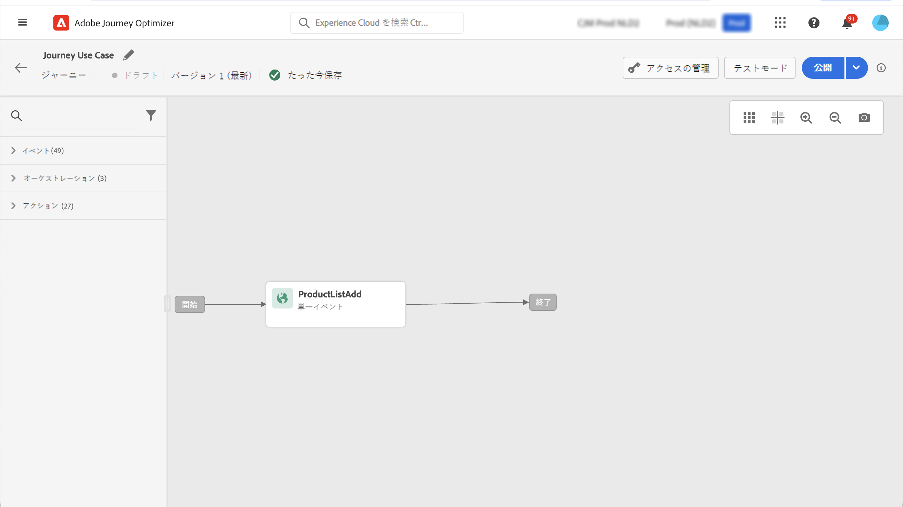
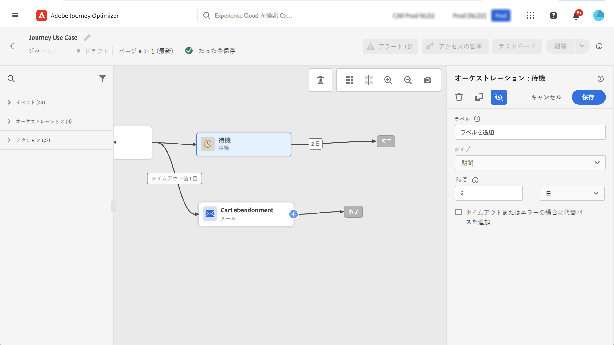
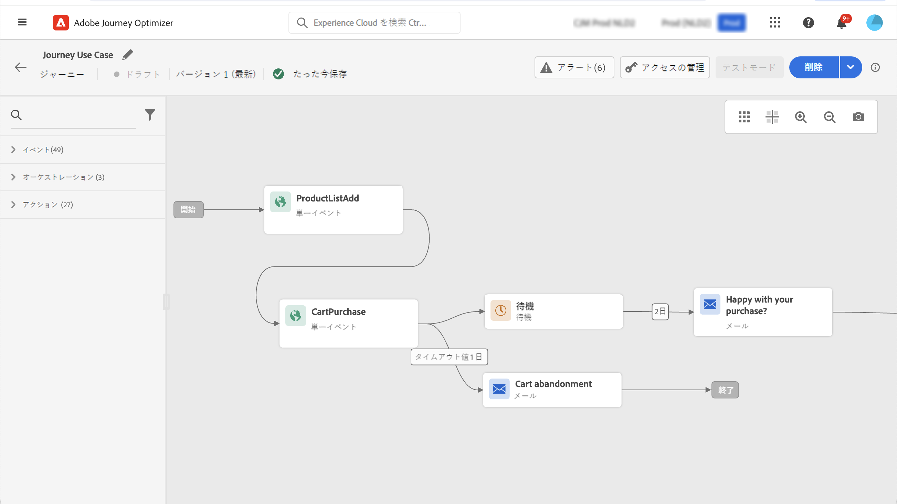

# Adobe Analytics の統合 {#analytics-data}

## Adobe Analyticsまたは Web SDK データの活用 {#leverage-analytics-data}

既にAdobe Experience Platformに取り込んでストリーミングしているすべての Web 行動イベントデータを (Adobe Analyticsまたは Web SDK を通じて ) 活用して、ジャーニーをトリガーし、顧客に対するエクスペリエンスを自動化できます。

>[!NOTE]
>
>この節の説明は、ルールベースのイベントと、Adobe Analyticsまたは WebSDK データを使用する必要があるお客様にのみ当てはまります。

この機能をAdobe Analyticsで使用するには、使用するレポートスイートをAdobe Experience Platformでアクティブ化する必要があります。 これを行うには、以下の手順に従います。

1. Adobe Experience Platform に接続し、**[!UICONTROL ソース]**&#x200B;を参照します。

1. 「 Adobe Analytics 」セクションで、「 **[!UICONTROL データを追加]**

   

1. 使用可能なAdobe Analyticsレポートスイートのリストから、 **[!UICONTROL レポートスイート]** を有効にします。 次に、「**[!UICONTROL 次へ]**」をクリックします。

   

1. 「デフォルト」または「カスタム」のスキーマを使用する場合に選択します。

1. 次の **[!UICONTROL データフローの詳細]** 画面、選択 **[!UICONTROL データフロー名]**.

1. 設定が完了したら、「 **[!UICONTROL 完了]**.

   

これにより、そのレポートスイートの Analytics ソースコネクタが有効になります。データが入ってくるたびに、データはエクスペリエンスイベントに変換され、Adobe Experience Platform に送信されます。

Adobe Analytics ソースコネクタについて詳しくは、[Adobe Experience Platform のドキュメント](https://experienceleague.adobe.com/docs/experience-platform/sources/connectors/adobe-applications/analytics.html?lang=ja){target=&quot;_blank&quot;}と[チュートリアルl](https://experienceleague.adobe.com/docs/experience-platform/sources/ui-tutorials/create/adobe-applications/analytics.html?lang=ja){target=&quot;_blank&quot;}を参照してください。

## Adobe Analyticsまたは Web SDK データを使用したイベントでのジャーニーの作成 {#event-analytics}

Adobe Analyticsと [Adobe Analyticsソース](#leverage-analytics-data) または [Adobe Experience Platform Web SDK](https://experienceleague.adobe.com/docs/experience-platform/edge/home.html?lang=ja)の場合は、後でジャーニーで使用できるイベントを作成できます。

この例では、商品を買い物かごに追加したユーザーをターゲットにします。

* 注文が完了した場合は、2 日後にフィードバックを求めるフォローアップメールが届きます。
* 注文が完了していない場合は、注文を完了するように促す電子メールが届きます。

1. Adobe Journey Optimizerから、 **[!UICONTROL 設定]** メニュー

1. 次に、 **[!UICONTROL 管理]** から **[!UICONTROL イベント]** カード。

   

1. クリック **[!UICONTROL イベントを作成]**.画面の右側にイベント設定ペインが開きます。

1. 次の項目に入力： **[!UICONTROL イベント]** パラメータ：

   * **[!UICONTROL 名前]**:名前をパーソナライズ **[!UICONTROL イベント]**.
   * **[!UICONTROL タイプ]**:を選択します。 **[!UICONTROL 単一]** タイプ。 [詳細情報](../event/about-events.md)
   * **[!UICONTROL イベント ID タイプ]**:を選択します。 **[!UICONTROL ルールベース]** イベント ID タイプ。 [詳細情報](../event/about-events.md#event-id-type)
   * **[!UICONTROL スキーマ]**:上記の節で作成した Analytics または WebSDK のスキーマを選択します。
   * **[!UICONTROL フィールド]**:「ペイロード」フィールドを選択します。 [詳細情報](../event/about-creating.md#define-the-payload-fields)
   * **[!UICONTROL イベント ID 条件]**:ジャーニーをトリガーにするイベントを識別するためにシステムで使用される条件を定義します。

      ここでは、顧客が買い物かごに品目を追加したときにイベントがトリガーされます。
   * **[!UICONTROL プロファイル識別子]**:ペイロードフィールドからフィールドを選択するか、イベントに関連付けられた人物を識別する数式を定義します。

   

1. 設定が完了したら、「 」を選択します。 **[!UICONTROL 保存]**. これで、イベントをジャーニーで使用する準備が整いました。

1. 次の **[!UICONTROL ジャーニー]**&#x200B;で、ジャーニーの作成を開始できます。 詳しくは、[この節](../building-journeys/journey-gs.md)を参照してください。

1. 以前に設定した Analytics イベントをジャーニーに追加します。

   

1. 注文が完了した場合にトリガーされるイベントを追加します。

1. お使いの **[!UICONTROL イベントメニュー]**&#x200B;を選択し、 **[!UICONTROL イベントのタイムアウトを定義]** および **[!UICONTROL タイムアウトパスを設定]** オプション。

   

1. タイムアウトパスから、 **[!UICONTROL 電子メール]** アクション。 このパスは、注文を完了していない顧客に、買い物かごがまだ利用可能であることを通知するメールを送信するために使用されます。

1. を追加します。 **[!UICONTROL 待機]** アクティビティを作成し、必要な期間に設定します。

   

1. 次に、 **[!UICONTROL メールアクション]**. この電子メールでは、顧客は、指定された注文に対するフィードバックを提供するよう求められます。

ジャーニーの有効性をテストした後、ジャーニーを公開できるようになりました。 [詳細情報](../building-journeys/publishing-the-journey.md)

