# ビジネスイベントの構成{#configure-a-business-event}

ユニタリイベントとは異なり、ビジネスイベントは特定のプロファイルにリンクされません。 イベントIDタイプは常にルールベースです。 ビジネスイベントの詳細については、[このセクション](../event/about-events.md)を参照してください。

読み取りセグメントベースのジャーニーは、1回のショット、定期的なスケジューラー、またはイベントの発生時にビジネスイベントによってトリガーできます。

ビジネスイベントには、「会社が在庫切れ」、「製品の株価が一定値に達する」などがあります。

## 重要な注意事項

* イベントスキーマには、プライマリIDが含まれている必要があります。
* ビジネスイベントは、ジャーニーの最初のステップとしてのみ削除できます。
* ビジネスイベントをジャーニーの最初のステップとして削除する場合、ジャーニーのスケジューラータイプは「ビジネスイベント」になります。
* 読み取りセグメントアクティビティのみが、ビジネスイベントの後にドロップできます。 次の手順として自動的に追加されます。
* ビジネスイベントを1時間以上頻繁にトリガーすることはできません。
* ビジネスイベントがトリガーされた後、セグメントを15分から1時間までエクスポートするのに遅延が生じます。
* ビジネスイベントをテストする場合は、イベントパラメーターと、テストジャーニーに入るテストプロファイルのIDを渡す必要があります。 また、ビジネスイベントベースのジャーニーをテストする場合は、1つのプロファイル入口のみをトリガーできます。 詳しくは、[この節](../building-journeys/testing-the-journey.md#test-business)を参照してください。テストモードでは、「コード表示」モードは使用できません。
* 新しいビジネスイベントが発生した場合、現在ジャーニーにいる個人にはどうなりますか？ 新しい繰り返しが発生した場合に個々のユーザーが繰り返しジャーニーに留まっている場合と同じように動作します。 彼らの道は終わった。 その結果、頻繁にビジネスイベントを行うと考えられる場合、マーケターは長いジャーニーの構築を避けるために注意を払う必要があります。

## ビジネスイベントの概要

ビジネスイベントを設定する最初の手順を次に示します。

1. 左側のメニューで、**[!UICONTROL 管理者]**&#x200B;アイコンをクリックし、**[!UICONTROL イベント]**&#x200B;をクリックします。 イベントのリストが表示されます。

   

1. 新しいイベントを作成するには、「**[!UICONTROL 追加]**」をクリックします。画面の右側にイベント設定ペインが開きます。

   

1. イベントの名前を入力します。 説明を追加することもできます。

   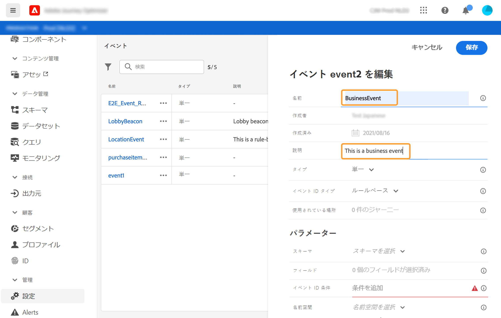

   >[!NOTE]
   >
   >スペースや特殊文字は使用しないでください。30 文字以内にしてください。

1. 「**[!UICONTROL タイプ]**」フィールドで、「**ビジネス**」を選択します。

   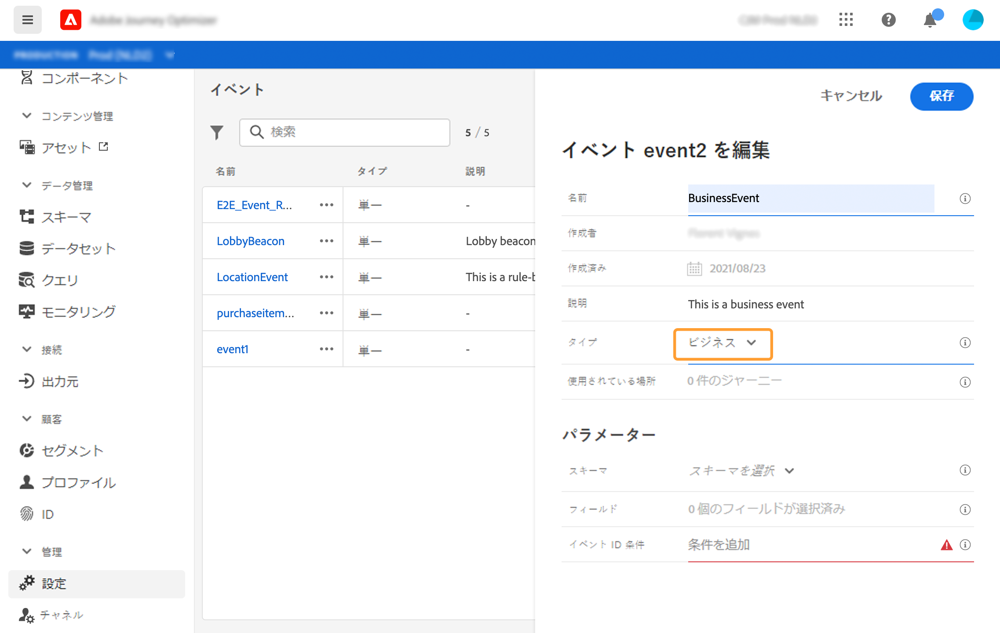

1. このイベントを使用するジャーニーの数は、「**[!UICONTROL 使用されている場所]**」フィールドに表示されます。**[!UICONTROL ジャーニーを表示]**&#x200B;アイコンをクリックすると、このイベントを使用するジャーニーのリストを表示できます。

1. スキーマフィールドとペイロードフィールドの定義：ここでは、ジャーニーが受信する必要のあるイベント情報（通常はペイロード）を選択します。 その後、この情報をジャーニーに使うことができます。詳しくは、[この節](../event/about-creating-business.md#define-the-payload-fields)を参照してください。

   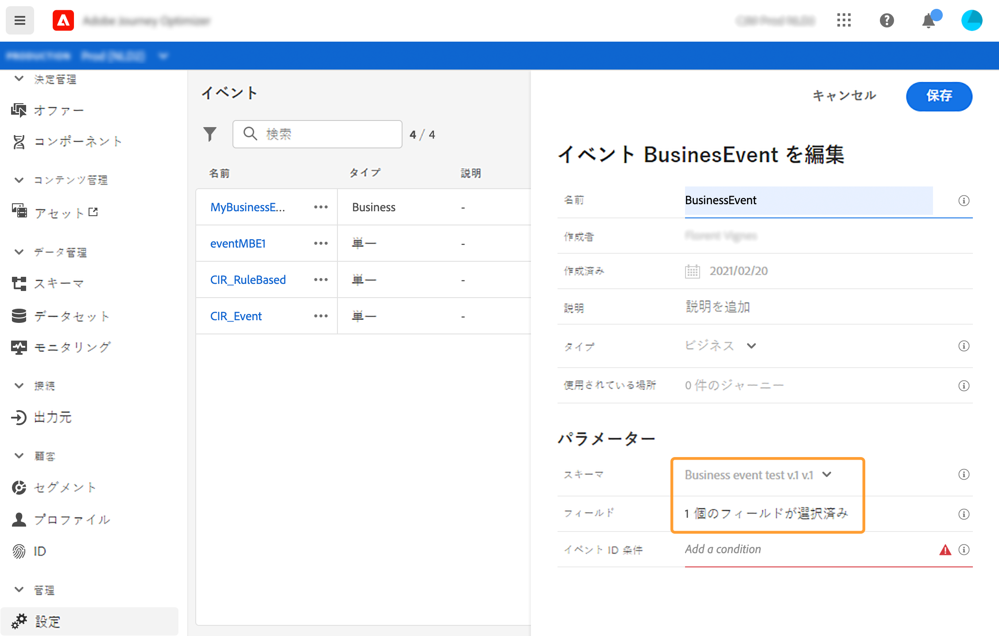

   時系列スキーマのみ使用できます。 エクスペリエンスイベント、決定イベント、ジャーニーステップのイベントスキーマは使用できません。 イベントスキーマには、プライマリIDが含まれている必要があります。

   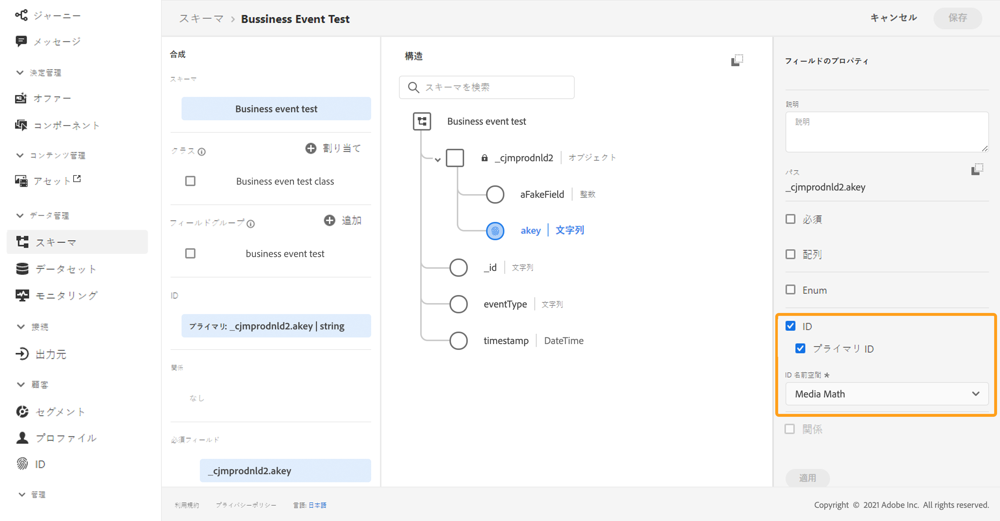

1. **[!UICONTROL イベントID条件]**フィールド内をクリックします。 シンプルな式エディターを使用して、ジャーニーをトリガーするイベントを識別するためにシステムで使用される条件を定義します。
   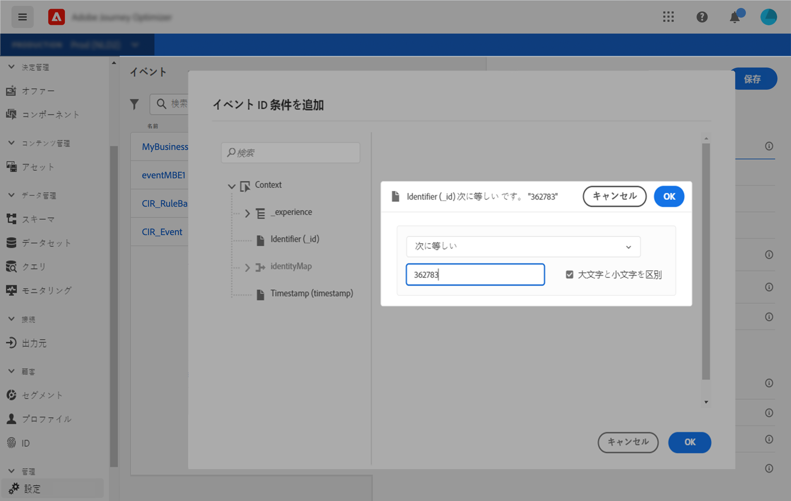

   この例では、製品のIDに基づいて条件を作成しました。 つまり、この条件に一致するイベントを受け取るたびに、ジャーニーに渡されます。

1. 「**[!UICONTROL 保存]**」をクリックします。

   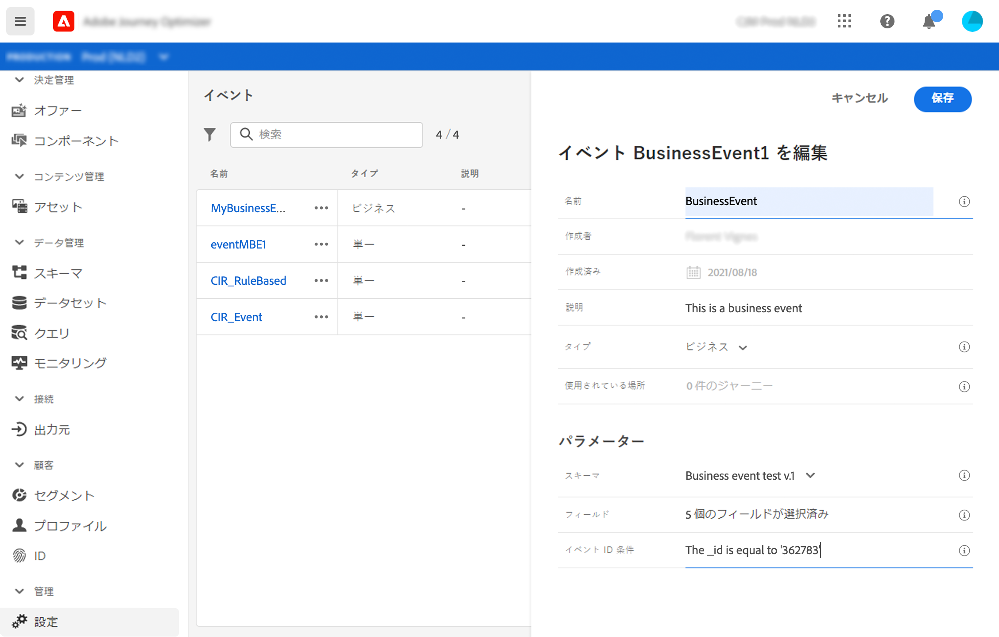

   これでイベントが設定され、ジャーニーに含まれる準備が整いました。イベントを受信するには、追加の設定手順が必要です。[このページ](../event/additional-steps-to-send-events-to-journey-orchestration.md)を参照してください。

## ペイロードフィールドを定義{#define-the-payload-fields}

ペイロード定義を使用すると、ジャーニー内のイベントからシステムが受け取ると想定する情報と、イベントに関連付けられている人を識別するためのキーを選択できます。 ペイロードは、Experience CloudXDMフィールド定義に基づきます。 XDMの詳細は、[このページ](https://experienceleague.adobe.com/docs/experience-platform/xdm/home.html?lang=ja)を参照してください。

1. リストからXDMスキーマを選択し、「**[!UICONTROL Payload]**」フィールドまたは&#x200B;**[!UICONTROL Edit]**&#x200B;アイコンをクリックします。

   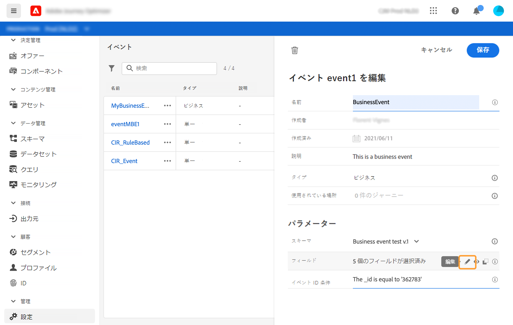

   スキーマで定義されているすべてのフィールドが表示されます。 フィールドのリストは、スキーマによって異なります。特定のフィールドを検索するか、フィルターを使用してすべてのノードとフィールドを表示するか、選択したフィールドのみを表示するかを選択できます。 スキーマ定義によって、一部のフィールドが必須で、事前に選択されている場合があります。選択を解除することはできません。 ジャーニーがイベントを適切に受け取るために必須のフィールドはすべて、デフォルトで選択されます。

   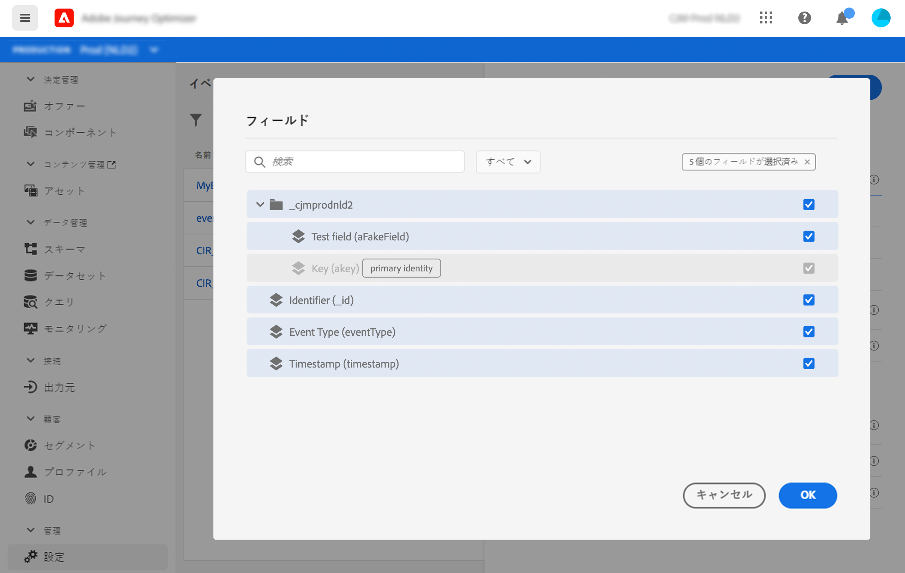

1. イベントから受け取るフィールドを選択します。 これらは、ビジネスユーザーがジャーニーで活用するフィールドです。

   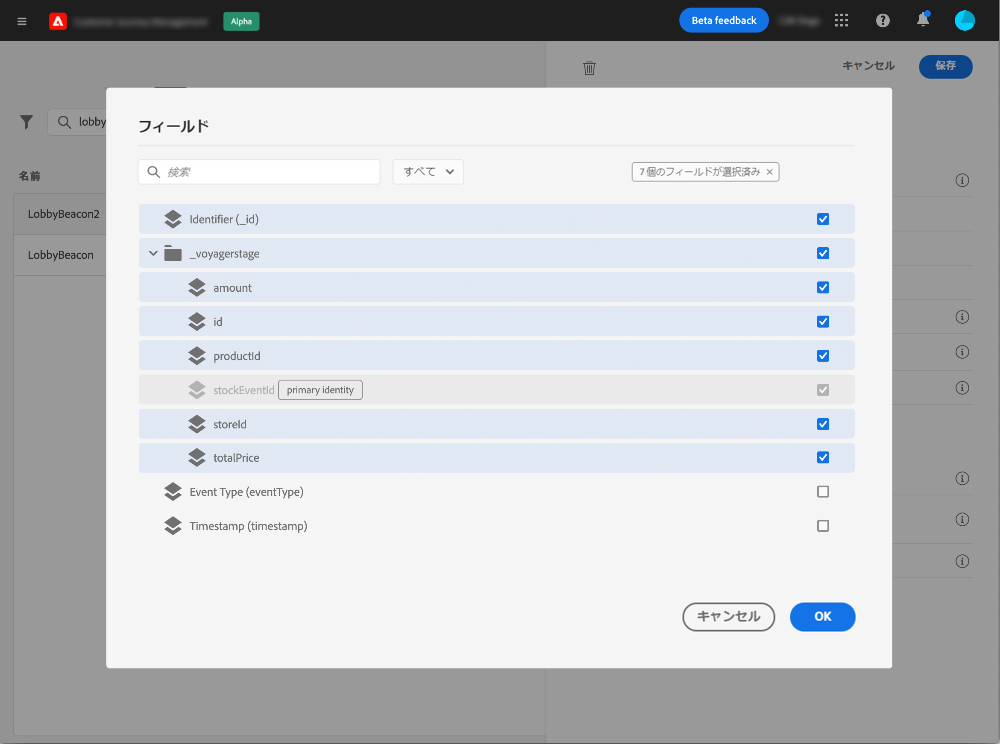

1. 必要なフィールドの選択が完了したら、「**[!UICONTROL 保存]**」をクリックするか、**[!UICONTROL Enter]**&#x200B;キーを押します。

   選択したフィールドの数が&#x200B;**[!UICONTROL ペイロード]**&#x200B;フィールドに表示されます。

   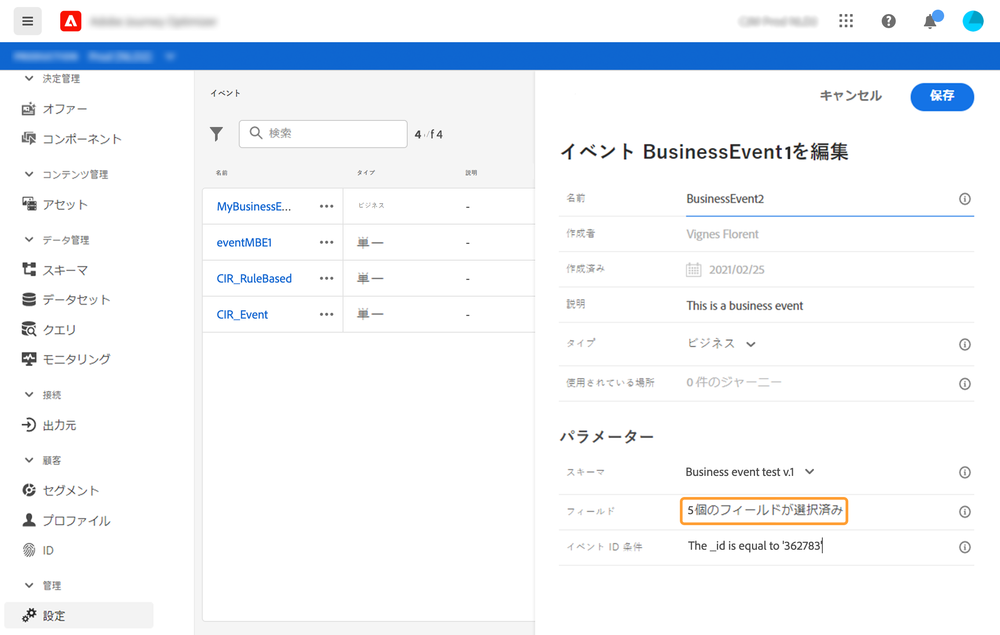

## ペイロード{#preview-the-payload}のプレビュー

ペイロードプレビューを使用して、ペイロード定義を検証できます。

1. 「**[!UICONTROL 表示ペイロード]**」アイコンをクリックして、システムが予想するペイロードをプレビューします。

   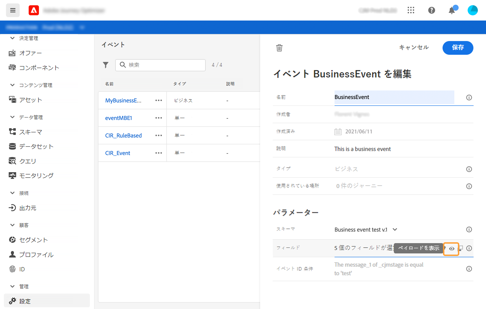

   選択したフィールドが表示されていることに注意してください。

   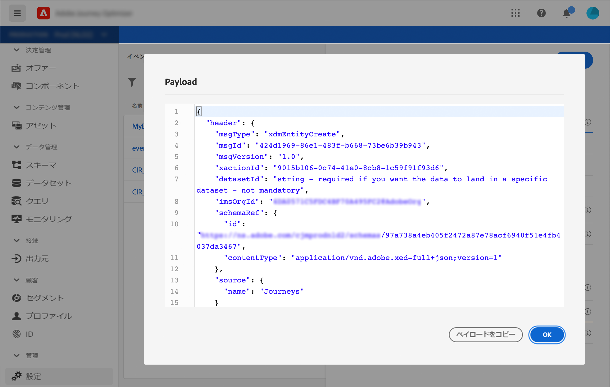

1. ペイロード定義を検証するプレビューを確認します。

1. その後、ペイロードプレビューをイベント送信の担当者と共有できます。 このペイロードは、[!DNL Journey Optimizer]にプッシュするイベントの設計に役立ちます。 [このページ](../event/additional-steps-to-send-events-to-journey-orchestration.md)を参照してください。
