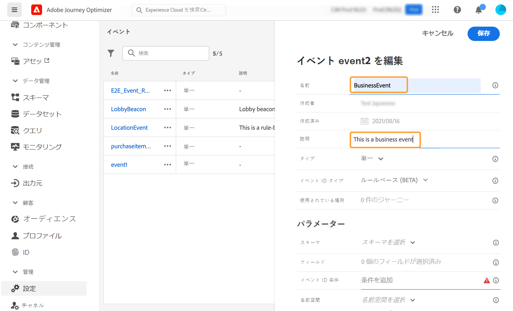
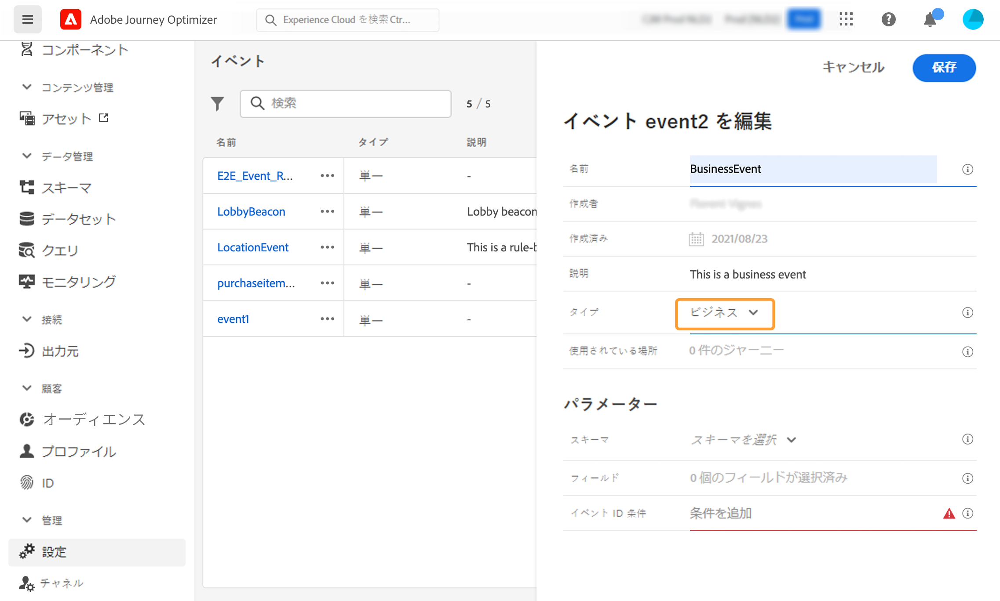
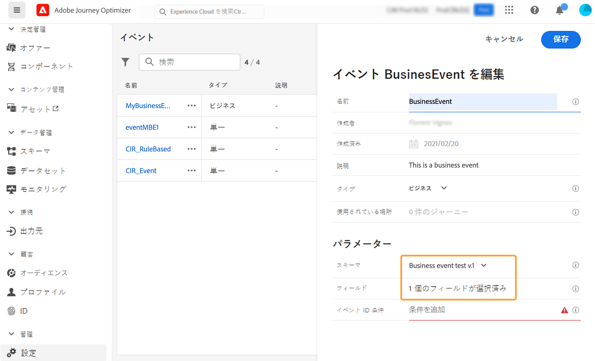
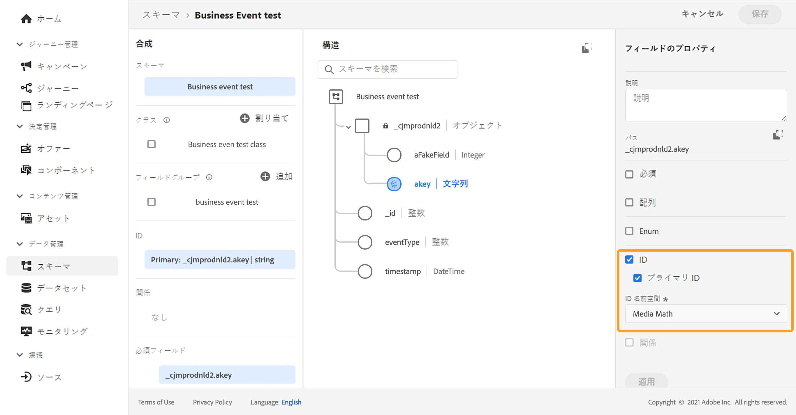
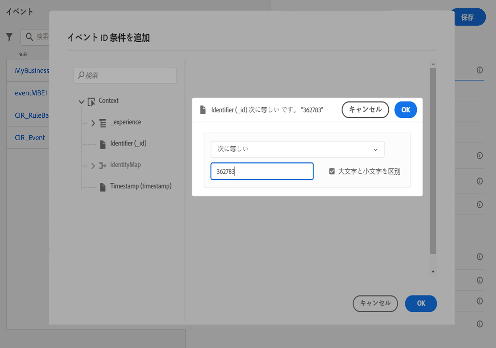
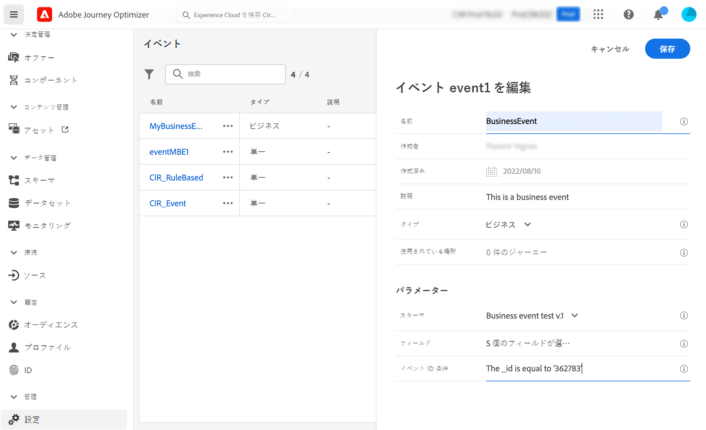
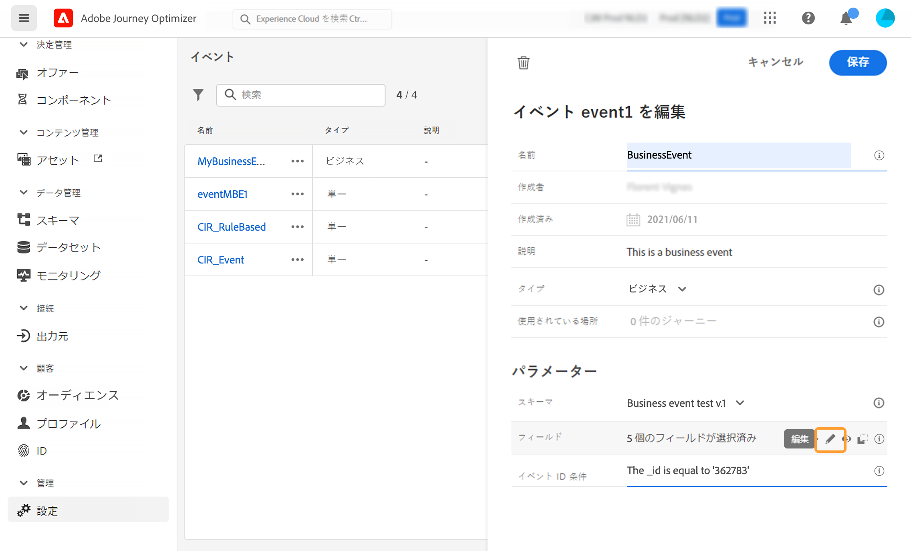
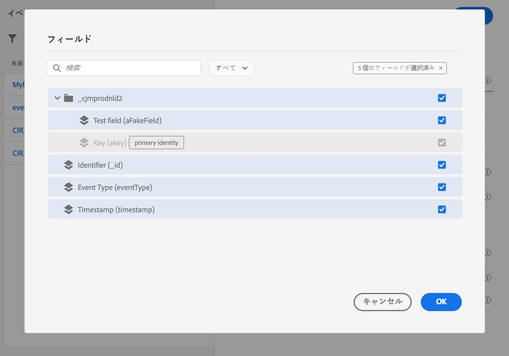
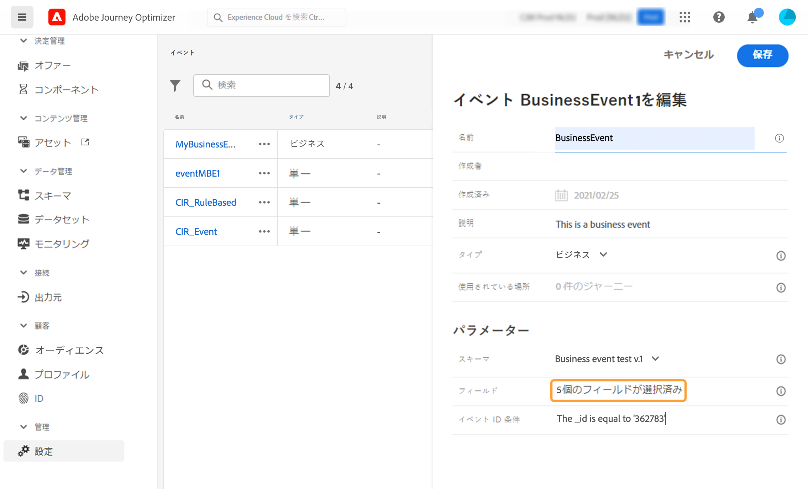
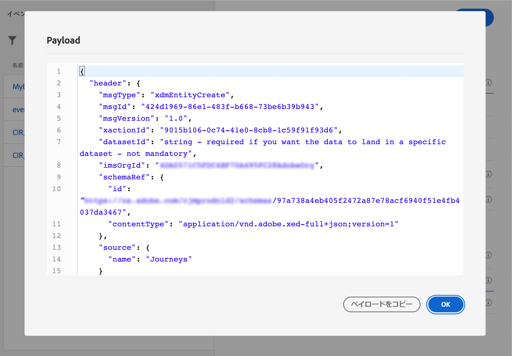

# ビジネスイベントの設定 {#configure-a-business-event}

>[!CONTEXTUALHELP]
>id="ajo_journey_event_business"
>title="ビジネスイベント"
>abstract="イベントの設定を使用すると、Journey Optimizer が受け取る情報を定義できます。複数のイベントを（ジャーニーの様々なステップで）使用できます。また、同じイベントを複数のジャーニーで使用することもできます。単一ベントとは異なり、ビジネスイベントは特定のプロファイルにリンクされません。イベント ID タイプは常にルールベースです。"

単一ベントとは異なり、ビジネスイベントは特定のプロファイルにリンクされません。イベント ID タイプは常にルールベースです。ビジネスイベントの詳細については、[この節](../event/about-events.md)を参照してください。

「オーディエンスを読み取り」ベースのジャーニーは、定期的にスケジューラーによって、またはイベントの発生時にビジネスイベントによって、1 回限りトリガーできます。

ビジネスイベントには、「製品が再入荷した」、「企業の株価が一定値に達した」などがあります。

>[!NOTE]
>
>また、ビジネスイベントのユースケースについての[チュートリアル](https://experienceleague.adobe.com/docs/journey-optimizer-learn/tutorials/create-journeys/use-case-business-event.html?lang=ja)を視聴することもできます。プロファイルでスキーマを有効にする必要はありません。

## 重要な注意事項 {#important-notes}

* 時系列スキーマのみ使用できます。エクスペリエンスイベント、決定イベント、ジャーニーステップイベントのスキーマは使用できません。
* イベントスキーマには、プライマリ ID が含まれている必要があります。イベントを定義する際は、`_id` および `timestamp` のフィールドを選択する必要があります。
* ビジネスイベントは、ジャーニーの最初のステップとしてのみドロップできます。
* ビジネスイベントをジャーニーの最初のステップとしてドロップする場合、ジャーニーのスケジューラータイプは「ビジネスイベント」になります。
* ビジネスイベントの後にドロップできるのは、「オーディエンスを読み取り」アクティビティだけです。次のステップとして自動的に追加されます。
* 複数のビジネスイベントの実行を許可するには、ジャーニープロパティの「**[!UICONTROL 実行]**」セクションで、対応するオプションを有効にします。
* ビジネスイベントがトリガーされた後、オーディエンスをエクスポートするのに、15 分から 1 時間の遅延が生じます。
* ビジネスイベントをテストする場合は、イベントパラメーターと、テストジャーニーにエントリするテストプロファイルの ID を渡す必要があります。また、ビジネスイベントベースのジャーニーをテストする場合は、1 つのプロファイルエントリのみをトリガーできます。[この節](../building-journeys/testing-the-journey.md#test-business)を参照してください。テストモードでは、「コードビュー」モードは使用できません。
* 新しいビジネスイベントが発生した場合、現在ジャーニーにいる個人はどうなりますか？新しい繰り返しが発生しても、個人は引き続き繰り返しジャーニー内に留まるのと同様です。パスは終了しました。その結果、頻繁なビジネスイベントが予測される場合、マーケターは作成するジャーニーが長くなりすぎるのを避けるために注意を払う必要があります。
* ビジネスイベントは、単一イベントやオーディエンスの選定アクティビティと組み合わせて使用することはできません。

## 複数のビジネスイベント {#multiple-business-events}

複数のビジネスイベントを続けて受け取る場合に適用される重要な注意事項を以下に示します。

**ジャーニーの処理中にビジネスイベントを受信した場合の動作を教えてください。**

ビジネスイベントは、単一イベントの場合と同じように再エントリルールに従います。ジャーニーが再エントリを許可する場合は、次のビジネスイベントが処理されます。

**具体化されたオーディエンスの過負荷を避けるためのガードレールとは何ですか？**

1 回限りのビジネスイベントの場合、特定のジャーニーについて、最初のイベントジョブによってプッシュされたデータが 1 時間の時間枠で再利用されます。スケジュールされたジャーニーの場合、ガードレールはありません。オーディエンスについて詳しくは、[Adobe Experience Platform セグメント化サービスのドキュメント](https://experienceleague.adobe.com/docs/experience-platform/segmentation/home.html?lang=ja)を参照してください。

## ビジネスイベントの概要 {#gs-business-events}

ビジネスイベントを設定する最初の手順は次のとおりです。

1. 管理メニューセクションで、「**[!UICONTROL 設定]**」を選択します。「**[!UICONTROL イベント]**」セクションで、「**[!UICONTROL 管理]**」をクリックします。イベントのリストが表示されます。

   

1. 新しいイベントを作成するには、「**[!UICONTROL イベントを作成]**」をクリックします。画面の右側にイベント設定ペインが開きます。

   

1. イベントの名前を入力します。説明を追加することもできます。

   

   >[!NOTE]
   >
   >英数字とアンダースコアのみが使用できます。最大長は 30 文字です。

1. 「**[!UICONTROL タイプ]**」フィールドで、「**ビジネス**」を選択します。

   

1. このイベントを使用しているジャーニーの数は、**[!UICONTROL 使用されている場所]**&#x200B;フィールドに表示されます。「**[!UICONTROL ジャーニーを表示]**」アイコンをクリックすると、このイベントを使用しているジャーニーのリストを表示できます。

1. スキーマとペイロードのフィールドを定義します。ジャーニーが受け取るイベント情報（もしくはペイロード）は、ここで選択します。この情報は、後ほどジャーニーで必要になります。[この節](../event/about-creating-business.md#define-the-payload-fields)を参照してください。

   

   時系列スキーマのみ使用できます。`Experience Events`、`Decision Events` および `Journey Step Events` スキーマは使用できません。イベントスキーマには、プライマリ ID が含まれている必要があります。イベントを定義する際は、`_id` および `timestamp` のフィールドを選択する必要があります。

   

1.  「**[!UICONTROL イベント ID 条件]**」フィールド内をクリックします。簡単な式エディターを使用して、ジャーニーをトリガーするイベントを識別するためにシステムが使用する条件を定義します。

   

   この例では、製品の ID に基づいて条件を作成しました。つまり、システムがこの条件に一致するイベントを受け取るたびに、ジャーニーに渡されます。

   >[!NOTE]
   >
   >シンプルな式エディターでは、すべての演算子が使用できるわけではなく、データタイプに応じて異なります。例えば、文字列タイプのフィールドには、「次を含む」または「次と等しい」を使用できます。

1. 「**[!UICONTROL 保存]**」をクリックします。

   

   イベントが設定され、ジャーニーで使用できる状態になりました。イベントを受信するには追加の設定手順が必要です。詳しくは、[このページ](../event/additional-steps-to-send-events-to-journey.md)を参照してください。

## ペイロードフィールドの定義 {#define-the-payload-fields}

ペイロード定義を使用すると、ジャーニーのイベントからシステムが受け取ると想定される情報と、イベントに関連付けられている人を識別するためのキーを選択できます。ペイロードは Experience Cloud XDM フィールド定義に基づいています。XDM について詳しくは、[Adobe Experience Platform ドキュメント](https://experienceleague.adobe.com/docs/experience-platform/xdm/home.html?lang=ja){target="_blank"}を参照してください。

1. リストから XDM スキーマを選択し、**[!UICONTROL フィールド]**&#x200B;フィールドまたは「**[!UICONTROL 編集]**」アイコンをクリックします。

   

   スキーマで定義されているすべてのフィールドが表示されます。フィールドのリストは、スキーマによって異なります。特定のフィールドを検索し、フィルターを使用してすべてのノードとフィールドを表示、または選択したフィールドのみを表示できます。スキーマ定義によっては、一部のフィールドが必須となっており、事前に選択されている場合があります。選択を解除することはできません。ジャーニーがイベントを適切に受け取るために必須のフィールドはすべて、デフォルトで選択されます。

   

   >[!NOTE]
   >
   > フィールド `_id` および `timestamp` が選択されていることを確認します。

1. イベントから受け取るフィールドを選択します。これらは、ビジネスユーザーがジャーニーで活用するフィールドです。

1. 必要なフィールドの選択が完了したら、「**[!UICONTROL 保存]**」をクリックするか、**[!UICONTROL Enter]** キーを押します。

   選択したフィールドの数が「**[!UICONTROL フィールド]**」フィールドに表示されます。

   

## ペイロードのプレビュー {#preview-the-payload}

ペイロードのプレビューを使用してペイロードの定義を検証します。

1. 「**[!UICONTROL ペイロードを表示]**」アイコンをクリックして、システムが想定するペイロードをプレビューします。

   

   選択したフィールドが表示されていることに注意してください。

   

1. ペイロード定義を検証するプレビューを確認します。

1. その後、イベント送信の担当者とペイロードプレビューを共有できます。このペイロードは、[!DNL Journey Optimizer]にプッシュするイベントのセットアップを設計するのに役立ちます。[このページ](../event/additional-steps-to-send-events-to-journey.md)を参照してください。
