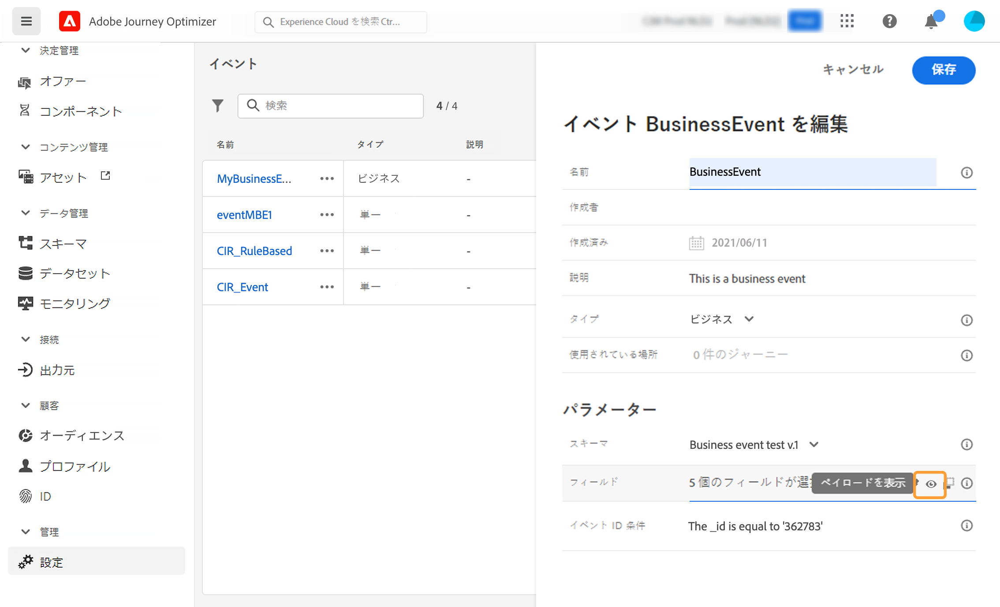

# 業務イベントの設定 {#configure-a-business-event}

>[!CONTEXTUALHELP]
>id="ajo_journey_event_business"
>title="ビジネスイベント"
>abstract="このイベント設定を使用すると、オプティマイザーがイベントとして受け取る情報を定義することができます。 複数のイベントを使用して journeys を作成すると、複数のイベントを使用して同じイベントを使用することができます。 ユニタリイベントとは異なり、ビジネスイベントは特定のプロファイルにリンクされていません。 イベント ID のタイプは、常にルールに基づいています。"

ユニタリイベントとは異なり、ビジネスイベントは特定のプロファイルにリンクされていません。 イベント ID のタイプは、常にルールに基づいています。 この節では、 [ ビジネスイベントについて詳しく説明 ](../event/about-events.md) しています。

このイベントが発生すると、定期的に、またはビジネスイベントの発生時に、journeys を使用して1回の操作で、定期的に、またはビジネスイベントによって開始されます。

ビジネスイベントには、「製品が在庫に戻る」、「企業の株式価格が特定の値に達する」などがあります。

>[!NOTE]
>
>また、ビジネスイベントユースケース [ チュートリアル ](https://experienceleague.adobe.com/docs/journey-optimizer-learn/tutorials/create-journeys/use-case-business-event.html) を見ることもできます。 ただし、スキーマをプロファイルに対して有効にする必要はありません。

## 重要な注意事項 {#important-notes}

* 使用できるのは、time series スキーマに限られます。 エクスペリエンスイベント、Decision イベント、および旅のステップイベントスキーマは使用できません。
* イベントスキーマには、人以外のプライマリ id が含まれている必要があります。 イベントを定義するには、次のフィールドが選択されている必要があります。 `_id``timestamp`
* ビジネスイベントは、旅の最初のステップとしてのみ削除できます。
* 最初のステップとして業務イベントをドロップすると、旅のスケジューラの種類は &quot;ビジネスイベント&quot; になります。
* 事業イベントの後に削除できるのは、segment 読み取り操作のみです。 これは、次の手順として自動的に追加されます。
* 複数のビジネスイベントを実行できるようにするには、旅プロパティのセクションにある **[!UICONTROL Execution]** 対応するオプションをオンにします。
* ビジネスイベントがトリガーされた後に、セグメントを15分から最大1時間に書き出すことができます。
* ビジネスイベントをテストする場合は、テストでの旅に入るテストプロファイルのイベントパラメーターと識別子を渡す必要があります。 また、ビジネスイベントをベースにしてテストを実行すると、1つのプロファイルの入り口しか起動できません。 この項 ](../building-journeys/testing-the-journey.md#test-business) を参照してください [ 。テストモードでは、使用可能な「コードビュー」モードはありません。
* 新しいビジネスイベントが発生した場合は、現在のユーザーに対してどのような問題が発生しますか。 この動作は、新しい繰り返しが発生したときに、個別のアイテムが継続して実行された場合と同じように動作します。 パスが終了します。 そのため、マーケティング担当者は頻繁なビジネスイベントを想定している場合は、journeys を使用すると、作成時間が長くなりすぎないように注意する必要があります。
* ビジネスイベントは、ユニタリイベントまたはセグメント認定アクティビティーと共に使用することはできません。

## 複数のビジネスイベント {#multiple-business-events}

ここでは、複数のビジネスイベントを1行に受け取る場合に適用される重要な注意事項について説明します。

**旅の処理中にビジネスイベントを受け取ったときの動作は、どのようなものでしょうか。**

ビジネスイベントは、ユニタリイベントの場合と同じように、再開始ルールに従います。 移動が許可されている場合は、次のビジネスイベントが処理されます。

**Materialized segment は、実体化されたセグメントの読み込みを回避するために使用できます。**

特定の過程において、勤務中のビジネスイベントが発生した場合、最初のイベントジョブによってプッシュされたデータは、1時間ウィンドウで再利用されます。 Journeys のスケジューリングには、guardrail はありません。 詳しくは、 [ Adobe エクスペリエンスプラットフォームセグメンテーションサービスのマニュアル ](https://experienceleague.adobe.com/docs/experience-platform/segmentation/home.html) を参照してください。

## ビジネスイベントを使用した作業について学習します。 {#gs-business-events}

次に、ビジネスイベントを設定するための第1段階について説明します。

1. 「管理メニュー」セクションで、を選択 **[!UICONTROL Configurations]** します。 **[!UICONTROL Events]**&#x200B;セクションのをクリック **[!UICONTROL Manage]** します。イベントのリストが表示されます。

   

1. をクリック **[!UICONTROL Create Event]** して、新しいイベントを作成します。 画面の右側にイベント設定ペインが表示されます。

   

1. イベントの名前を入力します。 説明を追加することもできます。

   

   >[!NOTE]
   >
   >スペースまたは特殊文字は使用しないでください。 30文字を超えないようにしてください。

1. **[!UICONTROL Type]**&#x200B;フィールドで、「勤務先 **」を選択** します。

   

1. このイベントを使用している journeys の数がフィールドに **[!UICONTROL Used in]** 表示されます。 このアイコンをクリック **[!UICONTROL View journeys]** すると、このイベントを使用して journeys のリストが表示されます。

1. 「スキーマ」フィールドと「ペイロード」フィールドを定義します。これは、journeys が受け取るイベント情報またはペイロードを選択する場合に使用されます。 この情報は、今後の旅で使用されます。 この項 ](../event/about-creating-business.md#define-the-payload-fields) を参照してください [ 。

   

   使用できるのは、time series スキーマに限られます。 `Experience Events``Journey Step Events`、 `Decision Events` スキーマを使用することはできません。イベントスキーマには、人以外のプライマリ id が含まれている必要があります。 イベントを定義するには、次のフィールドが選択されている必要があります。 `_id``timestamp`

   

1. フィールド内を **[!UICONTROL Event ID condition]** クリックします。 単純なエクスプレッションエディターを使用して、システムで使用される条件を定義します。これにより、旅をトリガーするイベントを識別できます。

   

   この例では、製品 id に基づいて条件を記述しています。 これは、この条件に一致するイベントをシステムが受け取るたびに、そのイベントが journeys に渡されることを意味します。

   >[!NOTE]
   >
   >単純な式エディターでは、すべての演算子を使用できるわけではありません。データ型によって異なります。 例えば、フィールドのストリング型については、「次を含む」または「等しい」を使用できます。

1. をクリック **[!UICONTROL Save]** します。

   

   イベントが設定され、旅に出られる準備ができました。 イベントを受信するには、その他の設定手順が必要です。 詳しくは、このページ ](../event/additional-steps-to-send-events-to-journey.md) を [ 参照してください。

## ペイロードフィールドの定義 {#define-the-payload-fields}

ペイロード定義を使用すると、旅のイベントからシステムが受け取ると予想される情報と、そのイベントに関連付けられた人物を識別するためのキーを選択できます。 ペイロードは、「エクスペリエンス Cloud XDM」フィールド定義に基づいています。 XDM について詳しくは、『 Adobe エクスペリエンスプラットフォームマニュアル ](https://experienceleague.adobe.com/docs/experience-platform/xdm/home.html) {target = &quot;_blank&quot;} を [ 参照してください。

1. リストから「XDM」スキーマを選択し、フィールドまたは **[!UICONTROL Edit]** アイコンをクリック **[!UICONTROL Fields]** します。

   

   スキーマに定義されているすべてのフィールドが表示されます。 フィールドのリストは、スキーマによって異なります。 特定のフィールドを検索することも、フィルターを使用してすべてのノードとフィールドを表示することも、選択したフィールドのみを表示することもできます。 スキーマ定義に従って、一部のフィールドは必須で、事前に選択されている場合があります。 選択を解除することはできません。 初期設定では、journeys によって適切にイベントを受信するために必須のすべてのフィールドが選択されています。

   

   >[!NOTE]
   >
   > 次のフィールドが選択されていることを確認してください。 `_id``timestamp`

1. イベントから受信することが予想されるフィールドを選択します。 これらのフィールドは、出張中にビジネスユーザーによって利用されます。

1. 必要なフィールドを選択したら、 **[!UICONTROL Save]** またはキーを押し **[!UICONTROL Enter]** ます。

   選択したフィールドの数がに **[!UICONTROL Fields]** 表示されます。

   

## ペイロードのプレビュー {#preview-the-payload}

ペイロードの定義を検証するには、ペイロードプレビューを使用します。

1. **[!UICONTROL View Payload]**&#x200B;アイコンをクリックして、システムで表示する必要があるペイロードをプレビューします。

   

   選択されたフィールドが表示されていることに注意してください。

   

1. プレビューを確認して、ペイロード定義を検証します。

1. これにより、ペイロードプレビューを、イベント送信の担当者に公開できます。 このようなペイロードにより、にプッシュする [!DNL Journey Optimizer] イベントの設定をデザインするのに役立ちます。 このページ ](../event/additional-steps-to-send-events-to-journey.md) を参照してください [ 。
