# 単一イベントの設定 {#configure-an-event}

単一イベントは、特定のプロファイルにリンクされます。ルールベースによるものと、システムで生成されるものがあります。単一イベントの詳細については、[この節](../event/about-events.md)を参照してください。

新規イベントを設定する最初の手順は次のとおりです。

1. 「管理」メニューセクションで、「**[!UICONTROL 設定]**」を選択します。 「**[!UICONTROL イベント]**」セクションで、「**[!UICONTROL 管理]**」をクリックします。 イベントのリストが表示されます。

   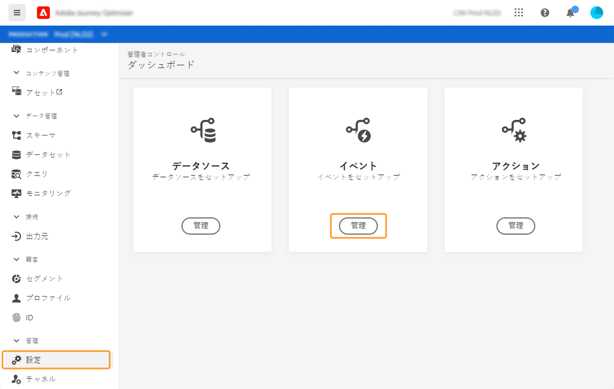

1. 新しいイベントを作成するには、「**[!UICONTROL イベントを作成]**」をクリックします。画面の右側にイベント設定ウィンドウが開きます。

   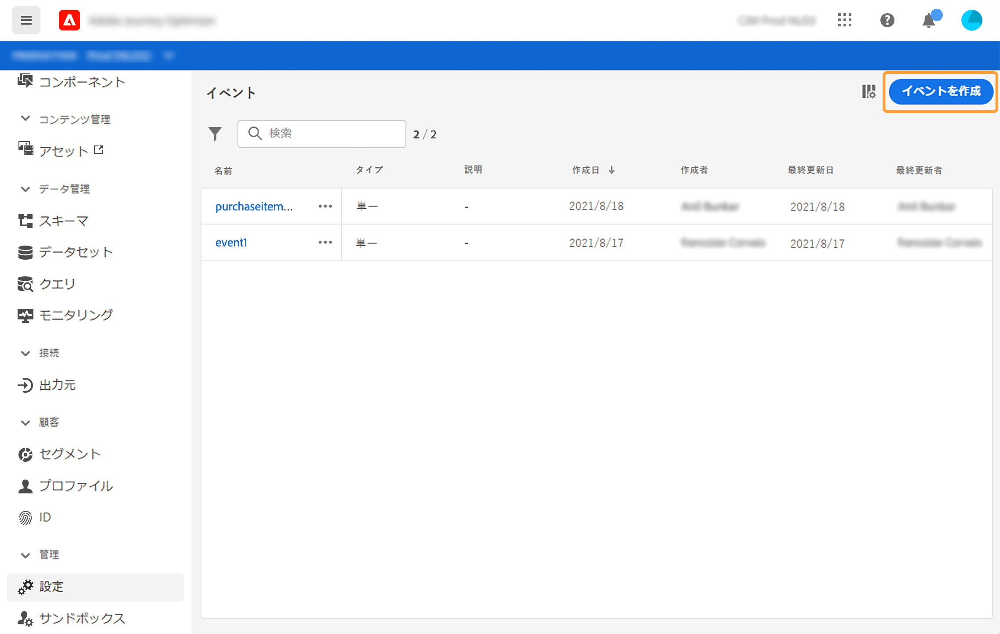

1. イベントの名前を入力します。説明を追加することもできます。

   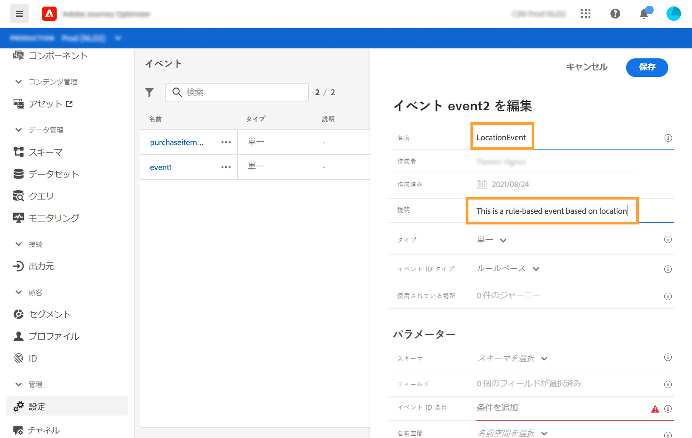

   >[!NOTE]
   >
   >スペースや特殊文字は使用しないでください。30 文字以内にしてください。

1. 「**[!UICONTROL タイプ]**」フィールドで「**単一**」を選択します。

   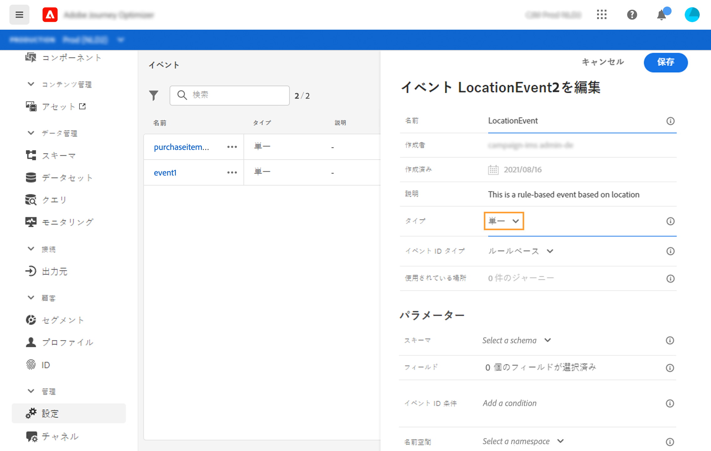

1. 「**[!UICONTROL イベント ID タイプ]**」フィールドで、使用するイベント ID タイプとして「**ルールベース**」または「**システム生成**」を選択します。イベント ID のタイプの詳細については、[この節](../event/about-events.md#event-id-type)を参照してください。

   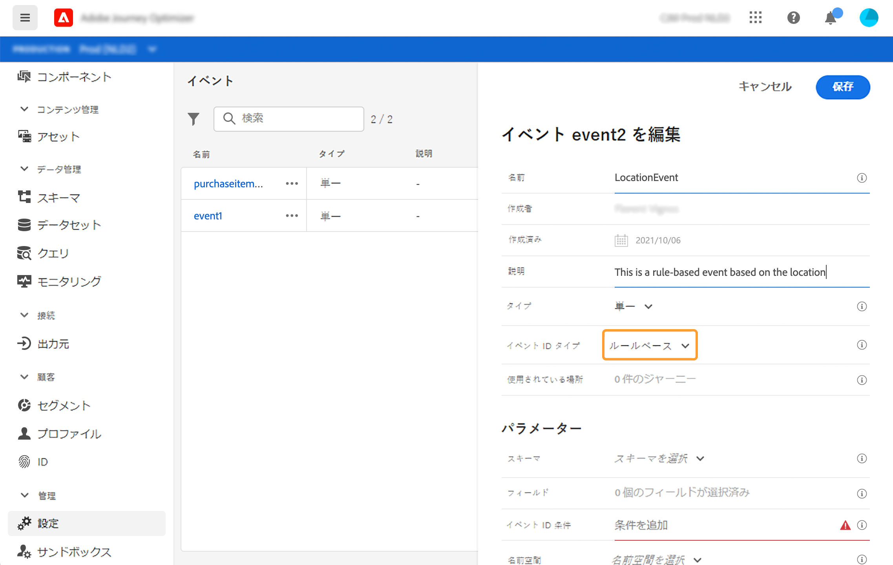

1. このイベントを使用するジャーニーの数は、「**[!UICONTROL 使用されている場所]**」フィールドに表示されます。**[!UICONTROL ジャーニーを表示]**&#x200B;アイコンをクリックすると、このイベントを使用するジャーニーのリストを表示できます。

1. スキーマとペイロードのフィールドを定義します。ジャーニーが受け取るイベント情報（通常、ペイロードと呼びます）は、ここで選択します。その後、この情報をジャーニーに使うことができます。[この節](../event/about-creating.md#define-the-payload-fields)を参照してください。

   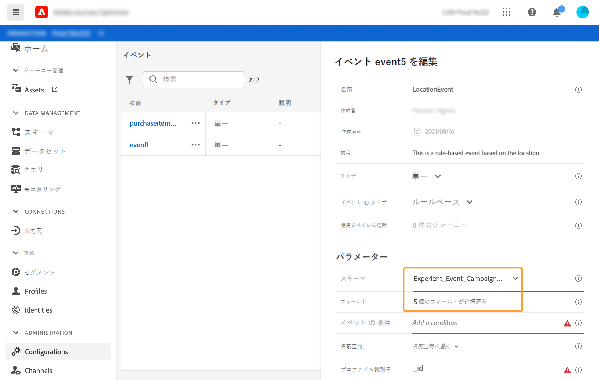

   >[!NOTE]
   >
   >**[!UICONTROL システム生成]**&#x200B;タイプを選択した場合は、eventID タイプのフィールドを持つスキーマのみを使用できます。**[!UICONTROL ルールベース]**&#x200B;タイプを選択した場合は、すべてのエクスペリエンスイベントのスキーマを使用できます。

1. ルールベースのイベントの場合は、「**[!UICONTROL イベント ID 条件]**」フィールド内でクリックします。簡単な式エディターを使用して、ジャーニーをトリガーするイベントを識別するためにシステムが使用する条件を定義します。
   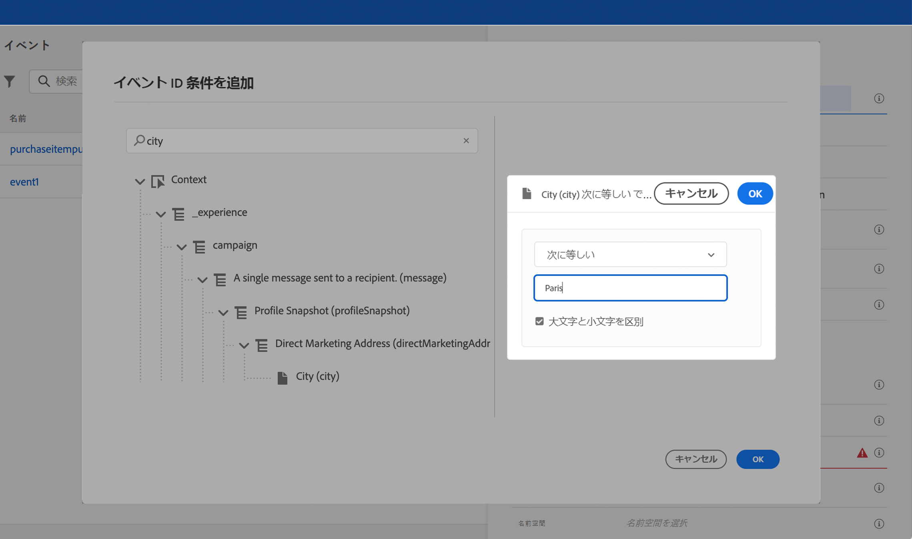

   この例では、プロファイルの市区町村に基づいて条件を作成しました。つまり、システムはこの条件（**[!UICONTROL 市区町村]**&#x200B;フィールドと&#x200B;**[!UICONTROL パリ]**&#x200B;という値）を満たすイベントを受け取るたびに、ジャーニーにイベントを渡します。

   >[!NOTE]
   >
   >**[!UICONTROL イベント ID 条件]**&#x200B;を定義する際に、高度な式エディターは使用できません。シンプルな式エディターでは、すべての演算子が使用できるわけではなく、データタイプに応じて異なります。 例えば、文字列タイプのフィールドには、「次を含む」または「次と等しい」を使用できます。

1. 名前空間を追加します。この手順はオプションですが、名前空間を追加すると、リアルタイム顧客プロファイルサービスに保存された情報を活用できるのでお勧めです。これは、イベントのキーのタイプを定義します。[この節](../event/about-creating.md#select-the-namespace)を参照してください。
1. プロファイル識別子を定義します。ペイロードフィールドからフィールドを選択するか、イベントに関連付けられた個人を識別する式を定義します。このキーは、名前空間を選択すると自動的に設定されます（編集は可能）。ジャーニーは名前空間に対応するキーを選択します（たとえば、メール名前空間を選択すると、メールのキーが選択されます）。[この節](../event/about-creating.md#define-the-event-key)を参照してください。

   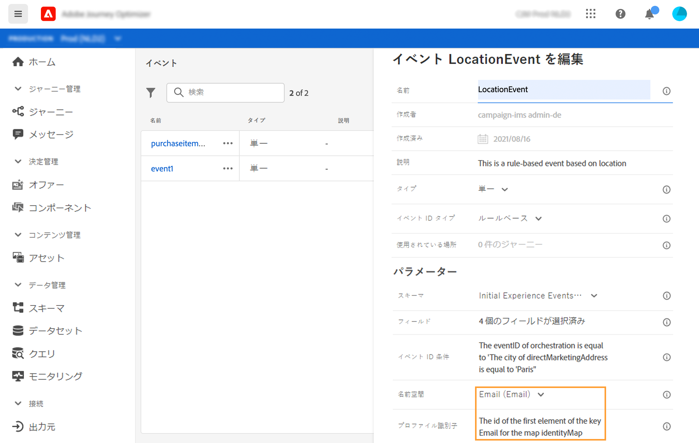

1. システム生成イベントの場合は、条件を追加できます。この手順はオプションです。これにより、条件を満たすイベントのみが処理されます。条件は、イベントに含まれる情報に基づく場合にのみ指定できます。[この節](../event/about-creating.md#add-a-condition)を参照してください。
1. 「**[!UICONTROL 保存]**」をクリックします。

   これでイベントが設定され、ジャーニーに含まれる準備が整いました。イベントを受信するには、追加の設定手順が必要です。[このページ](../event/additional-steps-to-send-events-to-journey-orchestration.md)を参照してください。

## ペイロードフィールドの定義 {#define-the-payload-fields}

ペイロード定義を使用すると、ジャーニーのイベントからシステムが受け取ると想定される情報と、イベントに関連付けられている人を識別するためのキーを選択できます。ペイロードは Experience Cloud XDM フィールド定義に基づいています。XDM について詳しくは、[Adobe Experience Platform のドキュメント](https://experienceleague.adobe.com/docs/experience-platform/xdm/home.html?lang=ja){target=&quot;_blank&quot;}を参照してください。

1. リストから XDM スキーマを選択し、**[!UICONTROL フィールド]**&#x200B;フィールドまたは「**[!UICONTROL 編集]**」アイコンをクリックします。

   

   スキーマで定義されているすべてのフィールドが表示されます。フィールドのリストは、スキーマによって異なります。特定のフィールドを検索し、フィルターを使用してすべてのノードとフィールドを表示、または選択したフィールドのみを表示できます。スキーマ定義によっては、一部のフィールドが必須となっており、事前に選択されている場合があります。選択を解除することはできません。ジャーニーがイベントを適切に受け取るために必須のフィールドはすべて、デフォルトで選択されます。

   >[!NOTE]
   >
   >システム生成イベントの場合は、「オーケストレーション」フィールドグループが XDM スキーマに追加されていることを確認してください。これにより、[!DNL Journey Optimizer] と連携するために必要な情報がスキーマにすべて含まれるようになります。

   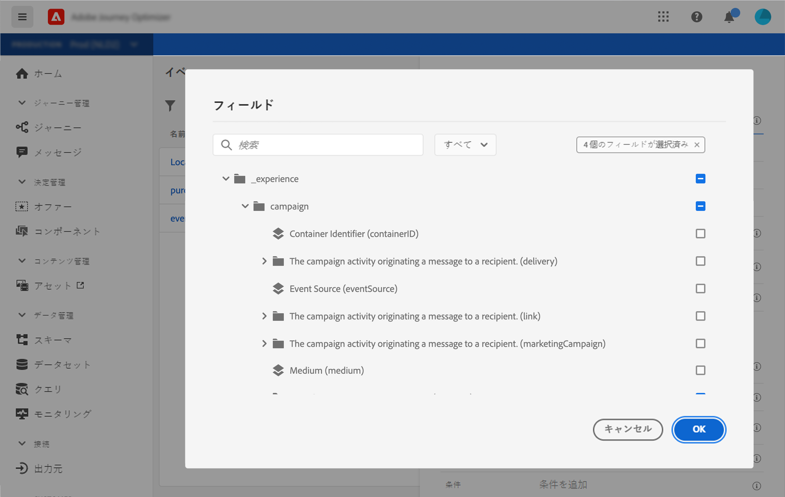

1. イベントから受け取るフィールドを選択します。これらは、ビジネスユーザーがジャーニーで活用するフィールドです。また、イベントに関連付けられた人物を識別するために使用するキーも含める必要があります（[この節](../event/about-creating.md#define-the-event-key)を参照）。

   >[!NOTE]
   >
   >システム生成イベントの場合は、[!DNL Journey Optimizer] がイベントを識別できるよう、選択されたフィールドのリストに **[!UICONTROL eventID]** フィールドが自動的に追加されます。イベントをプッシュするシステムでは ID を生成しないため、ペイロードプレビューにある ID を使用する必要があります。詳しくは、[この節](../event/about-creating.md#preview-the-payload)を参照してください。

1. 必要なフィールドの選択が完了したら、「**[!UICONTROL OK]**」をクリックするか、**[!UICONTROL Enter]** キーを押します。

   選択したフィールドの数が「**[!UICONTROL フィールド]**」フィールドに表示されます。

   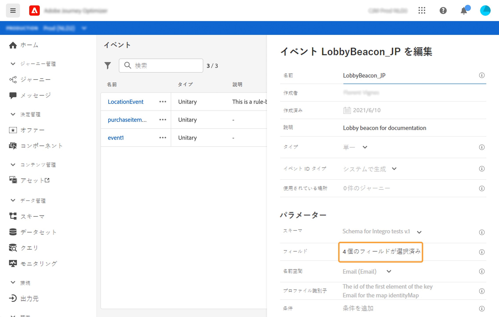

## 名前空間の選択 {#select-the-namespace}

名前空間を使用すると、イベントに関連付けられた人物の識別に使用するキーのタイプを定義できます。設定は必須ではありません。[リアルタイム顧客プロファイル](https://experienceleague.adobe.com/docs/experience-platform/profile/home.html?lang=ja){target=&quot;_blank&quot;}から得られる追加情報をジャーニーで取得する場合には必須です。 カスタムデータソースを介したサードパーティシステムのデータのみを使用する場合は、名前空間は必要ありません。

事前定義済みのものを使用するか、ID 名前空間サービスを使用して新しく作成できます。[Adobe Experience Platform のドキュメント](https://experienceleague.adobe.com/docs/experience-platform/sources/home.html?lang=ja){target=&quot;_blank&quot;}を参照してください。

メイン ID を持つスキーマを選択した場合は、「 **[!UICONTROL プロファイラー識別子]**」および「 **[!UICONTROL 名前空間]**」フィールドに事前入力します。ID を定義していない場合は、_identityMap > id_ がプライマリキーとして選択されます。次に、名前空間を選択する必要があります。キーは、_identityMap > id_ を使用して（**[!UICONTROL 名前空間]**&#x200B;フィールドの下に）事前入力されます。

フィールドを選択すると、メイン ID フィールドにタグ付けされます。

ドロップダウンリストから名前空間を選択します。

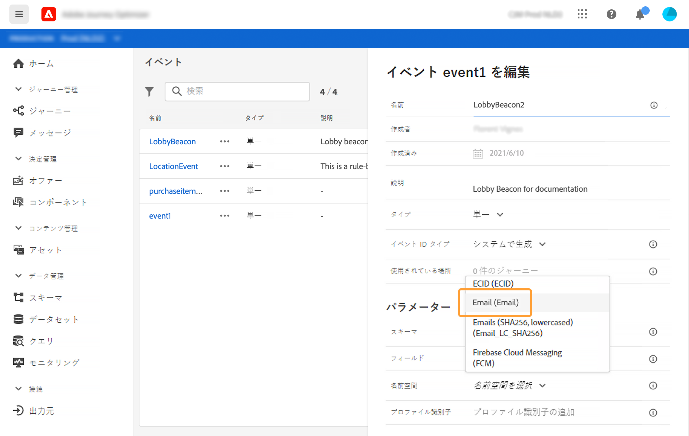

1 つのジャーニーで使用できる名前空間は 1 つだけです。同じジャーニーで複数のイベントを使用する場合は、同じ名前空間を使用する必要があります。[このページ](../building-journeys/journey.md)を参照してください。

## プロファイル識別子の定義 {#define-the-event-key}

キーは、イベントのペイロードデータの一部とするフィールドまたはフィールドの組み合わせです。システムはキーを使用することでイベントに関連付けられた人を識別できます。キーには、Experience Cloud ID、CRM ID、メールアドレスなどを使用できます。

リアルタイム顧客プロファイルデータベースに保存されたデータを活用する場合は、[リアルタイム顧客プロファイルサービス](https://experienceleague.adobe.com/docs/experience-platform/profile/home.html){target=&quot;_blank&quot;}でプロファイルの ID として定義した情報をイベントキーとして選択する必要があります。

これにより、システムはイベントと個人プロファイルの間の紐付けを実行できます。メイン ID を持つスキーマを選択した場合、「**[!UICONTROL プロファイル識別子]**」および「**[!UICONTROL 名前空間]** 」フィールドはあらかじめ入力されます。ID を定義していない場合は、_identityMap > id_ がプライマリキーとして選択されます。次に、名前空間を選択する必要があります。キーは、_identityMap > id_ を使用して（**[!UICONTROL 名前空間]**&#x200B;フィールドの下に）事前入力されます。

フィールドを選択すると、メイン ID フィールドにタグ付けされます。

CRM ID やメールアドレスなど、別のキーを使用する必要がある場合は、キーを手動で追加する必要があります。

1. 「**[!UICONTROL プロファイル識別子]**」フィールド内または鉛筆アイコン上をクリックします。

   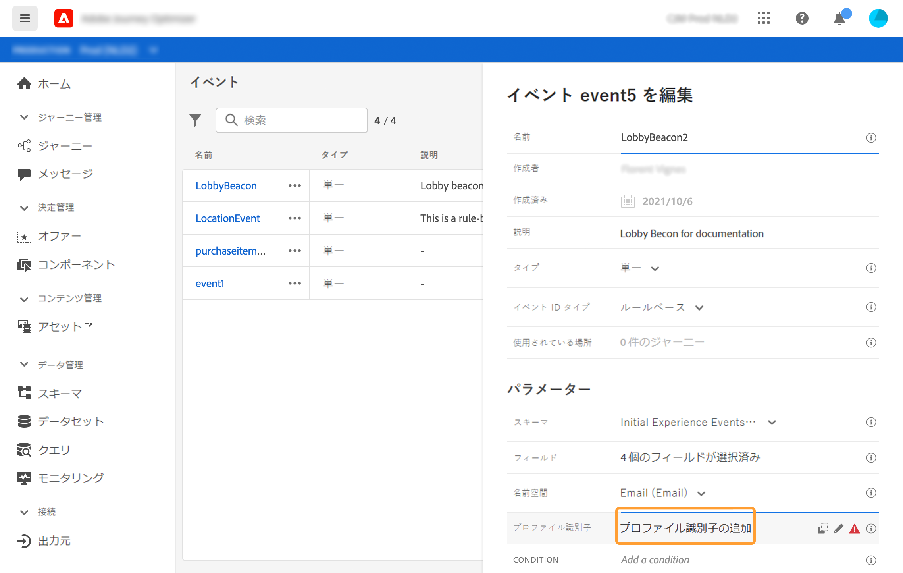

1. 「ペイロード」フィールドのリストでキーとして指定したフィールドを選択します。高度な式エディターに切り替えて、より複雑なキーを作成することもできます（例えば、イベントの 2 つのフィールドを連結）。この節では、以下を参照してください。

   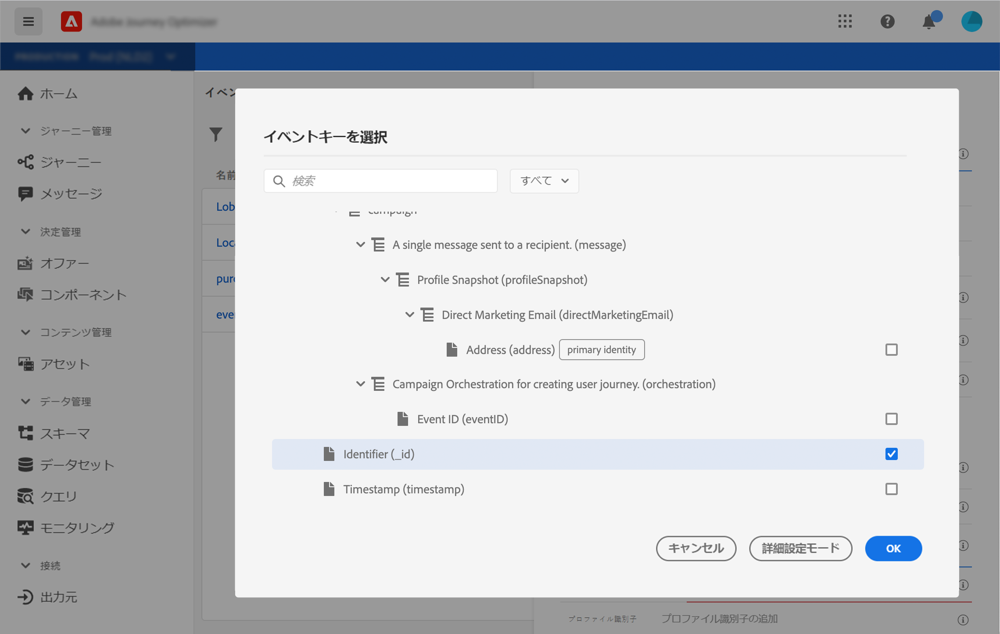

イベントを受け取ると、キーの値によって、イベントに関連付けられた人物を識別できます。キーは名前空間に関連付けられ（[この節](../event/about-creating.md#select-the-namespace)を参照）、Adobe Experience Platform でクエリの実行に使用できます。[このページ](../building-journeys/about-journey-activities.md#orchestration-activities)を参照してください。
このキーは、ある人物がジャーニーにエントリしているかどうかを確認するためにも使用されます。1 人の人物が同じジャーニーの 2 つの異なる場所に存在することはできません。その結果、同じキー（キー CRMID=3224 など）を同じジャーニー内の異なる場所に配置することはできません。

また、より高度な操作を実行する場合は、高度な式関数（**[!UICONTROL 詳細設定モード]**）にアクセスできます。これらの関数を使用すると、形式の変更、フィールドの連結、フィールドの一部のみを考慮する（先頭の 10 文字など）など、特定のクエリの実行に用いる値を操作できます。[Journey Orchestration のドキュメント](https://experienceleague.adobe.com/docs/journeys/using/building-advanced-conditions-journeys/expressionadvanced.html?lang=ja){target=&quot;_blank&quot;}を参照してください。

## 条件の追加 {#add-a-condition}

条件はシステム生成イベントの場合にのみ使用できます。システムがイベントの処理をフィルタリングできるよう、イベント条件を定義できます。条件が true の場合、イベントが処理されます。条件が true でない場合、イベントは無視されます。

イベントの条件は、イベントのペイロードで渡されたデータに基づいている場合にのみ指定できます。イベントレベルで定義された条件を、マーケターがキャンバス上で変更することはできません。目的は、このイベントを使用する際に、この条件を強化することです。例えば、買い物かごの値が小さすぎる場合に、マーケターが買い物かごの放棄イベントを使用しないようにするには、「買い物かごの値」イベントフィールドで条件を作成し、100 ドルを超える値を設定できます。

イベントに条件を設定するには、単純な式エディターまたは高度な式エディターを使用できます。[Journey Orchestration のドキュメント](https://experienceleague.adobe.com/docs/journeys/using/building-advanced-conditions-journeys/expressionadvanced.html){target=&quot;_blank&quot;}を参照してください。

例えば、特定のイベントタイプのイベントのみを処理し、他のタイプは無視する条件を定義できます。または、イベントが買い物かご放棄で、ペイロードに「買い物かごの値」フィールドが含まれている場合、買い物かごの値が 100 ドルを超えるときにのみイベントを処理するようイベント条件を定義できます。

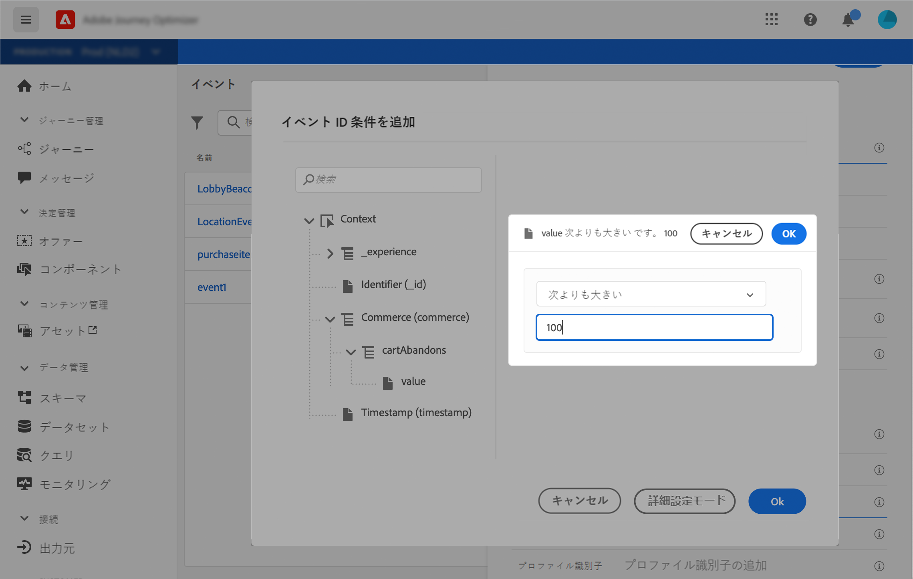

## ペイロードのプレビュー {#preview-the-payload}

ペイロードのプレビューを使用すると、ペイロード定義を検証できます。

>[!NOTE]
>
>システム生成イベントの場合、イベントを作成する際、ペイロードプレビューを表示する前にイベントを保存して再度開きます。この手順は、ペイロードでイベント ID を生成するために必要です。

1. 「**[!UICONTROL ペイロードを表示]**」アイコンをクリックして、システムが想定するペイロードをプレビューします。

   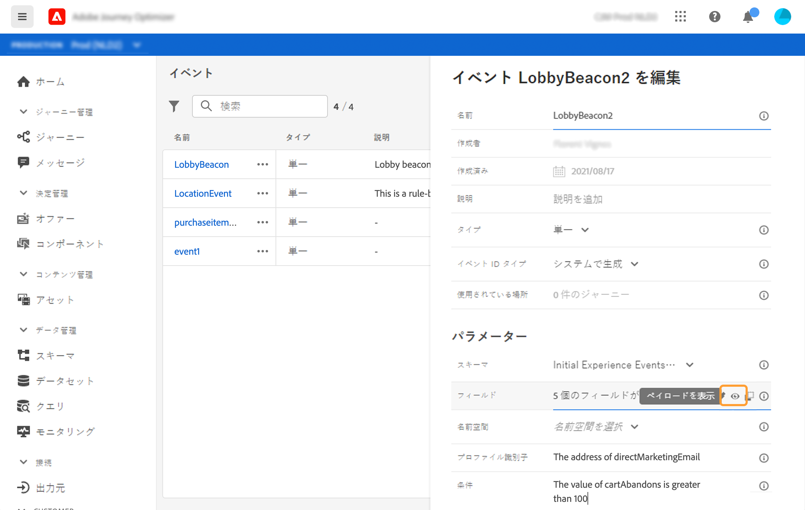

   選択したフィールドが表示されていることに注意してください。

   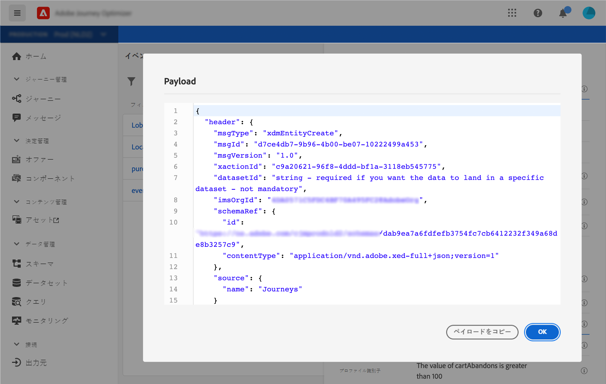

1. ペイロード定義を検証するプレビューを確認します。

1. その後、イベント送信の担当者とペイロードプレビューを共有できます。このペイロードは、にプッシュするイベントの設定を設計するのに役立ちます。 [!DNL Journey Optimizer]. [このページ](../event/additional-steps-to-send-events-to-journey-orchestration.md)を参照してください。
