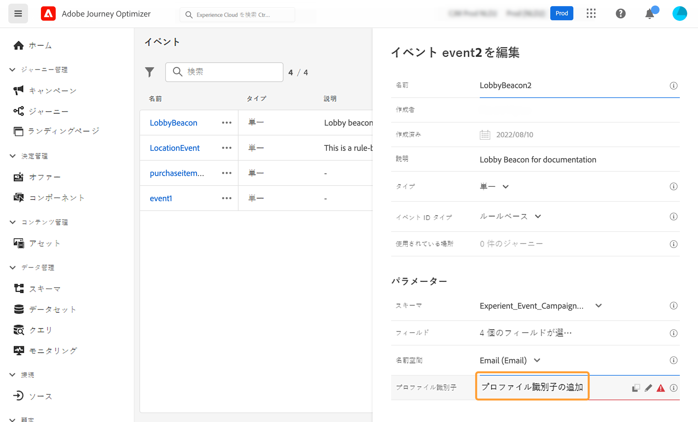
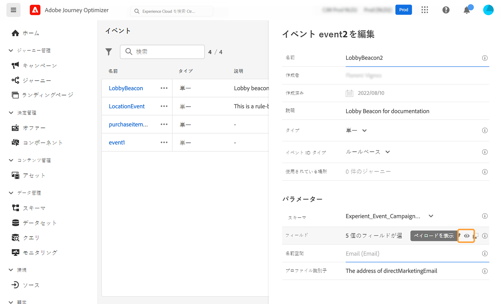

# 単一イベントの設定 {#configure-an-event}

>[!CONTEXTUALHELP]
>id="ajo_journey_event_unitary"
>title="単一イベント"
>abstract="イベントの設定を使用すると、Journey Optimizer が受け取る情報を定義できます。複数のイベントを（ジャーニーの様々なステップで）使用できます。また、同じイベントを複数のジャーニーで使用することもできます。単一イベントは、特定のプロファイルにリンクされます。ルールベースによるものと、システムで生成されるものがあります。"

>[!CONTEXTUALHELP]
>id="ajo_journey_event_parameters"
>title="パラメーター"
>abstract="スキーマやペイロードのフィールドなどのイベントのパラメーターを定義します。ルールベースのイベントの場合は、「**[!UICONTROL イベント ID 条件]**」フィールドを使用して、ジャーニーをトリガーするイベントを識別するためにシステムが使用する条件を定義します。イベントに使用する ID タイプとプロファイル識別子を追加します。"

単一イベントは、特定のプロファイルにリンクされます。ルールベースによるものと、システムで生成されるものがあります。単一イベントの詳細については、[この節](../event/about-events.md)を参照してください。

新規イベントを設定する最初の手順は次のとおりです。

1. 「管理」メニューセクションで&#x200B;**[!UICONTROL 設定]**&#x200B;に移動し、「**[!UICONTROL イベント]**」セクションで「**[!UICONTROL 管理]**」をクリックします。イベントのリストが表示されます。

   

1. 新しいイベントを作成するには、「**[!UICONTROL イベントを作成]**」をクリックします。画面の右側にイベント設定ペインが開きます。

   

1. イベントの名前を入力します。説明を追加することもできます。

   

   >[!NOTE]
   >
   >英数字とアンダースコアのみが使用できます。最大長は 30 文字です。

1. 「**[!UICONTROL タイプ]**」フィールドで「**単一**」を選択します。

   

1. 「**[!UICONTROL イベント ID タイプ]**」フィールドで、使用するイベント ID タイプとして「**ルールベース**」または「**システム生成**」を選択します。イベント ID のタイプの詳細については、[この節](../event/about-events.md#event-id-type)を参照してください。

   

1. このイベントを使用しているジャーニーの数は、**[!UICONTROL 使用されている場所]**&#x200B;フィールドに表示されます。「**[!UICONTROL ジャーニーを表示]**」アイコンをクリックすると、このイベントを使用しているジャーニーのリストを表示できます。

1. スキーマとペイロードのフィールドを定義します。ジャーニーが受け取るイベント情報（通常、ペイロードと呼びます）は、ここで選択します。その後、この情報をジャーニーに使うことができます。[この節](../event/about-creating.md#define-the-payload-fields)を参照してください。

   

   >[!NOTE]
   >
   >**[!UICONTROL システム生成]**&#x200B;タイプを選択した場合は、eventID タイプのフィールドを持つスキーマのみを使用できます。**[!UICONTROL ルールベース]**&#x200B;タイプを選択した場合は、すべてのエクスペリエンスイベントのスキーマを使用できます。

1. ルールベースのイベントの場合は、「**[!UICONTROL イベント ID 条件]**」フィールド内でクリックします。簡単で高度な式エディターを使用して、ジャーニーをトリガーするイベントを識別するためにシステムが使用する条件を定義します。

   

   この例では、プロファイルの市区町村に基づいて条件を作成しました。つまり、システムはこの条件（**[!UICONTROL 市区町村]**&#x200B;フィールドと&#x200B;**[!UICONTROL パリ]**&#x200B;という値）を満たすイベントを受け取るたびに、ジャーニーにイベントを渡します。

   >[!NOTE]
   >
   >シンプルな式エディターでは、すべての演算子が使用できるわけではなく、データタイプに応じて異なります。例えば、文字列タイプのフィールドには、「次を含む」または「次と等しい」を使用できます。
   >
   >イベントの作成後に新しい列挙値でスキーマを変更する場合、次の手順に従って既存のイベントに変更を適用する必要があります。イベントフィールドの列挙フィールドの選択を解除し、選択を確認して、列挙フィールドを再度選択します。これで、新しい列挙値が表示されます。

1. ID タイプを追加します。この手順はオプションですが、ID タイプを追加すると、リアルタイム顧客プロファイルサービスに保存されている情報を活用できるため、推奨されています。イベントのキーのタイプを定義します。詳しくは、[この節](../event/about-creating.md#select-the-namespace)を参照してください。

1. プロファイル識別子を定義します。ペイロードフィールドからフィールドを選択するか、イベントに関連付けられた個人を識別する式を定義します。このキーは、ID タイプを選択すると自動的に設定されます（編集は可能）。ジャーニーは ID タイプに対応するキーを選択します（例えば、メール ID タイプを選択すると、メールのキーが選択されます）。詳しくは、[この節](../event/about-creating.md#define-the-event-key)を参照してください。

   

1. 「**[!UICONTROL 保存]**」をクリックします。

   イベントが設定され、ジャーニーで使用できる状態になりました。イベントを受信するには追加の設定手順が必要です。[このページ](../event/additional-steps-to-send-events-to-journey.md)を参照してください。

## ペイロードフィールドの定義 {#define-the-payload-fields}

ペイロード定義を使用すると、ジャーニーのイベントからシステムが受け取ると想定される情報と、イベントに関連付けられている人を識別するためのキーを選択できます。ペイロードは Experience Cloud XDM フィールド定義に基づいています。XDM について詳しくは、[Adobe Experience Platform ドキュメント](https://experienceleague.adobe.com/docs/experience-platform/xdm/home.html?lang=ja){target="_blank"}を参照してください。

1. リストから XDM スキーマを選択し、**[!UICONTROL フィールド]**&#x200B;フィールドまたは「**[!UICONTROL 編集]**」アイコンをクリックします。

   

   スキーマで定義されているすべてのフィールドが表示されます。フィールドのリストは、スキーマによって異なります。特定のフィールドを検索し、フィルターを使用してすべてのノードとフィールドを表示、または選択したフィールドのみを表示できます。スキーマ定義によっては、一部のフィールドが必須となっており、事前に選択されている場合があります。選択を解除することはできません。ジャーニーがイベントを適切に受け取るために必須のフィールドはすべて、デフォルトで選択されます。

   >[!NOTE]
   >
   >システム生成イベントの場合は、「オーケストレーション」フィールドグループが XDM スキーマに追加されていることを確認してください。これにより、[!DNL Journey Optimizer] と連携するために必要な情報がスキーマにすべて含まれるようになります。

   

1. イベントから受け取るフィールドを選択します。これらは、ビジネスユーザーがジャーニーで活用するフィールドです。また、イベントに関連付けられた人物を識別するために使用するキーも含める必要があります（[この節](../event/about-creating.md#define-the-event-key)を参照）。

   >[!NOTE]
   >
   >システム生成イベントの場合は、[!DNL Journey Optimizer] がイベントを識別できるよう、選択されたフィールドのリストに **[!UICONTROL eventID]** フィールドが自動的に追加されます。イベントをプッシュするシステムでは ID を生成しないため、ペイロードプレビューにある ID を使用する必要があります。[この節](../event/about-creating.md#preview-the-payload)を参照してください。

1. 必要なフィールドの選択が完了したら、「**[!UICONTROL OK]**」をクリックするか、**[!UICONTROL Enter]** キーを押します。

   選択したフィールドの数が「**[!UICONTROL フィールド]**」フィールドに表示されます。

   

## ID タイプの選択 {#select-the-namespace}

>[!CONTEXTUALHELP]
>id="ajo_journey_namespace"
>title="ID タイプ"
>abstract="イベントに関連付けられた顧客プロファイルを識別するためのキーを選択します。"

ID タイプ（旧称「名前空間」）を使用すると、イベントに関連付けられた人物の識別に使用するキーのタイプを定義できます。設定は必須ではありません。[リアルタイム顧客プロファイル](https://experienceleague.adobe.com/docs/experience-platform/profile/home.html?lang=ja){target="_blank"}からの追加情報をジャーニーで取得する場合に必要です。カスタムデータソースを介したサードパーティシステムのデータのみを使用する場合は、ID タイプは必要ありません。

既存の ID タイプを使用することも、Adobe Experience Platform ID サービスを使用して新しい ID タイプを作成することもできます。詳しくは、[Adobe Experience Platform ドキュメント](https://experienceleague.adobe.com/docs/experience-platform/identity/home.html?lang=ja){target="_blank"}を参照してください。

プライマリ ID を持つスキーマを選択した場合は、「**[!UICONTROL プロファイル識別子]**」および「**[!UICONTROL ID タイプ]**」フィールドに事前入力します。ID を定義していない場合は、_identityMap > id_ がプライマリキーとして選択されます。次に、ID タイプを選択する必要があります。キーは、_identityMap／ID_ を使用して（**[!UICONTROL ID タイプ]**&#x200B;フィールドの下に）事前入力されます。

フィールドを選択すると、プライマリ ID フィールドにタグ付けされます。

ドロップダウンリストから ID タイプを選択します。

1 つのジャーニーで使用できる ID タイプは 1 つだけです。同じジャーニーで複数のイベントを使用する場合は、同じ ID タイプを使用する必要があります。詳しくは、[このページ](../building-journeys/journey.md)を参照してください。

>[!NOTE]
>
>ユーザーベースの ID タイプのみ選択できます。ID タイプをルックアップテーブルに対して定義した場合（例：製品ルックアップ対して ProductID ID タイプを定義した場合）、その ID タイプを **ID タイプ**&#x200B;ドロップダウンリストで使用することはできません。

## プロファイル識別子の定義 {#define-the-event-key}

キーは、イベントのペイロードデータの一部とするフィールドまたはフィールドの組み合わせです。システムはキーを使用することでイベントに関連付けられた人を識別できます。キーには、Experience Cloud ID、CRM ID、メールアドレスなどを使用できます。

アドビのリアルタイム顧客プロファイルデータベースに保存されたデータを使用するには、イベントキーが、[リアルタイム顧客プロファイルサービス](https://experienceleague.adobe.com/docs/experience-platform/profile/home.html?lang=ja){target="_blank"}でプロファイル ID として定義した情報である必要があります。

これにより、プロファイル識別子はイベントと個人プロファイルの間の紐付けを実行できます。プライマリ ID を持つスキーマを選択した場合は、「**[!UICONTROL プロファイル識別子]**」および「**[!UICONTROL ID タイプ]**」フィールドに事前入力します。ID を定義していない場合は、_identityMap／ID_ がプライマリキーとして選択されます。次に、ID タイプを選択する必要があります。キーは、_identityMap／ID_ を使用して自動的に事前入力されます。

フィールドを選択すると、プライマリ ID フィールドにタグ付けされます。

CRM ID やメールアドレスなど、別のキーを使用する必要がある場合は、以下の説明のとおり、キーを手動で追加する必要があります。

1. 「**[!UICONTROL プロファイル識別子]**」フィールド内または鉛筆アイコン上をクリックします。

   

1. 「ペイロード」フィールドのリストでキーとして指定したフィールドを選択します。

イベントを受け取ると、キーの値によって、システムはイベントに関連付けられた人物を識別できます。キーは [ID タイプ](../event/about-creating.md#select-the-namespace)に関連付けられ、Adobe Experience Platform でクエリの実行に使用できます。[このページ](../building-journeys/about-journey-activities.md#orchestration-activities)を参照してください。
このキーは、ある人物がジャーニーにエントリしているかどうかを確認するためにも使用されます。1 人の人物が同じジャーニーの 2 つの異なる場所に存在することはできません。その結果、同じキー（キー CRMID=3224 など）を同じジャーニー内の異なる場所に配置することはできません。

## 高度な式エディター {#adv-exp-editor}

イベント ID 条件またはプロファイル識別子を定義する際に、高度な式エディターに切り替えて、より複雑なキーを作成できます（例えば、イベントの 2 つのフィールドを連結するなど）。

より高度な操作を実行する場合は、「**[!UICONTROL 詳細設定モード]**」ボタンから高度な式関数にアクセスできます。これらの関数を使用すると、形式の変更、フィールドの連結、フィールドの一部のみを考慮する（先頭の 10 文字など）など、特定のクエリの実行に用いる値を操作できます。この[ページ](../building-journeys/expression/expressionadvanced.md)を参照してください。

## ペイロードのプレビュー {#preview-the-payload}

ペイロードのプレビューを使用すると、ペイロード定義を検証できます。

>[!NOTE]
>
>システム生成イベントの場合、イベントを作成する際、ペイロードプレビューを表示する前にイベントを保存して再度開きます。この手順は、ペイロードでイベント ID を生成するために必要です。

1. 「**[!UICONTROL ペイロードを表示]**」アイコンをクリックして、システムが想定するペイロードをプレビューします。

   

   選択したフィールドが表示されていることに注意してください。

   

1. ペイロード定義を検証するプレビューを確認します。

1. その後、イベント送信の担当者とペイロードプレビューを共有できます。このペイロードは、[!DNL Journey Optimizer]にプッシュするイベントのセットアップを設計するのに役立ちます。[このページ](../event/additional-steps-to-send-events-to-journey.md)を参照してください。
