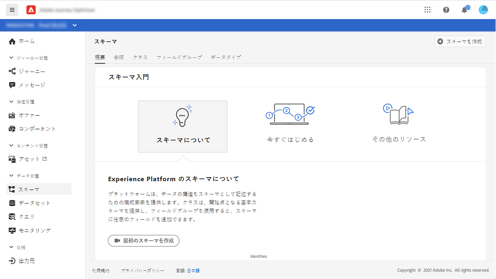
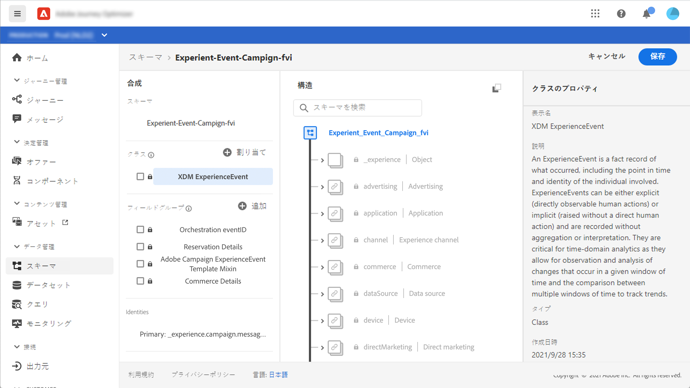
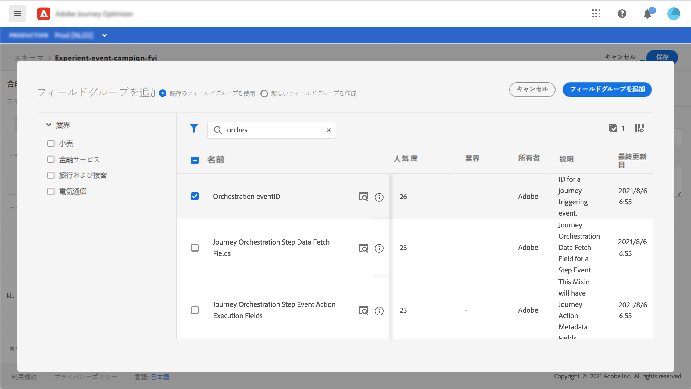
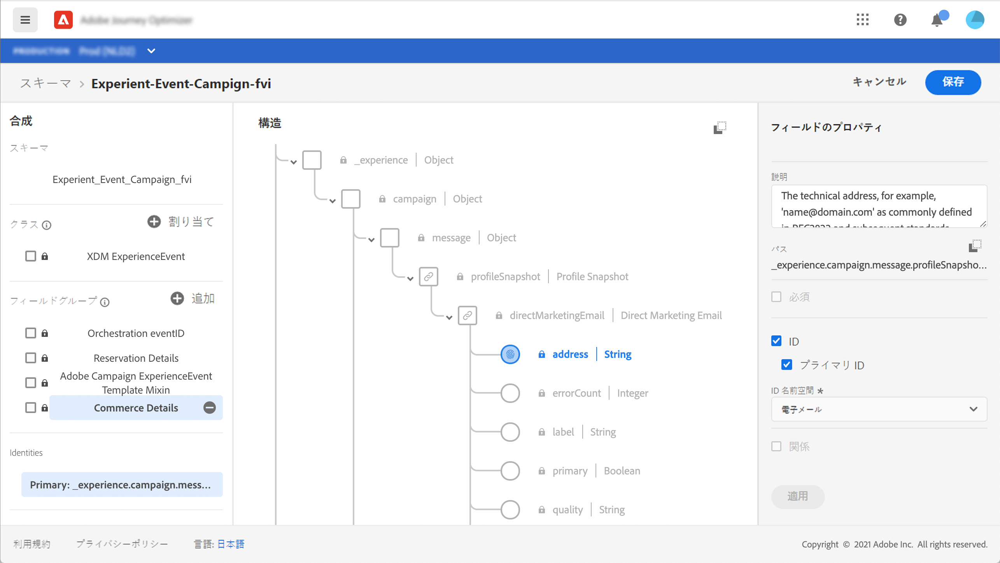
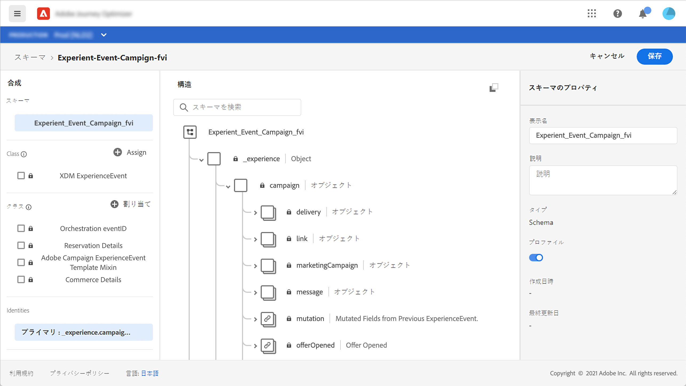
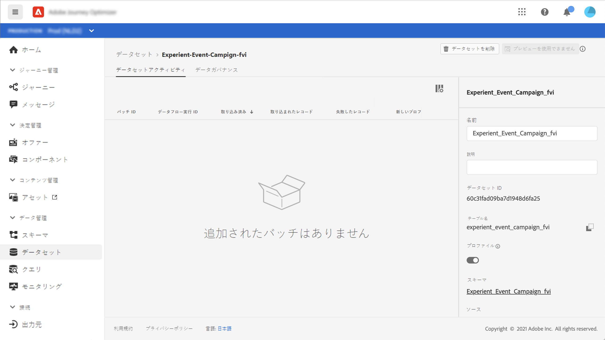
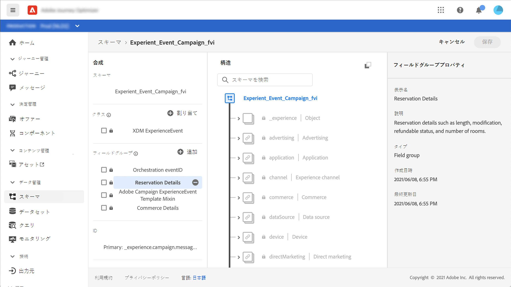
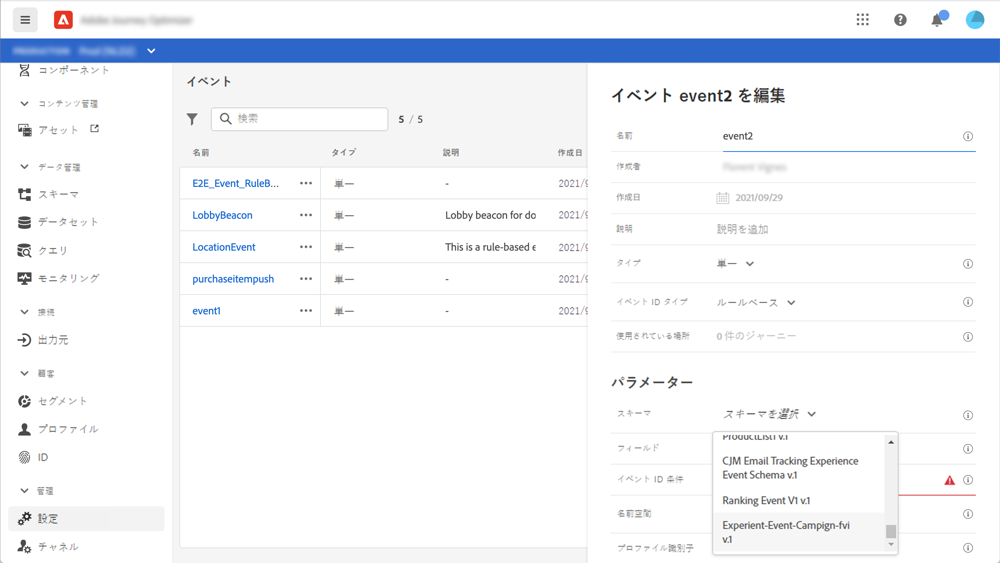

# [!DNL Journey Optimizer] イベントの ExperienceEvent スキーマについて

[!DNL Journey Optimizer] イベントは、ストリーミング取得を介して Adobe Experience Platform に送信される XDM エクスペリエンスイベントです。

そのため、[!DNL Journey Optimizer] のイベントを設定するための重要な前提条件は、Adobe Experience Platform の Experience Data Model（または XDM）と XDM Experience Data スキーマの作成方法、および XDM 形式のデータを Adobe Experience Platform にストリーミングする方法に精通していることです。

## [!DNL Journey Optimizer] イベントのスキーマ要件

[!DNL Journey Optimizer] のイベントを設定する最初の手順は、イベントを表す XDM スキーマと、Adobe Experience Platform でイベントのインスタンスを記録するために作成されたデータセットを確実に用意することです。イベント用データセットは必ずしも必要ではありませんが、特定のデータセットにイベントを送信すると、ユーザーのイベント履歴を保持して後から参照および分析できるので便利です。イベントに適したスキーマとデータセットがまだない場合は、これらのタスクの両方を Adobe Experience Platform の Web インターフェイスで実行できます。

[!DNL Journey Optimizer] イベントに使用される XDM スキーマは、以下の要件を満たす必要があります。

* スキーマは、XDM ExperienceEvent クラスである必要があります。

   

* システム生成イベントの場合、スキーマにオーケストレーション eventID Mixin を含める必要があります。[!DNL Journey Optimizer] はこのフィールドを使用して、ジャーニーで使用されるイベントを識別します。

   

* イベントの件名を識別するための ID フィールドを宣言します。ID が指定されていない場合は、ID マップを使用できます。この方法は推奨されません。

   

* このデータを後からジャーニーで参照できるようにする場合は、プロファイルのスキーマとデータセットをマークします。

   

   

* ユーザーに関する情報、イベントの生成元のデバイス、場所、イベントに関連するその他の有意義な状況など、イベントに含めたいその他のコンテキストデータを取り込むためのデータフィールドを自由に含めることができます。

   

   
