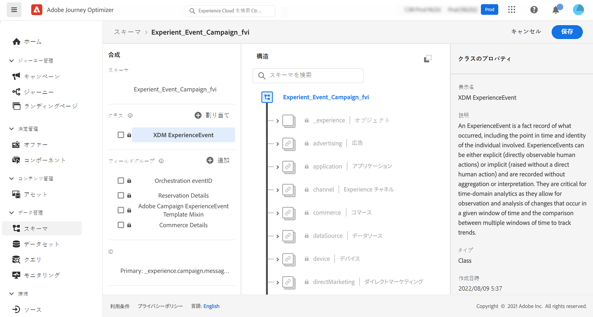
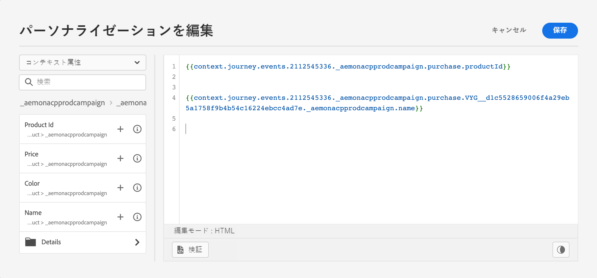

# [!DNL Journey Optimizer] イベントの ExperienceEvent スキーマについて {#about-experienceevent-schemas}

[!DNL Journey Optimizer] イベントは、ストリーミング取得を介して Adobe Experience Platform に送信される XDM エクスペリエンスイベントです。

そのため、[!DNL Journey Optimizer] のイベントを設定するための重要な前提条件は、Adobe Experience Platform のエクスペリエンスデータモデル（または XDM）と XDM エクスペリエンスイベントスキーマの作成方法、および XDM 形式のデータを Adobe Experience Platform にストリーミングする方法に精通していることです。

>[!CAUTION]
>
>ジャーニー条件でのエクスペリエンスイベント参照はサポートされなくなりました。詳しくは、別のベストプラクティスを参照してください。イベントトリガージャーニーのユースケースがあり、エクスペリエンスイベント参照が必要で、リストされている別の手段のいずれでもサポートできない場合は、アドビ担当者にお問い合わせください。アドビが目標の達成をお手伝いします。
>
>ジャーニーの開始イベントからコンテキストにアクセスしても影響を受けません。

## [!DNL Journey Optimizer] イベントのスキーマ要件  {#schema-requirements}

[!DNL Journey Optimizer] のイベントを設定する最初の手順は、イベントを表す XDM スキーマと、Adobe Experience Platform でイベントのインスタンスを記録するために作成されたデータセットを確実に用意することです。イベント用データセットは必ずしも必要ではありませんが、特定のデータセットにイベントを送信すると、ユーザーのイベント履歴を保持して後から参照および分析できるので便利です。イベントに適したスキーマとデータセットがまだない場合は、これらのタスクの両方を Adobe Experience Platform の Web インターフェイスで実行できます。

[!DNL Journey Optimizer] イベントに使用される XDM スキーマは、以下の要件を満たす必要があります。

* スキーマは、XDM ExperienceEvent クラスである必要があります。

  

* システム生成イベントの場合、オーケストレーション eventID フィールドグループがスキーマに含まれている必要があります。[!DNL Journey Optimizer] はこのフィールドを使用して、ジャーニーで使用されるイベントを識別します。

  

* イベント内の個々のプロファイルを識別するための ID フィールドを宣言します。 ID が指定されていない場合は、ID マップを使用できます。この方法は推奨されません。

  

* このデータをプロファイルで使用できるようにする場合は、プロファイルのスキーマとデータセットをマークします。[詳細情報](../data/lookup-aep-data.md)

  

  

* ユーザーに関する情報、イベントの生成元のデバイス、場所、イベントに関連するその他の有意義な状況など、イベントに含めるその他のコンテキストデータを取り込むデータフィールドを自由に含めることができます。

  

  

<!--
## Leverage schema relationships{#leverage_schema_relationships}

Adobe Experience Platform allows you to define relationships between schemas in order to use one dataset as a lookup table for another. 

Let's say your brand data model has a schema capturing purchases. You also have a schema for the product catalog. You can capture the product ID in the purchase schema and use a relationship to look up more complete product details from the product catalog. This allows you to create an audience for all customers who bought a laptop, for example, without having to explicitly list out all laptop IDs or capture every single product details in transactional systems.

To define a relationship, you need to have a dedicated field in the source schema, in this case the product ID field in the purchase schema. This field needs to reference the product ID field in the destination schema. The source and destination tables must be enabled for profiles and the destination schema must have that common field defined as its primary identity. 

Here is the product catalog schema enabled for profile with the product ID defined as the primary identity. 

Here is the purchase schema with the relationship defined on the product ID field.

>[!NOTE]
>
>Learn more about schema relationships in the [Experience Platform documentation](https://experienceleague.adobe.com/docs/platform-learn/tutorials/schemas/configure-relationships-between-schemas.html).

In Journey Optimizer, you can then leverage all the fields from the linked tables:

* when configuring a business or unitary event, [Read more](../event/experience-event-schema.md#unitary_event_configuration) 
* when using conditions in a journey, [Read more](../event/experience-event-schema.md#journey_conditions_using_event_context) 
* in message personalization, [Read more](../event/experience-event-schema.md#message_personalization) 
* in custom action personalization, [Read more](../event/experience-event-schema.md#custom_action_personalization_with_journey_event_context) 

### Arrays{#relationships_limitations}

You can define a schema relationship on an array of strings, for example, a list of product IDs.

You can also define a schema relationship with an attribute inside of an array of objects, for example a list of purchase information (product ID, product name, price, discount). The lookup values will be available in journeys (conditions, custom actions, etc.) and message personalization. 

### Event configuration{#unitary_event_configuration}

The linked schema fields are available in unitary and business event configuration:

* when browsing through the event schema fields in the event configuration screen.
* when defining a condition for system-generated events.

The linked fields are not available:

* in the event key formula
* in event id condition (rule-based events)

To learn how to configure a unitary event, refer to this [page](../event/about-creating.md).

### Journey conditions using event context{#journey_conditions_using_event_context}

You can use data from a lookup table linked to an event used in a journey for condition building (expression editor).

Add a condition in a journey, edit the expression and unfold the event node in the expression editor. 

To learn how to define journey conditions, refer to this [page](../building-journeys/condition-activity.md).

### Message personalization{#message_personalization}

The linked fields are available when personalizing a message. The related fields are displayed in the context passed from the journey to the message.

To learn how to personalize a message with contextual journey information, refer to this [page](../personalization/personalization-use-case.md).

### Custom action personalization with journey event context{#custom_action_personalization_with_journey_event_context}

The linked fields are available when configuring the action parameters of a journey custom action activity. 

To learn how to use custom actions, refer to this [page](../building-journeys/using-custom-actions.md).
-->
