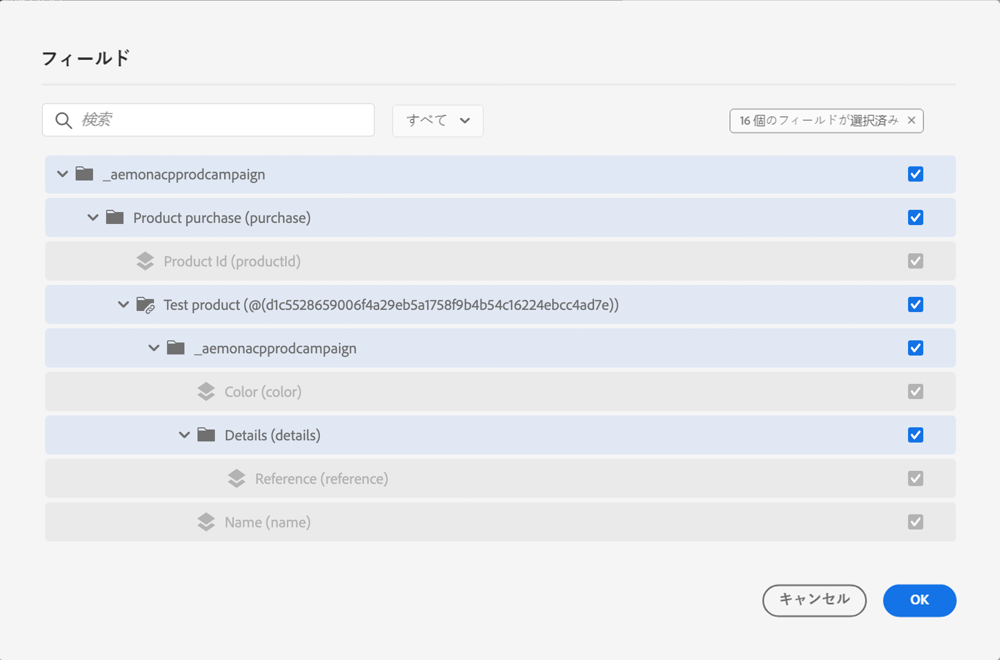

# イベントの [!DNL Journey Optimizer] ExperienceEvent スキーマについて {#about-experienceevent-schemas}

[!DNL Journey Optimizer] イベントは、XDM の機能を利用して、Adobe エクスペリエンスプラットフォームに、ストリーミングの取り込みによって送信されます。

そのため [!DNL Journey Optimizer] 、イベントを設定するための重要な前提条件として、Adobe エクスペリエンス platform のエクスペリエンスデータモデル (または xdm) と、xdm のイベントスキーマを作成する方法、そして xdm フォーマットされたデータを Adobe エクスペリエンスプラットフォームにストリーミングする方法について理解しておく必要があります。

## イベントの [!DNL Journey Optimizer] スキーマ要件  {#schema-requirements}

イベント [!DNL Journey Optimizer] を設定するには、まず最初に、イベントを表す XDM スキーマと、Adobe エクスペリエンスプラットフォーム上でこのイベントのインスタンスを記録するために作成されたデータセットがあることを確認します。 イベントのデータ設定は必ずしも必要なわけではありませんが、イベントを特定のデータセットに送信することで、ユーザーによるイベント履歴を維持し、将来の参照と分析に使用できるようになります。 イベントに対して適切なスキーマおよびデータセットがない場合は、これらのタスクはどちらも Adobe エクスペリエンスプラットフォーム web インターフェイスで実行できます。

イベントに [!DNL Journey Optimizer] 使用される XDM スキーマは、次の要件を満たしている必要があります。

* スキーマは、XDM ExperienceEvent クラスである必要があります。

   

* システムによって生成されたイベントの場合、スキーマには、オーケストレーションイベントフィールドグループが含まれている必要があります。 [!DNL Journey Optimizer] では、このフィールドを使用して、journeys で使用されているイベントを識別します。

   

* イベントの対象を識別するための id フィールドを宣言します。 Id が指定されていない場合は、id マップを使用できます。 これは推奨されていません。

   

* このデータを後で参照できるようにするには、プロファイルのスキーマおよびデータセットにマークを付けます。

   

   

* このように、イベントに含めるその他の文脈データ (ユーザーに関する情報、イベントが生成されたデバイス、場所、イベントに関連する重要な状況など) を取り込むためのデータフィールドも自由に追加できます。

   

   

## スキーマリレーションシップの活用{#leverage_schema_relationships}

Adobe エクスペリエンスプラットフォームを使用すると、スキーマ間の関係を定義して、1つのデータセットを別のデータセットのルックアップテーブルとして使用することができます。

ここでは、メーカーのデータモデルに、スキーマを購入するという情報が記載されています。 また、製品カタログのスキーマも作成します。 購入したスキーマの製品 ID を取得して、関係を使用して、製品カタログから詳細な製品詳細を確認することができます。 これによって、ラップトップを購入したすべての顧客に対して、ラップトップを明示的に指定したり、すべての製品についてのトランザクションシステムですべてを取得したりすることなく、セグメントを作成することができます。

リレーションシップを定義するには、ソーススキーマの専用フィールドが必要です。この場合は、購入スキーマの &quot;product ID&quot; フィールドが必要です。 このフィールドは送信先スキーマの &quot;product ID&quot; フィールドを参照する必要があります。 ソーステーブルと宛先テーブルがプロファイルに対して有効になっている必要があります。送信先スキーマには、プライマリ id として定義された共通フィールドが必要です。

次に示すのは、profile on the product catalog スキーマが有効になっていることを示しています。

次に示すのは、&quot;product ID&quot; フィールドで定義されているリレーションシップを含む購入スキーマです。

>[!NOTE]
>
>エクスペリエンスプラットフォームマニュアル ](https://experienceleague.adobe.com/docs/platform-learn/tutorials/schemas/configure-relationships-between-schemas.html?lang=en) のスキーマリレーションシップについて詳しくは、 [ こちらを参照してください。

この場合、次のように、リンクテーブルのすべてのフィールドを使用して、オプティマイザーを作成できます。

* ビジネスイベントまたはユニタリイベントを設定する場合は、「詳細」を参照し [ てください。](../event/experience-event-schema.md#unitary_event_configuration)
* 順番に条件を使用する場合は、「詳細」を [ 参照してください。](../event/experience-event-schema.md#journey_conditions_using_event_context)
* メッセージの個人用設定で、「詳細」を参照し [ てください。](../event/experience-event-schema.md#message_personalization)
* カスタムアクションの個人用設定では、「詳細」を参照し [ てください。](../event/experience-event-schema.md#custom_action_personalization_with_journey_event_context)

### イベントの設定{#unitary_event_configuration}

「リンクされたスキーマ」フィールドでは、ユニタリおよびビジネスイベントの設定を使用できます。

* 「イベントの設定」画面の「イベントスキーマ」フィールドに移動します。
* システムによって生成されたイベントの条件を定義する場合。

リンクされたフィールドを使用できません。

* イベントキー式
* イベント id 条件 (ルールに基づいたイベント)

ユニタリイベントの設定方法については、この [ ページ ](../event/about-creating.md) を参照してください。

### イベントのコンテキストを使用した旅の状態{#journey_conditions_using_event_context}

このルックアップテーブルのデータは、条件構築に使用するイベントにリンクされています (式エディター)。

条件を追加する場合は、式を編集して、式エディターにイベントノードを展開します。

旅の状態を定義する方法については、この [ ページ ](../building-journeys/condition-activity.md) を参照してください。

### メッセージの個人用設定{#message_personalization}

リンクされたフィールドは、メッセージを個人用に選択している場合に使用できます。 関連付けられたフィールドは、メッセージに転送されるときに渡されるコンテキストで表示されます。

文脈に応じた旅情報をメッセージに個人用に設定する方法については、この [ ページ ](../personalization/personalization-use-case.md) を参照してください。

### 旅イベントのコンテキストを使用したカスタムアクションの個人用設定{#custom_action_personalization_with_journey_event_context}

リンクされたフィールドは、旅のカスタムアクションアクティビティのアクションパラメーターを設定する場合に使用できます。

カスタムアクションの使用方法については、この [ ページ ](../building-journeys/using-custom-actions.md) を参照してください。
