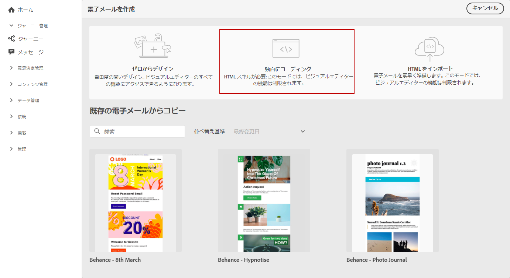
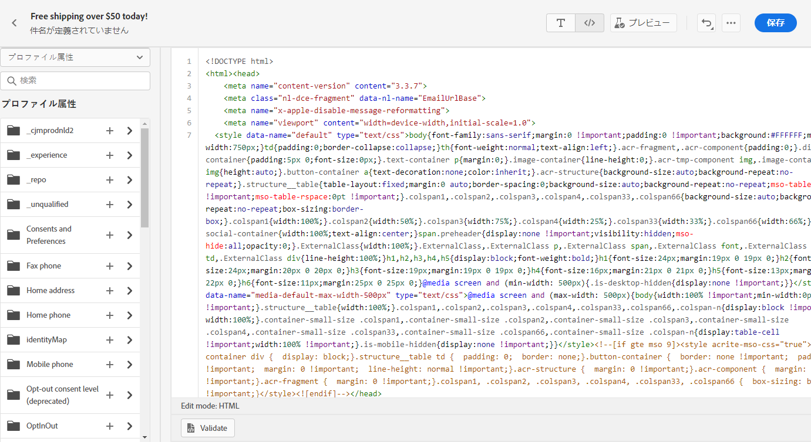
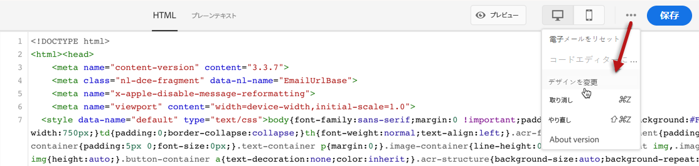
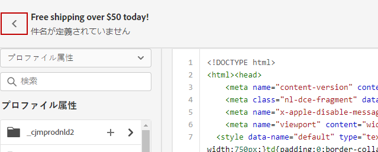
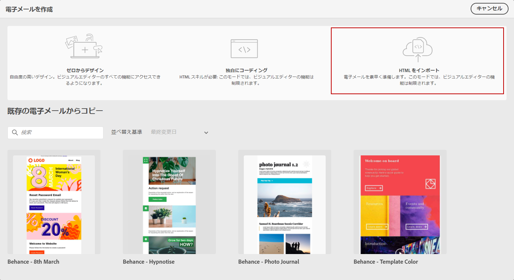
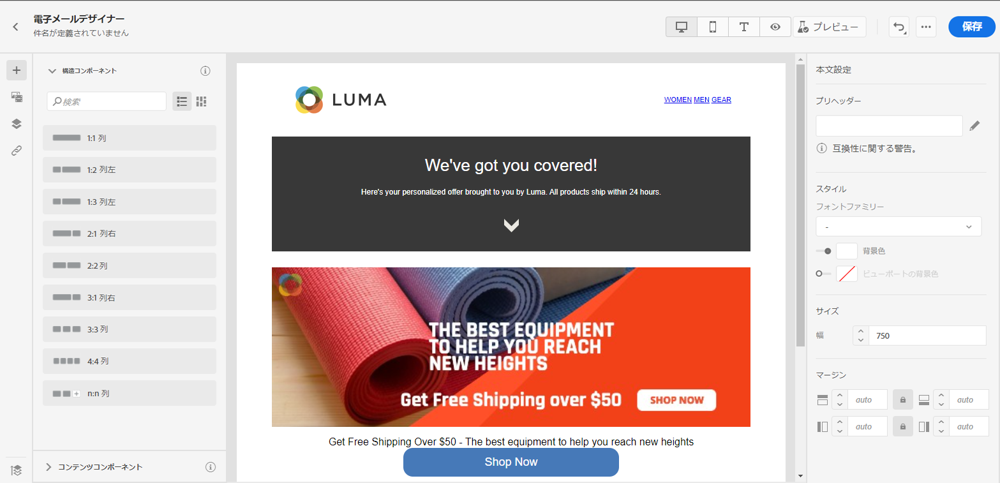

# 電子メールコンテンツをインポートまたはコード化{#existing-content}

Journey Optimizerでは、既存のHTMLコンテンツを読み込んで電子メールをデザインできます。 このコンテンツには、生のHTMLコードや、既存のHTMLファイルまたはzipフォルダーから取得したコンテンツを使用できます。

HTMLコンテンツのコーディングを作成したり、既存のコンテンツを読み込んだりするには、次の手順に従います。

1. [メッセージの作成](create-message.md)

1. 「**[!UICONTROL コンテンツを編集]**」セクションから&#x200B;**[!UICONTROL 電子メールデザイナー]**&#x200B;を開きます。

   

1. 「**[!UICONTROL 独自のコード]**」または「**[!UICONTROL HTMLを読み込む]**」を選択します。 次の手順については、次の節を参照してください。

## 自分の{#import-raw-html-code}をコード化

**[!UICONTROL 独自の]**&#x200B;モードをコードして、生のHTMLを読み込んだり、電子メールコンテンツをコード化したりできます。 この方法にはHTMLスキルが必要です。

>[!CAUTION]
>
> [Adobe Experience Manager Assets Essentials](assets-essentials.md)の画像は、このメソッドを使用する場合は参照できません。 HTMLコードで参照される画像は、公開場所に保存する必要があります。

1. 電子メールデザイナーホームページで、「**[!UICONTROL 独自のコード]**」を選択します。

   

1. 生のHTMLコードを入力または貼り付けます。

1. 左側のペインを使用して、[!DNL Journey Optimizer]個人設定機能を利用します。 詳しくは、[こちらの節](personalization/personalize.md)を参照してください。

   

1. 電子メールデザイナーを開いて、新しいデザインの電子メールを開始する場合は、オプションメニューから「**[!UICONTROL デザインの変更]**」を選択します。

   

1. 「**[!UICONTROL プレビュー]**」ボタンをクリックして、テストプロファイルを使用したメッセージデザインとパーソナライゼーションを確認します。 詳しくは、[こちらの節](preview.md)を参照してください。

   

1. コードの準備が整ったら、「**[!UICONTROL 保存]**」をクリックし、メッセージ作成画面に戻ってメッセージを完成させます。

   

## HTMLの読み込み{#import-html-content-from-file}

電子メールデザイナーでHTMLコンテンツを読み込むことができます。 この内容は次のとおりです。

* スタイルシートが組み込まれた&#x200B;**HTMLファイル**、
* HTMLファイル、スタイルシート(.css)、画像を含む&#x200B;**.zipフォルダー**。

   >[!NOTE]
   >
   >.zipファイル構造に制限はありません。 ただし、.zipフォルダーのツリー構造に合わせて、相対参照を指定する必要があります。

HTMLコンテンツを含むファイルを読み込むには、次の手順に従います。

1. 電子メールデザイナーホームページで、「**[!UICONTROL HTMLを読み込み]**」を選択します。

   

1. HTMLコンテンツを含むHTMLまたは.zipファイルをドラッグ&amp;ドロップします。

1. HTMLコンテンツがアップロードされると、電子メールデザイナー機能を利用して電子メールの編集とプレビューを行うことができます。 [詳しくは、この節](create-email-content.md)を参照してください。

   
