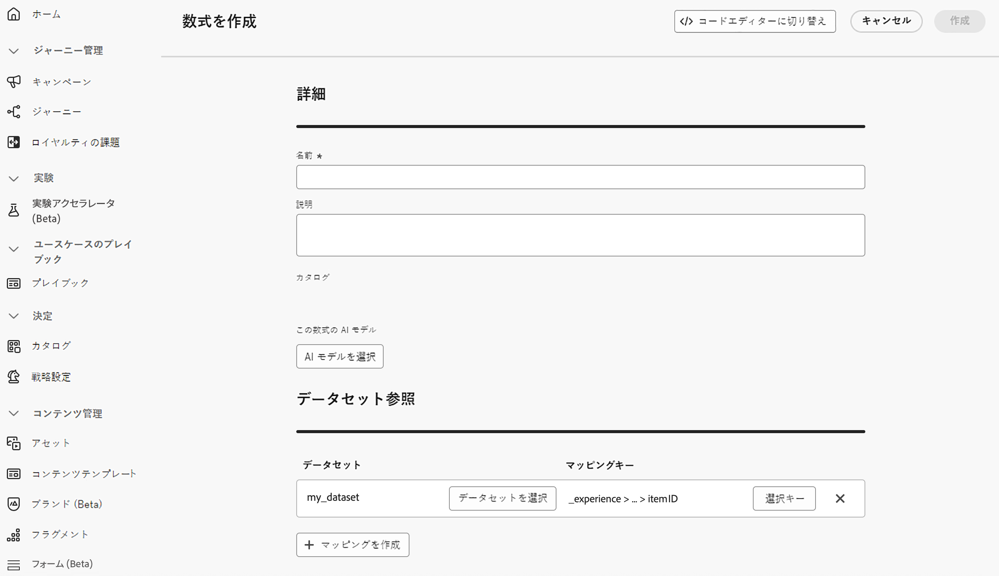

# Adobe Experience Platform データを決定に使用 {#aep-data}

>[!CONTEXTUALHELP]
>id="ajo_exd_rules_dataset_lookup"
>title="データセットルックアップ"
>abstract="決定ルールで Adobe Experience Platform データを使用すると、動的な外部属性に基づいて実施要件の条件を定義し、関連する場合にのみ決定項目を表示できます。Adobe Experience Platform データセットを [!DNL Journey Optimizer] のデータと結合する方法を定義するマッピングを作成します。必要な属性を持つデータセットを選択し、決定項目の属性とデータセットの両方に存在する結合キーを選択します。"

>[!CONTEXTUALHELP]
>id="ajo_exd_formula_dataset_lookup"
>title="データセットルックアップ"
>abstract="ランキング式は、決定項目の優先度を定義します。[!DNL Adobe Experience Platform] データセット属性を使用すると、実際の条件を反映するようにランキングロジックを動的に調整できます。Adobe Experience Platform データセットを [!DNL Journey Optimizer] のデータと結合する方法を定義するマッピングを作成します。必要な属性を持つデータセットを選択し、決定項目の属性とデータセットの両方に存在する結合キーを選択します"

>[!AVAILABILITY]
>
>この機能は、現在、限定提供リリースとしてすべてのお客様が利用できます。

[!DNL Journey Optimizer] を使用すると、決定に [!DNL Adobe Experience Platform] のデータを活用できます。これにより、決定属性の定義をデータセットの追加データに拡張し、属性を 1 つずつ手動で更新する必要がなく、定期的に変更される一括更新を行うことができます。例えば、可用性、待機時間などです。

開始する前に、参照のパーソナライゼーションに必要なデータセットを最初に参照に対して有効にする必要があります。 詳しくは、「Adobe Experience Platform データの使用 [ を参照してくだ ](../data/lookup-aep-data.md) い。

## ガードレールと制限 {#guidelines}

開始する前に、次の制限事項とガイドラインに注意してください。

* 決定ポリシーは、すべての決定ルールとランキング式を組み合わせて、合計で最大 3 つのデータセットを参照できます。例えば、ルールで 2 つのデータセットを使用する場合、数式では追加のデータセットを 1 つのみ使用できます。
* 決定ルールでは、3 つのデータセットを使用できます。
* ランキング式では、3 つのデータセットを使用できます。
* 決定ポリシーを評価すると、合計で最大 1000 個のデータセットクエリ（参照）が実行されます。決定項目で使用する各データセットマッピングは、1 つのクエリとしてカウントされます。例：決定項目で 2 つのデータセットを使用する場合、そのオファーの評価は 1,000 クエリの制限に対して 2 つのクエリとしてカウントされます。

## Adobe Experience Platform データの活用 {#leverage-aep-data}

データセットの参照が有効になると、その属性を使用して、外部データで決定ロジックを強化できます。これは、製品の在庫状況やリアルタイムの価格設定など、頻繁に変更される属性の場合に特に役立ちます。

Adobe Experience Platform データセットの属性は、次の 2 つの決定ロジックの部分で使用できます。

* **決定ルール**：決定項目が表示可能かどうかを定義します。
* **ランキング式**：外部データに基づいて決定項目に優先順位を付けます。

次の節では、両方のコンテキストでの Adobe Experience Platform データの使用方法について説明します。

### 決定ルール {#rules}

決定ルールで Adobe Experience Platform データを使用すると、動的な外部属性に基づいて実施要件の条件を定義し、関連する場合にのみ決定項目を表示できます。

例えば、オンライン小売業者がローカルストアの在庫に基づいて製品のレコメンデーションを宣伝するとします。製品は、最寄りの場所に在庫がある場合にのみレコメンデーションの対象となります。毎日の在庫更新を含むデータセットが Adobe Experience Platform にアップロードされます。ルールロジックは、顧客の優先ストアでの特定の製品の `inventory_count` が 0 より大きいかどうかを確認します。その場合は、決定項目の実施要件が満たされます。

Adobe Experience Platform データを決定ルールに使用するには、次の手順に従います。

1. **[!UICONTROL 戦略設定]**／**[!UICONTROL 決定ルール]**&#x200B;メニューに移動し、「**[!UICONTROL データセットを使用してルールを作成]**」を選択します。

   

1. 「**[!UICONTROL マッピングを作成]**」をクリックして、Adobe Experience Platform データセットを [!DNL Journey Optimizer] のデータと結合する方法を定義します。

   * 必要な属性を持つデータセットを選択します。
   * 決定項目の属性とデータセットの両方に存在する結合キー（製品 ID、ストア ID など）を選択します。

   

   >[!NOTE]
   >
   >ルールごとに最大 3 つのマッピングを作成できます。

1. 「**[!UICONTROL 続行]**」をクリックします。これで、**[!UICONTROL データセット参照]**&#x200B;メニューでデータセット属性にアクセスし、ルール条件で使用できるようにになりました。[詳しくは、決定ルールの作成方法を参照してください。](../experience-decisioning/rules.md#create)

   

### ランキング式 {#ranking-formulas}

ランキング式は、決定項目の優先度を定義します。[!DNL Adobe Experience Platform] データセット属性を使用すると、実際の条件を反映するようにランキングロジックを動的に調整できます。

例えば、航空会社がアップグレードオファーの優先順位付けにランキング式を使用しているとします。 顧客のロイヤルティ層が高く、現在の座席の空き状況が少ない場合（時間単位で更新されるデータセットに基づく）、その顧客にはより高い優先度が与えられます。データセットには、`flight_number`、`available_seats`、`loyalty_score` などのフィールドが含まれます。

Adobe Experience Platform データをランキング式に使用するには、次の手順に従います。

1. ランキング式を作成または編集します。「**[!UICONTROL データセット参照]**」セクションで、「**[!UICONTROL マッピングを作成]**」をクリックします。

1. データセットマッピングを定義します。

   * 適切なデータセット（フライトごとの座席の空席状況など）を選択します。
   * 決定項目の属性とデータセットの両方に存在する結合キー（フライト番号、顧客 ID など）を選択します。

   

   >[!NOTE]
   >
   >ランキング式ごとに最大 3 つのマッピングを作成できます。

1. データセットフィールドを使用して、通常どおりランキング式を作成します。[ランキング式の作成方法の詳細情報](ranking/ranking-formulas.md#create-ranking-formula)

   
