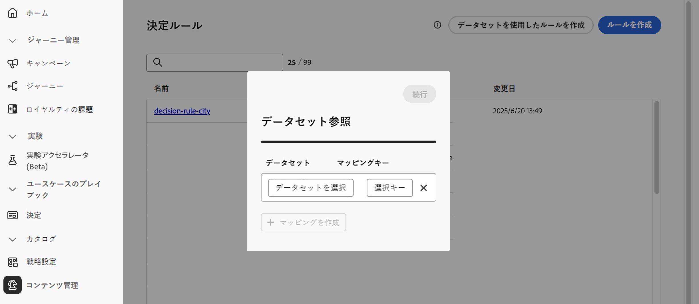
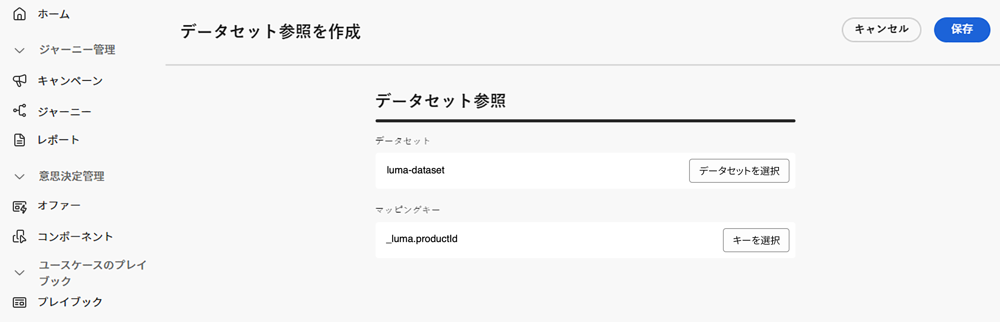
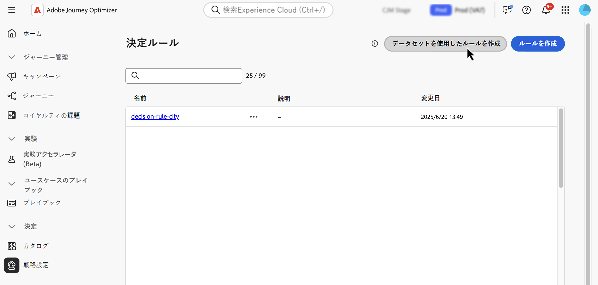
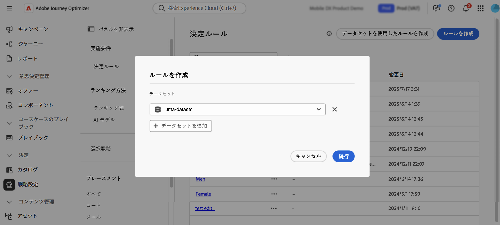
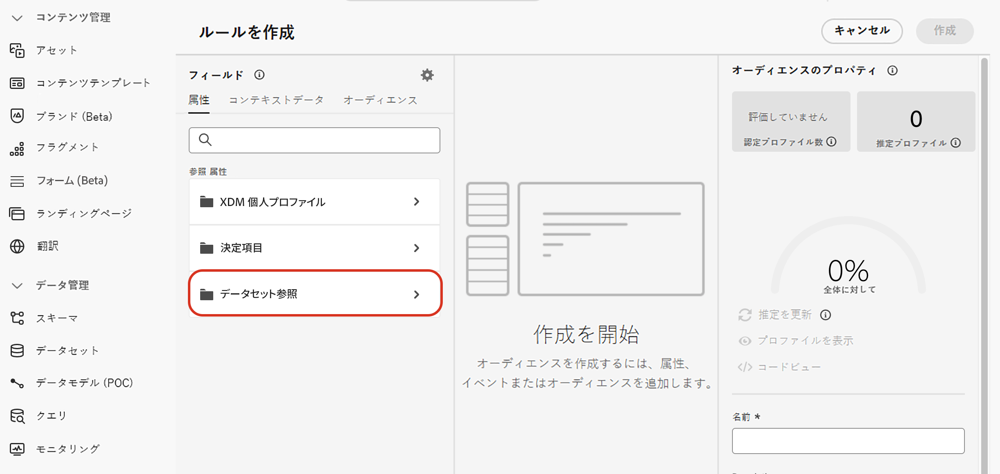
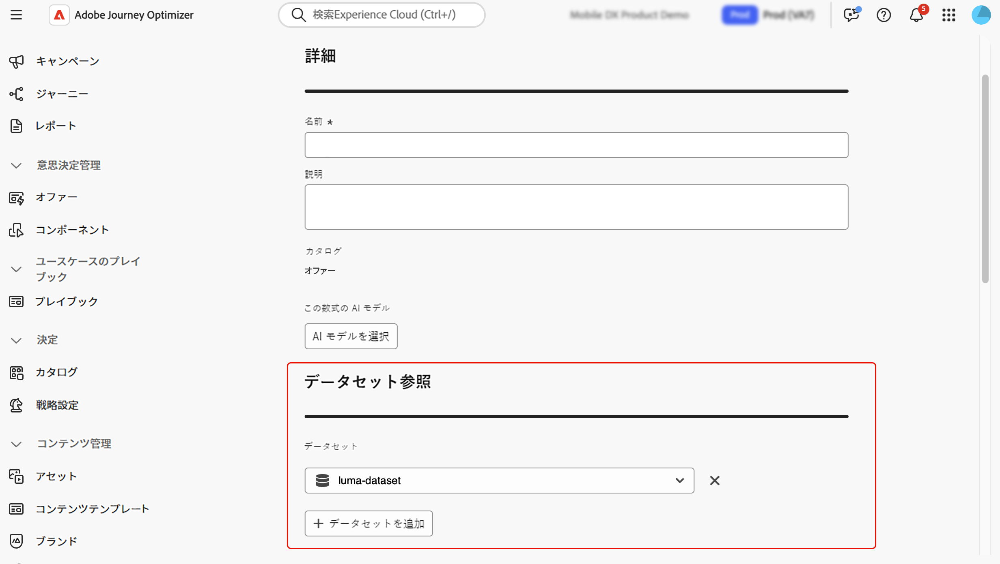
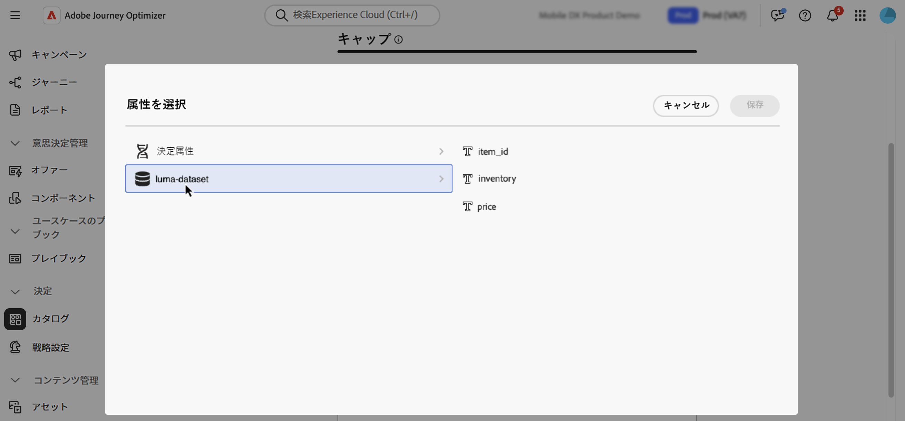

# Adobe Experience Platform データを決定に使用 {#aep-data}

>[!CONTEXTUALHELP]
>id="ajo_exd_catalogs_dataset"
>title="データセットの参照"
>abstract="Adobe Experience Platform の属性を決定に使用するには、マッピングを作成して、Adobe Experience Platform データセットと [!DNL Journey Optimizer] のデータとの結合方法を定義する必要があります。"

>[!CONTEXTUALHELP]
>id="ajo_exd_catalogs_dataset_create"
>title="データセットの参照"
>abstract="ルックアップに対して有効になっているすべての Adobe Experience Platform データセットの中から、必要な属性を持つデータセットを選択し、決定項目属性とデータセットの両方に存在するマッピングキー（便名、顧客 ID など）を選択します。"

>[!CONTEXTUALHELP]
>id="ajo_exd_rules_dataset_lookup"
>title="データセットのルックアップ"
>abstract="必要な属性を持つ Adobe Experience Platform データセットを選択します。データセットがリストに表示されない場合は、ルックアップに対してデータセットが有効になっていて、データセットのルックアップマッピングが作成されていることを確認します。"

>[!CONTEXTUALHELP]
>id="ajo_exd_formula_dataset_lookup"
>title="データセットのルックアップ"
>abstract="[!DNL Adobe Experience Platform] データセット属性を使用すると、実際の条件を反映するようにランキングロジックを動的に調整できます。「**[!UICONTROL データセットを追加]**」をクリックして、必要な属性を持つ Adobe Experience Platform データセットを選択します。データセットがリストに表示されない場合は、ルックアップに対してデータセットが有効になっていて、データセットのルックアップマッピングが作成されていることを確認します。"

>[!CONTEXTUALHELP]
>id="ajo_exd_item_capping_dataset"
>title="データセットの追加"
>abstract="[!DNL Adobe Experience Platform] データセットを使用して、動的な外部属性に基づいてキャップ条件を定義します。「**[!UICONTROL データセットを追加]**」をクリックして、必要な属性を持つ Adobe Experience Platform データセットを選択します。データセットがリストに表示されない場合は、ルックアップに対してデータセットが有効になっていて、データセットのルックアップマッピングが作成されていることを確認します。"

[!DNL Journey Optimizer] を使用すると、決定に [!DNL Adobe Experience Platform] のデータを活用できます。これにより、決定属性の定義をデータセットの追加データに拡張し、属性を 1 つずつ手動で更新する必要がなく、定期的に変更される一括更新を行うことができます。例えば、可用性、待機時間などです。

>[!AVAILABILITY]
>
>この機能は現在、限定提供リリースとしてすべてお客様が利用できます。

## ガードレールと制限事項 {#guardrails}

* **サポートされているチャネル** - 決定を使用したデータセット参照は、現在、メールとジャーニーのカスタムアクションで機能します。<!--Support for code-based experience channels is coming soon.-->
* **属性の使用状況** - 決定のデータセットルックアップ機能は、属性を追加して決定項目の定義を拡張します。プロファイルに対する属性は拡張しません。
* 参照制限：[!DNL Journey Optimizer] では、1 つの決定ポリシーあたり最大 1,000 件の参照をサポートしています。

## 前提条件

### 参照用のデータセットを有効にする

開始する前に、まず、決定に必要なデータセットを参照に対して有効にする必要があります。[Adobe Experience Platform データの使用](../data/lookup-aep-data.md)の節で説明している手順に従ってください。

### マッピングの作成

Adobe Experience Platform の属性を決定に使用するには、マッピングを作成して、Adobe Experience Platform データセットと [!DNL Journey Optimizer] のデータとの結合方法を定義する必要があります。それには、次の手順に従います。

1. **[!UICONTROL カタログ]**／**[!UICONTROL データセット参照]**&#x200B;に移動し、「**[!UICONTROL 作成]**」をクリックします。

   

1. マッピングを設定します。

   1. 「**[!UICONTROL データセットを選択]**」をクリックして、参照が有効になっているすべての Adobe Experience Platform データセットを表示します。必要な属性を持つデータセットを選択します。

   1. 「**[!UICONTROL キーを選択]**」をクリックして、決定項目の属性とデータセットの両方に存在する結合キー（フライト番号、顧客 ID など）を選択します。

   

1. 「**[!UICONTROL 保存]**」をクリックします。

## Adobe Experience Platform データの活用 {#leverage-aep-data}

データセットの参照が有効になり、マッピングが作成されると、そのデータを使用して、外部データで決定ロジックを強化できます。これは、製品の在庫状況やリアルタイムの価格設定など、頻繁に変更される属性の場合に特に役立ちます。

Adobe Experience Platform データセットの属性は、次の 2 つの決定ロジックの部分で使用できます。

* **決定ルール**：決定項目が表示可能かどうかを定義します。
* **ランキング式**：外部データに基づいて決定項目に優先順位を付けます。
* **キャッピングルール**：外部データを使用して、キャッピングルールのしきい値を計算します。

次の節では、これらのコンテキストでの Adobe Experience Platform データの使用方法について説明します。

### 決定ルール {#rules}

決定ルールで Adobe Experience Platform データを使用すると、動的な外部属性に基づいて実施要件の条件を定義し、関連する場合にのみ決定項目を表示できます。

例えば、オンライン小売業者がローカルストアの在庫に基づいて製品のレコメンデーションを宣伝するとします。製品は、最寄りの場所に在庫がある場合にのみレコメンデーションの対象となります。毎日の在庫更新を含むデータセットが Adobe Experience Platform にアップロードされます。ルールロジックは、顧客の優先ストアでの特定の製品の `inventory_count` が 0 より大きいかどうかを確認します。その場合は、決定項目の実施要件が満たされます。

Adobe Experience Platform データを決定ルールに使用するには、次の手順に従います。

1. **[!UICONTROL 戦略設定]**／**[!UICONTROL 決定ルール]**&#x200B;メニューに移動し、「**[!UICONTROL データセットを使用してルールを作成]**」を選択します。

   

1. 「**[!UICONTROL データセットを追加]**」をクリックして、必要な属性を持つデータセットを選択します。

   

1. 「**[!UICONTROL 続行]**」をクリックします。これで、**[!UICONTROL データセット参照]**&#x200B;メニューでデータセット属性にアクセスし、ルール条件で使用できるようにになりました。[詳しくは、決定ルールの作成方法を参照してください。](../experience-decisioning/rules.md#create)

   

### ランキング式 {#ranking-formulas}

ランキング式は、決定項目の優先度を定義します。[!DNL Adobe Experience Platform] データセット属性を使用すると、実際の条件を反映するようにランキングロジックを動的に調整できます。

例えば、航空会社がアップグレードオファーの優先順位付けにランキング式を使用しているとします。 顧客のロイヤルティ層が高く、現在の座席の空き状況が少ない場合（時間単位で更新されるデータセットに基づく）、その顧客にはより高い優先度が与えられます。データセットには、`flight_number`、`available_seats`、`loyalty_score` などのフィールドが含まれます。

Adobe Experience Platform データをランキング式に使用するには、次の手順に従います。

1. ランキング式を作成または編集します。

1. 「**[!UICONTROL データセット参照]**」セクションで、「**[!UICONTROL データセットを追加]**」をクリックします。

1. 適切なデータセットを選択します。

   

   >[!NOTE]
   >
   >探しているデータセットがリストに表示されない場合は、参照に対してデータセットが有効になっていて、データセット参照マッピングが作成されていることを確認します。詳しくは、[前提条件](#prerequisites)の節を参照してください。

1. データセットフィールドを使用して、通常どおりランキング式を作成します。[ランキング式の作成方法の詳細情報](ranking/ranking-formulas.md#create-ranking-formula)

   

### キャッピングルール {#capping-rules}

キャッピングルールは、決定項目を表示できる最大回数を定義する制約として使用されます。キャッピングルールで Adobe Experience Platform データを使用すると、動的な外部属性に基づいてキャッピング条件を定義できます。これを行うには、キャッピングルールで式を使用して、目的のキャッピングしきい値を計算します。

例えば、小売業者は、リアルタイムの製品在庫に基づいてオファーを制限する場合があります。固定しきい値 500 を設定する代わりに、Adobe Experience Platform データセットから「`inventory_count`」フィールドを参照する式を使用します。データセットに 275 個の項目が在庫に残っていることが示されている場合、オファーはその数までのみ配信されます。

>[!NOTE]
>
>キャッピングルール&#x200B;**式**&#x200B;は現在、すべてのユーザーに対する限定提供として使用でき、**[!UICONTROL 合計]**&#x200B;キャッピングタイプでのみサポートされています。

Adobe Experience Platform データをキャッピングルール式に使用するには、次の手順に従います。

1. 決定項目を作成または編集します。

1. 項目の実施要件を定義する際は、「**[!UICONTROL データセットを追加]**」をクリックし、適切なデータセットを選択します。

   

   >[!NOTE]
   >
   >探しているデータセットがリストに表示されない場合は、参照に対してデータセットが有効になっていて、データセット参照マッピングが作成されていることを確認します。詳しくは、[前提条件](#prerequisites)の節を参照してください。

1. **[!UICONTROL 合計]**&#x200B;キャップタイプを選択し、「**[!UICONTROL 式]**」オプションを有効にします。

   

   >[!NOTE]
   >
   >探しているデータセットがリストに表示されない場合は、参照に対してデータセットが有効になっていて、データセット参照マッピングが作成されていることを確認します。詳しくは、[前提条件](#prerequisites)の節を参照してください。

1. 式を編集し、データセットフィールドを使用して式を作成します。

   

1. 通常どおり、キャップとルールの決定項目の設定を完了します。[キャッピングルールの設定方法について説明します。](../experience-decisioning/items.md#capping)
