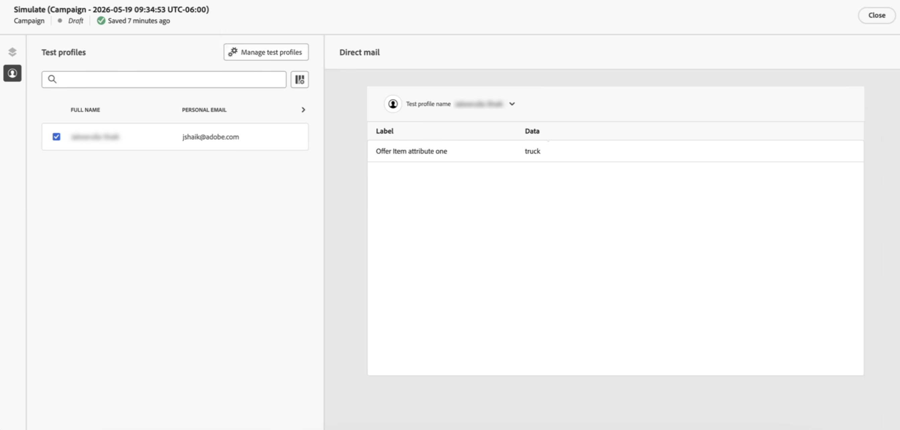

# ダイレクトメールでのバッチ決定 {#batch-decisioning-direct-mail}

バッチ決定では、Decisioningは各プロファイルに最適な決定項目を選択し、それらの結果をダイレクトメール抽出ファイルに含めます。 決定ポリシーの設定時に&#x200B;**[!UICONTROL 個の項目数]**&#x200B;を設定することで、プロファイルごとに複数の項目を返すことができます。 書き出されたファイルは、ダイレクトメールのパーソナライゼーションや、プロファイルと決定属性を別のシステムに書き出すバッチのユースケースに使用できます。

ダイレクトメールのバッチ決定では、次の2つの主要なユースケースをサポートしています。

* **決定付きのダイレクトメール** – 受信者ごとに物理メールをパーソナライズします。 例えば、適格性ルールとランキング（優先順位または式）を使用して、各プロファイルに最適な画像やオファーを選択します。 抽出ファイルには、プロファイルデータと、選択した決定項目またはダイレクトメールプロバイダーの項目（オファー画像URLなど）からの属性が含まれます。
* **下流システムのバッチ書き出し** - プロファイルとその決定結果（オファーID、属性など）を書き出して、別のシステムで使用します。 バッチ決定を実行し、ファイルをサーバーに書き出します。ダウンストリームツール（サードパーティのメールサービスプロバイダーなど）は、そのデータを独自のキャンペーンやプロセスに使用します。

>[!NOTE]
>
>このページでは、ダイレクトメールでのバッチ決定の使用に関する決定固有の側面に焦点を当てます。 ファイルのルーティング、チャネル設定、抽出ファイルの設定など、ダイレクトメールチャネルの設定と使用について詳しくは、[ ダイレクトメールの使用を開始](../direct-mail/get-started-direct-mail.md)および[ ダイレクトメールメッセージの作成](../direct-mail/create-direct-mail.md)を参照してください。

## ワークフローの概要 {#workflow}

1. **ダイレクトメールキャンペーンまたはジャーニーを作成**: ジャーニーまたはキャンペーンを作成し、**[!UICONTROL ダイレクトメール]** アクションを選択し、ダイレクトメール設定を選択してオーディエンスを定義します。

   ➡️ [ ダイレクトメールメッセージの作成方法について説明します](../direct-mail/create-direct-mail.md)

1. **決定ポリシーを追加**:

   1. 「**[!UICONTROL コンテンツを編集]**」をクリックして、抽出ファイルを設定します。
   1. 抽出ファイルに列を追加し、 アイコンを使用してパーソナライゼーションエディターを開きます。

      

   1. **[!UICONTROL Decisioning]** メニューに移動して、決定ポリシーを作成します。 ポリシー設定で、プロファイルごとに複数の決定項目が必要な場合は&#x200B;**[!UICONTROL 項目数]**&#x200B;を設定し、選択戦略とオプションのフォールバックを設定します。

      

   ➡️ [ ダイレクトメールで決定ポリシーを追加および設定する方法について説明します](create-decision-policy.md#add)

1. **決定属性を使用してダイレクトメールファイルをパーソナライズする**：決定結果を含める必要がある列の場合は、Personalization エディターを開き、**[!UICONTROL 決定ポリシー]**&#x200B;に移動し、**[!UICONTROL 決定ポリシー]**&#x200B;を挿入を選択して、決定ポリシーのコードを追加します。

   返された決定項目属性を使用して、選択したオファー情報が各プロファイルの抽出ファイルに含まれるようにします。 複数の項目が返された場合は、ポリシー`#each` ループを使用して、列内の各項目から属性をマッピングします。

   ➡️ [ メッセージで決定ポリシーを使用する方法を学ぶ – 「ダイレクトメール」タブ ](use-decision-policy.md)

1. テストプロファイルで&#x200B;**[!UICONTROL コンテンツをシミュレート]**&#x200B;し、書き出された行（決定値を含む）をプレビューします。

   

   ➡️ [ コンテンツをプレビューしてテストする方法について説明します](../content-management/preview-test.md)

1. キャンペーンをアクティブ化するか、ジャーニーを公開して、ファイル（CSVまたはテキスト区切り）を生成し、設定済みのサーバーに書き出します。

   ➡️ [ キャンペーンのレビューとアクティブ化の方法について](../campaigns/review-activate-campaign.md) | [ ジャーニーの公開方法について](../building-journeys/publish-journey.md)

## ダイレクトメール+意思決定の例 {#example-direct-mail}

例：フィットネス retailerでは、10枚の画像のうち1枚を使用して、各顧客にパーソナライズされたポストカードを送信します。 同社は、意思決定プロセスを活用して、プロファイルごとに最適な画像を選択しています。

1. 10個の決定項目（画像ごとに1個）を作成し、それぞれに実施要件ルール（年齢、性別など）を設定します。
2. それらをコレクションに追加し、ランキング方法（手動優先度や数式など）を使用して選択戦略を作成します。
3. ダイレクトメールキャンペーンまたはジャーニーで、「決定」を有効にして、この選択戦略を使用する決定ポリシーを追加します。
4. 抽出ファイルで、選択した画像（オファー画像URLなど）を保持する決定項目属性のデータを持つ列を追加します。 その他の列には、フルネーム、住所、都道府県、郵便番号などがあります。
5. キャンペーンが実行されると、各プロファイルには、そのプロファイル用に選択した画像を含む書き出し内の1行が取得されます。 ダイレクトメールプロバイダーは、このファイルを使用して物理メールを作成します。

テストプロファイルで&#x200B;**[!UICONTROL コンテンツをシミュレート]**&#x200B;すると、そのプロファイルに書き出される決定結果（画像など）を確認できます。

## 一括書き出し（ミドルウェア）の使用例 {#example-batch-export}

一部の顧客では、プロファイルとその決定結果を書き出し、他のシステム（CRMやメールサービスプロバイダーなど）で使用するためにバッチ決定を使用します。 フローは次のとおりです。

1. 上記のように、ダイレクトメール（ファイルルーティング + チャネル設定）を設定します。
2. ダイレクトメールキャンペーンまたはジャーニーを作成し、決定ポリシーを追加します。
3. プロファイルフィールドの列と、書き出しに必要な決定項目属性の列を追加します。
4. キャンペーンのアクティベート： ファイルはサーバー（Amazon S3やSFTPなど）に書き出されます。
5. 下流システムでは、ファイルを取得し、プロファイルと決定データを独自のキャンペーンやプロセスに使用します。

これにより、Experience Decisioningを使用したダイレクトメールチャネルを通じたバッチ決定のユースケースがサポートされます。

## 関連ドキュメント {#related}

* [ ダイレクトメールメッセージの作成](../direct-mail/create-direct-mail.md) – 抽出ファイルを設定し、決定を有効にします
* [決定ポリシーの作成](create-decision-policy.md#add) - 「ダイレクトメール」タブに決定ポリシーを追加します
* [ ダイレクトメール設定](../direct-mail/direct-mail-configuration.md) - ファイルのルーティングとチャネル設定
* [決定の基本を学ぶ](gs-experience-decisioning.md) – 概念とガードレール
