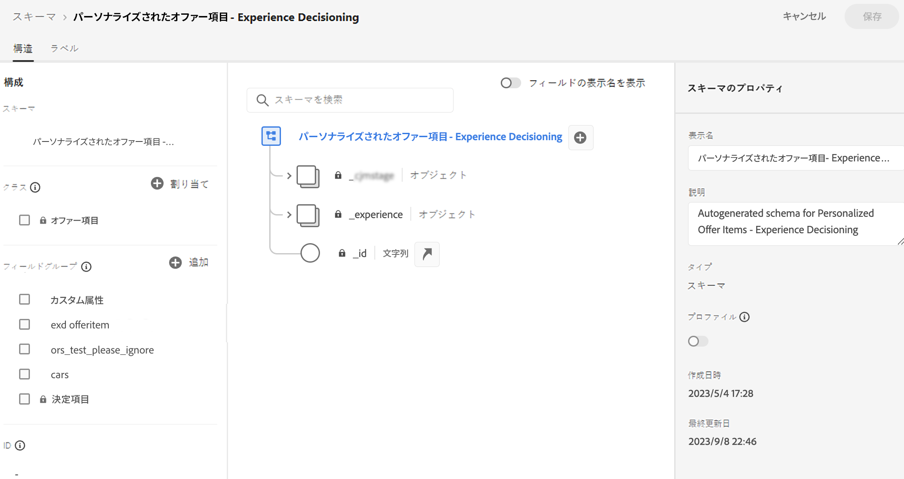

# 項目カタログ {#catalog}

決定では、カタログは、決定項目を整理する中心的なコンテナとして機能します。各カタログは、決定項目に割り当て可能なすべての属性を含む、Adobe Experience Platform スキーマにリンクされます。

現時点では、作成されたすべての決定項目は、単一の「オファー」カタログ内に統合され、**[!UICONTROL カタログ]**&#x200B;メニューからアクセスできます。

## ガードレールと制限

最適なパフォーマンスと一貫性を確保することを目的に、決定では次のガードレールと制限が適用されます。

* **サポートされていないデータタイプ**

  現時点では、決定は、文字列、整数、ブーリアン、日付、日時、決定アセット、オブジェクトの各データタイプのみをサポートしています。これらのデータタイプに該当しないフィールドは、決定項目やカタログの作成時には使用できません。

* **カスタム属性の制限**

  各決定項目には、最大 100 個のカスタム属性を含めることができます。

* **ネストの制限**

  最大 4 レベルのネストがサポートされています。画像は最終レベルではサポートされません。

## カタログのスキーマへのアクセスと編集 {#access-catalog-schema}

決定項目の属性が保存されるカタログのスキーマにアクセスするには、次の手順に従います。

1. 項目リストで、「**[!UICONTROL 項目を作成]**」ボタンの横にある「**[!UICONTROL スキーマを編集]**」ボタンをクリックします。

1. 以下の構造に従って、新しいタブでカタログのスキーマが開きます。

   * **`_experience`** ノードには、名前、開始日、終了日、説明など、標準の決定項目属性が含まれます。
   * **`_<imsOrg>`** ノードには、カスタムの決定項目属性が格納されています。デフォルトでは、カスタム属性は設定されませんが、必要に応じて必要な数だけ追加できます。完了すると、カスタム属性が標準属性と共に、決定項目作成画面に表示されます。

   

1. スキーマにカスタム属性を追加するには、**`_<imsOrg>`** ノードに展開し、構造内の目的の場所で「+」ボタンをクリックします。

   

1. 追加した属性に必要なフィールドに入力し、「**[!UICONTROL 適用]**」をクリックします。

   決定アセット属性を持つ属性に入力される値はパブリック URL です。ほとんどの場合、これは画像を指します。

   Adobe Experience Platform スキーマの操作方法について詳しくは、[XDM システムドキュメント](https://experienceleague.adobe.com/docs/experience-platform/xdm/ui/overview.html?lang=ja)を参照してください。

1. 目的のカスタム属性を追加したら、スキーマを保存します。新しいフィールドを「**[!UICONTROL カスタム属性]**」セクション内の決定項目作成画面で使用できるようになりました。

   以下の例は、スキーマで定義されたオブジェクトなどのカスタム属性を含む項目作成画面を示しています。

   

