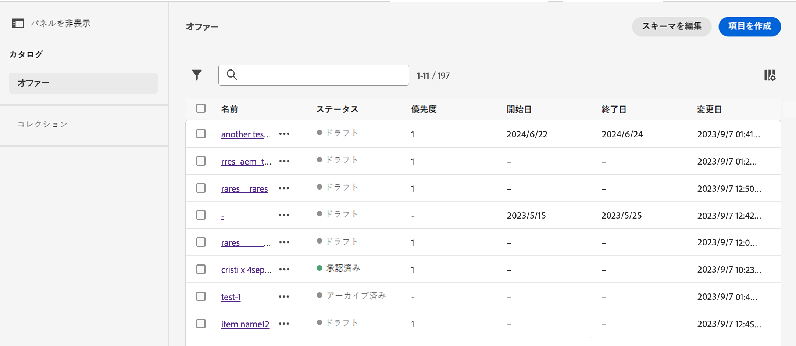
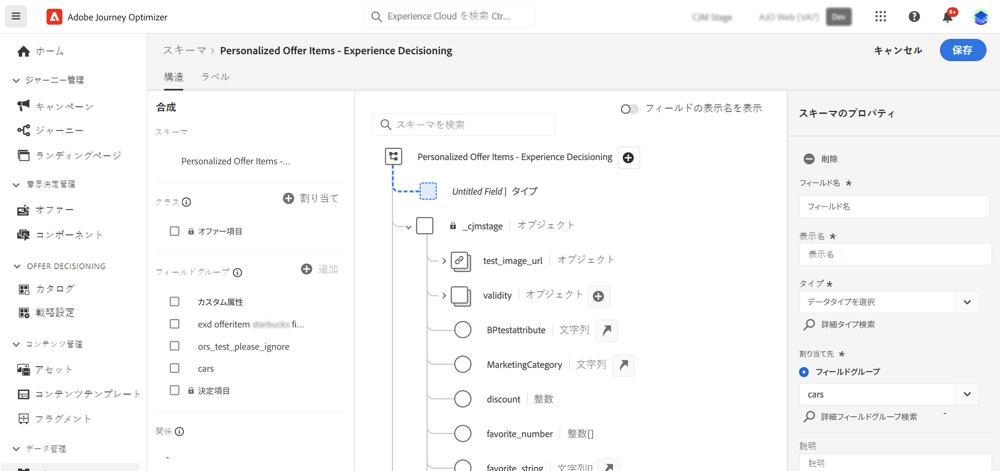

# 項目カタログ {#catalog}

>[!BEGINSHADEBOX 「このドキュメントガイドの内容は次のとおりです」]

* [エクスペリエンス決定の基本を学ぶ](gs-experience-decisioning.md)
* 決定項目の管理：**[項目カタログの設定](catalogs.md)** - [決定項目の作成](items.md) - [項目コレクションの管理](collections.md)
* 項目の選択の設定：[決定ルールの作成](rules.md) - [ランキングメソッドの作成](ranking.md)
* [選択戦略の作成](selection-strategies.md)
* [決定ポリシーの作成](create-decision.md)

>[!ENDSHADEBOX]

エクスペリエンス判定では、カタログは、決定項目を整理するための中心的なコンテナとして機能します。各カタログは、決定項目に割り当て可能なすべての属性を含む、Adobe Experience Platform スキーマにリンクされます。

現時点では、作成されたすべての決定項目は、からアクセスできる単一の「オファー」カタログ内に統合されます **[!UICONTROL カタログ]** メニュー。

決定項目の属性が保存されるカタログのスキーマにアクセスするには、次の手順に従います。

1. 項目リストで、「**[!UICONTROL 項目を作成]**」ボタンの横にある「**[!UICONTROL スキーマを編集]**」ボタンをクリックします。

1. 以下の構造に従って、新しいタブでカタログのスキーマが開きます。

   * **`_experience`** ノードには、名前、開始日、終了日、説明など、標準の決定項目属性が含まれます。
   * **`_<imsOrg>`** ノードには、カスタムの決定項目属性が格納されています。デフォルトでは、カスタム属性は設定されませんが、必要に応じて必要な数だけ追加できます。完了すると、カスタム属性が標準属性と共に、決定項目作成画面に表示されます。

   

1. スキーマにカスタム属性を追加するには、**`_<imsOrg>`** ノードに展開し、構造内の目的の場所で「+」ボタンをクリックします。

   

1. 追加した属性に必要なフィールドに入力し、「**[!UICONTROL 適用]**」をクリックします。

   >[!CAUTION]
   >
   >現時点では、Experience Decisioning は、以下に示すデータタイプのみをサポートしています。これらのデータタイプに該当しないフィールドは、決定項目の作成時には使用できません。
   >* 文字列
   >* ブール値
   >* 数値

   Adobe Experience Platform スキーマの操作方法について詳しくは、[XDM システムドキュメント](https://experienceleague.adobe.com/docs/experience-platform/xdm/ui/overview.html?lang=ja)を参照してください。

1. 目的のカスタム属性を追加したら、スキーマを保存します。新しいフィールドは「**[!UICONTROL カスタム属性]** 」セクション内の決定項目作成画面で使用可能になりました。
