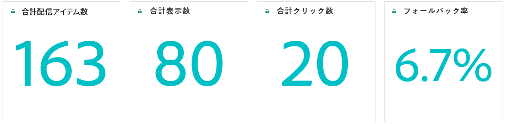
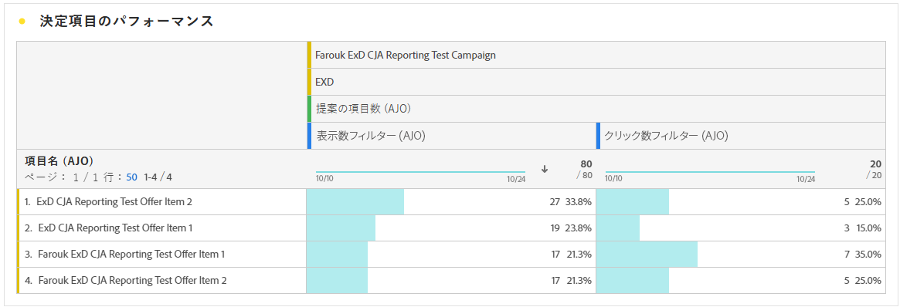

# 決定に関するレポート {#decisioning-report}

## コードベースのキャンペーンレポート {#campaigns}

コードベースのエクスペリエンスが公開されると、専用レポートにアクセスして、決定の主要業績評価指標（KPI）を監視できます。

<!--Once code-based experiences are live, you can access dedicated reports to monitor Key Performance Indicators (KPIs) as an all-encompassing dashboard, delivering an analysis of essential metrics associated with your campaign.

This encompasses details related to the decision items performances and how users interacted with them. [Learn how to work with Code-based experience reports](../reports/campaign-global-report-cja-code.md)-->

また、決定項目のパフォーマンスに関する詳細やユーザーの何らかのアクションにアクセスして、キャンペーンに関連する重要な指標の分析を提供することもできます。

決定に関するコードベースのエクスペリエンスレポートの操作方法について詳しくは、[この節](../reports/campaign-global-report-cja-code.md#decisioning-reporting)を参照してください。

## Customer Journey Analytics でのレポート {#cja}

Customer Journey Analytics を操作している場合は、決定を活用して、コードベースのキャンペーン用のカスタムレポートダッシュボードを作成できます。

主な手順は以下のとおりです。Customer Journey Analytics の操作方法について詳しくは、[Customer Journey Analytics ドキュメント](https://experienceleague.adobe.com/ja/docs/analytics-platform/using/cja-landing){target="_blank"}を参照してください。

1. Customer Journey Analytics で&#x200B;**接続**&#x200B;を作成して設定します。これにより、レポートが必要なデータセットに接続できます。[接続の作成方法の詳細情報](https://experienceleague.adobe.com/ja/docs/analytics-platform/using/cja-connections/create-connection){target="_blank"}

1. **データビュー**&#x200B;を作成し、前に作成した接続に関連付けます。「**[!UICONTROL コンポーネント]**」タブで、レポートに表示する関連スキーマフィールドを選択します。決定の場合は、「**propositioninteract**」フィールドと「**propositiondisplay**」フィールドを必ず含めてください。[データビューの作成および設定方法の詳細情報](https://experienceleague.adobe.com/ja/docs/analytics-platform/using/cja-dataviews/create-dataview){target="_blank"}

1. **ワークスペースプロジェクト**&#x200B;でデータコンポーネント、テーブル、ビジュアライゼーションを組み合わせて、コードベースのキャンペーンのレポートを作成して共有します。[ワークスペースプロジェクトの作成方法の詳細情報](https://experienceleague.adobe.com/ja/docs/analytics-platform/using/cja-workspace/build-workspace-project/create-projects){target="_blank"}
