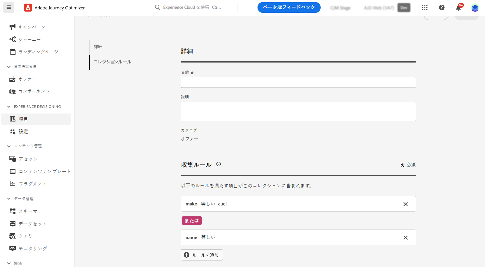

# コレクション {#collections}

>[!CONTEXTUALHELP]
>id="ajo_exd_item_collections"
>title="コレクションの作成"
>abstract="コレクションを使用すると、好みに応じて決定項目を分類およびグループ化できます。これらのカテゴリは、決定項目の属性を活用するルールを策定することで作成されます。"

>[!CONTEXTUALHELP]
>id="ajo_exd_item_collection_rules"
>title="コレクションのルールの定義"
>abstract="1 つまたは複数のルールを追加して、コレクションに含める項目を決定します。基準として使用する項目属性を選択します。目的の演算子を選択し、フィルタリングに使用する値を入力します。必要な数のルールを追加します。"

>[!CONTEXTUALHELP]
>id="ajo_exd_strategy_collection"
>title="コレクションの選択"
>abstract="検討するオファーが含まれているコレクションを選択します。この手順は、選択戦略を作成する場合は必須です。コレクションを使用すると、好みに応じて決定項目を分類およびグループ化できます。例えば、カスタム属性「カテゴリ」に「ヨガ」の値を持つすべての決定項目を含むコレクションを作成できます。"

コレクションを使用すると、好みに応じて決定項目を分類およびグループ化できます。これらのカテゴリは、決定項目の属性を活用するルールを策定することで作成されます。

例えば、決定項目のカタログスキーマに「カテゴリ」カスタム属性を追加したとします。これにより、「カテゴリ」属性に「ヨガ」の値を持つすべての決定項目を含むコレクションを作成できます。

コレクションのリストには、**[!UICONTROL カタログ]**&#x200B;メニューからアクセスできます。

コレクションを作成するには、次の手順に従います。

1. **[!UICONTROL カタログ]**／**[!UICONTROL コレクション]**&#x200B;に移動して、「**[!UICONTROL コレクションを作成]**」をクリックします。
1. コレクションの名前と説明を入力します。
1. 1 つまたは複数のルールを追加して、コレクションに含める項目を決定します。その手順は次のとおりです。

   1. 基準として使用する項目属性を選択します。属性リストには、カタログスキーマで定義されているすべての標準属性とカスタム属性が含まれます。[詳しくは、項目のカタログを参照してください](catalogs.md)
   1. 目的の演算子を選択し、フィルタリングする値を入力します。各オファー名を明示的に指定するか、各オファーに &quot;luma-summer&quot; タグを作成して割り当てます。

      >[!NOTE]
      >
      >**CONTAINS** 演算子は、部分一致やワイルドカード一致をサポートしていません。これは **IN** 演算子のように機能するので、属性の正確な値の配列を指定する必要があります。
      >
      >例えば、コレクションに含める夏のオファー（*&quot;luma-summer-yoga&quot;*、*&quot;luma-summer-fitness&quot;*、*&quot;luma-summer-running&quot;*）が複数あるとします。これらの項目を含めるには、&quot;Offer name&quot; CONTAINS &quot;luma-summer-yoga&quot;, &quot;luma-summer-fitness&quot;, &quot;luma-summer-running&quot; などのルールを定義する必要があります。このルールは、リスト内の名前のいずれかと完全に一致するオファーのみを返します。
      >
      >部分一致（例：*&quot;luma-summer&quot;* を含むすべてのオファー）が必要な場合、これは現在サポートされていません。各オファー名を明示的に指定するか、各オファーに *&quot;luma-summer&quot;* タグを割り当てて、そのタグをルールで使用する必要があります。

   1. これらの手順を、追加するルールの数だけ繰り返します。複数のルールを追加する場合、**AND** および **OR** 演算子を選択して組み合わせることができます。これを行うには、オペレーターバッジをクリックして、2 つの選択肢を切り替えます。
   1. 「**[!UICONTROL コレクションをプレビュー]**」ボタンをクリックすると、定義したルールを満たす項目が表示されます。

   

1. コレクションルールを定義したら、「**[!UICONTROL 作成]**」をクリックします。コレクションがリストに表示されます。

>[!NOTE]
>
>各項目コレクションには、最大 500 個のオファー項目を含めることができます。[詳しくは、決定ガードレールと制限を参照してください](gs-experience-decisioning.md#guardrails)
