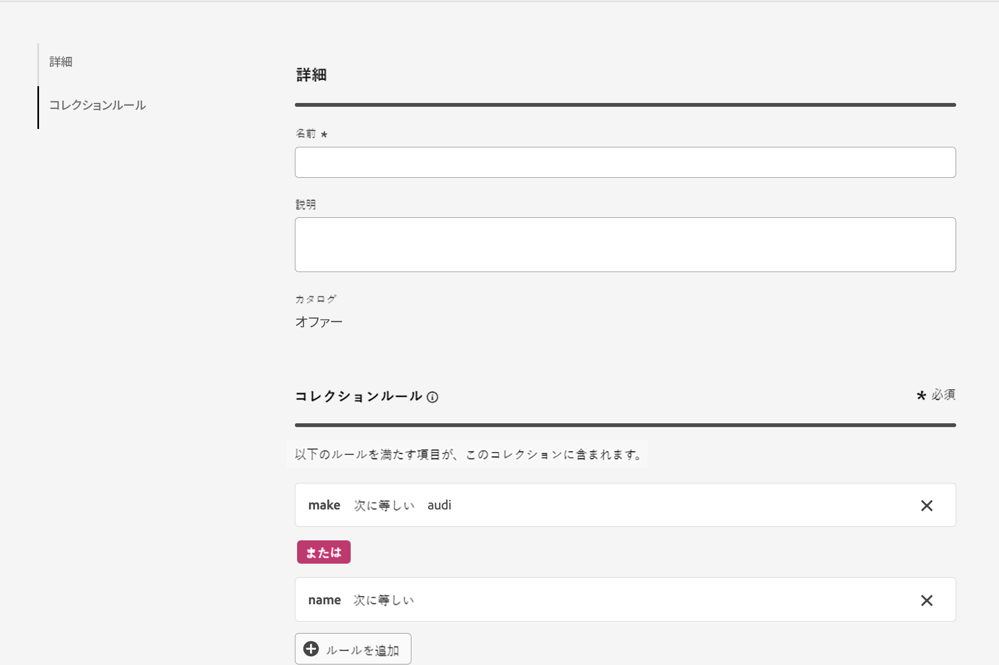

# コレクション {#collections}

>[!CONTEXTUALHELP]
>id="ajo_exd_item_collections"
>title="コレクションの作成"
>abstract="コレクションを使用すると、好みに応じて決定項目を分類およびグループ化できます。これらのカテゴリは、決定項目の属性を活用するルールを策定することで作成されます。"

>[!CONTEXTUALHELP]
>id="ajo_exd_item_collection_rules"
>title="コレクションのルールの定義"
>abstract="1 つまたは複数のルールを追加して、コレクションに含める項目を決定します。基準として使用する項目属性を選択します。目的の演算子を選択し、フィルタリングに使用する値を入力します。必要な数のルールを追加します。"

>[!CONTEXTUALHELP]
>id="ajo_exd_strategy_collection"
>title="コレクションの選択"
>abstract="検討するオファーが含まれているコレクションを選択します。この手順は、選択戦略を作成する場合は必須です。コレクションを使用すると、好みに応じて決定項目を分類およびグループ化できます。例えば、カスタム属性「カテゴリ」に「ヨガ」の値を持つすべての決定項目を含むコレクションを作成できます。"

>[!BEGINSHADEBOX 「このドキュメントガイドの内容は次のとおりです」]

* [エクスペリエンス決定の基本を学ぶ](gs-experience-decisioning.md)
* 決定項目の管理：[項目カタログの設定](catalogs.md) - [決定項目の作成](items.md) - **[項目コレクションの管理](collections.md)**
* 項目の選択の設定：[決定ルールの作成](rules.md) - [ランキングメソッドの作成](ranking.md)
* [選択戦略の作成](selection-strategies.md)
* [決定ポリシーを作成](create-decision.md)

>[!ENDSHADEBOX]

コレクションを使用すると、好みに応じて決定項目を分類およびグループ化できます。これらのカテゴリは、決定項目の属性を活用するルールを策定することで作成されます。

例えば、決定項目のカタログスキーマに「カテゴリ」カスタム属性を追加したとします。これにより、「カテゴリ」属性に「ヨガ」の値を持つすべての決定項目を含むコレクションを作成できます。

コレクションのリストには、からアクセスできます **[!UICONTROL カタログ]** メニュー。

コレクションを作成するには、次の手順に従います。

1. に移動します。 **[!UICONTROL カタログ]** > **[!UICONTROL コレクション]** をクリックして、 **[!UICONTROL コレクションを作成]**.
1. コレクションの名前と説明を入力します。
1. 1 つまたは複数のルールを追加して、コレクションに含める項目を決定します。その手順は次のとおりです。

   1. 基準として使用する項目属性を選択します。属性リストには、カタログスキーマで定義されているすべての標準属性とカスタム属性が含まれます。[詳しくは、項目のカタログを参照してください](catalogs.md)
   1. 目的の演算子を選択し、フィルターに使用する値を入力します。
   1. これらの手順を、追加するルールの数だけ繰り返します。複数のルールを追加する場合、**AND** および **OR** 演算子を選択して組み合わせることができます。これを行うには、オペレーターバッジをクリックして、2 つの選択肢を切り替えます。

   

1. コレクションルールを定義したら、「**[!UICONTROL 作成]**」をクリックします。コレクションがリストに表示されます。
