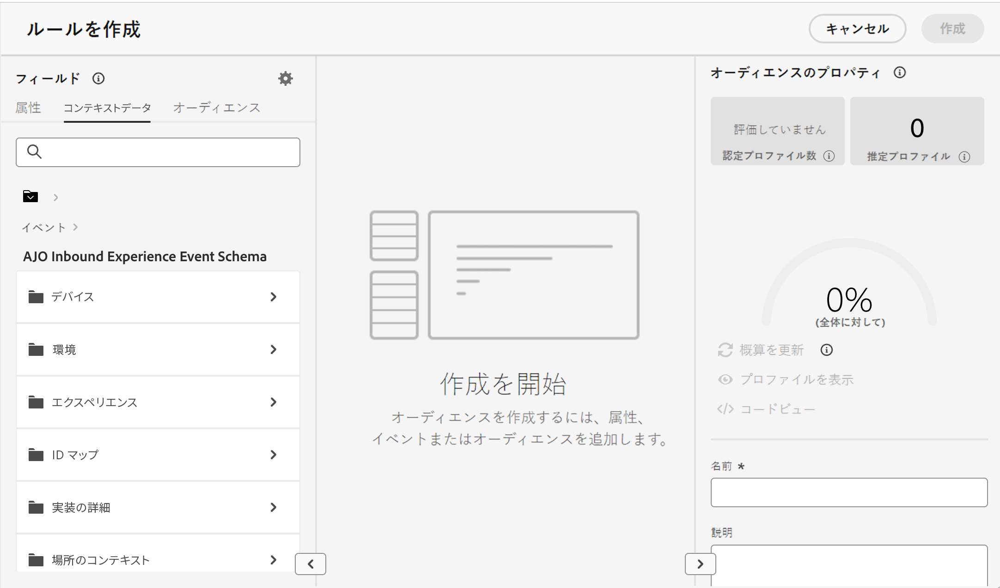

# 決定でのコンテキストデータの活用 {#context}

Decisioning を使用すると、Adobe Experience Platformで提供されている任意の情報を活用して、[ 決定ルール ](rules.md) または [ ランキング式 ](ranking/ranking.md) の作成などの様々なアクションを実行できます。

例えば、決定リクエストが行われた時点で現在の天気が 80 度以上であることを要求する決定ルールを設計できます。

>[!NOTE]
>
>コンテキストデータは、Adobe Experience Platform で定義され、決定リクエスト時に送信されます。履歴データは含まれません。

コンテキストデータを使用するには、まず、決定で使用できるようにするデータを定義する必要があります。完了すると、このデータは決定ルールの作成時に使用できる「**[!UICONTROL コンテキストデータ]**」タブで決定にシームレスに統合されます。また、ランキング式を編集する際に、データを活用することもできます。

決定に Adobe Experience Platform データをフィードする手順は、次のとおりです。

1. Adobe Experience Platform で&#x200B;**エクスペリエンスイベントスキーマ**&#x200B;およびそれに関連する&#x200B;**データセット**&#x200B;を作成します。 [ 詳しくは、スキーマの作成方法を参照してください ](https://experienceleague.adobe.com/ja/docs/experience-platform/xdm/ui/resources/schemas){target="_blank"}

1. 新しい Adobe Experience Platform データストリームを次の手順で作成します。

   1. **[!UICONTROL データストリーム]**&#x200B;メニューに移動し、「**[!UICONTROL 新規データストリーム]**」を選択します。

   1. **[!UICONTROL イベントスキーマ]**&#x200B;ドロップダウンリストで、先ほど作成したエクスペリエンスイベントスキーマを選択し、「**[!UICONTROL 保存]**」をクリックします。

      

   1. 「**[!UICONTROL サービスを追加]**」をクリックし、サービスとして「Adobe Experience Platform」を選択します。**[!UICONTROL イベントデータセット]**&#x200B;ドロップダウンリストで、先ほど作成したイベントデータセットを選択し、「**[!UICONTROL Adobe Journey Optimizer]**」オプションを有効にします。

      

データストリームを保存すると、選択したデータセットの情報が自動的に取得されて決定に統合され、通常は約 24 時間以内に使用できるようになります。

Adobe Experience Platform の操作方法に関する詳細なガイダンスについては、次のリソースを参照してください。

* [ エクスペリエンスデータモデル（XDM）スキーマ ](https://experienceleague.adobe.com/ja/docs/experience-platform/xdm/schema/composition){target="_blank"}
* [データセット](https://experienceleague.adobe.com/ja/docs/experience-platform/catalog/datasets/overview){target="_blank"}
* [データストリーム](https://experienceleague.adobe.com/ja/docs/experience-platform/datastreams/overview){target="_blank"}
