# 決定ポリシーを作成 {#create-decision}

>[!CONTEXTUALHELP]
>id="ajo_code_based_item_number"
>title="返される項目の数の定義"
>abstract="返される決定項目の数を選択します。例えば、「2」を選択した場合、現在の設定に対して最適な 2 つの実施要件を満たすオファーが表示されます。"

>[!CONTEXTUALHELP]
>id="ajo_code_based_fallback"
>title="フォールバックの選択"
>abstract="フォールバック項目は、その決定ポリシーに対して定義された選択戦略がいずれも選定されていない際にユーザーに表示されます。"

>[!CONTEXTUALHELP]
>id="ajo_code_based_strategy"
>title="戦略とは"
>abstract="選択戦略の順序によって、最初に評価される戦略が決まります。少なくとも 1 つの戦略が必要です。組み合わせ戦略の決定項目は、一緒に評価されます。"
>additional-url="https://experienceleague.adobe.com/ja/docs/journey-optimizer/using/decisioning/offer-decisioning/get-started-decision/starting-offer-decisioning" text="戦略の作成"

顧客に最適な動的オファーとエクスペリエンスを提示するには、キャンペーンまたはジャーニーのコンテンツに決定ポリシーを追加し、返す項目と使用する選択戦略を設定します。 これを行うには、以下の手順に従います。

1. [決定ポリシーの追加](#add)
1. [決定ポリシーを設定](#configure) – 名前を追加し、電子メールチャネルに返す項目数を指定します。
1. [戦略シーケンスの設定](#strategy) - 決定ポリシーで返す項目を選択します。
1. [フォールバックオファーの選択](#fallback) （オプション）- 適合する項目または選択戦略がない場合に表示する項目を選択します。
1. [レビューして保存](#review)選択戦略
1. [&#x200B; プレースメントの割り当て](#placement) （電子メールチャネル）

>[!AVAILABILITY]
>
>決定ポリシーは、**コードベースのエクスペリエンス**、**プッシュ通知**、およびSMS チャネルのすべての顧客が利用できます。
>
>メールチャネルの決定は、制限付き可用性で利用できます。 アクセスをリクエストするには、Adobe担当者にお問い合わせください。 リリースサイクルと可用性フェーズについて詳しくは、[Journey Optimizer リリースサイクル](../rn/releases.md)を参照してください。

## 決定ポリシーの追加 {#add}

ジャーニーまたはキャンペーンを開き、[チャネルアクション](../building-journeys/journey-action.md)を選択して、メッセージのコンテンツを編集します。

メッセージのコンテンツを編集し、選択したチャネルに基づいて決定ポリシーを追加する方法について詳しくは、以下のタブを参照してください。

>[!BEGINTABS]

>[!TAB  コードベースのエクスペリエンス ]

コードベースのエクスペリエンスの場合、プロパティパネルで使用可能な&#x200B;**コードエディター**&#x200B;または&#x200B;**決定** メニューを使用して、新しい決定ポリシーを追加できます。

+++コードエディターからの決定ポリシーの追加

1. 「**[!UICONTROL コードを編集]**」ボタンを使用して、コードエディターを開きます。

1. **[!UICONTROL 決定ポリシー]** メニューに移動し、「**[!UICONTROL 決定ポリシーを追加]**」ボタンをクリックします。

   

+++

+++決定メニューから決定ポリシーを追加します

1. プロパティ ペインの アイコンをクリックして、**[!UICONTROL 決定]** メニューにアクセスします。

1. 「**[!UICONTROL 決定ポリシーを追加]**」ボタンをクリックします。

   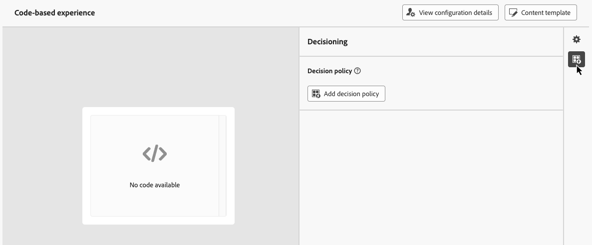

+++

>[!TAB メール]

1. 「**[!UICONTROL 決定を有効にする]**」オプションを切り替えます。

   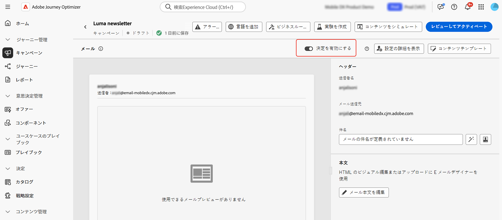

   >[!IMPORTANT]
   >
   >決定を有効にすると、既存のメールコンテンツが消去されます。メールを既にデザインしている場合は、事前にコンテンツをテンプレートとして保存します。

1. メールデザイナーで利用可能な&#x200B;**パーソナライゼーションエディター**&#x200B;または&#x200B;**決定** メニューを使用して、新しい決定ポリシーを追加します。

   +++Personalization エディターから決定ポリシーを追加する

   1. パーソナライゼーションを追加できる件名フィールドまたはメール本文の任意のフィールドで利用できる アイコンを使用して、パーソナライゼーションエディターを開きます。

   1. **[!UICONTROL 決定ポリシー]** メニューに移動し、「**[!UICONTROL 決定ポリシーを追加]**」ボタンをクリックします。

      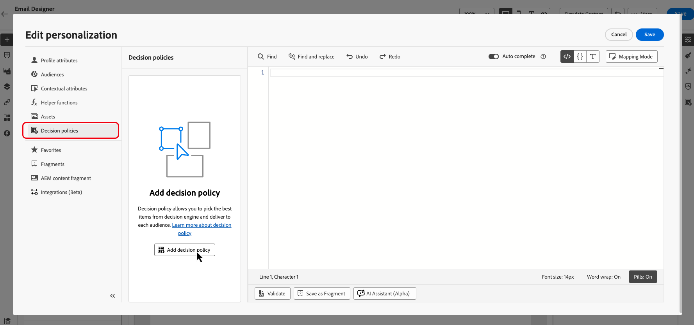

   +++

   +++決定メニューから決定ポリシーを追加します

   1. メールDesignerを開き、メール構造内の任意のコンポーネントを選択します。

   1. プロパティ ペインの アイコンをクリックして、**[!UICONTROL 決定]** メニューにアクセスします。

   1. 「**[!UICONTROL 新しいポリシーを追加]**」ボタンをクリックします。

      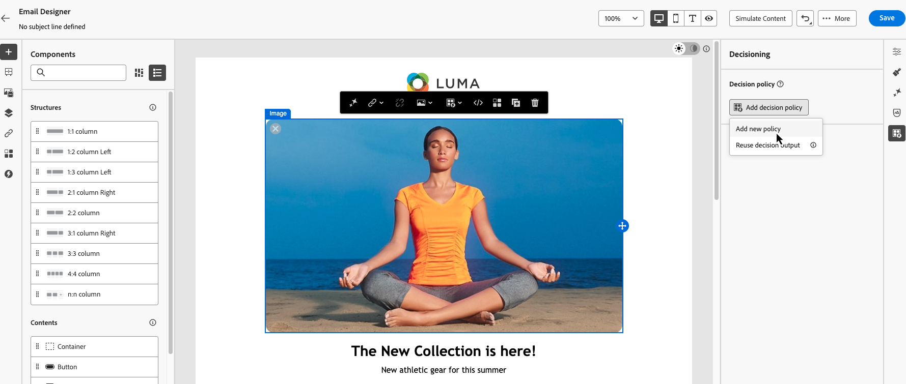

   >[!NOTE]
   >
   >**[!UICONTROL 決定出力を再利用]** オプションを使用すると、このメールで既に作成されている決定ポリシーを再利用できます。 特に、同じオファーを複数の場所（ヘッダーやフッターなど）で表示する場合に便利です。
   >
   >メール本文で複数の決定ポリシーで同じオファーを選択できる場合、エンジンはオファーを重複しません。各プレースメントに異なるオファーが届くため、同じオファーが両方の場所に表示されません。 同じオファーを複数のプレースメントで表示するには、**[!UICONTROL 決定出力を再利用]**&#x200B;して、このメールの既存の決定ポリシーの出力を再利用します。

>[!TAB SMS]

SMSの場合、プロパティパネルで利用可能な&#x200B;**パーソナライゼーションエディター**&#x200B;または&#x200B;**決定** メニューを使用して、新しい決定ポリシーを追加できます。

+++パーソナライゼーションエディターからの決定ポリシーの追加

1.  アイコンを使用してパーソナライゼーションエディターを開きます。
1. **[!UICONTROL 決定ポリシー]** メニューに移動し、「**[!UICONTROL 決定ポリシーを追加]**」ボタンをクリックします。

   

+++

+++決定メニューから決定ポリシーを追加します

1. プロパティ ペインの アイコンをクリックして、**[!UICONTROL 決定]** メニューにアクセスします。

1. 「**[!UICONTROL 決定ポリシーを追加]**」ボタンをクリックします。

   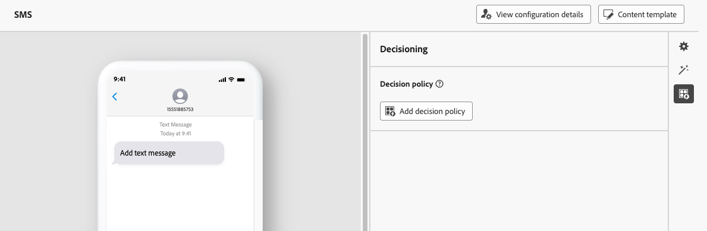

>[!TAB プッシュ通知]

プッシュ通知の場合、プロパティパネルで使用できる&#x200B;**パーソナライゼーションエディター**&#x200B;または&#x200B;**決定** メニューのいずれかを使用して、新しい決定ポリシーを追加できます。

+++パーソナライゼーションエディターからの決定ポリシーの追加

1.  アイコンを使用してパーソナライゼーションエディターを開きます。
1. **[!UICONTROL 決定ポリシー]** メニューに移動し、「**[!UICONTROL 決定ポリシーを追加]**」ボタンをクリックします。

   

+++

+++決定メニューから決定ポリシーを追加します

1. プロパティ ペインの アイコンをクリックして、**[!UICONTROL 決定]** メニューにアクセスします。

1. 「**[!UICONTROL 決定ポリシーを追加]**」ボタンをクリックします。

   

>[!IMPORTANT]
>
>プッシュ通知を使用したエクスペリエンス決定には、モバイル SDKの特定のバージョンが必要です。 この機能を実装する前に、[&#x200B; リリースノート &#x200B;](https://developer.adobe.com/client-sdks/home/release-notes/){target="_blank"}を確認して、必要なバージョンを特定し、それに応じてアップグレードされていることを確認してください。 また、[このセクション &#x200B;](https://developer.adobe.com/client-sdks/home/current-sdk-versions/){target="_blank"}では、お使いのプラットフォームで利用可能なすべてのSDK バージョンを表示できます。

>[!ENDTABS]

## 決定ポリシーの設定 {#configure}

コンテンツに新しい決定ポリシーを追加すると、決定ポリシー設定画面が開きます。 決定ポリシーを設定するには、次の手順に従います。

1. 決定ポリシーの名前を入力してから、カタログを選択します（現在はデフォルトの&#x200B;**[!UICONTROL オファー]**&#x200B;カタログに限定されています）。

   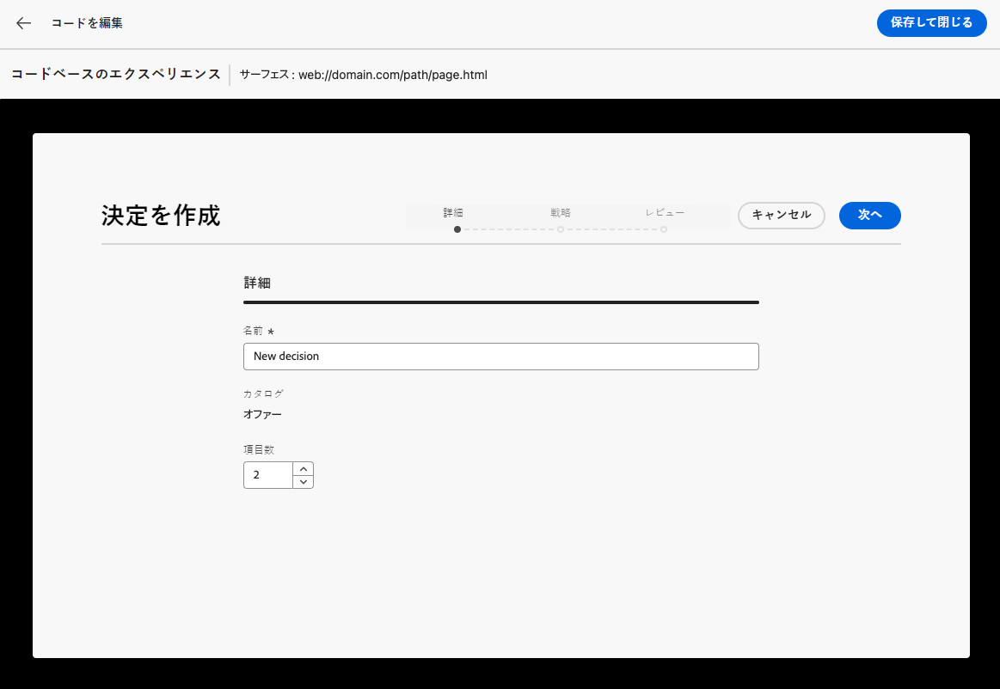

1. 「**[!UICONTROL 項目数]**」フィールドでは、決定ポリシーで返される決定項目の数を定義できます。 例えば、「2」を選択した場合、現在の設定に対して最適な 2 つの実施要件を満たすオファーが表示されます。

   >[!NOTE]
   >
   >このオプションは、電子メールおよびコードベースのエクスペリエンスチャネルでのみ使用できます。 その他のすべてのチャネルでは、1つのアクションにつき1つの決定項目のみを返すことができます。

   電子メールチャネルの複数の項目を返すには、**[!UICONTROL 繰り返しグリッド]** コンポーネント内に決定ポリシーを追加する必要があります。 詳しくは、以下の節を展開してください。

   +++複数の決定項目をメールで返す

   1. メール内の&#x200B;**[!UICONTROL リピートグリッド]**&#x200B;コンポーネントをドラッグし、**[!UICONTROL 設定]**&#x200B;ペインを使用して必要に応じて設定します。

      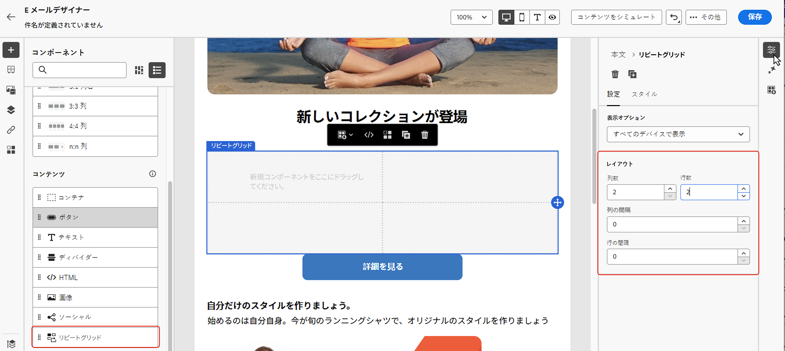

   1. キャンバスツールバーの「**[!UICONTROL 決定]**」アイコンをクリックするか、**[!UICONTROL 決定]**&#x200B;パネルを開き、「**[!UICONTROL 決定ポリシーを追加]**」を選択します。

   1. 「**[!UICONTROL 項目数]**」フィールドで返される項目の数を指定し、以下の説明に従って決定ポリシーを設定します。選択できる項目の最大数は、**[!UICONTROL リピートグリッド]**&#x200B;コンポーネントで定義したタイルの数によって制限されます。

   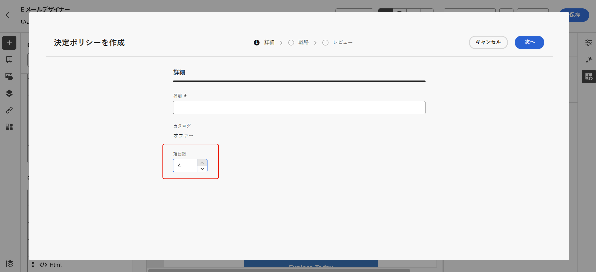

   +++

1. 「**[!UICONTROL 次へ]**」をクリックします。

## 戦略シーケンスの設定 {#strategy}

「**[!UICONTROL 戦略シーケンス]**」セクションでは、決定ポリシーと共に提示する決定項目を選択し、選択戦略を設定できます。

1. 「**[!UICONTROL 追加]**」をクリックして、ポリシーに含めるオブジェクトのタイプを選択します。

   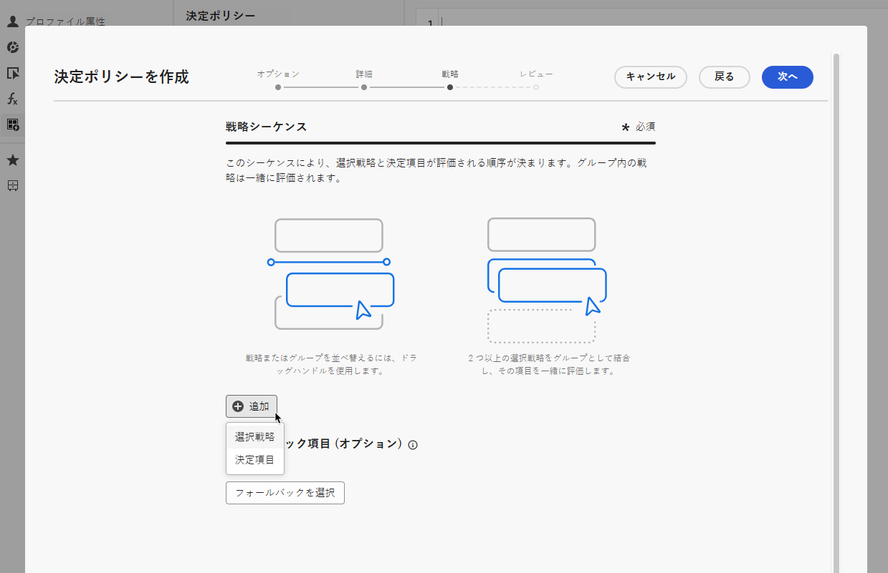

   * **[!UICONTROL 選択戦略]** - 決定戦略では、実施要件と制約およびランキング方法に関連付けられたコレクションを活用して、表示する項目を決定します。1 つまたは複数の既存の選択戦略を選択するか、「**[!UICONTROL 選択戦略を作成]**」ボタンを使用して新しい選択戦略を作成できます。[詳しくは、選択戦略の作成方法を参照してください。](selection-strategies.md)

   * **[!UICONTROL 決定項目]** - 選択戦略を実行せずに、1 つの決定項目を選択します。一度に選択できる決定項目は 1 つだけです。項目に設定されている実施要件制約が適用されます。

   >[!NOTE]
   >
   >決定ポリシーでは、最大 10 個の選択戦略と決定項目を組み合わせてサポートします。[詳しくは、決定ガードレールと制限を参照してください。](gs-experience-decisioning.md#guardrails)

1. 複数の決定項目や戦略を追加した場合、それらは特定の順序で評価されます。シーケンスに最初に追加されたオブジェクトが最初に評価され、それ以降も追加された順に評価されます。デフォルトのシーケンスを変更するには、オブジェクトやグループをドラッグ＆ドロップして、任意の順序に並べ替えます。詳しくは、以下の節を参照してください。

   +++決定ポリシーの評価順序の管理

   決定項目と選択戦略をポリシーに追加したら、それらの順序を並べ替えて評価順序を決定し、選択戦略を組み合わせて一緒に評価することができます。

   項目と戦略が評価される&#x200B;**順序**&#x200B;は、各オブジェクトまたはオブジェクトのグループの左側にある数字で示されます。シーケンス内の選択戦略（または戦略のグループ）の位置を移動するには、別の位置にドラッグ＆ドロップします。

   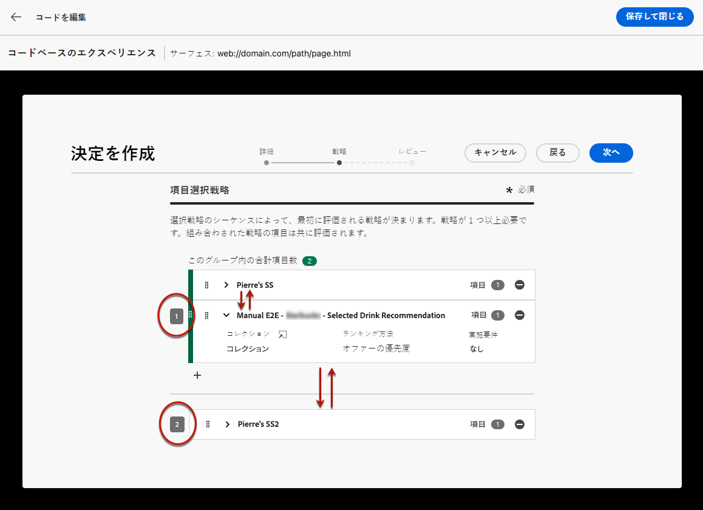

   >[!NOTE]
   >
   >シーケンス内でドラッグ＆ドロップできるのは選択戦略のみです。決定項目の位置を変更するには、その決定項目を削除し、前に評価する他の項目を追加した後で、「**[!UICONTROL 追加]**」ボタンを使用して再度追加する必要があります。

   また、複数の選択戦略をグループに&#x200B;**組み合わせて**、個別にではなく一緒に評価することもできます。これを行うには、選択戦略の下にある「**`+`**」ボタンをクリックして、別の選択戦略と組み合わせます。また、選択戦略を別の選択戦略にドラッグ＆ドロップして、2 つの戦略を 1 つのグループにグループ化することもできます。

   >[!NOTE]
   >
   >決定項目は、他の項目や選択戦略とグループ化できません。

   複数の戦略とそのグループ化によって、戦略の優先度と実施要件を満たすオファーのランキングが決まります。最初の戦略の優先度が最も高く、同じグループ内で結合された戦略も同じ優先度になります。

   例えば、2 つのコレクションが（1 つは戦略 A 、もう 1 つは戦略 B に）あるとします。リクエストは、2 つの決定項目を送り返すことです。戦略 A の 2 つの実施要件を満たすオファーがあり、戦略 B の 3 つの実施要件を満たすオファーがあるとします。

   * 2 つの戦略が&#x200B;**組み合わされていない**&#x200B;か、順序が同じでない場合（1 と 2）、戦略の上位 2 つの実施要件を満たすオファーが最初の行に返されます。最初の戦略に実施要件を満たすオファーが 2 つない場合、決定エンジンは次の戦略に順番に進み、まだ必要なオファーを見つけます。最終的には必要に応じてフォールバックを返します。

     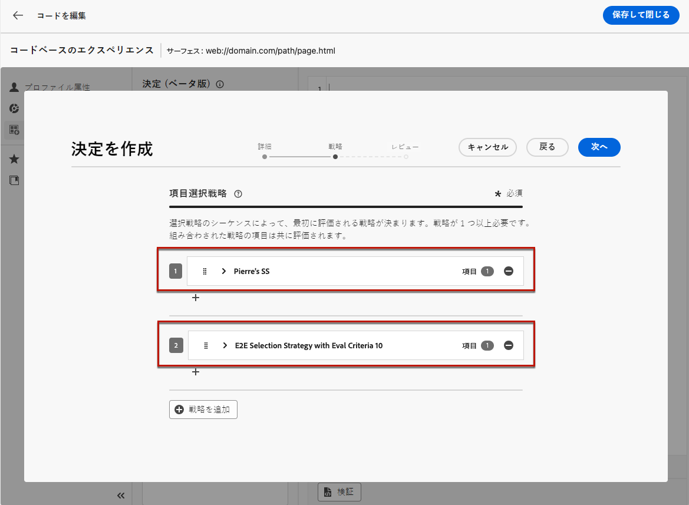

   * 2 つのコレクションが&#x200B;**同時に評価**&#x200B;される場合、戦略 A から 2 つの実施要件を満たすオファーがあり、戦略 B から 3 つの実施要件を満たすオファーがあります。そのため、5 つのオファーはすべて、それぞれのランキングメソッドによって決定された値に基づいてまとめられます。リクエストされたオファー数は 2 つなので、これら 5 つのオファーのうち上位 2 つの実施要件を満たすオファーが返されます。

     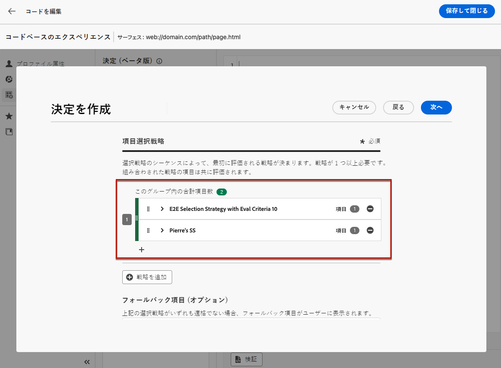

   **複数の戦略がある場合の例**

   次に、複数の戦略を異なるグループに分割した例を考えてみましょう。3 つの戦略を定義しました。戦略 1 と戦略 2 はグループ 1 で結合され、戦略 3 は独立しています（グループ 2）。各戦略の実施要件を満たすオファーとその優先度（ランキング関数評価で使用）は、次のとおりです。

   * グループ 1：
      * 戦略 1 -（オファー 1、オファー 2、オファー 3）- 優先度 1
      * 戦略 2 -（オファー 3、オファー 4、オファー 5）- 優先度 1

   * グループ 2：
      * 戦略 3 -（オファー 5、オファー 6）- 優先度 0

   優先度が最も高い戦略のオファーが最初に評価され、ランク付けされたオファーリストに追加されます。

   * **反復 1：**

     戦略 1 および戦略 2 のオファーは、一緒に評価されます（オファー 1、オファー 2、オファー 3、オファー 4、オファー 5）。結果が次のようになったとします。

     オファー 1 - 10
オファー 2 - 20
オファー 3 - 30（戦略 1 から）、45（戦略 2 から）。両者の中で最も高いものが考慮されるので、45 が考慮されます。
オファー 4 - 40
オファー 5 - 50

     ランク付けされたオファーは、オファー 5 、オファー 3、オファー 4、オファー 2、オファー 1 となります。

   * **反復 2：**

     戦略 3 のオファーが評価されます（オファー 5、オファー 6）。結果が次のようになったとします。

      * オファー 5 - 上記の結果に既に存在するので、評価されません。
      * オファー 6 - 60

     ランク付けされたオファーは、次のようになります。オファー 5 、オファー 3、オファー 4、オファー 2、オファー 1、オファー 6。

   +++

1. 選択戦略の準備が整ったら、「**[!UICONTROL 次へ]**」をクリックします。

## フォールバックオファーの追加 {#fallback}

決定項目や選択戦略を選択した後で、上記の項目や選択戦略のいずれも選定されない場合、表示するフォールバックオファーを追加できます。

リストから任意の項目を選択すると、現在のサンドボックスで作成されたすべての決定項目が表示されます。選択戦略が選定されていない場合、選択した項目に適用された日付や実施要件制約に関係なく、フォールバックがユーザーに表示されます<!--nor frequency capping when available - TO CLARIFY-->。

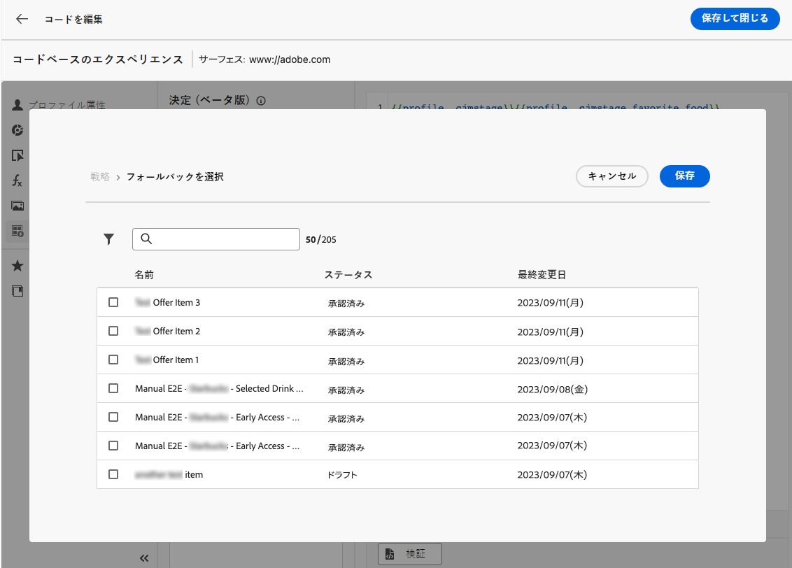

>[!NOTE]
> フォールバックはオプションです。リクエストした項目数を上限に、項目の数を選択できます。実施要件が満たされてなく、フォールバックが設定されていない場合は、何も表示されません。

## 決定ポリシーの確認と保存 {#review}

選択戦略を設定し、フォールバックオファーを追加したら、「**[!UICONTROL 次へ]**」をクリックして決定ポリシーを確認および保存します。次に、「**[!UICONTROL 作成]**」をクリックしてポリシーの作成を確定します。

>[!IMPORTANT]
>
>決定ポリシーが作成されると、それに加えられた変更がすべてのデータ領域に反映されるまでに最大15分、カナダでは最大30分かかる場合があります。 これには、コレクションへの新しい決定項目の追加、項目内のルールの変更、項目コンテンツの変更、数式の更新などの変更が含まれます。

決定ポリシーは、パーソナライゼーションエディターの省略記号ボタンや、コンポーネントプロパティパネル内の&#x200B;**[!UICONTROL 決定]**&#x200B;メニューを使用して、いつでも編集または削除できます。

>[!BEGINTABS]

>[!TAB パーソナライゼーションエディターからのポリシーの編集または削除]

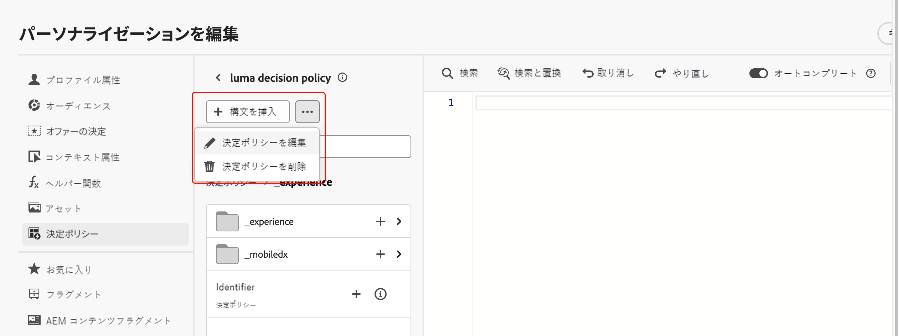

>[!TAB 決定メニューからポリシーを編集または削除する]

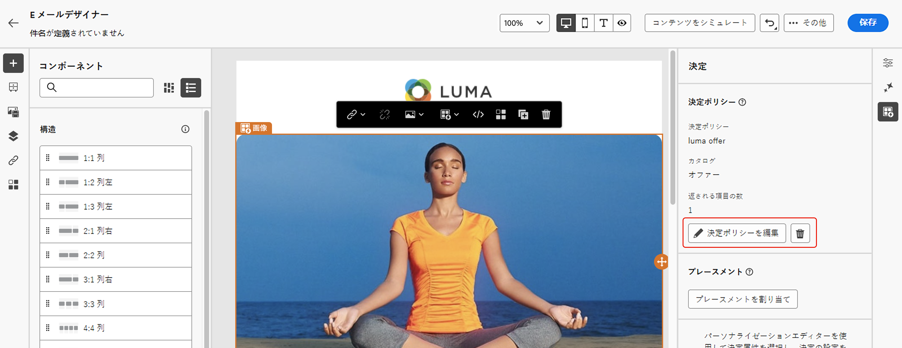

>[!ENDTABS]

## プレースメントの割り当て {#placement}

メールの場合、決定ポリシーに関連付けられたコンポーネントのプレースメントを定義する必要があります。これを行うには、コンポーネントプロパティペインの「**[!UICONTROL 決定]** 」ボタンをクリックして、「**[!UICONTROL プレースメントを割り当て]**」を選択します。[詳しくは、プレースメントの操作方法を参照してください。](../experience-decisioning/placements.md)

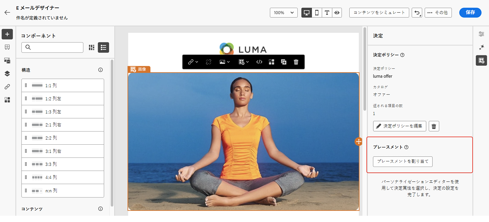

## 次の手順 {#next-steps}

決定ポリシーの作成方法を理解したところで、[!DNL Journey Optimizer]つのチャネルでオファーを配信する準備が整いました。

➡️[メッセージで決定ポリシーを使用する方法を学ぶ](../experience-decisioning/use-decision-policy.md)
