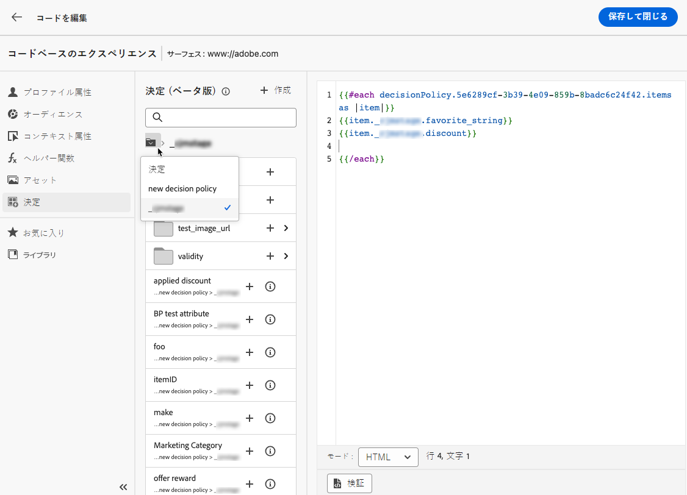

# 決定ポリシーの作成 {#create-decision}

>[!CONTEXTUALHELP]
>id="ajo_code_based_decision"
>title="決定とは"
>abstract="判定ポリシーは、エクスペリエンス判定エンジンを活用して、オーディエンスに応じて、配信する最適なコンテンツを選択します。"
>additional-url="https://experienceleague.adobe.com/docs/journey-optimizer/using/offer-decisioning/get-started-decision/starting-offer-decisioning.html?lang=ja" text="エクスペリエンス判定について"

>[!BEGINSHADEBOX]

このドキュメントガイドの内容は次のとおりです。

* [Experience Decisioning の基本を学ぶ](gs-experience-decisioning.md)
* 決定項目を管理
   * [項目カタログを設定](catalogs.md)
   * [決定項目の作成](items.md)
   * [項目コレクションを管理](collections.md)
* 項目の選択を設定
   * [決定ルールの作成](rules.md)
   * [ランキングメソッドの作成](ranking.md)
* [選択戦略を作成](selection-strategies.md)
* **[決定ポリシーの作成](create-decision.md)**

>[!ENDSHADEBOX]

判定ポリシーは、オーディエンスに応じて、配信する最適なコンテンツを選択するためにエクスペリエンス判定エンジンを活用するオファーのコンテナです。

>[!NOTE]
>
>Adobe Analytics の [!DNL Journey Optimizer] ユーザーインターフェイス、決定ポリシーは決定としてラベル付けされます<!--but they are decision policies. TBC if this note is needed-->.

## コードベースのキャンペーンに決定ポリシーを追加する {#add-decision}

>[!CONTEXTUALHELP]
>id="ajo_code_based_item_number"
>title="返す項目数を定義"
>abstract="返す決定項目の数を選択します。 例えば、「2」を選択した場合、現在のサーフェスに対して適格なオファーのうち最も 2 つが提示されます。"

>[!CONTEXTUALHELP]
>id="ajo_code_based_fallback"
>title="フォールバックを選択"
>abstract="その決定ポリシーに対して定義された選択戦略がいずれも選定されていない場合、フォールバック項目がユーザーに表示されます。"

>[!CONTEXTUALHELP]
>id="ajo_code_based_strategy"
>title="戦略とは"
>abstract="選択戦略の順序によって、最初に評価される戦略が決まります。 少なくとも 1 つの方法が必要です。 組み合わせ戦略の決定項目は、一緒に評価されます。"
>additional-url="https://experienceleague.adobe.com/docs/journey-optimizer/using/offer-decisioning/get-started-decision/starting-offer-decisioning.html?lang=ja" text="戦略の作成"
>additional-url="https://experienceleague.adobe.com/docs/journey-optimizer/using/offer-decisioning/get-started-decision/starting-offer-decisioning.html?lang=ja" text="評価順序"

Web サイトやモバイルアプリで訪問者に最適な動的なオファーやエクスペリエンスを提示するには、コードベースのキャンペーンに決定ポリシーを追加します。 これを行うには、以下の手順に従います。

1. キャンペーンを作成し、 **[!UICONTROL コードベースのエクスペリエンス（ベータ版）]** アクション。 [詳細情報](../code-based/create-code-based.md)

   >[!NOTE]
   >
   >コードベースのエクスペリエンス機能は、現在、一部のユーザーのみが利用できるベータ版として利用できます。

1. 次から： [コードエディター](../code-based/create-code-based.md#edit-code)を選択し、 **[!UICONTROL 決定]** アイコンとクリック **[!UICONTROL 決定の作成]**.

   

1. 決定ポリシーの詳細を入力します。名前を追加し、カタログを選択します。

   >[!NOTE]
   >
   >現在はデフォルトのみ **[!UICONTROL オファー]** カタログを使用できます。

   

1. 返す項目の数を選択します。 例えば、「2」を選択した場合、現在のサーフェスに対して適格なオファーのうち最も 2 つが提示されます。 「**[!UICONTROL 次へ]**」をクリックします。

1. 以下を使用します。 **[!UICONTROL 方法を追加]** ボタンを使用して、決定ポリシーの選択戦略を定義します。 各戦略は、実施要件の制約に関連付けられたオファーコレクションと、表示するオファーを決定するためのランキング方法で構成されます。 [詳細情報](selection-strategies.md)

   

   >[!NOTE]
   >
   >少なくとも 1 つの方法が必要です。 10 個を超える戦略を追加することはできません。

1. 次から： **[!UICONTROL 方法を追加]** 画面を開いて、戦略を作成することもできます。 The **[!UICONTROL 選択方法を作成]** ボタンにより次の場所にリダイレクトされます： **[!UICONTROL エクスペリエンス判定]** > **[!UICONTROL 設定]** メニュー。 [詳細情報](selection-strategies.md)

   

1. 複数の戦略を追加する場合、特定の順序で評価されます。 シーケンスに最初に追加された方法が最初に評価され、以降も同様に続きます。 [詳細情報](#evaluation-order)

   デフォルトの順序を変更するには、ストラテジーやグループをドラッグ&amp;ドロップして、必要に応じて順序を変更します。

   

1. フォールバックを追加します。 上記の選択戦略のどれも選定されていない場合、フォールバック項目はユーザーに表示されます。

   

   リストから任意の項目を選択できます。このリストには、現在のサンドボックスで作成されたすべての判定項目が表示されます。 選択戦略が選定されていない場合、選択した項目に適用された日付および適格要件の制約に関係なく、フォールバックがユーザーに表示されます<!--nor frequency capping when available - TO CLARIFY-->.

   >[!NOTE]
   >
   >フォールバックはオプションです。 フォールバックが選択されておらず、戦略が選定されていない場合、 [!DNL Journey Optimizer].

1. 選択内容を保存し、をクリックします。 **[!UICONTROL 作成]**. 新しい決定ポリシーは、以下に追加されます。 **[!UICONTROL 決定]**.

   

判定ポリシーが作成されたので、コードベースのエクスペリエンスコンテンツ内で判定属性を使用できます。 [詳細情報](#use-decision-policy)

## 評価順序 {#evaluation-order}

前述のように、戦略は、コレクション、ランキング方法、実施要件制約で構成されます。

以下が可能です。

* 戦略を評価する順序を設定します。
* 複数の戦略を組み合わせて、個別ではなく一緒に評価します。

複数の戦略とそのグループ化によって、実施要件を満たすオファーの戦略とランキングの優先順位が決まります。 第 1 の戦略の優先順位が最も高く、同じグループ内で組み合わされた戦略の優先順位が同じです。

例えば、戦略 A と戦略 B の 2 つのコレクションがあるとします。リクエストは、2 つの決定項目を返送するためのものです。 例えば、戦略 A の適格なオファーが 2 つ、戦略 B の適格なオファーが 3 つあるとします。

* 2 つの戦略が **組み合わせなし** または、順番（1 と 2）で、最初の戦略の実施要件を満たす上位 2 つのオファーが最初の行に返されます。 最初の戦略で適格なオファーが 2 つもない場合、決定エンジンは順番に次の戦略に進み、まだ必要なオファーをいくつでも見つけ、最終的には必要に応じてフォールバックを返します。

  

* 2 つのコレクションが **同時に評価される**&#x200B;に基づき、戦略 A からの適格なオファーが 2 つ、戦略 B からの適格なオファーが 3 つあるので、5 つのオファーはすべて、それぞれのランキングメソッドで決定された値に基づいて一緒に並べられます。 リクエストされたオファー数は 2 つなので、これら 5 つのオファーのうち上位 2 つの実施要件を満たすオファーが返されます。

  

+++ **複数の戦略を使用した例**

次に、複数の戦略を異なるグループに分割した例を考えてみましょう。

3 つの戦略を定義しました。 戦略 1 と戦略 2 は、グループ 1 で組み合わされ、戦略 3 は独立しています（グループ 2）。

各戦略の適格なオファーとその優先度（ランキング関数の評価で使用）は、次のとおりです。

* グループ 1：
   * 方法 1 - （オファー 1、オファー 2、オファー 3） — 優先度 1
   * 方法 2 - （オファー 3、オファー 4、オファー 5） — 優先度 1

* グループ 2：
   * 戦略 3 - （オファー 5、オファー 6） — 優先度 0

最も優先度の高い戦略オファーが最初に評価され、ランク付けされたオファーリストに追加されます。

**反復 1：**

戦略 1 および戦略 2 のオファーは、一緒に評価されます（オファー 1、オファー 2、オファー 3、オファー 4、オファー 5）。 結果が次のようになったとします。

オファー 1 - 10 オファー 2 - 20 オファー 3 - 30（戦略 1 から）45（戦略 2 から）. 両者の中で最も高いものが考慮されるので、45 が考慮されます。
オファー 4 - 40
オファー 5 - 50

ランク付けされたオファーは、オファー 5、オファー 3、オファー 4、オファー 2、オファー 1 になりました。

**反復 2：**

戦略 3 のオファーが評価されます（オファー 5、オファー 6）。 結果が次のようになったとします。

* オファー 5 - 上記の結果に既に存在するので、評価されません。
* オファー 6 - 60

ランク付けされたオファーは、次のようになります。オファー 5 、オファー 3、オファー 4、オファー 2、オファー 1、オファー 6。

+++

## コードエディターでの決定ポリシーの使用 {#use-decision-policy}

作成した判定ポリシーは、 [コードエディター](../code-based/create-code-based.md#edit-code). これを行うには、以下の手順に従います。

>[!NOTE]
>
>コードエディターは、 [!DNL Journey Optimizer] 式エディターには、パーソナライゼーションおよびオーサリング機能がすべて含まれています。 [詳細情報](../personalization/personalization-build-expressions.md)

1. 「+」アイコンをクリックします。 決定ポリシーに対応するコードが追加されます。 これで、必要なすべての決定属性をそのコード内に追加できます。

   

   >[!NOTE]
   >
   >このシーケンスは、判定ポリシーを返す回数を繰り返します。 例えば、次の場合に 2 つの項目を返すように選択したとします。 [決定の作成](#add-decision)の場合、同じシーケンスが 2 回繰り返されます。

1. 決定ポリシーをクリックします。 決定属性が表示されます。

   これらの属性は、 **[!UICONTROL オファー]** カタログのスキーマ。 カスタム属性は、 **_cjmstage** フォルダー属性と標準属性 **_experience** フォルダー。 [オファーカタログのスキーマの詳細を説明します](catalogs.md)

   

1. 各フォルダーをクリックして展開します。 目的の場所にマウスのカーソルを置き、追加する属性の横にある+アイコンをクリックします。 属性は、コードに追加する数だけ追加できます。

   

1. 決定ポリシーのルートに戻るには、フォルダーアイコンをクリックします。

   

1. また、式エディタで使用できる他のアトリビュート（プロファイルアトリビュートなど）を追加することもできます。

   
