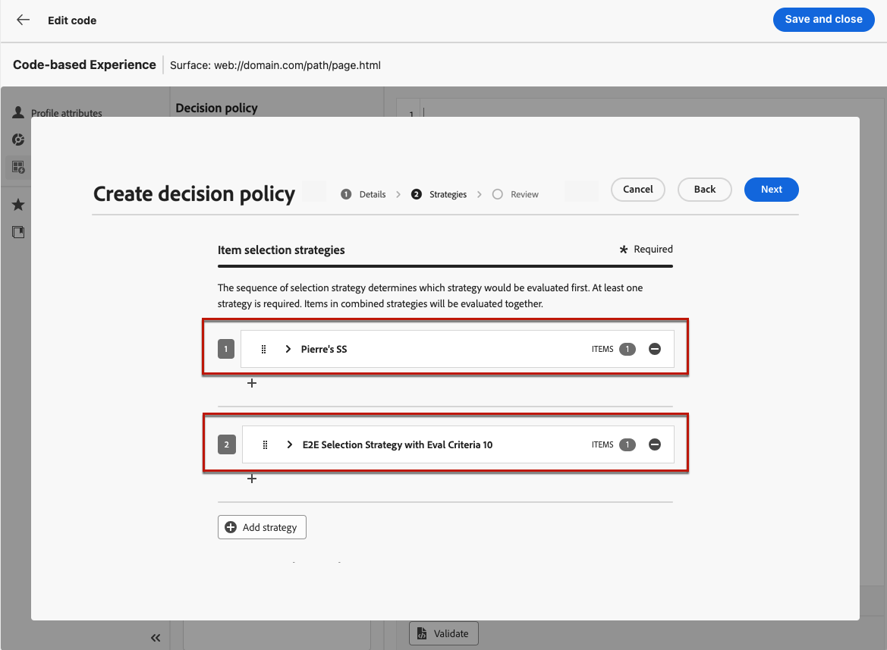

# 決定ポリシーの作成 {#create-decision}

>[!CONTEXTUALHELP]
>id="ajo_code_based_decision"
>title="決定とは"
>abstract="決定ポリシーには、決定エンジンが最適なコンテンツを選択するためのすべての選択ロジックが含まれています。決定ポリシーはキャンペーンに固有です。目標は、各プロファイルに最適なオファーを選択することです。一方、キャンペーンのオーサリングでは、メッセージに含める項目属性など、選択した決定項目の表示方法を指定できます。"
>additional-url="https://experienceleague.adobe.com/ja/docs/journey-optimizer/using/decisioning/offer-decisioning/get-started-decision/starting-offer-decisioning" text="決定について"

決定ポリシーは、オーディエンスに応じて配信する最適なコンテンツを選択するために、決定エンジンを活用するオファーのコンテナです。

決定ポリシーには、決定エンジンが最適なコンテンツを選択するためのすべての選択ロジックが含まれています。決定ポリシーはキャンペーンに固有です。目標は、各プロファイルに最適なオファーを選択することです。一方、キャンペーンのオーサリングでは、メッセージに含める項目属性など、選択した決定項目の表示方法を指定できます。

>[!NOTE]
>
>[!DNL Journey Optimizer] のユーザーインターフェイスでは、決定ポリシーは決定としてラベル付けされます<!--but they are decision policies. TBC if this note is needed-->。

コードベースのキャンペーンに決定ポリシーを活用する主な手順を次に示します。

1. [コードベースのキャンペーンに決定ポリシーを作成します](#add-decision)
1. [コードベースのキャンペーンに決定ポリシーを使用します](#use-decision-policy)
1. [カスタム Customer Journey Analytics レポートダッシュボードを作成します](#cja)

## コードベースのキャンペーンへの決定ポリシーの追加 {#add-decision}

>[!CONTEXTUALHELP]
>id="ajo_code_based_item_number"
>title="返される項目の数の定義"
>abstract="返される決定項目の数を選択します。例えば、「2」を選択した場合、現在の設定に対して最適な 2 つの実施要件を満たすオファーが表示されます。"

>[!CONTEXTUALHELP]
>id="ajo_code_based_fallback"
>title="フォールバックの選択"
>abstract="フォールバック項目は、その決定ポリシーに対して定義された選択戦略がいずれも選定されていない際にユーザーに表示されます。"

>[!CONTEXTUALHELP]
>id="ajo_code_based_strategy"
>title="戦略とは"
>abstract="選択戦略の順序によって、最初に評価される戦略が決まります。少なくとも 1 つの戦略が必要です。組み合わせ戦略の決定項目は、一緒に評価されます。"
>additional-url="https://experienceleague.adobe.com/ja/docs/journey-optimizer/using/decisioning/offer-decisioning/get-started-decision/starting-offer-decisioning" text="戦略の作成"
>additional-url="https://experienceleague.adobe.com/ja/docs/journey-optimizer/using/decisioning/offer-decisioning/get-started-decision/starting-offer-decisioning" text="評価順序"

Web サイトやモバイルアプリで訪問者に最適な動的なオファーおよびエクスペリエンスを提示するには、コードベースキャンペーンに決定ポリシーを追加します。これを行うには、以下の手順に従います。

### 決定ポリシーの作成 {#add}

1. キャンペーンを作成し、**[!UICONTROL コードベースのエクスペリエンス]**&#x200B;アクションを選択します。[詳細情報](../code-based/create-code-based.md)

1. [コードエディター](../code-based/create-code-based.md#edit-code)から **[!UICONTROL 決定ポリシー]**&#x200B;アイコンを選択し、「**[!UICONTROL 決定ポリシーを追加]**」をクリックします。

   

1. 決定ポリシーの詳細を入力します。名前を追加し、カタログを選択します。

   >[!NOTE]
   >
   >現在はデフォルトの&#x200B;**[!UICONTROL オファー]**&#x200B;カタログのみを使用できます。

1. 返される項目の数を選択します。例えば、「2」を選択した場合、現在の設定に対して最適な 2 つの実施要件を満たすオファーが表示されます。「**[!UICONTROL 次へ]**」をクリックします。

   

### 項目と選択戦略の選択 {#select}

「**[!UICONTROL 戦略シーケンス]**」セクションでは、決定ポリシーと共に提示する決定項目と選択戦略を選択できます。

1. 「**[!UICONTROL 追加]**」ボタンをクリックして、ポリシーに含めるオブジェクトのタイプを選択します。

   * **[!UICONTROL 選択戦略]**：1 つまたは複数の選択戦略を追加します。決定戦略では、実施要件制約とランキング方法に関連付けられたコレクションを活用して、表示する項目を決定します。既存の選択戦略を選択するか、「**[!UICONTROL 選択戦略を作成]**」ボタンを使用して新しい選択戦略を作成できます。[詳しくは、選択戦略の作成方法を参照してください](selection-strategies.md)

   * **[!UICONTROL 決定項目]**：1 つの決定項目を追加し、選択戦略を介さずに提示できるようにします。一度に選択できる決定項目は 1 つだけです。項目に設定されている実施要件制約が適用されます。

   

   >[!NOTE]
   >
   >決定ポリシーでは、最大 10 個の選択戦略と決定項目を組み合わせてサポートします。 [ 決定ガードレールと制限の詳細を説明します ](gs-experience-decisioning.md#guardrails)。

1. 複数の決定項目や戦略を追加した場合、それらは特定の順序で評価されます。シーケンスに最初に追加されたオブジェクトが最初に評価され、以下同様に評価されます。 デフォルトのシーケンスを変更するには、オブジェクトやグループをドラッグ＆ドロップして、任意の順序に並べ替えることができます。[詳しくは、決定ポリシーの評価順序を参照してください](#evaluation-order)

### 決定ポリシーの評価順序の管理 {#evaluation-order}

決定項目と選択戦略をポリシーに追加したら、それらの順序を並べ替えて評価順序を決定し、選択戦略を組み合わせて一緒に評価することができます。

項目と戦略が評価される&#x200B;**順序**&#x200B;は、各オブジェクトまたはオブジェクトのグループの左側にある数字で示されます。シーケンス内の選択戦略（または戦略のグループ）の位置を移動するには、別の位置にドラッグ＆ドロップします。

>[!NOTE]
>
>シーケンス内でドラッグ＆ドロップできるのは選択戦略のみです。決定項目の位置を変更するには、その決定項目を削除し、前に評価する他の項目を追加した後で、「**[!UICONTROL 追加]**」ボタンを使用して再度追加する必要があります。

また、複数の選択戦略をグループに&#x200B;**組み合わせて**、個別にではなく一緒に評価することもできます。これを行うには、選択戦略の下にある「**`+`**」ボタンをクリックして、別の選択戦略と組み合わせます。また、選択戦略を別の選択戦略にドラッグ＆ドロップして、2 つの戦略を 1 つのグループにグループ化することもできます。

>[!NOTE]
>
>決定項目は、他の項目や選択戦略とグループ化できません。

複数の戦略とそのグループ化によって、戦略の優先度と実施要件を満たすオファーのランキングが決まります。最初の戦略の優先度が最も高く、同じグループ内で結合された戦略も同じ優先度になります。

例えば、2 つのコレクションが（1 つは戦略 A 、もう 1 つは戦略 B に）あるとします。リクエストは、2 つの決定項目を送り返すことです。戦略 A の 2 つの実施要件を満たすオファーがあり、戦略 B の 3 つの実施要件を満たすオファーがあるとします。

* 2 つの戦略が&#x200B;**組み合わされていない**&#x200B;か、順序が同じでない場合（1 と 2）、戦略の上位 2 つの実施要件を満たすオファーが最初の行に返されます。最初の戦略に実施要件を満たすオファーが 2 つない場合、決定エンジンは次の戦略に順番に進み、まだ必要なオファーを見つけます。最終的には必要に応じてフォールバックを返します。

  

* 2 つのコレクションが&#x200B;**同時に評価**&#x200B;される場合、戦略 A から 2 つの実施要件を満たすオファーがあり、戦略 B から 3 つの実施要件を満たすオファーがあります。そのため、5 つのオファーはすべて、それぞれのランキングメソッドによって決定された値に基づいてまとめられます。リクエストされたオファー数は 2 つなので、これら 5 つのオファーのうち上位 2 つの実施要件を満たすオファーが返されます。

  

+++ **複数の戦略がある場合の例**

次に、複数の戦略を異なるグループに分割した例を考えてみましょう。

3 つの戦略を定義しました。戦略 1 と戦略 2 はグループ 1 で結合され、戦略 3 は独立しています（グループ 2）。

各戦略の実施要件を満たすオファーとその優先度（ランキング関数評価で使用）は、次のとおりです。

* グループ 1：
   * 戦略 1 -（オファー 1、オファー 2、オファー 3）- 優先度 1
   * 戦略 2 -（オファー 3、オファー 4、オファー 5）- 優先度 1

* グループ 2：
   * 戦略 3 -（オファー 5、オファー 6）- 優先度 0

優先度が最も高い戦略のオファーが最初に評価され、ランク付けされたオファーリストに追加されます。

**反復 1：**

戦略 1 および戦略 2 のオファーは、一緒に評価されます（オファー 1、オファー 2、オファー 3、オファー 4、オファー 5）。結果が次のようになったとします。

オファー 1 - 10
オファー 2 - 20
オファー 3 - 30（戦略 1 から）、45（戦略 2 から）。両者の中で最も高いものが考慮されるので、45 が考慮されます。
オファー 4 - 40
オファー 5 - 50

ランク付けされたオファーは、オファー 5 、オファー 3、オファー 4、オファー 2、オファー 1 となります。

**反復 2：**

戦略 3 のオファーが評価されます（オファー 5、オファー 6）。結果が次のようになったとします。

* オファー 5 - 上記の結果に既に存在するので、評価されません。
* オファー 6 - 60

ランク付けされたオファーは、次のようになります。オファー 5 、オファー 3、オファー 4、オファー 2、オファー 1、オファー 6。

+++

### フォールバックオファーの追加 {#fallback}

決定項目や選択戦略を選択した後で、上記の項目や選択戦略のいずれも選定されない場合、ユーザーに表示されるフォールバックオファーを追加できます。

リストから任意の項目を選択すると、現在のサンドボックスで作成されたすべての決定項目が表示されます。選択戦略が選定されていない場合、選択した項目に適用された日付や実施要件制約に関係なく、フォールバックがユーザーに表示されます<!--nor frequency capping when available - TO CLARIFY-->。

>[!NOTE]
>
>フォールバックはオプションです。フォールバックが選択されておらず、戦略が選定されていない場合、[!DNL Journey Optimizer] には何も表示されません。決定ポリシーがリクエストする項目数まで追加できます。これにより、ユースケースで必要に応じて、一定数の項目が返されることが保証されます。

決定ポリシーの準備が整ったら、保存して「**[!UICONTROL 作成]**」をクリックします。決定ポリシーが作成されたので、コードベースのエクスペリエンスコンテンツ内で決定属性を使用できます。[詳細情報](#use-decision-policy)

## コードエディターでの決定ポリシーの使用 {#use-decision-policy}

作成した決定ポリシーは、[パーソナライゼーションエディター](../code-based/create-code-based.md#edit-code)で使用できます。これを行うには、以下の手順に従います。

>[!NOTE]
>
>コードベースのエクスペリエンスでは、[!DNL Journey Optimizer] パーソナライゼーションエディターのすべてのパーソナライズ機能とオーサリング機能を活用します。[詳細情報](../personalization/personalization-build-expressions.md)

1. 「**[!UICONTROL ポリシーを挿入]**」ボタンをクリックします。決定ポリシーに対応するコードが追加されます。

   

   >[!NOTE]
   >
   >このシーケンスは、決定ポリシーを返して欲しい回数だけ繰り返します。例えば、[決定を作成する](#add-decision)際に、2 つの項目を返すように選択した場合、同じシーケンスが 2 回繰り返されます。

1. 必要なすべての決定属性を、そのコード内に追加できるようになりました。利用可能な属性は、**[!UICONTROL オファー]**&#x200B;カタログのスキーマに保存されます。カスタム属性は、**`_<imsOrg`>** フォルダーに保存され、標準属性は **`_experience`** フォルダーに保存されます。[オファーカタログのスキーマの詳細情報](catalogs.md)

   

   >[!NOTE]
   >
   >決定ポリシー項目のトラッキングの場合、決定ポリシーのコンテンツに対して次のように `trackingToken` 属性を追加する必要があります。
   >`trackingToken: {{item._experience.decisioning.decisionitem.trackingToken}}`

1. 各フォルダーをクリックして展開します。目的の場所にマウスのカーソルを置き、追加する属性の横にある「+」アイコンをクリックします。必要な数の属性をコードに追加できます。

   

1. また、パーソナライゼーションエディターで使用できる他の属性（プロファイル属性など）を追加することもできます。

   

## Customer Journey Analytics でのレポート {#cja}

Customer Journey Analyticsを使用している場合は、Decisioning を活用したコードベースのキャンペーン用のカスタムレポートダッシュボードを作成できます。

主な手順は以下のとおりです。Customer Journey Analytics の操作方法について詳しくは、[Customer Journey Analytics ドキュメント](https://experienceleague.adobe.com/ja/docs/analytics-platform/using/cja-landing){target="_blank"}を参照してください。

1. Customer Journey Analytics で&#x200B;**接続**&#x200B;を作成して設定します。これにより、レポートが必要なデータセットに接続できます。[詳しくは、接続の作成方法を参照してください](https://experienceleague.adobe.com/ja/docs/analytics-platform/using/cja-connections/create-connection){target="_blank"}

1. **データビュー**&#x200B;を作成し、前に作成した接続に関連付けます。「**[!UICONTROL コンポーネント]**」タブで、レポートに表示する関連スキーマフィールドを選択します。決定の場合、「**propositioninteract**」フィールドと「**propositiondisplay**」フィールドを必ず含めます。 [詳しくは、データビューの作成および設定方法を参照してください](https://experienceleague.adobe.com/ja/docs/analytics-platform/using/cja-dataviews/create-dataview){target="_blank"}

1. **ワークスペースプロジェクト**&#x200B;でデータコンポーネント、テーブル、ビジュアライゼーションを組み合わせて、コードベースのキャンペーンのレポートを作成して共有します。[詳しくは、ワークスペースプロジェクトの作成方法を参照してください](https://experienceleague.adobe.com/ja/docs/analytics-platform/using/cja-workspace/build-workspace-project/create-projects){target="_blank"}
