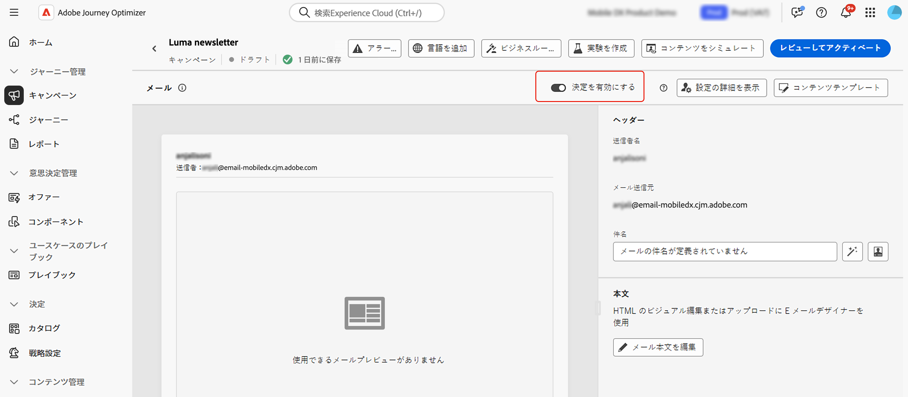
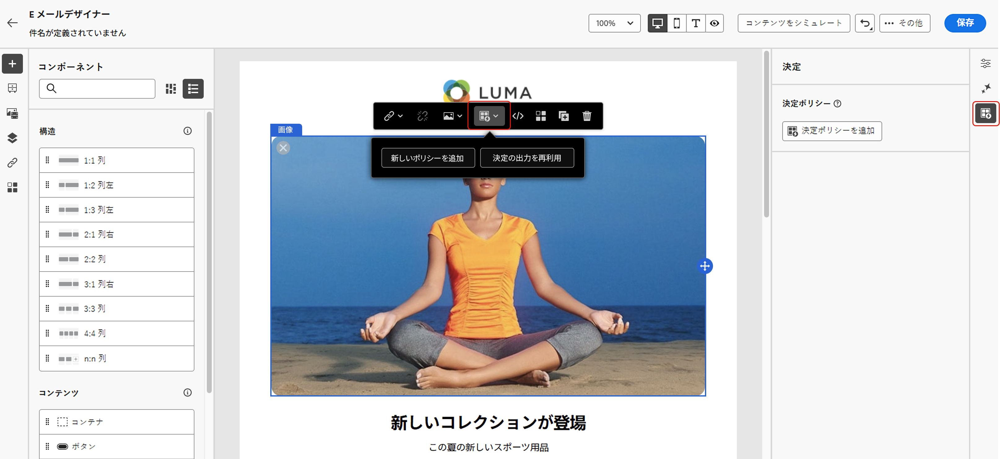
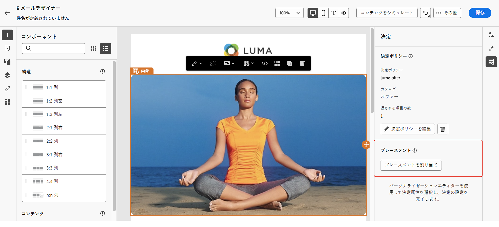
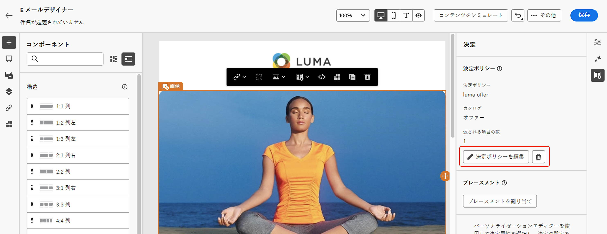
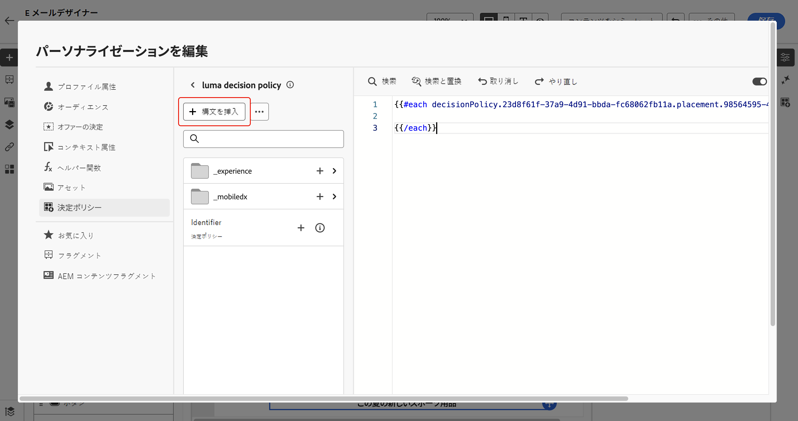
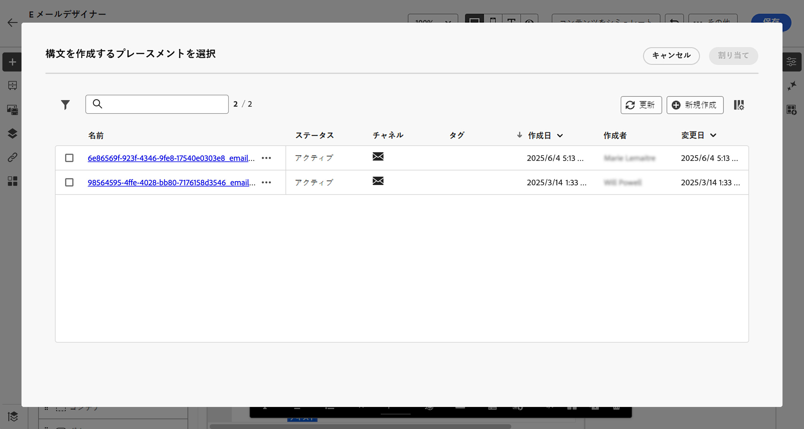

# 決定ポリシーの作成 {#create-decision}

>[!CONTEXTUALHELP]
>id="ajo_code_based_decision"
>title="決定とは"
>abstract="決定ポリシーには、決定エンジンが最適なコンテンツを選択するためのすべての選択ロジックが含まれています。決定ポリシーはキャンペーンに固有です。目標は、各プロファイルに最適なオファーを選択することです。一方、キャンペーンのオーサリングでは、メッセージに含める項目属性など、選択した決定項目の表示方法を指定できます。"
>additional-url="https://experienceleague.adobe.com/ja/docs/journey-optimizer/using/decisioning/offer-decisioning/get-started-decision/starting-offer-decisioning" text="決定について"

>[!CONTEXTUALHELP]
>id="ajo_journey_decision_policy"
>title="決定ポリシーの定義"
>abstract="決定ポリシーを使用すると、決定エンジンから最適な項目を選択し、正しいオーディエンスに配信できます。"
>additional-url="https://experienceleague.adobe.com/ja/docs/journey-optimizer/using/decisioning/offer-decisioning/get-started-decision/starting-offer-decisioning" text="決定について"

>[!CONTEXTUALHELP]
>id="ajo_exd_decision_policy"
>title="決定ポリシー"
>abstract="決定ポリシーを使用すると、決定エンジンから最適な項目を選択し、各オーディエンスに配信できます。"

>[!CONTEXTUALHELP]
>id="ajo_exd_placements"
>title="プレースメント"
>abstract="プレースメントにより、決定エンジンから返された項目がメッセージ内に表示される場所が決まります。レポートでは、様々なプレースメントにわたるパフォーマンスを追跡できます。"

>[!CONTEXTUALHELP]
>id="ajo_exd_decision_attribute"
>title="カタログから決定属性を選択する"
>abstract="決定属性はカタログのスキーマに保存されます。選択したカタログから、ここで使用する属性を選択します。"

決定ポリシーは、各オーディエンスメンバーに配信する最適なコンテンツを動的に返すことを目的に、決定エンジンを活用するオファーのコンテナです。目標は、各プロファイルに最適なオファーを選択することです。一方、キャンペーン／ジャーニーのオーサリングでは、メッセージに含める項目属性など、選択した決定項目の表示方法を指定できます。

## 主な手順 {#key}

メッセージに決定ポリシーを活用する主な手順を次に示します。

1. [メールまたはコードベースのエクスペリエンスで決定ポリシーを作成](#add-decision)

   返される項目の数を選択し、選択戦略、フォールバックオプション、評価順序を設定して、メールまたはコードベースのエクスペリエンスで決定ポリシーを設定します。

1. [コンテンツで決定ポリシーを使用](#use-decision-policy)

   メッセージに表示する決定ポリシーの出力と決定項目の属性を使用してコンテンツをパーソナライズします。

1. [レポートダッシュボードを作成](cja-reporting.md)

   カスタムの Customer Journey Analytics ダッシュボードを作成してパフォーマンスを測定し、決定ポリシーとオファーがどのように配信および関与されているかに関するインサイトを得ます。

## ガードレールと制限

* **限定提供 - メールでの決定ポリシー** - 現時点では、メールでの決定ポリシー作成は限定提供で使用できます。アクセス権を取得するには、アドビ担当者にお問い合わせください。
* **ミラーページ** - 現時点では、決定項目はメールのミラーページではレンダリングされません。
* **トラッキングとリンクのタイプ** - 決定によって生成されたリンクを追跡するには、「決定アセット」としてスキーマで定義します。属性ベースのリンクは追跡できません。
* **メールでの決定ポリシーのネスト** - 既に決定ポリシーが関連付けられている親メールコンポーネント内に複数の決定ポリシーをネストすることはできません。
* **決定ポリシーを含む複製されたジャーニー／キャンペーン** - 決定ポリシーを含むジャーニーまたはキャンペーンを複製すると、複製されたバージョンは元のメールまたはコードベースのエクスペリエンスを参照するので、エラーが発生します。複製後は、常に決定ポリシーを再設定します。
* **同意ポリシー** - 同意ポリシーの更新が有効になるまで最大 48 時間かかります。決定ポリシーが、最近更新された同意ポリシーに関連付けられた属性を参照している場合、変更は直ちに適用されません。

  同様に、同意ポリシーの対象となる新しいプロファイル属性が決定ポリシーに追加された場合、その属性は使用可能になりますが、関連付けられた同意ポリシーは、遅延が経過するまで適用されません。

  同意ポリシーは、Adobe Healthcare Shield または Privacy and Security Shield アドオンを導入している組織でのみ使用できます。

* **AI ランキング** - 現時点では、決定を含むジャーニーのメールチャネルでは、AI ランキングはサポートされていません。

## メールまたはコードベースのエクスペリエンスで決定ポリシーを作成 {#add-decision}

>[!CONTEXTUALHELP]
>id="ajo_code_based_item_number"
>title="返される項目の数の定義"
>abstract="返される決定項目の数を選択します。例えば、「2」を選択した場合、現在の設定に対して最適な 2 つの実施要件を満たすオファーが表示されます。"

>[!CONTEXTUALHELP]
>id="ajo_code_based_fallback"
>title="フォールバックの選択"
>abstract="フォールバック項目は、その決定ポリシーに対して定義された選択戦略がいずれも選定されていない際にユーザーに表示されます。"

>[!CONTEXTUALHELP]
>id="ajo_code_based_strategy"
>title="戦略とは"
>abstract="選択戦略の順序によって、最初に評価される戦略が決まります。少なくとも 1 つの戦略が必要です。組み合わせ戦略の決定項目は、一緒に評価されます。"
>additional-url="https://experienceleague.adobe.com/ja/docs/journey-optimizer/using/decisioning/offer-decisioning/get-started-decision/starting-offer-decisioning" text="戦略の作成"

メールの受信者と web サイトやモバイルアプリで訪問者に最適な動的なオファーおよびエクスペリエンスを提示するには、メールまたはコードベースのキャンペーンまたはジャーニーに決定ポリシーを追加します。これを行うには、以下の手順に従います。

### 決定ポリシーの作成 {#add}

1. ジャーニーまたはキャンペーンで、**[!UICONTROL メール]**&#x200B;または&#x200B;**[!UICONTROL コードベースのエクスペリエンス]**&#x200B;アクションを追加します。

1. メールの場合は、設定画面で&#x200B;**[!UICONTROL 決定を有効にする]**&#x200B;を切り替えます。

   

   >[!IMPORTANT]
   >
   >決定を有効にすると、既存のメールコンテンツが消去されます。メールを既にデザインしている場合は、事前にコンテンツをテンプレートとして保存します。
   >
   >メール内で設定された決定ポリシーは、テンプレートに保存されません。テンプレートを別のメールに適用する場合は、ポリシーを再設定する必要があります。

1. パーソナライゼーションエディターを使用して、メールおよびコードベースのエクスペリエンスでポリシーを作成できます。また、E メールデザイナーの専用メニューからメールに作成することもできます。詳しくは、以下の節を展開してください。

   +++Personalizationエディター

   1. パーソナライゼーションエディターを開き、「**[!UICONTROL 決定ポリシー]**」を選択します。
   1. 「**[!UICONTROL 決定ポリシーを追加]**」ボタンをクリックして、新しいポリシーを作成します。

      

   +++

   +++メールDesigner **[!UICONTROL 決定]** メニュー

   1. コンポーネントを選択し、ツールバーまたはプロパティパネルの「**[!UICONTROL 決定]**」アイコンをクリックして、「**[!UICONTROL 新しいポリシーを追加]**」を選択します。

   1. 「**[!UICONTROL 決定出力を再利用]**」を選択して、このメール内で既に作成されている決定ポリシーを再利用します。

      

   +++

1. 名前を入力し、カタログを選択します（現在はデフォルトの&#x200B;**[!UICONTROL オファー]**&#x200B;カタログに限定されています）。

1. 返される項目の数を選択します。例えば、「2」を選択した場合、現在の設定に対して最適な 2 つの実施要件を満たすオファーが表示されます。

   

   メールの場合、複数の項目は&#x200B;**[!UICONTROL リピートグリッド]**&#x200B;コンテンツコンポーネントでのみ返すことができます。詳しくは、以下の節を展開してください。

   +++ 複数の決定項目をメールで返す

   1. **[!UICONTROL リピートグリッド]**&#x200B;コンポーネントをキャンバスにドラッグし、**[!UICONTROL 設定]**&#x200B;パネルを使用して必要に応じて設定します。

      

   1. キャンバスツールバーの「**[!UICONTROL 決定]**」アイコンをクリックするか、**[!UICONTROL 決定]**&#x200B;パネルを開き、「**[!UICONTROL 決定ポリシーを追加]**」を選択します。

   1. 「**[!UICONTROL 項目数]**」フィールドで返される項目の数を指定し、以下の説明に従って決定ポリシーを設定します。選択できる項目の最大数は、**[!UICONTROL リピートグリッド]**&#x200B;コンポーネントで定義したタイルの数によって制限されます。

   

   +++

1. 「**[!UICONTROL 次へ]**」をクリックします。

### 項目と選択戦略の選択 {#select}

「**[!UICONTROL 戦略シーケンス]**」セクションでは、決定ポリシーと共に提示する決定項目と選択戦略を選択できます。

1. 「**[!UICONTROL 追加]**」をクリックして、ポリシーに含めるオブジェクトのタイプを選択します。

   * **[!UICONTROL 選択戦略]**：1 つまたは複数の選択戦略を追加します。決定戦略では、実施要件制約とランキング方法に関連付けられたコレクションを活用して、表示する項目を決定します。既存の選択戦略を選択するか、「**[!UICONTROL 選択戦略を作成]**」ボタンを使用して新しい選択戦略を作成できます。[詳しくは、選択戦略の作成方法を参照してください](selection-strategies.md)

   * **[!UICONTROL 決定項目]**：1 つの決定項目を追加し、選択戦略を介さずに提示できるようにします。一度に選択できる決定項目は 1 つだけです。項目に設定されている実施要件制約が適用されます。

   

   >[!NOTE]
   >
   >決定ポリシーでは、最大 10 個の選択戦略と決定項目を組み合わせてサポートします。[詳しくは、決定ガードレールと制限を参照してください。](gs-experience-decisioning.md#guardrails)

1. 複数の決定項目や戦略を追加した場合、それらは特定の順序で評価されます。シーケンスに最初に追加されたオブジェクトが最初に評価され、それ以降も追加された順に評価されます。デフォルトのシーケンスを変更するには、オブジェクトやグループをドラッグ＆ドロップして、任意の順序に並べ替えます。詳しくは、以下の節を展開してください。

   +++決定ポリシーの評価順序の管理

   決定項目と選択戦略をポリシーに追加したら、それらの順序を並べ替えて評価順序を決定し、選択戦略を組み合わせて一緒に評価することができます。

   項目と戦略が評価される&#x200B;**順序**&#x200B;は、各オブジェクトまたはオブジェクトのグループの左側にある数字で示されます。シーケンス内の選択戦略（または戦略のグループ）の位置を移動するには、別の位置にドラッグ＆ドロップします。

   

   >[!NOTE]
   >
   >シーケンス内でドラッグ＆ドロップできるのは選択戦略のみです。決定項目の位置を変更するには、その決定項目を削除し、前に評価する他の項目を追加した後で、「**[!UICONTROL 追加]**」ボタンを使用して再度追加する必要があります。

   また、複数の選択戦略をグループに&#x200B;**組み合わせて**、個別にではなく一緒に評価することもできます。これを行うには、選択戦略の下にある「**`+`**」ボタンをクリックして、別の選択戦略と組み合わせます。また、選択戦略を別の選択戦略にドラッグ＆ドロップして、2 つの戦略を 1 つのグループにグループ化することもできます。

   >[!NOTE]
   >
   >決定項目は、他の項目や選択戦略とグループ化できません。

   複数の戦略とそのグループ化によって、戦略の優先度と実施要件を満たすオファーのランキングが決まります。最初の戦略の優先度が最も高く、同じグループ内で結合された戦略も同じ優先度になります。

   例えば、2 つのコレクションが（1 つは戦略 A 、もう 1 つは戦略 B に）あるとします。リクエストは、2 つの決定項目を送り返すことです。戦略 A の 2 つの実施要件を満たすオファーがあり、戦略 B の 3 つの実施要件を満たすオファーがあるとします。

   * 2 つの戦略が&#x200B;**組み合わされていない**&#x200B;か、順序が同じでない場合（1 と 2）、戦略の上位 2 つの実施要件を満たすオファーが最初の行に返されます。最初の戦略に実施要件を満たすオファーが 2 つない場合、決定エンジンは次の戦略に順番に進み、まだ必要なオファーを見つけます。最終的には必要に応じてフォールバックを返します。

     

   * 2 つのコレクションが&#x200B;**同時に評価**&#x200B;される場合、戦略 A から 2 つの実施要件を満たすオファーがあり、戦略 B から 3 つの実施要件を満たすオファーがあります。そのため、5 つのオファーはすべて、それぞれのランキングメソッドによって決定された値に基づいてまとめられます。リクエストされたオファー数は 2 つなので、これら 5 つのオファーのうち上位 2 つの実施要件を満たすオファーが返されます。

     

   **複数の戦略がある場合の例**

   次に、複数の戦略を異なるグループに分割した例を考えてみましょう。3 つの戦略を定義しました。戦略 1 と戦略 2 はグループ 1 で結合され、戦略 3 は独立しています（グループ 2）。各戦略の実施要件を満たすオファーとその優先度（ランキング関数評価で使用）は、次のとおりです。

   * グループ 1：
      * 戦略 1 -（オファー 1、オファー 2、オファー 3）- 優先度 1
      * 戦略 2 -（オファー 3、オファー 4、オファー 5）- 優先度 1

   * グループ 2：
      * 戦略 3 -（オファー 5、オファー 6）- 優先度 0

   優先度が最も高い戦略のオファーが最初に評価され、ランク付けされたオファーリストに追加されます。

   * **反復 1：**

     戦略 1 および戦略 2 のオファーは、一緒に評価されます（オファー 1、オファー 2、オファー 3、オファー 4、オファー 5）。結果が次のようになったとします。

     オファー 1 - 10
オファー 2 - 20
オファー 3 - 30（戦略 1 から）、45（戦略 2 から）。両者の中で最も高いものが考慮されるので、45 が考慮されます。
オファー 4 - 40
オファー 5 - 50

     ランク付けされたオファーは、オファー 5 、オファー 3、オファー 4、オファー 2、オファー 1 となります。

   * **反復 2：**

     戦略 3 のオファーが評価されます（オファー 5、オファー 6）。結果が次のようになったとします。

      * オファー 5 - 上記の結果に既に存在するので、評価されません。
      * オファー 6 - 60

     ランク付けされたオファーは、次のようになります。オファー 5 、オファー 3、オファー 4、オファー 2、オファー 1、オファー 6。

   +++

1. 「**[!UICONTROL 次へ]**」をクリックします。

### フォールバックオファーの追加 {#fallback}

決定項目や選択戦略を選択した後で、上記の項目や選択戦略のいずれも選定されない場合、表示するフォールバックオファーを追加できます。

リストから任意の項目を選択すると、現在のサンドボックスで作成されたすべての決定項目が表示されます。選択戦略が選定されていない場合、選択した項目に適用された日付や実施要件制約に関係なく、フォールバックがユーザーに表示されます<!--nor frequency capping when available - TO CLARIFY-->。


>[!NOTE]
> フォールバックはオプションです。リクエストした項目数を上限に、項目の数を選択できます。実施要件が満たされてなく、フォールバックが設定されていない場合は、何も表示されません。

### 決定ポリシーの保存と管理 {#save}

決定ポリシーの準備が整ったら、保存して「**[!UICONTROL 作成]**」をクリックします。

メールの場合、決定ポリシーに関連付けられたコンポーネントのプレースメントを定義する必要があります。これを行うには、コンポーネントプロパティパネルの「**[!UICONTROL 決定]**」ボタンをクリックして、「**[!UICONTROL プレースメントを割り当て]**」を選択します。[詳しくは、プレースメントの操作方法を参照してください。](../experience-decisioning/placements.md)



決定ポリシーは、パーソナライゼーションエディターの省略記号ボタンや、コンポーネントプロパティパネル内の&#x200B;**[!UICONTROL 決定]**&#x200B;メニューを使用して、いつでも編集または削除できます。

>[!BEGINTABS]

>[!TAB パーソナライゼーションエディターからのポリシーの編集または削除]


>[!TAB コンポーネントのプロパティからのポリシーの編集または削除]



>[!ENDTABS]

## コンテンツで決定ポリシーを使用 {#use-decision-policy}

作成したら、返される決定項目にリンクされた決定ポリシーと属性をコンテンツで使用して、コンテンツをパーソナライズできます。それには、次の手順に従います。

### 決定ポリシーコードの挿入 {#insert-code}

1. パーソナライゼーションエディターを開き、**[!UICONTROL 決定ポリシー]**&#x200B;メニューにアクセスします。

1. メールの場合、「**[!UICONTROL 構文を挿入]**」をクリックして、決定ポリシーに対応するコードを追加します。コードベースのエクスペリエンスの場合は、「**[!UICONTROL ポリシーを挿入]**」をクリックします。

   +++メールへの決定ポリシーコードの挿入

   

   メールの場合、コンポーネントに事前に関連付けられたプレースメントがない場合は、リストから 1 つ選択して「**[!UICONTROL 割り当て]**」をクリックします。

   

   +++

   +++コードベースのエクスペリエンスに決定ポリシーコードを挿入

   

   +++

   >[!NOTE]
   >
   >コード挿入ボタンが表示されない場合は、親コンポーネントに対して決定ポリシーが既に設定されている可能性があります。

1. 決定ポリシーのコードが追加されます。このシーケンスは、決定ポリシーを返して欲しい回数だけ繰り返します。例えば、[決定を作成する](#add-decision)際に、2 つの項目を返すように選択した場合、同じシーケンスが 2 回繰り返されます。

### 決定項目の属性の活用 {#attributes}

必要なすべての決定属性を、そのコード内に追加できるようになりました。利用可能な属性は、**[!UICONTROL オファー]**&#x200B;カタログのスキーマに保存されます。カスタム属性は、**`_<imsOrg`>** フォルダーに保存され、標準属性は **`_experience`** フォルダーに保存されます。[オファーカタログのスキーマの詳細情報](catalogs.md)


>[!NOTE]
>
>決定ポリシー項目のトラッキングの場合、決定ポリシーのコンテンツに対して次のように `trackingToken` 属性を追加する必要があります。
>&#x200B;>`trackingToken: {{item._experience.decisioning.decisionitem.trackingToken}}`

1. 各フォルダーをクリックして展開します。目的の場所にマウスのカーソルを置き、追加する属性の横にある「+」アイコンをクリックします。必要な数の属性をコードに追加できます。

   

1. `#each` ループを角括弧 `[ ]` で囲み、閉じ括弧 `/each` の直前にコンマを追加します。

   

1. また、パーソナライゼーションエディターで使用できる他の属性（プロファイル属性など）を追加することもできます。

   

### フラグメントの活用 {#fragments}

決定ポリシーにフラグメントを含む決定項目が含まれている場合、これらのフラグメントを決定ポリシーコードで活用できます。 [詳しくは、フラグメントを参照してください。](../content-management/fragments.md)

>[!AVAILABILITY]
>
>この機能は現在、一連の組織でのみ使用できます（使用制限あり）。 詳しくは、アドビ担当者にお問い合わせください。

例えば、複数のモバイルデバイスモデルに対して異なるコンテンツを表示するとします。 決定ポリシーで使用する決定項目に、これらのデバイスに対応するフラグメントが追加されていることを確認します。 [方法についてはこちらを参照してください](items.md#attributes)。

{width=70%}

完了したら、次のいずれかの方法を使用できます。

>[!BEGINTABS]

>[!TAB  コードを直接挿入する ]

以下のコードブロックを決定ポリシーコードにコピー&amp;ペーストするだけです。 `variable` をフラグメント ID に、`placement` をフラグメント参照キーに置き換えます。

```

{{fragment id = variable}}
```

>[!TAB  詳細な手順に従う ]

1. **[!UICONTROL ヘルパー関数]** に移動し、**Let** 関数 ` {{variable}}` をコードペインに追加して、フラグメントの変数を宣言できます。

   

1. **Map** > **Get** 関数 `` を使用して、式を作成します。 マップは決定項目で参照されるフラグメントです。文字列は、**[!UICONTROL フラグメント参照キー]** として決定項目で入力したデバイスモデルにすることができます。

   

1. また、このデバイスモデル ID を含むコンテキスト属性を使用することもできます。

   

1. フラグメント用に選択した変数をフラグメント ID として追加します。

   

>[!ENDTABS]

フラグメント ID と参照キーは、決定項目の「**[!UICONTROL フラグメント]**」セクションから選択されます。

>[!WARNING]
>
>フラグメントキーが正しくない場合や、フラグメントコンテンツが有効でない場合、レンダリングが失敗し、Edge呼び出しでエラーが発生します。

## 最終手順 {#final-steps}

コンテンツの準備が整ったら、キャンペーンまたはジャーニーをレビューして公開します。

* [ジャーニーの公開](../building-journeys/publishing-the-journey.md)
* [キャンペーンのレビューとアクティブ化](../campaigns/review-activate-campaign.md)
* [コードベースのエクスペリエンスの公開とアクティブ化](../code-based/publish-code-based.md)

コードベースのエクスペリエンスの場合、開発者が API または SDK 呼び出しを実行して、チャネル設定で定義されたサーフェスのコンテンツを取得すると、変更が web ページまたはアプリに適用されます。

>[!NOTE]
>
>現在、決定を使用して、[コードベースのエクスペリエンス](../code-based/create-code-based.md)キャンペーンまたはジャーニーのユーザーインターフェイスのコンテンツをシミュレートすることはできません。回避策について詳しくは、[この節](../code-based/code-based-decisioning-implementations.md)を参照してください。

決定のパフォーマンスを確認するために、カスタムの [Customer Journey Analytics レポートダッシュボード](cja-reporting.md)を作成できます。
