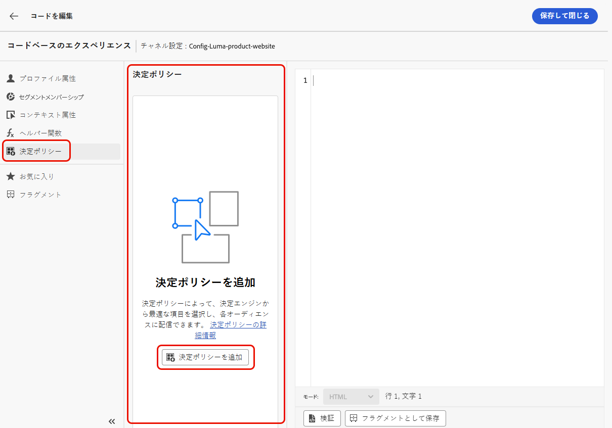

# 決定ポリシーの作成 {#create-decision}

>[!CONTEXTUALHELP]
>id="ajo_code_based_decision"
>title="決定とは"
>abstract="決定ポリシーには、決定エンジンが最適なコンテンツを選択するためのすべての選択ロジックが含まれています。決定ポリシーは、キャンペーンに固有です。決定ポリシーの目標は各プロファイルに最適なオファーを選択することですが、キャンペーンオーサリングでは、メッセージに含める項目の属性など、選択した決定項目の表示方法を指定することができます。"
>additional-url="https://experienceleague.adobe.com/ja/docs/journey-optimizer/using/decisioning/offer-decisioning/get-started-decision/starting-offer-decisioning" text="Experience Decisioning について"

決定ポリシーは、オーディエンスに応じて配信する最適なコンテンツを選択するためにエクスペリエンス判定エンジンを活用するオファーのコンテナです。

決定ポリシーには、決定エンジンが最適なコンテンツを選択するためのすべての選択ロジックが含まれています。決定ポリシーは、キャンペーンに固有です。決定ポリシーの目標は各プロファイルに最適なオファーを選択することですが、キャンペーンオーサリングでは、メッセージに含める項目の属性など、選択した決定項目の表示方法を指定することができます。

>[!NOTE]
>
>[!DNL Journey Optimizer] のユーザーインターフェイスでは、決定ポリシーは決定としてラベル付けされます<!--but they are decision policies. TBC if this note is needed-->。

## コードベースのキャンペーンへの決定ポリシーの追加 {#add-decision}

>[!CONTEXTUALHELP]
>id="ajo_code_based_item_number"
>title="返される項目の数の定義"
>abstract="返される決定項目の数を選択します。例えば、「2」を選択した場合、現在のサーフェスに対して最適な 2 つの実施要件を満たすオファーが表示されます。"

>[!CONTEXTUALHELP]
>id="ajo_code_based_fallback"
>title="フォールバックの選択"
>abstract="フォールバック項目は、その決定ポリシーに対して定義された選択戦略がいずれも選定されていない際にユーザーに表示されます。"

>[!CONTEXTUALHELP]
>id="ajo_code_based_strategy"
>title="戦略とは"
>abstract="選択戦略の順序によって、最初に評価される戦略が決まります。少なくとも 1 つの戦略が必要です。組み合わせ戦略の決定項目は、一緒に評価されます。"
>additional-url="https://experienceleague.adobe.com/ja/docs/journey-optimizer/using/decisioning/offer-decisioning/get-started-decision/starting-offer-decisioning" text="戦略の作成"
>additional-url="https://experienceleague.adobe.com/ja/docs/journey-optimizer/using/decisioning/offer-decisioning/get-started-decision/starting-offer-decisioning" text="評価順序"

Web サイトやモバイルアプリで訪問者に最適な動的なオファーおよびエクスペリエンスを提示するには、コードベースキャンペーンに決定ポリシーを追加します。これを行うには、以下の手順に従います。

1. キャンペーンを作成して選択 **[!UICONTROL コードベースのエクスペリエンス]** アクション。 [詳細情報](../code-based/create-code-based.md)

1. から [コードエディター](../code-based/create-code-based.md#edit-code)を選択し、 **[!UICONTROL 決定ポリシー]** アイコンとクリック **[!UICONTROL 決定ポリシーを追加]**.

   

1. 決定ポリシーの詳細を入力します。名前を追加し、カタログを選択します。

   >[!NOTE]
   >
   >現在はデフォルトの&#x200B;**[!UICONTROL オファー]**&#x200B;カタログのみを使用できます。

   

1. 返される項目の数を選択します。例えば、「2」を選択した場合、現在のサーフェスに対して最適な 2 つの実施要件を満たすオファーが表示されます。「**[!UICONTROL 次へ]**」をクリックします。

1. 「**[!UICONTROL 戦略を追加]**」ボタンを使用して、決定ポリシーの選択戦略を定義します。各戦略は、実施要件制約に関連付けられたオファーコレクションと、表示するオファーを決定するランキング方法で構成されます。 [詳細情報](selection-strategies.md)

   

   >[!NOTE]
   >
   >少なくとも 1 つの戦略が必要です。10 個以上の戦略を追加することはできません。

1. **[!UICONTROL 戦略を追加]**&#x200B;画面から、戦略を作成することもできます。この **[!UICONTROL 選択戦略を作成]** ボタンをクリックすると、にリダイレクトされます **[!UICONTROL Experience decisioning]** > **[!UICONTROL 戦略の設定]** メニュー。 [詳細情報](selection-strategies.md)

   

1. 複数の戦略を追加した場合、それらは特定の順序で評価されます。シーケンスに最初に追加された戦略が最初に評価され、以下同様に評価されます。[詳細情報](#evaluation-order)

   デフォルトのシーケンスを変更するには、戦略をドラッグ＆ドロップして、任意に並べ替えることができます。

   

1. フォールバックを追加します。上記の選択戦略がどれも選定されていない場合、フォールバック項目がユーザーに表示されます。

   

   リストから任意の項目を選択すると、現在のサンドボックスで作成されたすべての決定項目が表示されます。選択戦略が選定されていない場合、選択した項目に適用された日付や実施要件制約に関係なく、フォールバックがユーザーに表示されます<!--nor frequency capping when available - TO CLARIFY-->。

   >[!NOTE]
   >
   >フォールバックはオプションです。フォールバックが選択されておらず、戦略が選定されていない場合、[!DNL Journey Optimizer] には何も表示されません。

1. 選択内容を保存し、「**[!UICONTROL 作成]**」をクリックします。決定ポリシーが作成されたので、コードベースのエクスペリエンスコンテンツ内で決定属性を使用できます。[詳細情報](#use-decision-policy)

   

## 評価順序 {#evaluation-order}

前述のように、戦略はコレクション、ランキング方法、実施要件制約で構成されます。

以下が可能です。

* 戦略を評価する順序を設定します。
* 複数の戦略を組み合わせて、個別ではなく一緒に評価します。

複数の戦略とそのグループ化によって、戦略の優先度と実施要件を満たすオファーのランキングが決まります。最初の戦略の優先度が最も高く、同じグループ内で結合された戦略も同じ優先度になります。

例えば、2 つのコレクションが（1 つは戦略 A 、もう 1 つは戦略 B に）あるとします。リクエストは、2 つの決定項目を送り返すことです。戦略 A の 2 つの実施要件を満たすオファーがあり、戦略 B の 3 つの実施要件を満たすオファーがあるとします。

* 2 つの戦略が&#x200B;**組み合わされていない**&#x200B;か、順序が同じでない場合（1 と 2）、戦略の上位 2 つの実施要件を満たすオファーが最初の行に返されます。最初の戦略に実施要件を満たすオファーが 2 つない場合、決定エンジンは次の戦略に順番に進み、まだ必要なオファーを見つけます。最終的には必要に応じてフォールバックを返します。

  

* 2 つのコレクションが&#x200B;**同時に評価**&#x200B;される場合、戦略 A から 2 つの実施要件を満たすオファーがあり、戦略 B から 3 つの実施要件を満たすオファーがあります。そのため、5 つのオファーはすべて、それぞれのランキングメソッドによって決定された値に基づいてまとめられます。リクエストされたオファー数は 2 つなので、これら 5 つのオファーのうち上位 2 つの実施要件を満たすオファーが返されます。

  

+++ **複数の戦略がある場合の例**

次に、複数の戦略を異なるグループに分割した例を考えてみましょう。

3 つの戦略を定義しました。戦略 1 と戦略 2 はグループ 1 で結合され、戦略 3 は独立しています（グループ 2）。

各戦略の実施要件を満たすオファーとその優先度（ランキング関数評価で使用）は、次のとおりです。

* グループ 1：
   * 戦略 1 -（オファー 1、オファー 2、オファー 3）- 優先度 1
   * 戦略 2 -（オファー 3、オファー 4、オファー 5）- 優先度 1

* グループ 2：
   * 戦略 3 -（オファー 5、オファー 6）- 優先度 0

優先度が最も高い戦略のオファーが最初に評価され、ランク付けされたオファーリストに追加されます。

**反復 1：**

戦略 1 および戦略 2 のオファーは、一緒に評価されます（オファー 1、オファー 2、オファー 3、オファー 4、オファー 5）。結果が次のようになったとします。

オファー 1 - 10
オファー 2 - 20
オファー 3 - 30（戦略 1 から）、45（戦略 2 から）。両者の中で最も高いものが考慮されるので、45 が考慮されます。
オファー 4 - 40
オファー 5 - 50

ランク付けされたオファーは、オファー 5 、オファー 3、オファー 4、オファー 2、オファー 1 となります。

**反復 2：**

戦略 3 のオファーが評価されます（オファー 5、オファー 6）。結果が次のようになったとします。

* オファー 5 - 上記の結果に既に存在するので、評価されません。
* オファー 6 - 60

ランク付けされたオファーは、次のようになります。オファー 5 、オファー 3、オファー 4、オファー 2、オファー 1、オファー 6。

+++

## コードエディターでの決定ポリシーの使用 {#use-decision-policy}

作成した決定ポリシーは、[式エディター](../code-based/create-code-based.md#edit-code)で使用できます。これを行うには、以下の手順に従います。

>[!NOTE]
>
>コードベースのエクスペリエンスでは、[!DNL Journey Optimizer] 式エディターとそのすべてのパーソナライズおよびオーサリング機能を活用します。[詳細情報](../personalization/personalization-build-expressions.md)

1. 「」をクリックします **[!UICONTROL ポリシーを挿入]** ボタン。 決定ポリシーに対応するコードが追加されます。

   

   >[!NOTE]
   >
   >このシーケンスは、決定ポリシーを返して欲しい回数だけ繰り返します。例えば、[決定を作成する](#add-decision)際に、2 つの項目を返すように選択した場合、同じシーケンスが 2 回繰り返されます。

1. これで、必要なすべての決定属性をそのコード内に追加できます。 使用可能な属性は、に保存されます。 **[!UICONTROL オファー]** カタログのスキーマ カスタム属性は、**`_<imsOrg`>** フォルダーに保存され、標準属性は **`_experience`** フォルダーに保存されます。[オファーカタログのスキーマの詳細情報](catalogs.md)

   

   >[!NOTE]
   >
   >決定ポリシー項目のトラッキングの場合 `trackingToken`決定ポリシーコンテンツには、属性を次のように追加する必要があります。
   >`trackingToken: {{item._experience.decisioning.decisionitem.trackingToken}}`

1. 各フォルダーをクリックして展開します。目的の場所にマウスのカーソルを置き、追加する属性の横にある「+」アイコンをクリックします。必要な数の属性をコードに追加できます。

   

1. また、式エディターで使用できる他の属性（プロファイル属性など）を追加することもできます。

   

## Customer Journey Analytics でのレポート {#cja}

Customer Journey Analytics を操作している場合は、エクスペリエンス決定を活用して、コードベースのキャンペーン用のカスタムレポートダッシュボードを作成できます。

主な手順は以下のとおりです。Customer Journey Analytics の操作方法について詳しくは、[Customer Journey Analytics ドキュメント](https://experienceleague.adobe.com/ja/docs/analytics-platform/using/cja-landing){target="_blank"}を参照してください。

1. Customer Journey Analytics で&#x200B;**接続**&#x200B;を作成して設定します。これにより、レポートが必要なデータセットに接続できます。[詳しくは、接続の作成方法を参照してください](https://experienceleague.adobe.com/ja/docs/analytics-platform/using/cja-connections/create-connection){target="_blank"}

1. **データビュー**&#x200B;を作成し、前に作成した接続に関連付けます。「**[!UICONTROL コンポーネント]**」タブで、レポートに表示する関連スキーマフィールドを選択します。エクスペリエンス決定の場合は、**propositioninteract** フィールドと **propositiondisplay** フィールドを必ず含めてください。[詳しくは、データビューの作成および設定方法を参照してください](https://experienceleague.adobe.com/ja/docs/analytics-platform/using/cja-dataviews/create-dataview){target="_blank"}

1. **ワークスペースプロジェクト**&#x200B;でデータコンポーネント、テーブル、ビジュアライゼーションを組み合わせて、コードベースのキャンペーンのレポートを作成して共有します。[詳しくは、ワークスペースプロジェクトの作成方法を参照してください](https://experienceleague.adobe.com/ja/docs/analytics-platform/using/cja-workspace/build-workspace-project/create-projects){target="_blank"}
