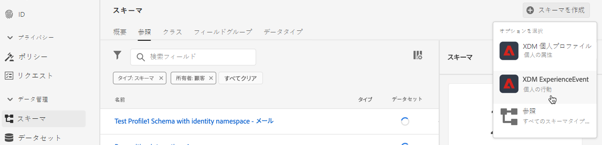
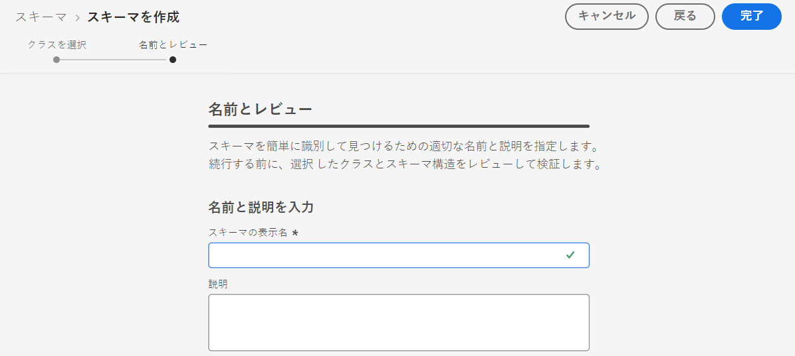
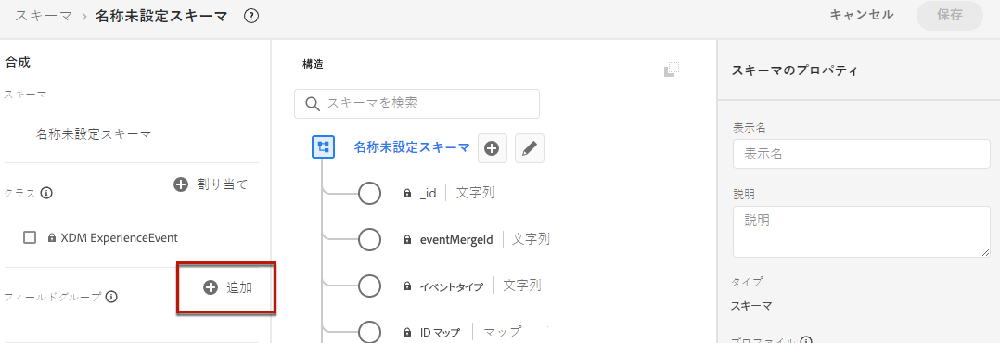
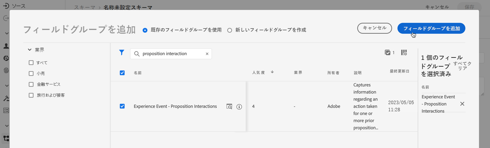
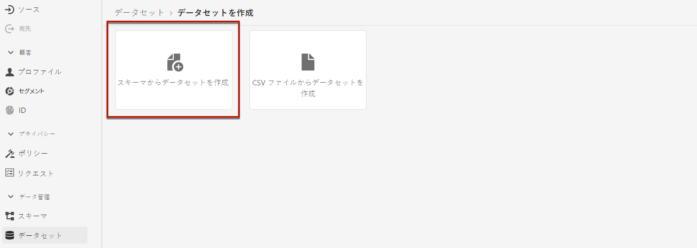
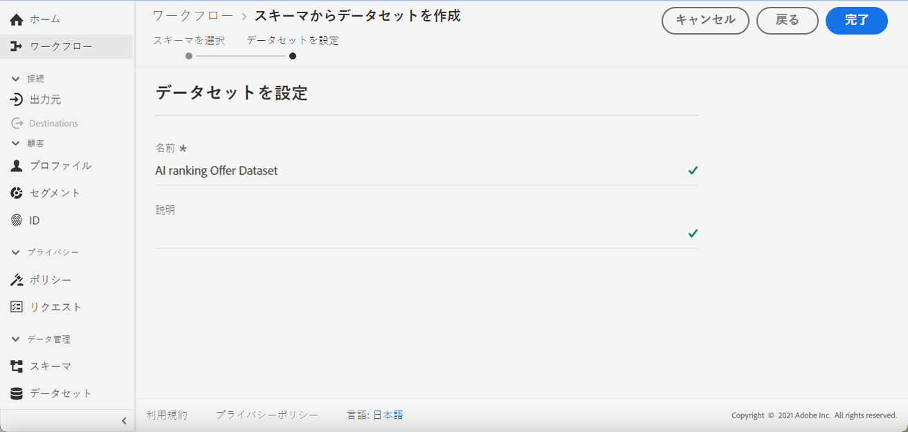

# イベントを収集するためのデータセットの作成 {#create-dataset}

エクスペリエンスイベントを収集するには、まずこれらのイベントが送信されるデータセットを作成する必要があります。

まず、データセットで使用するスキーマを作成します。

1. **[!UICONTROL データ管理]** メニューから、**[!UICONTROL スキーマ]**&#x200B;を選択します。

1. **[!UICONTROL スキーマを作成]**&#x200B;をクリックし、右上の&#x200B;**[!UICONTROL エクスペリエンスイベント]**&#x200B;を選択して、**次へ**&#x200B;をクリックします。

   

   >[!NOTE]
   >
   >XDM スキーマとフィールドグループについて詳しくは、[XDM システム概要ドキュメント ](https://experienceleague.adobe.com/docs/experience-platform/xdm/home.html){target="_blank"}を参照してください。

1. スキーマの名前と説明を入力し、**終了**をクリックします。
   

1. 左側の&#x200B;**[!UICONTROL フィールドグループ]** セクションから、**[!UICONTROL 追加]**&#x200B;を選択します。

   

1. **[!UICONTROL 検索]** フィールドに「提案インタラクション」と入力します。

1. **[!UICONTROL エクスペリエンスイベント – 提案インタラクション]** フィールドグループを選択し、**[!UICONTROL フィールドグループを追加]**&#x200B;をクリックします。

   

   >[!CAUTION]
   >
   >データセットで使用されるスキーマには、**[!UICONTROL エクスペリエンスイベント – 提案インタラクション]** フィールドグループが関連付けられている必要があります。 そうでない場合は、AI モデルで使用することはできません。

1. スキーマを保存します。

>[!NOTE]
>
>スキーマの構築について詳しくは、[ スキーマ構成の基本](https://experienceleague.adobe.com/docs/experience-platform/xdm/schema/composition.html#understanding-schemas){target="_blank"}を参照してください。

これで、このスキーマを使用してデータセットを作成する準備が整いました。 これを行うには、次の手順に従います。

1. **[!UICONTROL データ管理]** メニューから、**[!UICONTROL データセット]**&#x200B;を選択し、**[!UICONTROL 参照]** タブに移動します。

1. 「**[!UICONTROL データセットを作成]**」をクリックし、**[!UICONTROL スキーマからデータセットを作成]**&#x200B;を選択します。

   

1. リストから作成したスキーマを選択し、**[!UICONTROL 次へ]**&#x200B;をクリックします。

1. 「**[!UICONTROL 名前]**」フィールドにデータセットの一意の名前を入力し、**[!UICONTROL 終了]**&#x200B;をクリックします。

   

>[!NOTE]
>
>このデータセットを選択して、[AI モデル ](../ranking/create-ai-models.md)の作成時にイベントデータを収集できるようになりました。
