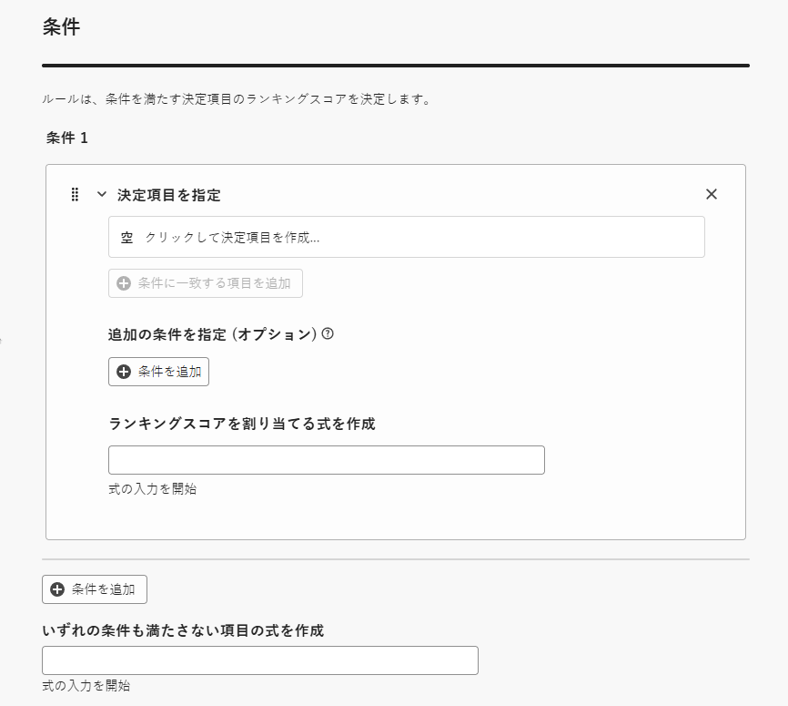
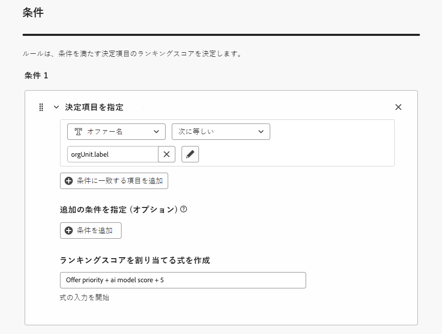

# AI 式ビルダーの使用 {#create-ranking-formulas}

**ランキング式** を使用すると、優先度スコアを考慮するのではなく、最初に提示するオファーを決定するルールを定義できます。

<!--In today's world, relevance demands more than static priorities.The new formula builder in **[!UICONTROL Adobe Journey Optimizer]** empowers marketers to dynamically rank offers by blending AI-driven model scores with business priorities, offer attributes, and contextual signals — no coding required.-->

これらのルールを作成するために、**[!UICONTROL Adobe Journey Optimizer]** の AI 式ビルダーを使用すると、オファーのランク付け方法をより柔軟に制御できます。 静的なオファーの優先度のみに依存するのではなく、ガイド付きインターフェイスを通じて、AI モデルスコア、オファーの優先度、プロファイル属性、オファー属性、コンテキストシグナルを組み合わせるカスタムランキング式を定義できるようになりました。

このアプローチを使用すると、AI 主導の傾向、ビジネス価値、リアルタイムコンテキストの任意の組み合わせに基づいてオファーのランキングを動的に調整できるので、マーケティング目標と顧客ニーズの両方に意思決定を合わせることが容易になります。 AI 式ビルダーは、適用するコントロールの量に応じて、単純な式または高度な式をサポートします。

ランキング式を作成したら、その式を [ 選択戦略 ](selection-strategies.md) に割り当てることができます。 この選択戦略を使用するときに提示できるオファーが複数ある場合、決定エンジンは選択された式を使用して、最初に配信するオファーを計算します。

## ランキング式の作成 {#create-ranking-formula}

>[!CONTEXTUALHELP]
>id="ajo_exd_config_formulas"
>title="ランキング式の作成"
>abstract="数式を使用すると、項目の優先度スコアを考慮するのではなく、最初に提示する決定項目を決定するルールを定義できます。 ランキング式を作成したら、選択戦略に割り当てることができます。"

ランキング式を作成するには、次の手順に従います。

1. **[!UICONTROL 戦略の設定]** メニューにアクセスし、「**[!UICONTROL ランキング式]**」タブを選択します。 以前に作成した式のリストが表示されます。

   

1. **[!UICONTROL 数式を作成]** をクリックします。

1. 式の名前を指定し、必要に応じて説明を追加します。

   {width="80%"}

1. 必要に応じて、「**[!UICONTROL AI モデルを選択]**」をクリックして、ランキング式を作成するための参照として使用するモデルを設定します。 以下で式を定義する際にモデルスコアを参照するたびに、選択した AI モデルが使用されます。

   >[!CAUTION]
   >
   >ランキング式に組み込まれた AI モデルを使用する場合、データは「除外とモデル駆動トラフィックのコンバージョン率 [ レポートに反映されません ](../reports/campaign-global-report-cja-code.md#conversion-rate)。

1. 一致する決定項目のランキングスコアを決定する条件を定義します。 次のいずれかを実行できます

   * [ ユーザーインターフェイス ](#ranking-select-criteria) から **[!UICONTROL 条件]** セクションに入力します。
   * または、[ コードエディター ](#ranking-code-editor) に切り替えます。

<!--## Select an ELS dataset {#els-dataset}

To leverage data from an AEP dataset, you can select it in the **[!UICONTROL ELS settings]** section.

1. Select an ELS dataset from the list.

1. Select a decision attribute. This action is mandatory.

{width="80%"}

-->

## 式ビルダーを使用して条件を定義 {#ranking-select-criteria}

直感的なインターフェイスを使用すると、AI スコア（傾向）、オファー値（優先度）、コンテキストレバー、外部プロファイル傾向を個別にまたは組み合わせて調整し、すべてのインタラクションを最適化することで、意思決定を微調整できます。<!--Whether you're maximizing revenue, promoting strategic offers, or balancing business goals with real-time context, the formula builder gives you total control in defining ranking strategies.-->

インターフェイスから直接条件を定義するには、次の手順に従います。

<!--{width="80%"}-->

1. 「**[!UICONTROL 条件 1]**」セクションで、次の操作を行って、ランキングスコアを適用する決定項目を指定します。
   * [ 決定項目属性 ](items.md#attributes)、
   * 論理演算子を選択します。
   * 一致条件を追加 – 値を入力するか、プロファイル属性または [ コンテキストデータ ](context-data.md) を選択できます。

   {width="70%"}

   <!--You can refer to [offer attributes](items.md#attributes), profile attributes, or [context data](context-data.md).-->

1. オプションで、追加の要素を指定して、条件が true になるように一致条件を絞り込むことができます。

   {width="80%"}

   例えば、条件 1 として *Weather* カスタム属性 *Equals**warm* を定義したとします。 さらに、最初の条件が満たされ、リクエスト時に温度が 75 度を超えた場合など、別の条件を追加できます。その場合、条件 1 は true になります。<!--Add a screenshot with the example-->

1. 上で定義した条件を満たす決定項目にランキングスコアを割り当てる式を作成します。 次のいずれかを参照できます。

   * オプションで「**[!UICONTROL 詳細]**」セクションで選択した AI モデルから得られたスコア [ 上記 ](#create-ranking-formula);
   * 決定項目の優先度（[ 決定項目の作成 ](items.md#attributes) 時に手動で割り当てた値 <!--If a profile qualifies for multiple decision items, a higher priority grants the item precedence over others.-->
   * 外部で派生した傾向スコアなど、プロファイルに存在する可能性のある属性。
   * 任意の形式で割り当てることができる静的な値。
   * 上記のすべての組み合わせ。

   {width="70%"}

   >[!NOTE]
   >
   >フィールドの横にあるアイコンをクリックして、事前定義済みの変数を追加します。

1. 「**[!UICONTROL 条件を追加]**」をクリックして、1 つ以上の条件を必要な回数だけ追加します。 ロジックを次に示します。
   * 特定の決定項目に対して最初の条件が true の場合、次の条件よりも優先されます。
   * true でない場合、決定エンジンは次の条件に進み、それ以降も同様です。

1. 最後のフィールドで、上記の条件を満たさないすべての決定項目に割り当てられる式を作成できます。

   {width="70%"}

1. 「**[!UICONTROL 作成]**」をクリックして、ランキング式を完成させます。 リストから選択して詳細を表示し、編集または削除できるようになりました。 適格な決定項目をランク付けする [ 選択戦略 ](selection-strategies.md) で使用する準備が整いました。

### ランキング式の例

次の例をご覧ください。<!--To be checked by PM-->

{width="80%"}

決定項目の領域（カスタム属性）がプロファイルの地理的ラベル（プロファイル属性）と等しい場合、ここで表されたランキングスコア（決定項目の優先度、AI モデルスコアおよび静的な値の組み合わせ）が、その条件を満たすすべての決定項目に適用されます。

## コードエディターの使用 {#ranking-code-editor}

**PQL構文** でランキング式を表すには、画面右上の専用ボタンを使用してコードエディターに切り替えます。 PQL 構文の使用方法について詳しくは、[関連するドキュメント](https://experienceleague.adobe.com/docs/experience-platform/segmentation/pql/overview.html?lang=ja)を参照してください。

>[!CAUTION]
>
>このアクションは、この式のデフォルトのビルダー表示に戻るのを防ぎます。

その後、プロファイル属性、[ コンテキストデータ ](context-data.md)、[ 決定項目属性 ](items.md#attributes) を活用できます。

例えば、実際の天気が暑い場合、「hot」属性を持つすべてのオファーの優先度を上げたいとします。 これを行うために、**contextData.weather=hot** が判定呼び出しで渡されました。<!--[Learn how to work with context data](context-data.md)-->

{width="80%"}

>[!IMPORTANT]
>
>ランキング式を作成する際に、前月内に発生したエクスペリエンスイベントを式のコンポーネントとして追加するなど、前の期間を振り返ることはサポートされていません。 数式の作成中にルックバック期間を含めようとすると、保存時にエラーが発生します。

### ランキング式のPQLの例 {#ranking-formula-examples}

必要に応じて、様々なランキング式を作成できます。以下に例を示します。

+++プロファイル属性に基づいた特定のオファー属性を持つオファーのブースト

オファーに対応する市区町村にプロファイルが住んでいる場合は、その市区町村内のすべてのオファーの優先度を 2 倍にします。

**ランキング式：**

```
if( offer.characteristics.get("city") = homeAddress.city, offer.rank.priority * 2, offer.rank.priority)
```

+++

+++終了日が今から 24 時間以内のオファーのブースト

**ランキング式：**

```
if( offer.selectionConstraint.endDate occurs <= 24 hours after now, offer.rank.priority * 3, offer.rank.priority)
```

+++

+++オファーされる製品を顧客が購入する傾向に基づいたオファーのブースト

顧客の傾向スコアに基づいて、オファーのスコアを上げることができます。

この例では、インスタンステナントは *_salesvelocity* です。また、プロファイルスキーマには、一連のスコアが配列に格納されます。


これを前提として、例えば、次のようなプロファイルの場合、

```
{"_salesvelocity": {"individualScoring": [
                    {"core": {
                            "category":"insurance",
                            "propensityScore": 96.9
                        }},
                    {"core": {
                            "category":"personalLoan",
                            "propensityScore": 45.3
                        }},
                    {"core": {
                            "category":"creditCard",
                            "propensityScore": 78.1
                        }}
                    ]}
}
```

+++

+++コンテキストデータに基づくオファーのブースト {#context-data}

[!DNL Journey Optimizer] を使用すると、呼び出しで渡されるコンテキストデータに基づいて、特定のオファーの優先度を上げることができます。例えば、`contextData.weather=hot` が渡される場合は、`attribute=hot` を含んだすべてのオファーの優先度を上げる必要があります。**Edge Decisioning** API および **Decisioning** API を使用してコンテキストデータを渡す方法について詳しくは、[この節](context-data.md)を参照してください。

**Decisioning** API を使用する場合は、次の例のように、コンテキストデータをリクエスト本文のプロファイル要素に追加します。

```
"xdm:profiles": [
{
    "xdm:identityMap": {
        "crmid": [
            {
            "xdm:id": "CRMID1"
            }
        ]
    },
    "xdm:contextData": [
        {
            "@type":"_xdm.context.additionalParameters;version=1",
            "xdm:data":{
                "xdm:weather":"hot"
            }
        }
    ]
    
}],
```

+++