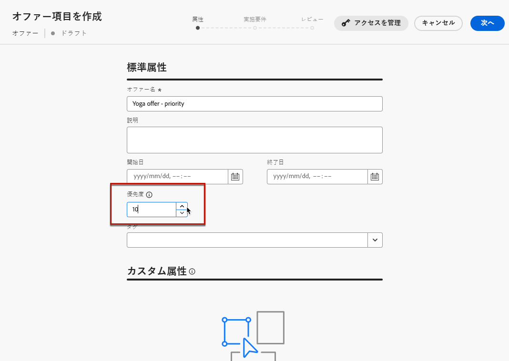
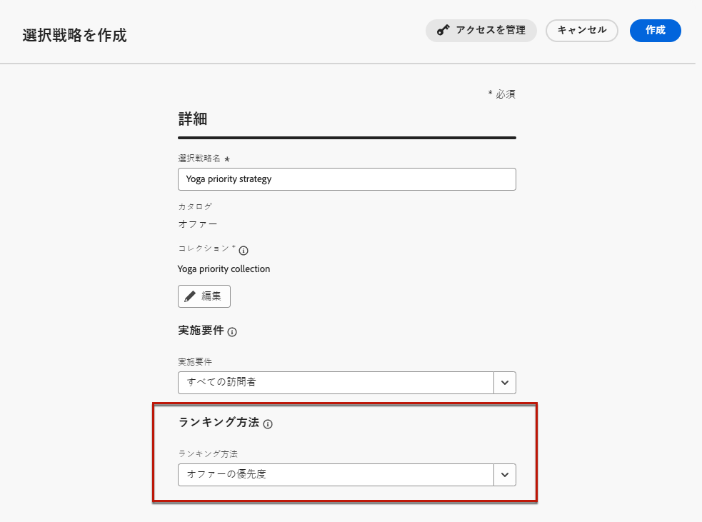
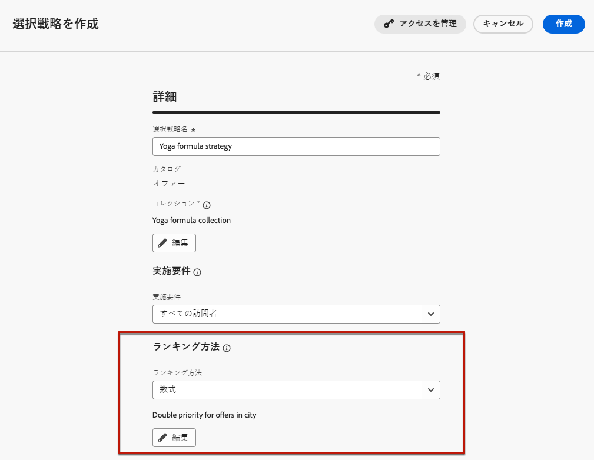
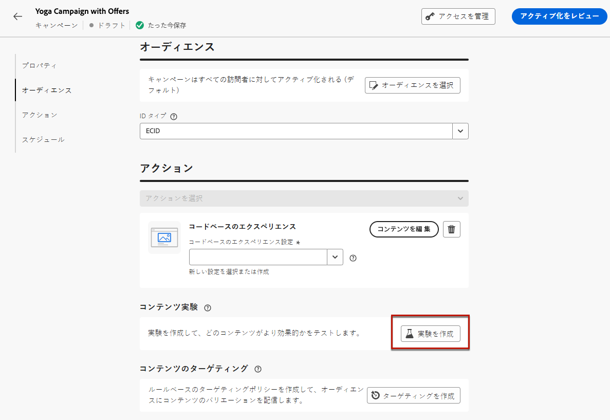
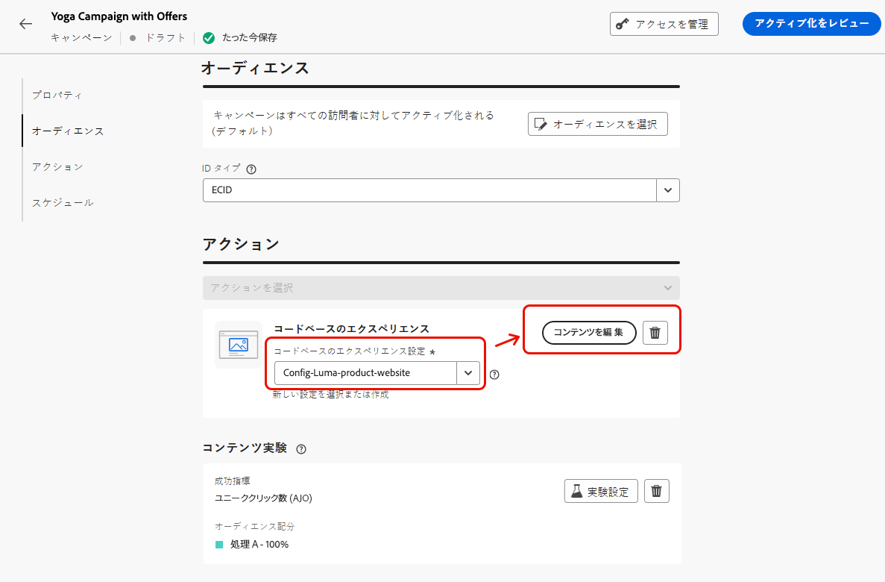
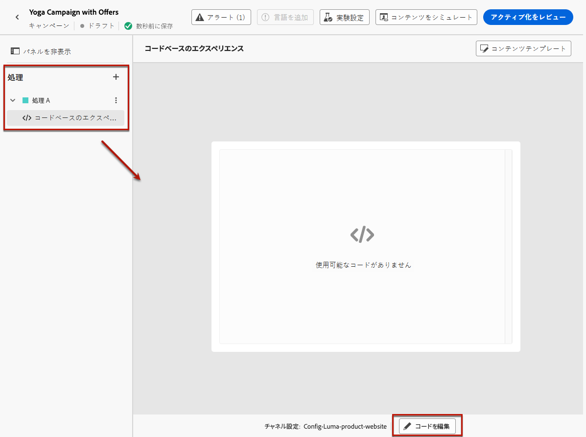
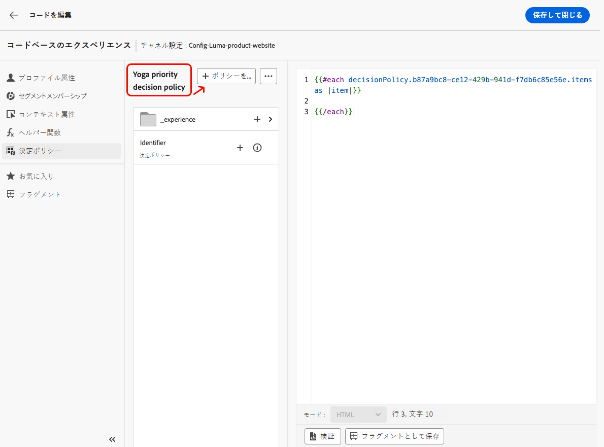
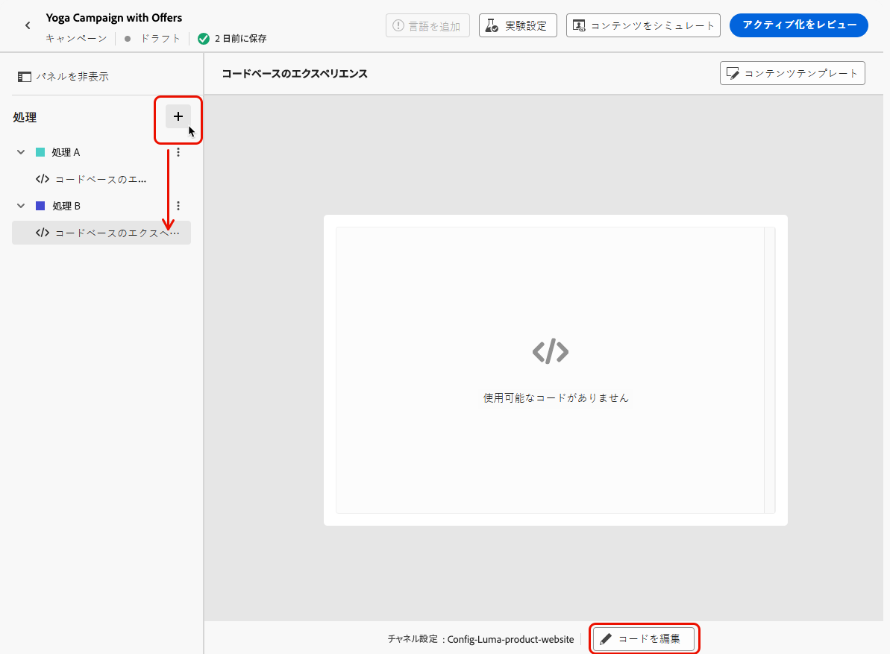
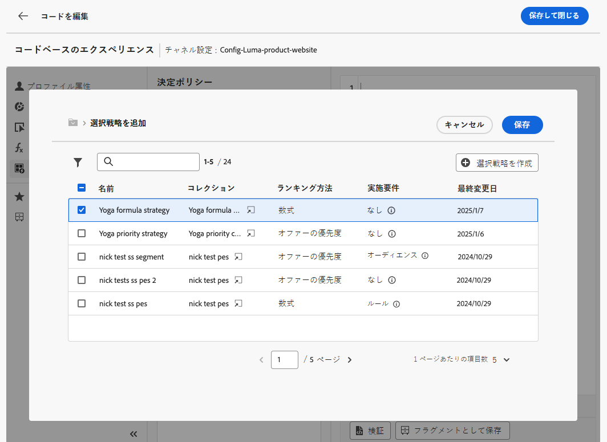

# コンテンツ実験によるコードベースのエクスペリエンスでの決定の使用 {#experience-decisioning-uc}

このユースケースでは、[!DNL Journey Optimizer] コードベースチャネルで決定の使用に必要なすべての手順を示します。

この例では、特定のランキング式が、事前に割り当てられたオファーの優先度よりも優れたパフォーマンスを発揮するかどうか確信が持てません。ターゲットオーディエンスに最適なパフォーマンスを測定するには、[コンテンツ実験](../content-management/content-experiment.md)を使用してキャンペーンを作成し、次の 2 つの配信処理を定義します。

* 最初の処理では、ランキング方法として&#x200B;**優先度**&#x200B;を使用します。
* 2 番目の処理では、ランキング方法として&#x200B;**式**&#x200B;を使用します。

## 選択戦略の作成

まず、ランキング方法として優先度を使用する選択戦略と、ランキング方法として式を使用する選択戦略の 2 つを作成する必要があります。

>[!NOTE]
>
>また、選択戦略を介さずに 1 つの決定項目を作成することもできます。各項目に設定されている優先度が適用されます。

### 優先度を使用した戦略の作成

ランキング方法として優先度を使用する最初の選択戦略を作成するには、次の手順に従います。

1. 決定項目を作成します。[方法について詳しくは、こちらを参照してください](items.md)

1. 他の決定項目と比較した決定項目の&#x200B;**[!UICONTROL 優先度]**&#x200B;を設定します。プロファイルが複数の項目に該当する場合、優先度の高い項目が他の項目よりも優先されます。

   {width="90%"}

   >[!NOTE]
   >
   >優先度は、整数データタイプです。整数データタイプであるすべての属性には、整数値（小数は含まない）を含める必要があります。

1. 決定項目の実施要件を設定します。

   * オーディエンスまたはルールを定義して、項目を特定のプロファイルのみに制限します。[詳細情報](items.md#eligibility)

   * キャッピングルールを設定し、オファーを提示できる最大回数を定義します。[詳細情報](items.md#capping)

1. 必要に応じて、上記の手順を繰り返して、追加の決定項目を作成します。

1. 決定項目が含まれる&#x200B;**コレクション**&#x200B;を作成します。[詳細情報](collections.md)

1. [選択戦略](selection-strategies.md#create-selection-strategy)を作成し、検討するオファーを含む[コレクション](collections.md)を選択します。

1. [ランキング方法を選択](#select-ranking-method)し、プロファイルごとに最適なオファーを選択するのに使用します。この場合、「**[!UICONTROL オファーの優先度]**」を選択します。複数のオファーがこの戦略の実施要件を満たす場合、決定エンジンはオファーの&#x200B;**[!UICONTROL 優先度]**&#x200B;として設定された値を使用します。[詳細情報](selection-strategies.md#offer-priority)

   {width="90%"}

### 式を使用した別の戦略の作成

ランキング方法として式を使用する 2 番目の選択戦略を作成するには、次の手順に従います。

1. 決定項目を作成します。[方法について詳しくは、こちらを参照してください](items.md)

   <!--Do you need to set the same **[!UICONTROL Priority]** as for the first decision item, or it won't be considered at all?-->

1. 決定項目の実施要件を設定します。

   * オーディエンスまたはルールを定義して、項目を特定のプロファイルのみに制限します。[詳細情報](items.md#eligibility)

   * キャッピングルールを設定し、オファーを提示できる最大回数を定義します。[詳細情報](items.md#capping)

1. 必要に応じて、上記の手順を繰り返して、追加の決定項目を作成します。

1. 決定項目が含まれる&#x200B;**コレクション**&#x200B;を作成します。[詳細情報](collections.md)

1. [選択戦略](selection-strategies.md#create-selection-strategy)を作成し、検討するオファーを含む[コレクション](collections.md)を選択します。

1. プロファイルごとに最適なオファーを選択するのに使用する[ランキング方法を選択](#select-ranking-method)します。この場合、「**[!UICONTROL 式]**」を選択し、特定の計算済みスコアを使用して、配信する実施要件を満たすオファーを決定します。[詳細情報](selection-strategies.md#ranking-formula)

   {width="90%"}

## コードベースのエクスペリエンスキャンペーンの作成

<!--To present the best dynamic offer and experience to your visitors on your website or mobile app, add a decision policy to a code-based campaign.

Define two delivery treatments each containing a different decision policy.-->

2 つの選択戦略を設定したら、最も高パフォーマンスの戦略を比較するために、戦略ごとに異なる処理を定義するコードベースのエクスペリエンスキャンペーンを作成します。

1. キャンペーンを作成し、**[!UICONTROL コードベースのエクスペリエンス]**&#x200B;アクションを選択します。[詳細情報](../code-based/create-code-based.md)

1. キャンペーンの概要ページで「**[!UICONTROL 実験を作成]**」をクリックして、コンテンツ実験を設定します。[方法について詳しくは、こちらを参照してください](../content-management/content-experiment.md)

   {width="90%"}

1. キャンペーンの概要ページで、コードベースの設定を選択し、「**[!UICONTROL コンテンツを編集]**」をクリックします。

   {width="90%"}

1. コンテンツ編集ウィンドウから、**処理 A** のパーソナライズを開始するには、「**[!UICONTROL コードを編集]**」をクリックします。

   {width="90%"}

1. [コードエディター](../code-based/create-code-based.md#edit-code)から「**[!UICONTROL 決定ポリシー]**」を選択し、「**[!UICONTROL 決定ポリシーを追加]**」をクリックして、決定の詳細を入力します。[詳細情報](create-decision.md#add)

   {width="90%"}

1. 「**[!UICONTROL 戦略シーケンス]**」セクションで、「**[!UICONTROL 追加]**」ボタンをクリックし、「**[!UICONTROL 選択戦略]**」を選択します。[詳細情報](create-decision.md#select)

   {width="80%"}

   >[!NOTE]
   >
   >また、「**[!UICONTROL 決定項目]**」を選択して、選択戦略を介さずに 1 つの項目を追加することもできます。各項目に設定されている優先度が適用されます。

1. 作成した最初の戦略（ランキング方法として優先度を使用する戦略）を選択します。

   {width="90%"}

1. 変更を保存し、「**[!UICONTROL 作成]**」をクリックします。**[!UICONTROL 決定ポリシー]**&#x200B;の下に新しい決定が追加されます。

1. 「**[!UICONTROL ポリシーを挿入]**」ボタンをクリックします。決定ポリシーに対応するコードが追加されます。次に、必要なすべての属性（プロファイル属性を含む）をコードに追加します。[詳細情報](create-decision.md#use-decision-policy)

   {width="90%"}

1. 変更を保存します。

1. コンテンツ編集ウィンドウに戻り、「+」ボタンを選択して&#x200B;**処理 B** を追加し、これを選択して「**[!UICONTROL コードを編集]**」をクリックします。

   {width="90%"}

1. 上記の手順 5 と 6 を繰り返して別の決定ポリシーを作成し、作成した 2 番目の選択戦略（ランキング方法として式を使用する戦略）を選択します。<!--Do you need to create exactly the same content to compare only the ranking method?-->

   {width="90%"}

1. 必要に応じて決定ポリシーを編集します（上記の手順 8 および 9 を参照）。

1. 変更を保存し、[コードベースのエクスペリエンスキャンペーンを公開](../code-based/publish-code-based.md)します。

実験を実行した後、[実験キャンペーンレポート](../reports/campaign-global-report-cja-experimentation.md)を使用して、キャンペーン処理のパフォーマンスを追跡します。<!-- and [report on decisioning](cja-reporting.md).-->その後、実験の結果を解釈できます。[方法について詳しくは、こちらを参照してください](../content-management/get-started-experiment.md#interpret-results)

結果が最終的な場合：

* 最もパフォーマンスの高いランキングで処理をすべてのお客様にプッシュできます。
* または、最もパフォーマンスの高いランキング方法を複製する選択戦略を使用して、新しいキャンペーンを作成することもできます。