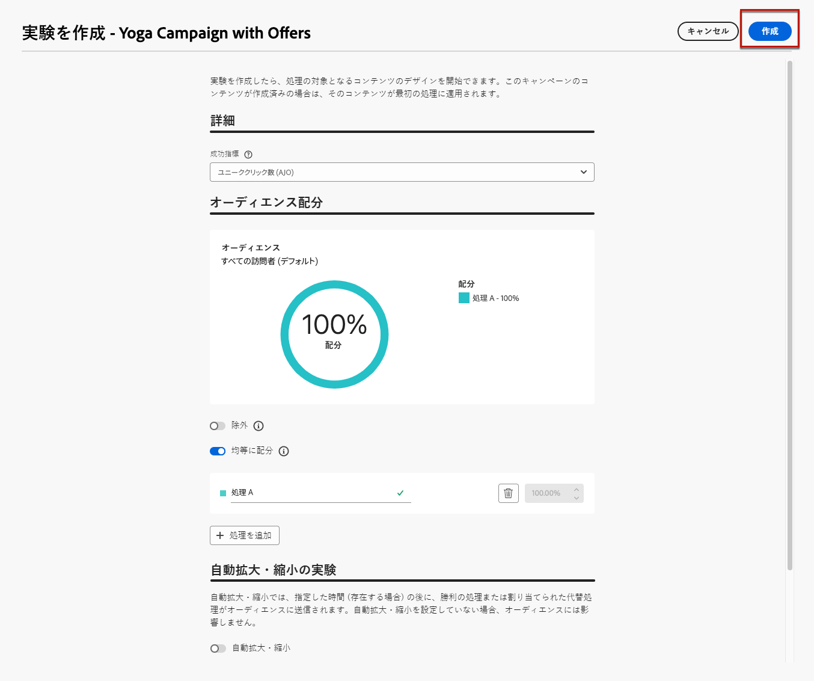

# 決定のユースケース {#experience-decisioning-uc}

このユースケースでは、[!DNL Journey Optimizer] コードベースのチャネルで Decisioning を使用するために必要なすべての手順を示します。

<!--In this use case, you create a campaign where you define two delivery treatments - each containing a different decision policy in order to measure which one performs best for your target audience.-->

このユースケースでは、特定のランキング式が、事前に割り当てられたオファーの優先度よりも優れたパフォーマンスを発揮するかどうかは不明です。

ターゲットオーディエンスに最適なパフォーマンスを測定するには、[ コンテンツ実験 ](../content-management/content-experiment.md) を使用してキャンペーンを作成し、次の 2 つの配信処理を定義します。

<!--Set up the experiment such that:-->

* 最初の処理には、ランキング方法として優先度を持つ 1 つの選択戦略が含まれます。
* 2 番目の処理には、式をランキング方法とする異なる選択戦略が含まれます。

## 選択戦略の作成

まず、ランキング方法として優先度を持つ戦略と、ランキング方法として式を持つ戦略の 2 つの選択戦略を構築する必要があります。

### 最初の選択戦略を作成

最初の選択戦略で、ランキング方法として「優先度」を選択します。 次の手順に従います。

1. 決定項目を作成します。 [方法について詳しくは、こちらを参照してください](items.md)

1. 他の項目と比較して、決定項目の **[!UICONTROL 優先度]** を設定します。 プロファイルが複数の項目の対象となる場合は、優先度を高くすると、その項目の優先度が他の項目よりも優先されます。

   

   >[!NOTE]
   >
   >優先度は、整数データタイプです。整数データタイプであるすべての属性には、整数値（小数は含まない）を含める必要があります。

1. 決定項目の実施要件を設定します。

   * オーディエンスまたはルールを定義して、項目を特定のプロファイルのみに制限します。 [詳細情報](items.md#eligibility)

   * キャッピングルールを設定して、オファーを提示できる最大回数を定義します。 [詳細情報](items.md#capping)

1. 必要に応じて、上記の手順を繰り返して、追加の決定項目を作成します。

1. 決定項目を組み込む **コレクション** を作成します。 [詳細情報](collections.md)

1. [ 選択戦略 ](selection-strategies.md#create-selection-strategy) を作成し、考慮するオファーを含んだ [ コレクション ](collections.md) を選択します。

1. [ ランキング方法を選択 ](#select-ranking-method) して、各プロファイルに最適なオファーを選択します。

   この場合、**[!UICONTROL オファーの優先度]** を選択します。この戦略に対して実施要件を満たすオファーが複数ある場合、決定エンジンはオファーで **[!UICONTROL 優先度]** として設定された値を使用します。 [詳細情報](selection-strategies.md#offer-priority)

   

### 2 つ目の選択戦略を作成する

2 番目の選択戦略で、ランキング方法として式を選択します。 次の手順に従います。

1. 決定項目を作成します。 [方法について詳しくは、こちらを参照してください](items.md)

<!--1. Set the same **[!UICONTROL Priority]** as for the first decision item. TBC?-->

1. 決定項目の実施要件を設定します。

   * オーディエンスまたはルールを定義して、項目を特定のプロファイルのみに制限します。 [詳細情報](items.md#eligibility)

   * キャッピングルールを設定して、オファーを提示できる最大回数を定義します。 [詳細情報](items.md#capping)

1. 必要に応じて、上記の手順を繰り返して、追加の決定項目を作成します。

1. 決定項目を組み込む **コレクション** を作成します。 [詳細情報](collections.md)

1. [ 選択戦略 ](selection-strategies.md#create-selection-strategy) を作成し、考慮するオファーを含んだ [ コレクション ](collections.md) を選択します。

1. [ ランキング方法を選択 ](#select-ranking-method) して、各プロファイルに最適なオファーを選択します。

   この場合、特定の計算済みスコアを使用して実施要件を満たす配信対象オファーを選択するには、「**[!UICONTROL 式]**」を選択します。 [詳細情報](selection-strategies.md#ranking-formula)

   

## コードベースのエクスペリエンスキャンペーンの作成

<!--To present the best dynamic offer and experience to your visitors on your website or mobile app, add a decision policy to a code-based campaign.

Define two delivery treatments each containing a different decision policy.-->

2 つの選択戦略を設定したら、コードベースのエクスペリエンスキャンペーンを作成します。このキャンペーンでは、各戦略に異なる処理を定義して、どの戦略が最もパフォーマンスが高いかを比較します。

1. キャンペーンを作成し、**[!UICONTROL コードベースのエクスペリエンス]**&#x200B;アクションを選択します。[詳細情報](../code-based/create-code-based.md)

1. キャンペーンの概要ページで「**[!UICONTROL 実験を作成]**」をクリックして、コンテンツ実験の設定を開始します。[詳細情報](../content-management/content-experiment.md)

   

1. 「**[!UICONTROL コンテンツを編集]**」をクリックします。

<!--1. Sart personalizing **Treatment A** by clicking **[!UICONTROL Create]**.

    -->

1. コンテンツ編集ウィンドウで、「**[!UICONTROL コードを編集]**」をクリックして **処理 A** のパーソナライズを開始します。

   

1. **[!UICONTROL 決定ポリシー]** を選択し、「**[!UICONTROL 決定ポリシーを追加]**」をクリックして、決定の詳細を入力します。 [詳細情報](create-decision.md)

   

1. 最初に作成した戦略を選択します。 「**[!UICONTROL 戦略を追加]**」をクリックします。

1. 「**[!UICONTROL 作成]**」をクリックします。**[!UICONTROL 決定]**&#x200B;の下に新しい決定が追加されます。

   

1. その他のアクションアイコン（3 つのドット）をクリックして、「**[!UICONTROL 追加]**」を選択します。これで、必要なすべての決定属性をこの内部に追加できます。

   

1. また、パーソナライゼーションエディターで使用できる他の属性（プロファイル属性など）を追加することもできます。

   

1. コンテンツ編集ウィンドウで、「**処理 B**」を選択し、上記の手順を繰り返して別の決定ポリシーを作成し、作成した 2 番目の選択戦略を選択します。

   

1. コンテンツを保存します。
