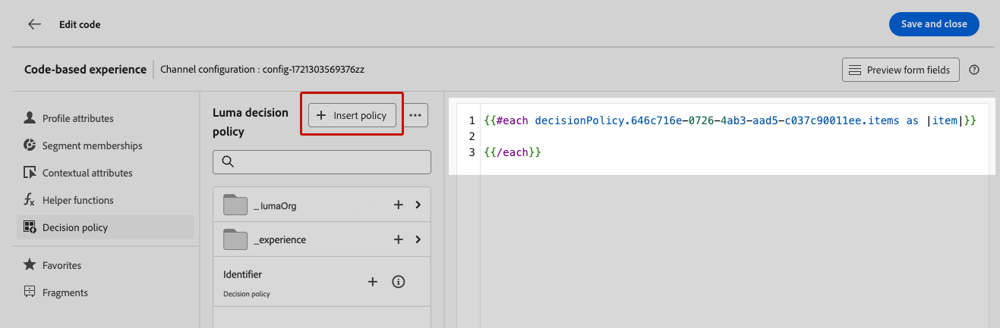

# Experience Decisioning のユースケース {#experience-decisioning-uc}

>[!BEGINSHADEBOX 「このドキュメントガイドの内容は次のとおりです」]

* [Experience Decisioning の基本を学ぶ](gs-experience-decisioning.md)
* 決定項目の管理：[項目カタログの設定](catalogs.md) - [決定項目の作成](items.md) - [項目コレクションの管理](collections.md)
* 項目の選択の設定：[決定ルールの作成](rules.md) - [ランキングメソッドの作成](ranking.md)
* [選択戦略の作成](selection-strategies.md)
* [決定ポリシーを作成](create-decision.md)

>[!ENDSHADEBOX]

このユースケースでは、それぞれ異なる決定ポリシーを含んだ 2 つの配信処理を定義し、ターゲットオーディエンスに対して最もパフォーマンスが良い配信を測定します。

## 項目と戦略の作成

まず、項目を作成してコレクションにグループ化し、ルールとランキング方法を設定する必要があります。これらの要素を使用すると、選択戦略を作成できます。

1. に移動します。 **[!UICONTROL Experience Decisioning]** > **[!UICONTROL カタログ]** およびいくつかのオファー項目を作成します。 オーディエンスまたはルールを使用して制約を設定することで、各項目を特定のプロファイルのみに制限します。[詳細情報](items.md)

   <!--
   1. From the items list, click the **[!UICONTROL Edit schema]** button  and edit the custom attributes if needed. [Learn how to work with catalogs](catalogs.md)-->

1. **コレクション**&#x200B;を作成して、好みに応じて決定項目を分類およびグループ化します。[詳細情報](collections.md)

1. **決定ルール**&#x200B;を作成して、決定項目の表示先を決定します。[詳細情報](rules.md)

1. **ランキング方法**&#x200B;を作成し、それを決定戦略内で適用して、決定項目の選択の優先順位を決定します。[詳細情報](ranking.md)

1. コレクション、決定ルールおよびランキング方法を活用した&#x200B;**選択戦略**&#x200B;を作成して、プロファイルへの表示に適した決定項目を特定します。[詳細情報](selection-strategies.md)

## 決定ポリシーの作成

Web サイトやモバイルアプリで訪問者に最適な動的なオファーおよびエクスペリエンスを提示するには、コードベースキャンペーンに決定ポリシーを追加します。

それぞれ異なる決定ポリシーを含んだ 2 つの配信処理を定義します。

1. キャンペーンを作成し、「**[!UICONTROL コードベースエクスペリエンス（ベータ版）]**」アクションを選択します。[詳細情報](../code-based/create-code-based.md)

   >[!NOTE]
   >
   >現在、コードベースエクスペリエンス機能は、ベータ版として一部のユーザーのみが利用できます。ベータ版プログラムに参加するには、アドビカスタマーケアにお問い合わせください。

1. キャンペーンの概要ページで「**[!UICONTROL 実験を作成]**」をクリックして、コンテンツ実験の設定を開始します。[詳細情報](../campaigns/content-experiment.md)

1. **[!UICONTROL 決定]**&#x200B;アイコンを選択して、「**[!UICONTROL 決定を作成]**」をクリックし、決定の詳細を入力します。[詳細情報](create-decision.md)

   

1. 決定の選択戦略を定義します。「**[!UICONTROL 戦略を追加]**」をクリックします。

1. 「**[!UICONTROL 作成]**」をクリックします。**[!UICONTROL 決定]**&#x200B;の下に新しい決定が追加されます。

   

1. その他のアクションアイコン（3 つのドット）をクリックして、「**[!UICONTROL 追加]**」を選択します。これで、必要なすべての決定属性をこの内部に追加できます。

   

1. また、式エディターで使用できる他の属性（プロファイル属性など）を追加することもできます。

   

1. 処理 B を作成し、上記の手順を繰り返して別の決定を作成します。

1. コンテンツを保存します。

