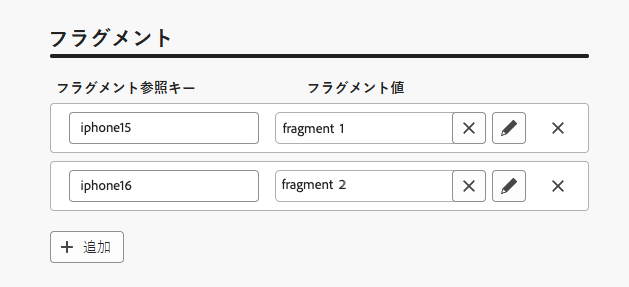
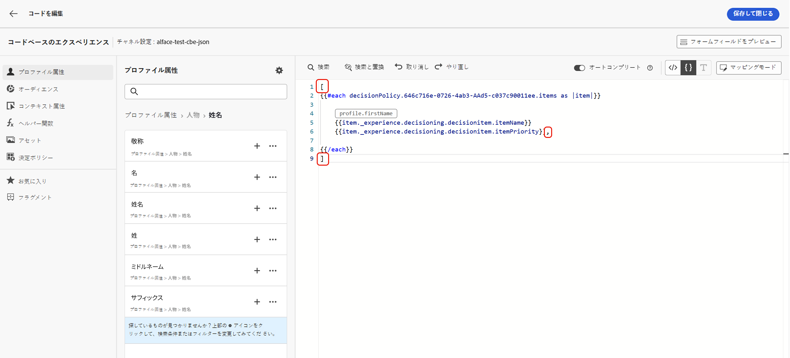
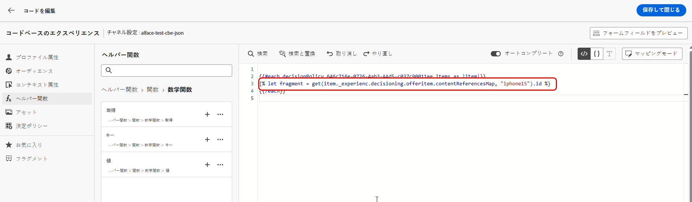
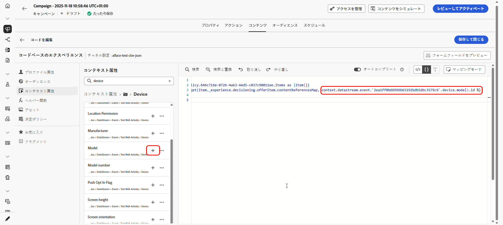
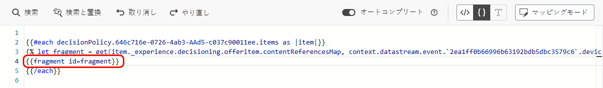

# 意思決定ポリシーでフラグメントを活用する {#fragments}

決定ポリシーにフラグメントを含む決定項目が含まれている場合は、決定ポリシーコードでこれらのフラグメントを活用できます。[詳しくは、フラグメントを参照してください。](../content-management/fragments.md)

>[!AVAILABILITY]
>
>この機能は、**コードベースのエクスペリエンス**&#x200B;および&#x200B;**電子メール** チャネルの限定提供で利用できます。 アクセスをリクエストするには、Adobe担当者にお問い合わせください。

例えば、複数のモバイルデバイスモデルに対して異なるコンテンツを表示するとします。決定ポリシーで使用している決定項目に、これらのデバイスに対応するフラグメントが追加されていることを確認します。[方法についてはこちらを参照してください](items.md#attributes)。

フラグメント参照とプレースメントキーを表示する決定項目の{width=70%}

完了したら、次のいずれかの方法を使用できます。

>[!BEGINTABS]

>[!TAB コードを直接挿入する]

以下のコードブロックを決定ポリシーコードにコピー＆ペーストするだけです。`variable` をフラグメント ID に、`placement` をフラグメント参照キーに置き換えます。

```handlebars

{{fragment id = variable}}
```

>[!TAB 詳細な手順に従う]

1. 「**[!UICONTROL ヘルパー関数]**」に移動し、コードパネルに **Let** 関数 ` {{variable}}` を追加します。ここでフラグメントの変数を宣言できます。

   

1. **Map**／**Get** 関数 `` を使用して、式を作成します。マップは、決定項目で参照されるフラグメントです。 文字列は、決定項目に&#x200B;**[!UICONTROL フラグメント参照キー]**&#x200B;として入力したデバイスモデルにすることができます。

   

1. また、このデバイスモデル ID を含むコンテキスト属性を使用することもできます。

   デバイス モデル IDに

1. フラグメントに選択した変数をフラグメント ID として追加します。

   

>[!ENDTABS]

フラグメント ID と参照キーは、決定項目の「**[!UICONTROL フラグメント]**」セクションから選択されます。

>[!WARNING]
>
>フラグメントキーが正しくない場合や、フラグメントコンテンツが有効でない場合、レンダリングは失敗し、Edge 呼び出しでエラーが発生します。

## フラグメント使用時のガードレール {#fragments-guardrails}

**電子メールでコンテンツと式のフラグメントをシミュレートする**

**電子メール** チャネルの場合、**[!UICONTROL プルーフを送信]**&#x200B;するか、キャンペーンがアクティブ化されたときに、決定項目に関連付けられた式フラグメントが正しく表示されます。 ただし、**[!UICONTROL コンテンツをシミュレート]**&#x200B;しても、決定項目の式フラグメントは表示されません。

**電子メールのビジュアルフラグメントと決定項目**

決定項目に&#x200B;**[!UICONTROL ビジュアルフラグメント]**&#x200B;を割り当てることはできません。このコンテキストでサポートされているのは&#x200B;**式フラグメント**&#x200B;のみです。

**決定項目とコンテキストの属性**

決定項目の属性とコンテキスト属性は、[!DNL Journey Optimizer] フラグメントではデフォルトでサポートされていません。 ただし、以下に説明するように、代わりにグローバル変数を使用できます。

例えば、フラグメントで *sport* 変数を使用するとします。

1. フラグメント内でこの変数を参照します。例：

   ```text
   Elevate your practice with new {{sport}} gear!
   ```

1. 決定ポリシーブロック内で、**Let** 関数を使用して変数を定義します。以下の例では、決定項目属性を使用して *sport* が定義されています。

   ```handlebars
   {#each decisionPolicy.13e1d23d-b8a7-4f71-a32e-d833c51361e0.items as |item|}}
   
   {{fragment id = get(item._experience.decisioning.offeritem.contentReferencesMap, "placement1").id }}
   {{/each}}
   ```

**決定項目フラグメントコンテンツの検証**

* これらのフラグメントの動的な性質により、キャンペーンで使用する場合、決定項目で参照されるフラグメントのキャンペーンコンテンツ作成時にメッセージ検証がスキップされます。

* フラグメントコンテンツの検証は、フラグメントの作成中と公開中にのみ行われます。

* JSON タイプの式フラグメントの場合、フラグメントを保存すると、コンテンツが構文的に検証されます。 検証エラーはアラートとして表示されます。

実行時に、キャンペーンコンテンツ（決定項目のフラグメントコンテンツを含む）が検証されます。検証に失敗した場合、キャンペーンはレンダリングされません。
