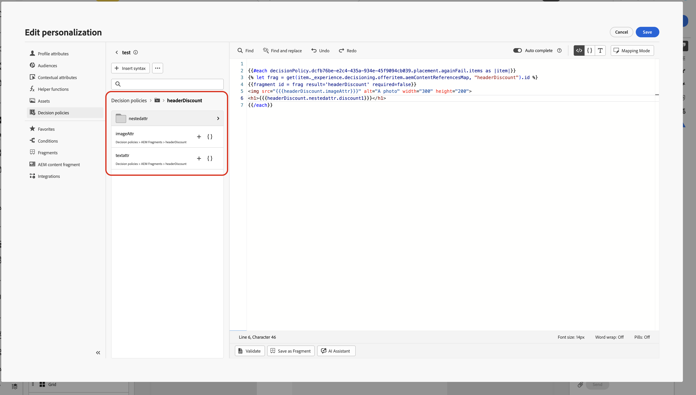

# 決定ポリシーでのフラグメントの活用 {#fragments}

>[!BEGINSHADEBOX]

**このページでは、**&#x200B;意思決定ポリシー内でJourney Optimizer コンテンツフラグメントとAEM コンテンツフラグメントを活用して、チャネルをまたいでコンテンツ決定が提供する内容をパーソナライズおよび最適化できます。

>[!ENDSHADEBOX]

決定項目では、決定ポリシー内でメッセージをオーサリングする際に利用できる2種類のフラグメントコンテンツをサポートしています。

* **Journey Optimizer コンテンツフラグメント** — Journey Optimizerで作成され、決定項目の&#x200B;**[!UICONTROL フラグメント]** セクションに追加された再利用可能なエクスプレッションフラグメント。 [AJO コンテンツフラグメントの詳細](../content-management/fragments.md)
* **AEM コンテンツフラグメント** — Adobe Experience Managerで作成され、決定項目の属性にマッピングされ、キー名でパーソナライゼーションエディターで選択されたコンテンツ。 [AEM コンテンツフラグメントを決定項目に関連付ける方法について説明します](items.md#aem-fragments)

## Journey Optimizer コンテンツフラグメント {#ajo-fragments}

決定ポリシーにAJO コンテンツフラグメントを含む決定項目が含まれている場合、決定ポリシー内のメッセージを、決定が使用可能なすべてのチャネル（コードベースのエクスペリエンス、電子メール、プッシュ、SMS、ジャーニー）でオーサリングする際に、これらのフラグメントを活用できます。

例えば、複数のモバイルデバイスモデルに対して異なるコンテンツを表示するとします。 決定ポリシーで使用している決定項目に、それぞれ異なる電話モデルに関連する指定されたフラグメントを追加します。 [決定項目にフラグメントを追加する方法を説明します](items.md#attributes)。

フラグメント参照とプレースメントキーを表示する決定項目の{width=70%}

完了したら、次のいずれかの方法を使用できます。

>[!BEGINTABS]

>[!TAB コードを直接挿入する]

以下のコードブロックを決定ポリシーコードにコピー＆ペーストするだけです。 `variable` をフラグメント ID に、`placement` をフラグメント参照キーに置き換えます。

```handlebars

{{fragment id = variable required=false}}
```

>[!TAB 詳細な手順に従う]

1. 「**[!UICONTROL ヘルパー関数]**」に移動し、コードパネルに **Let** 関数 ` {{variable}}` を追加します。ここでフラグメントの変数を宣言できます。

   

1. **Map**／**Get** 関数 `` を使用して、式を作成します。 マップは、決定項目で参照されるフラグメントです。 文字列は、決定項目に&#x200B;**[!UICONTROL フラグメント参照キー]**&#x200B;として入力したデバイスモデルにすることができます。

   

1. また、このデバイスモデル ID を含むコンテキスト属性を使用することもできます。

   デバイス モデル IDに

1. フラグメントに選択した変数をフラグメント ID として追加します。

   

>[!ENDTABS]

フラグメント ID と参照キーは、決定項目の「**[!UICONTROL フラグメント]**」セクションから選択されます。

>[!WARNING]
>
>フラグメントキーが正しくないか、フラグメントコンテンツが無効な場合、レンダリングが失敗し、Edge呼び出しでエラーが発生する可能性があります。
>
>フラグメントが一時的に使用できない場合のエラーを回避するには、`required=false` フラグを使用して、代わりにフラグメントをスキップします。 [一時的に利用できないフラグメントについて詳しく見る](#temporary-unavailable-fragments)

### 使用状況とガードレール {#fragments-guardrails}

以下のガードレールは、決定項目で使用される&#x200B;**AJO コンテンツフラグメント**&#x200B;に特に適用されます。

+++メールのコンテンツフラグメントとエクスプレッションフラグメントをシミュレーション

**電子メール** チャネルの場合、**[!UICONTROL プルーフを送信]**&#x200B;するか、キャンペーンがアクティブ化されたときに、決定項目に関連付けられた式フラグメントが正しく表示されます。 ただし、**[!UICONTROL コンテンツをシミュレート]**&#x200B;しても、決定項目の式フラグメントは表示されません。

+++

+++メール内のビジュアルフラグメントと決定項目

決定項目に&#x200B;**[!UICONTROL ビジュアルフラグメント]**&#x200B;を割り当てることはできません。このコンテキストでサポートされているのは&#x200B;**式フラグメント**&#x200B;のみです。

+++

+++決定項目とコンテキスト属性

決定項目の属性とコンテキスト属性は、[!DNL Journey Optimizer] フラグメントではデフォルトでサポートされていません。 ただし、以下に説明するように、代わりにグローバル変数を使用できます。

例えば、フラグメントで *sport* 変数を使用するとします。

1. フラグメント内でこの変数を参照します。例：

   ```text
   Elevate your practice with new {{sport}} gear!
   ```

1. 決定ポリシーブロック内で、**Let** 関数を使用して変数を定義します。 以下の例では、決定項目属性を使用して *sport* が定義されています。

   ```handlebars
   {#each decisionPolicy.13e1d23d-b8a7-4f71-a32e-d833c51361e0.items as |item|}}
   
   {{fragment id = get(item._experience.decisioning.offeritem.contentReferencesMap, "placement1").id }}
   {{/each}}
   ```

+++

+++決定項目フラグメントのコンテンツ検証

* これらのフラグメントの動的な性質により、キャンペーンで使用する場合、決定項目で参照されるフラグメントのキャンペーンコンテンツ作成時にメッセージ検証がスキップされます。

* フラグメントコンテンツの検証は、フラグメントの作成中と公開中にのみ行われます。

* JSON タイプの式フラグメントの場合、フラグメントを保存すると、コンテンツが構文的に検証されます。 検証エラーはアラートとして表示されます。

実行時に、キャンペーンコンテンツ（決定項目のフラグメントコンテンツを含む）が検証されます。 検証に失敗した場合、キャンペーンはレンダリングされません。

+++

+++一時的に利用できないフラグメントはスキップされます{#temporary-unavailable-fragments}

ジャーニーまたはキャンペーンが決定項目に添付されたフラグメントを参照する場合、更新されたフラグメントがEdgeで使用可能になるまでに短い同期遅延が発生する可能性があります。

フラグメントが一時的に使用できない場合のエラーを回避するために、フラグメントでは、ジャーニーまたはキャンペーンが失敗する代わりにスキップされるように、デフォルトで`required` フラグが`false`に設定されるようになりました。

つまり、Edgeでフラグメントが一時的に使用できない場合、フラグメントは無視されます。 フラグメントが使用可能な場合は、通常どおりレンダリングされます。

**例**

決定ポリシーが2つのオファーに適格で、それぞれに「20% オフ」や「30% オフ」などのフラグメントがあり、2番目のフラグメントが一時的に利用できない場合、システムは利用可能なオファー（20% オフ）をレンダリングし、ジャーニーまたはキャンペーンを失敗させることなく、他のフラグメント（30% オフ）をスキップします。 `required=false`これにより、コンテンツの同期中に信頼性が向上します。

+++

>[!NOTE]
>
>`required` フラグを`true`に設定すると、フラグメントを必須としてマークできます。 ただし、フラグメントが一時的に見つからない場合、ジャーニーまたはキャンペーンのレンダリングが失敗する可能性があります。

## AEM コンテンツフラグメント {#aem-fragments-decisioning}

>[!AVAILABILITY]
>
>この機能は、Decisioningをサポートするアウトバウンドチャネルの制限付き可用性で利用できます。 アクセスをリクエストするには、Adobe担当者にお問い合わせください。

意思決定ポリシーでAEM コンテンツフラグメントを活用する前に、次の点を確認してください。

* コンテンツフラグメントをAdobe Experience Managerで作成し、Journey Optimizerで見つけられるように`ajo-enabled:{OrgId}/{SandboxName}`でタグ付けしました。 [&#x200B; タグの作成と割り当て方法について説明します](../integrations/aem-fragments.md#create-tag)
* 一意の参照名を割り当てることで、フラグメントをオファー項目の&#x200B;**[!UICONTROL AEM フラグメント]** セクションに関連付けました。 [AEM コンテンツフラグメントを決定項目に関連付ける方法について説明します](items.md#attributes)

パーソナライゼーションエディターでは、ポリシーによって選択された決定項目に関連付けられたすべてのAEM コンテンツフラグメントが使用できます。 フラグメントキー名ごとに1つのフォルダーが表示されます。

➡️ [Journey Optimizer DecisioningでAEM コンテンツフラグメントを使用する方法をビデオ &#x200B;](#video)で説明します

この例では、決定ポリシーには、参照名でAEM フラグメントが関連付けられている2つの決定項目が含まれています。


1. 「+」ボタンをクリックして、目的のフラグメントを式に追加します。

   1つの参照名に複数のフラグメントが関連付けられている場合、異なるオファー項目に関連付けられている可能性があるため、Decisioningでは、決定ポリシーのランキング基準に基づいて、各顧客に最適なフラグメントを決定します。

1. フラグメントを選択したら、画像URL、テキストフィールド、その他のコンテンツなどの属性を活用し、Decisioningを使用して、適切なコンテンツを的確な顧客にタイミングよく提供できます。

   

1. キャンペーンまたはジャーニーをアクティブ化する前に、次のいずれかのシミュレーション方法を使用して、AEM コンテンツフラグメントのフィールド値がどのようにレンダリングされるかをプレビューします。「**[!UICONTROL コンテンツをシミュレート]**」をクリックしてサンプル入力データまたはAIの自動生成を使用してコンテンツのバリエーションをテストするか、「**[!UICONTROL コンテンツをシミュレート]**」をクリックし、ドロップダウンから「**[!UICONTROL コンテンツをシミュレート]**」を選択して、特定テストプロファイルのテストプロファイルで使用使用します。 [&#x200B; コンテンツのシミュレーションの詳細](../content-management/preview-test.md)

## チュートリアルビデオ {#video}

Adobe Experience ManagerのコンテンツフラグメントとJourney Optimizer Decisioningを使用してコンテンツをパーソナライズし、最適化する方法を説明します。

>[!VIDEO](https://video.tv.adobe.com/v/3492216/?captions=jpn&learn=on&enablevpops)
