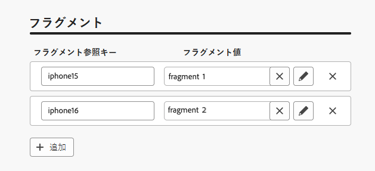
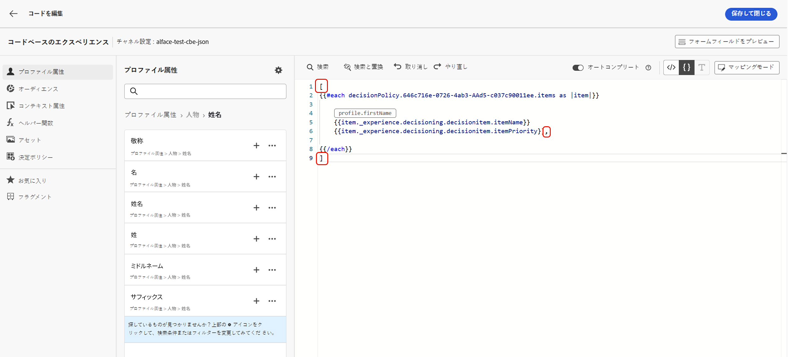
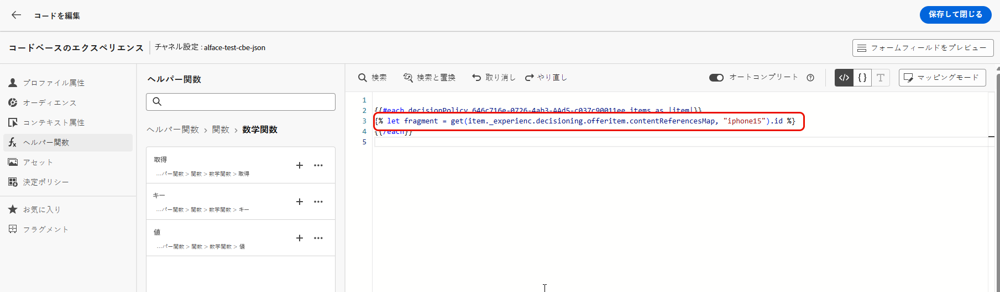
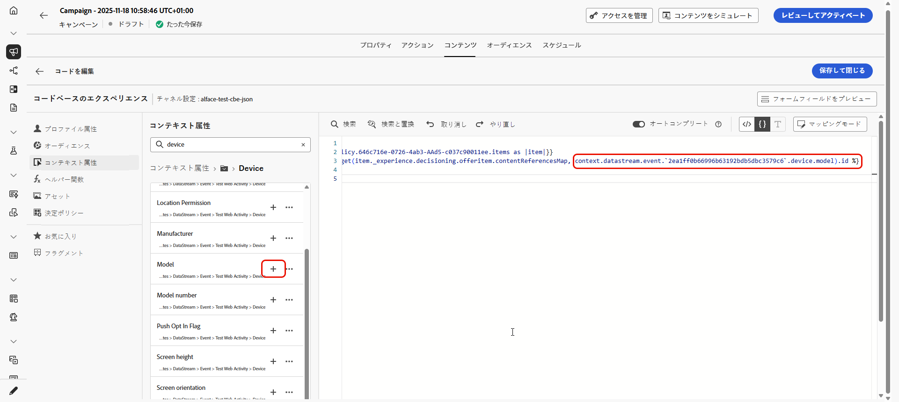
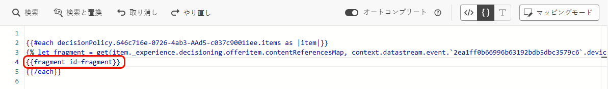

# 意思決定ポリシーでフラグメントを活用する {#fragments}

決定ポリシーにフラグメントを含む決定項目が含まれている場合は、決定ポリシー内でメッセージのオーサリング時にこれらのフラグメントを活用できます。 [詳しくは、フラグメントを参照してください。](../content-management/fragments.md)

>[!AVAILABILITY]
>
>この機能は、**コードベースのエクスペリエンス**&#x200B;および&#x200B;**電子メール** チャネルで利用できます。

例えば、複数のモバイルデバイスモデルに対して異なるコンテンツを表示するとします。 決定ポリシーで使用している決定項目に、それぞれ異なる電話モデルに関連する指定されたフラグメントを追加します。 [方法についてはこちらを参照してください](items.md#attributes)。

フラグメント参照とプレースメントキーを表示する決定項目の{width=70%}

完了したら、次のいずれかの方法を使用できます。

>[!BEGINTABS]

>[!TAB コードを直接挿入する]

以下のコードブロックを決定ポリシーコードにコピー＆ペーストするだけです。 `variable` をフラグメント ID に、`placement` をフラグメント参照キーに置き換えます。

```handlebars

{{fragment id = variable required=false}}
```

>[!TAB 詳細な手順に従う]

1. 「**[!UICONTROL ヘルパー関数]**」に移動し、コードパネルに **Let** 関数 ` {{variable}}` を追加します。ここでフラグメントの変数を宣言できます。

   

1. **Map**／**Get** 関数 `` を使用して、式を作成します。 マップは、決定項目で参照されるフラグメントです。 文字列は、決定項目に&#x200B;**[!UICONTROL フラグメント参照キー]**&#x200B;として入力したデバイスモデルにすることができます。

   

1. また、このデバイスモデル ID を含むコンテキスト属性を使用することもできます。

   デバイス モデル IDに

1. フラグメントに選択した変数をフラグメント ID として追加します。

   

>[!ENDTABS]

フラグメント ID と参照キーは、決定項目の「**[!UICONTROL フラグメント]**」セクションから選択されます。

>[!WARNING]
>
>フラグメントキーが正しくないか、フラグメントコンテンツが無効な場合、レンダリングが失敗し、Edge呼び出しでエラーが発生する可能性があります。
>
>フラグメントが一時的に使用できない場合のエラーを回避するには、`required=false` フラグを使用して、代わりにフラグメントをスキップします。 [詳細情報](#temporary-unavailable-fragments)

## 使用状況とガードレール {#fragments-guardrails}

### メールのコンテンツフラグメントとエクスプレッションフラグメントをシミュレーション {#simulate-content-expression-fragments}

**電子メール** チャネルの場合、**[!UICONTROL プルーフを送信]**&#x200B;するか、キャンペーンがアクティブ化されたときに、決定項目に関連付けられた式フラグメントが正しく表示されます。 ただし、**[!UICONTROL コンテンツをシミュレート]**&#x200B;しても、決定項目の式フラグメントは表示されません。

### メール内のビジュアルフラグメントと決定項目 {#visual-fragments-decision-items}

決定項目に&#x200B;**[!UICONTROL ビジュアルフラグメント]**&#x200B;を割り当てることはできません。このコンテキストでサポートされているのは&#x200B;**式フラグメント**&#x200B;のみです。

### 決定項目とコンテキスト属性 {#decision-item-context-attributes}

決定項目の属性とコンテキスト属性は、[!DNL Journey Optimizer] フラグメントではデフォルトでサポートされていません。 ただし、以下に説明するように、代わりにグローバル変数を使用できます。

例えば、フラグメントで *sport* 変数を使用するとします。

1. フラグメント内でこの変数を参照します。例：

   ```text
   Elevate your practice with new {{sport}} gear!
   ```

1. 決定ポリシーブロック内で、**Let** 関数を使用して変数を定義します。 以下の例では、決定項目属性を使用して *sport* が定義されています。

   ```handlebars
   {#each decisionPolicy.13e1d23d-b8a7-4f71-a32e-d833c51361e0.items as |item|}}
   
   {{fragment id = get(item._experience.decisioning.offeritem.contentReferencesMap, "placement1").id }}
   {{/each}}
   ```

### 決定項目フラグメントのコンテンツ検証 {#fragment-content-validation}

* これらのフラグメントの動的な性質により、キャンペーンで使用する場合、決定項目で参照されるフラグメントのキャンペーンコンテンツ作成時にメッセージ検証がスキップされます。

* フラグメントコンテンツの検証は、フラグメントの作成中と公開中にのみ行われます。

* JSON タイプの式フラグメントの場合、フラグメントを保存すると、コンテンツが構文的に検証されます。 検証エラーはアラートとして表示されます。

実行時に、キャンペーンコンテンツ（決定項目のフラグメントコンテンツを含む）が検証されます。 検証に失敗した場合、キャンペーンはレンダリングされません。

### 一時的に利用できないフラグメントはスキップされます {#temporary-unavailable-fragments}

ジャーニーまたはキャンペーンが決定項目に添付されたフラグメントを参照する場合、更新されたフラグメントがEdgeで使用可能になるまでに短い同期遅延が発生する可能性があります。

フラグメントが一時的に使用できない場合のエラーを回避するために、フラグメントでは、ジャーニーまたはキャンペーンが失敗する代わりにスキップされるように、デフォルトで`required` フラグが`false`に設定されるようになりました。

つまり、Edgeでフラグメントが一時的に使用できない場合、フラグメントは無視されます。 フラグメントが使用可能な場合は、通常どおりレンダリングされます。

**例**

決定ポリシーが2つのオファーに適格で、それぞれに「20% オフ」や「30% オフ」などのフラグメントがあり、2番目のフラグメントが一時的に利用できない場合、システムは利用可能なオファー（20% オフ）をレンダリングし、ジャーニーまたはキャンペーンを失敗させることなく、他のフラグメント（30% オフ）をスキップします。 `required=false`これにより、コンテンツの同期中に信頼性が向上します。

>[!NOTE]
>
>`required` フラグを`true`に設定すると、フラグメントを必須としてマークできます。 ただし、フラグメントが一時的に見つからない場合、ジャーニーまたはキャンペーンのレンダリングが失敗する可能性があります。

