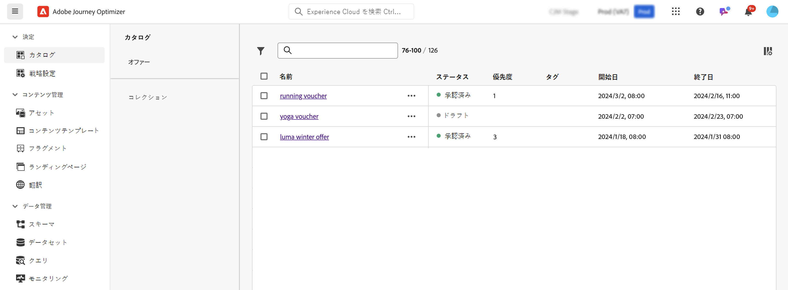
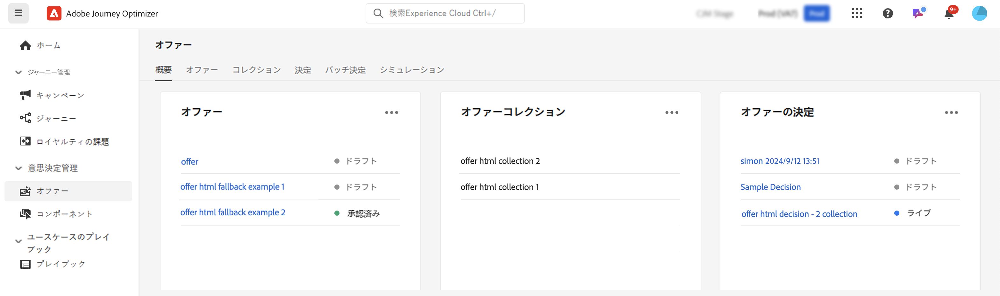

# [!DNL Journey Optimizer] の意思決定機能の概要 {#gs-decision}

[!DNL Journey Optimizer] の意思決定機能を使用すると、あらゆるタッチポイントをまたいで、正確に適切なタイミングで、最高のオファーとパーソナライズされたエクスペリエンスを顧客に提供できます。 これらの機能は、マーケティングオファーの一元的なカタログと、ルールとランキング条件を使用して各個人に最も関連性の高いコンテンツを配信する高度な決定エンジンを通じて、パーソナライゼーションを簡素化します。

主な利点：

* 複数のチャネル間でパーソナライズされたオファーを提供することで、キャンペーンのパフォーマンスを向上できる。
* ワークフローの向上：マーケティングチームは、複数の配信やキャンペーンを作成するのではなく、配信を 1 件だけ作成し、テンプレートの様々な部分のオファーを変えることで、ワークフローを改善することができる。
* キャンペーンや顧客にオファーを表示する回数を制御できる。

現在、[!DNL Journey Optimizer] は、以下に詳しく説明する 2 つのコアソリューションを提供しています。

## 決定 {#decisioning}

既存のJourney Optimizer ワークフローを統合し、追加のコンテンツカタログを管理するための基盤を築くように設計された、次世代の意思決定フレームワーク。 決定オファー：

* スキーマベースの項目カタログ管理：カスタマイズしたメタデータを各オファーに関連付けることで、柔軟性を向上させます。
* 柔軟な収集ルール：様々な条件に基づいて、将来の評価のためにオファーを簡単にグループ化します。
* 決定ポリシーと選択戦略の設定を更新しました：決定コンポーネントの再利用性を実現します。
* 実験機能：他のコンテンツコンポーネントに対して決定ロジックをテストし、パフォーマンスを測定します。

現時点では、コードベースのエクスペリエンスチャネルで Experience Decisioning がサポートされています。

➡️[ 意思決定の概要 ](../experience-decisioning/gs-experience-decisioning.md)

## 意思決定管理 {#decision-management}

Journey Optimizerの確立された機能である Decision Management は、マーケティングオファーの一元化されたライブラリと、リアルタイム顧客プロファイルにルールと制約を適用する意思決定エンジンを使用し、Adobe Experience Platform データを活用して適切なオファーを適切なタイミングで提供します。

意思決定管理は現在、メール、アプリ内メッセージ、プッシュ通知、SMS の 4 つのチャネルをサポートしています。

➡️[ 意思決定管理の概要 ](../offers/get-started/starting-offer-decisioning.md)
