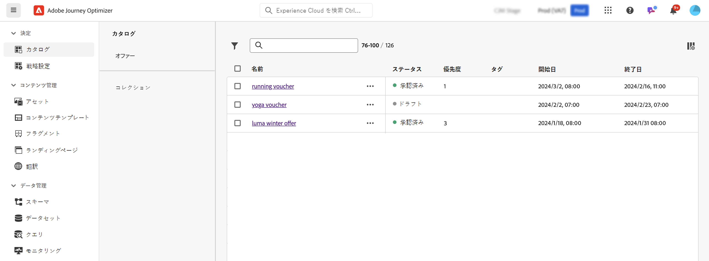
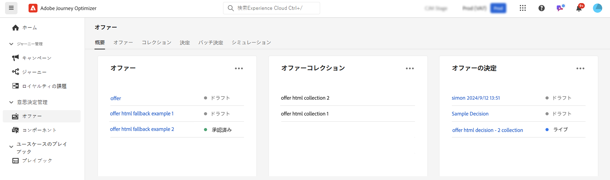

# [!DNL Journey Optimizer] の決定機能の基本を学ぶ {#gs-decision}

[!DNL Journey Optimizer] の決定機能を使用すると、すべてのタッチポイントにわたって最適なタイミングで最高のオファーとパーソナライズされたエクスペリエンスを顧客に提供できます。 これらの機能により、マーケティングオファーの一元化されたカタログと、ルールとランキング条件を使用して各個人に最も関連性の高いコンテンツを提供する高度な決定エンジンを通じて、パーソナライゼーションが簡素化されます。

主な利点：

* 複数のチャネル間でパーソナライズされたオファーを提供することで、キャンペーンのパフォーマンスを向上できる。
* ワークフローの向上：マーケティングチームは、複数の配信やキャンペーンを作成するのではなく、配信を 1 件だけ作成し、テンプレートの様々な部分のオファーを変えることで、ワークフローを改善することができる。
* キャンペーンや顧客にオファーを表示する回数を制御できる。

現在、[!DNL Journey Optimizer] は、以下に詳しく説明する 2 つのコアソリューションを提供しています。

## 決定 {#decisioning}

既存の Journey Optimizer ワークフローを統合し、追加のコンテンツカタログを管理するための基盤を築くように設計された、当社の次世代の決定フレームワークです。 決定オファーは次のとおりです。

* スキーマベースの項目カタログ管理：カスタマイズしたメタデータを各オファーに関連付けることで、柔軟性を向上させます
* 柔軟なコレクションルール：様々な条件に基づいて、今後の評価のオファーを簡単にグループ化します
* 更新された決定ポリシーと選択戦略の設定：決定コンポーネントの再利用を可能にします
* 実験機能：他のコンテンツコンポーネントに対して決定ロジックをテストし、パフォーマンスを測定します

決定は、**コードベースのエクスペリエンス**、**電子メール**、**プッシュ通知**、および&#x200B;**SMS** チャネルのすべての顧客が利用できます。 リリースサイクルと可用性フェーズについて詳しくは、[Journey Optimizer リリースサイクル](../rn/releases.md)を参照してください。

➡️ [決定の基本を学ぶ](../experience-decisioning/gs-experience-decisioning.md)

>[!NOTE]
>
>意思決定管理からDecisioningに移行するには、[移行ドキュメント &#x200B;](../experience-decisioning/migrate-to-decisioning.md)および[移行API ガイド &#x200B;](../experience-decisioning/decisioning-migration-api.md)を参照してください。

## 意思決定管理 {#decision-management}

Journey Optimizer の確立された機能である意思決定管理では、マーケティングオファーの一元化されたライブラリと、リアルタイム顧客プロファイルにルールと制約を適用する決定エンジンを使用し、Adobe Experience Platform データを活用して的確なオファーを適切なタイミングで提供します。

意思決定管理では、メール、アプリ内メッセージ、プッシュ通知、SMS、ダイレクトメールのチャネルをサポートしています。

➡️ [意思決定管理の基本を学ぶ](../offers/get-started/starting-offer-decisioning.md)
