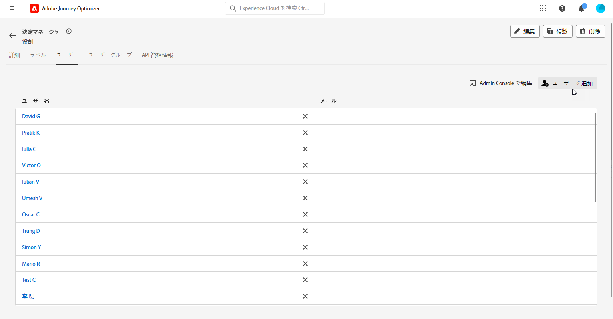
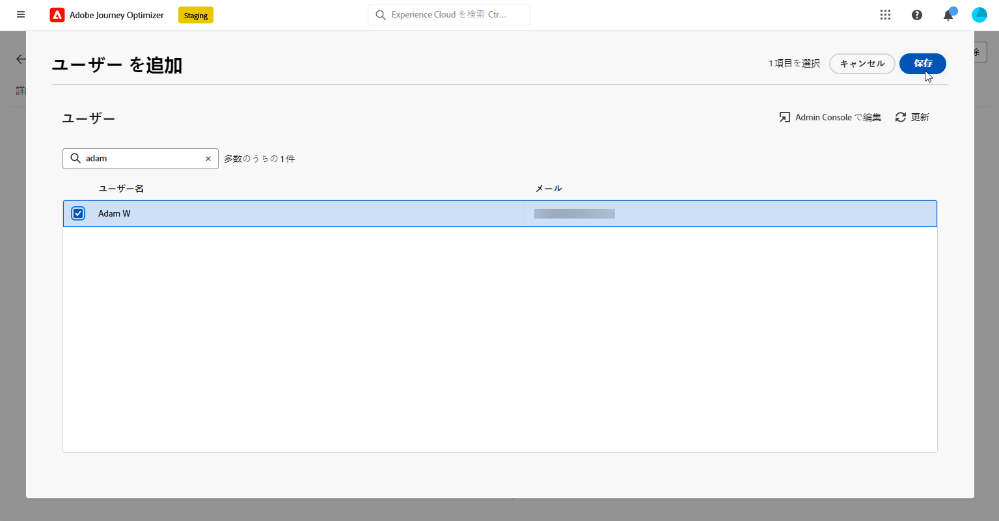

# 決定の基本を学ぶ {#get-started-experience-decisioning}

>[!CONTEXTUALHELP]
>id="ajo_email_enable_experience_decisioning"
>title="決定とは"
>abstract="決定とは、決定エンジンから最適な項目を選択して各個人に配信する、意思決定管理以外の新しいツールです。使用するには、追加の設定が必要です。"

## 決定とは {#about}

決定は、「決定項目」と呼ばれるマーケティングオファーの一元カタログと、高度な決定エンジンを提供することで、パーソナライゼーションを簡素化します。このエンジンは、ルールとランキング条件を活用して、各個人に最も関連性の高い決定項目を選択し、提示します。

これらの決定項目は、Journey Optimizer キャンペーン内でアクセスできる [ 新しいコードベースのエクスペリエンスチャネル ](../code-based/get-started-code-based.md) を通じて、幅広いインバウンドサーフェスにシームレスに統合されます。

>[!IMPORTANT]
>
>決定の決定ポリシーは、コードベースのエクスペリエンスキャンペーンでのみ使用できます。

➡️ コードベースのエクスペリエンスチャネルを使用して決定を作成し、コンテンツ実験で使用する方法を示すエンドツーエンドのユースケースについて詳しくは、[この節](experience-decisioning-uc.md)を参照してください。

## 決定の主な手順 {#steps}

決定を操作する主な手順は次のとおりです。

1. **適切な権限を割り当て**&#x200B;ます。決定は、決定マネージャーなど、決定関連の&#x200B;**[!UICONTROL 役割]**&#x200B;へのアクセス権を持つユーザーのみが使用できます。決定にアクセスできない場合は、権限を拡張する必要があります。

   +++決定マネージャーの役割の割り当て方法

   1. [!DNL Permissions] 製品でユーザーに役割を割り当てるには、「**[!UICONTROL 役割]**」タブに移動し、決定マネージャーを選択します。

      

   1. 「**[!UICONTROL ユーザー]**」タブで「**[!UICONTROL ユーザーを追加]**」をクリックします。

      

   1. ユーザーの名前またはメールアドレスを入力するか、リストからユーザーを選択して、「**[!UICONTROL 保存]**」をクリックします。

      まだユーザーを作成していない場合は、[ユーザーの追加についてのドキュメント](https://experienceleague.adobe.com/ja/docs/experience-platform/access-control/ui/users)を参照してください。

      

   これにより、ユーザーをインスタンスへリダイレクトするメールがユーザーに送られます。

   +++

1. **カスタム属性の設定**：カスタム属性をカタログのスキーマに設定して、項目カタログを特定の要件に合わせます。

   ➡️ [項目カタログの設定方法の詳細情報](catalogs.md)

1. ターゲットオーディエンスに表示する&#x200B;**決定項目を作成**&#x200B;します。

   ➡️ ユーザーインターフェイス（および[ API ドキュメント](api-reference/decisions-items/create.md)）[での決定項目の作成方法の詳細情報](items.md)

1. **コレクションで整理**：コレクションを使用し、属性ベースのルールに基づいて決定項目を分類します。コレクションを選択戦略に組み込んで、考慮する必要がある決定項目のコレクションを特定します。

   ➡️ ユーザーインターフェース（および [API ドキュメント](api-reference/items-collections/create.md)）[での項目コレクションの管理方法の詳細情報](collections.md)

1. **決定ルールの作成**：決定ルールは、どのユーザーに決定項目を表示できるかを決定するために、決定項目や選択戦略で使用されます。

   ➡️ [決定ルールの作成方法の詳細情報](rules.md)

1. **ランキング方法の実装**：ランキング方法を作成し、選択戦略内で適用して、決定項目を選択する際の優先順位を決定します。

   ➡️ [ランキング方法の作成方法の詳細情報](ranking.md)

1. **選択戦略の作成**：コレクション、決定ルール、ランキング方法を活用した選択戦略を作成して、プロファイルに表示するのに適した決定項目を特定します。

   ➡️ [&#128279;](selection-strategies.md)ユーザーインターフェイス（および [APIドキュメント](api-reference/selection-strategies/create.md)）での選択戦略の作成方法の詳細情報

1. **決定ポリシーを作成し、コードベースのキャンペーンに埋め込む**：決定ポリシーは、複数の選択戦略を組み合わせて、対象のオーディエンスに表示する適格な決定項目を決定します。

   ➡️ [決定ポリシーの操作方法の詳細情報](create-decision.md)
➡️ コードベースのエクスペリエンスチャネルを通じてオファーを正常に配信するには、[この節](../code-based/code-based-implementation-samples.md)の実装手順に従ってください。

