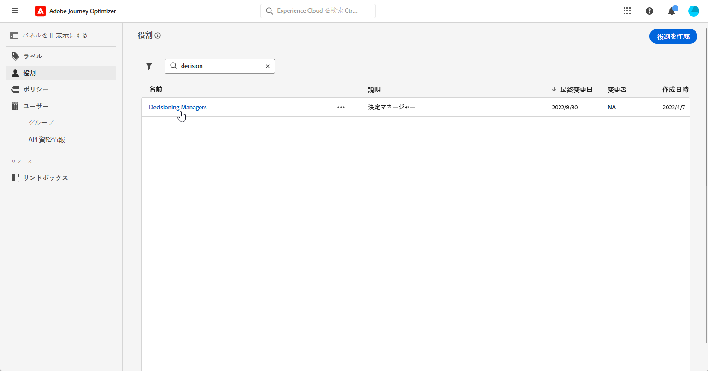

# 意思決定の概要 {#get-started-experience-decisioning}

## 決定とは {#about}

決定は、「決定項目」と呼ばれるマーケティングオファーの一元カタログと、高度な決定エンジンを提供することで、パーソナライゼーションを簡素化します。このエンジンは、ルールとランキング条件を活用して、各個人に最も関連性の高い決定項目を選択し、提示します。

これらの決定項目は、Journey Optimizer キャンペーン内でアクセス可能になった[新しいコードベースのエクスペリエンスチャネル](https://experienceleague.adobe.com/ja/docs/journey-optimizer/using/code-based-experience/get-started-code-based)を通じて、幅広いインバウンドサーフェスにシームレスに統合されます。意思決定決定ポリシーは、コードベースのエクスペリエンスキャンペーンでのみ使用できます。

## ガードレールと制限 {#guardrails}

意思決定の最適な使用を確保するには、次のガードレールと制限に注意してください。

### 一般的なガードレール {#general}

* **オファー項目**：各項目コレクションには、最大 500 個のオファー項目を含めることができます。
* **カスタム属性**：決定項目には、最大 100 個のカスタム属性を含めることができます。
* **ポリシーごとの選択戦略と決定項目**：決定ポリシーでは、最大 10 個の選択戦略と決定項目を組み合わせてサポートします。

### 実施要件ルール {#eligibility}

* **ネスティングレベル**：ネストの深さは 30 レベルに制限されています。 これは、PQL文字列内の `)` の閉じ丸括弧をカウントすることによって測定されます。
* **ルール文字列サイズ**:UTF-8 でエンコードされた文字の場合、ルール文字列のサイズは最大 15 KB になります。 これは、15,000 文字の ASCII 文字（各 1 バイト）、または 3,750～7,500 文字の非 ASCII 文字（各 2～4 バイト）に相当します。

### ランキング式 {#ranking}

* **ネスティングレベル**：ネストの深さは 30 レベルに制限されています。 これは、PQL文字列内の `)` の閉じ丸括弧をカウントすることによって測定されます。
* **数式文字列サイズ**：ルール文字列は、UTF-8 でエンコードされた文字のサイズが最大 8 KB である可能性があります。 これは、8,000 文字の ASCII 文字（各 1 バイト）、または 2,000～4,000 文字の非 ASCII 文字（各 2～4 バイト）に相当します。

## 決定の主な手順 {#steps}

Decisioning を使用する主な手順は次のとおりです。

1. **適切な権限を割り当て**&#x200B;ます。決定は、決定マネージャーなど、決定に関連する **[!UICONTROL 役割]** へのアクセス権を持つユーザーのみが使用できます。 Decisioning にアクセスできない場合は、権限を拡張する必要があります。

   +++決定マネージャーの役割の割り当て方法

   1. [!DNL Permissions] 製品でユーザーに役割を割り当てるには、「**[!UICONTROL 役割]**」タブに移動し、決定マネージャーを選択します。

      

   1. 「**[!UICONTROL ユーザー]**」タブで「**[!UICONTROL ユーザーを追加]**」をクリックします。

      

   1. ユーザーの名前またはメールアドレスを入力するか、リストからユーザーを選択して、「**[!UICONTROL 保存]**」をクリックします。

      まだユーザーを作成していない場合は、[ユーザーの追加についてのドキュメント](https://experienceleague.adobe.com/ja/docs/experience-platform/access-control/ui/users)を参照してください。

      

   これにより、ユーザーをインスタンスへリダイレクトするメールがユーザーに送られます。

+++

1. **カスタム属性の設定**：カスタム属性をカタログのスキーマに設定して、項目カタログを特定の要件に合わせます。

   ➡️ [ 項目カタログの設定方法を学ぶ ](catalogs.md)

1. ターゲットオーディエンスに表示する&#x200B;**決定項目を作成**&#x200B;します。

   ➡️[ 決定項目の作成方法を学ぶ ](items.md) （[API ドキュメント ](api-reference/decisions-items/create.md)）

1. **コレクションで整理**：コレクションを使用し、属性ベースのルールに基づいて決定項目を分類します。コレクションを選択戦略に組み込んで、考慮する必要がある決定項目のコレクションを特定します。

   ➡️[ 項目コレクションの管理方法を学ぶ ](collections.md) （[API ドキュメント ](api-reference/items-collections/create.md)）

1. **決定ルールの作成**：決定ルールは、どのユーザーに決定項目を表示できるかを決定するために、決定項目や選択戦略で使用されます。

   ➡️ [ 決定ルールの作成方法を説明します ](rules.md)

1. **ランキングメソッドの実装**：ランキングメソッドを作成し、決定戦略内で適用して、決定項目を選択する際の優先順位を決定します。

   ➡️ [ ランキングメソッドの作成方法を説明します ](ranking.md)

1. **選択戦略の作成**：コレクション、決定ルール、ランキングメソッドを活用して、プロファイルに表示するのに適した決定項目を特定する選択戦略を作成します。

   ➡️[ 選択戦略の作成方法を説明します ](selection-strategies.md) （[API ドキュメント ](api-reference/selection-strategies/create.md)）

1. **決定ポリシーを作成して、コードベースのキャンペーンに埋め込む**：決定ポリシーは、複数の選択戦略を組み合わせて、対象オーディエンスに表示する適格な決定項目を決定します。

   ➡️ [ 決定ポリシーの操作方法を説明します ](create-decision.md)
