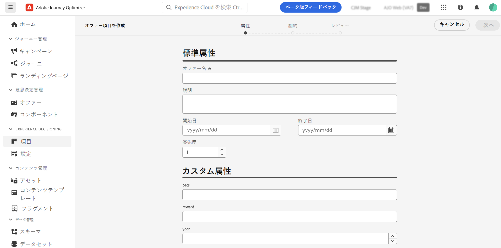
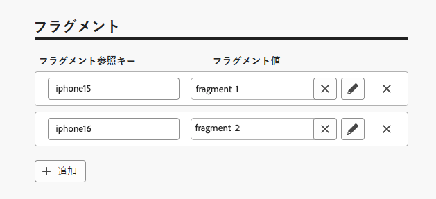
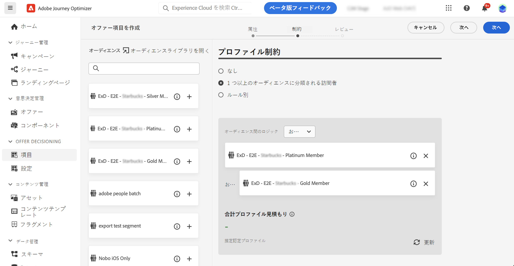
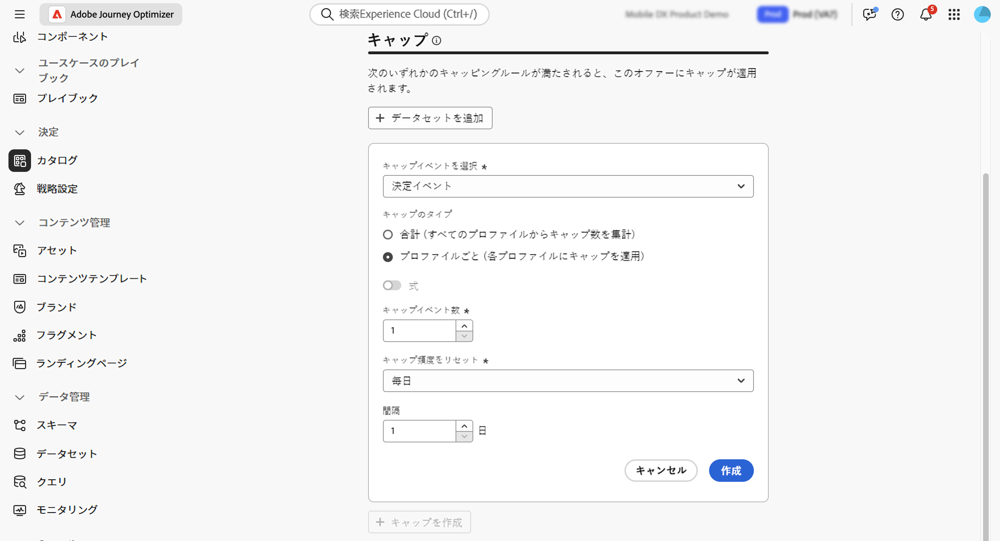
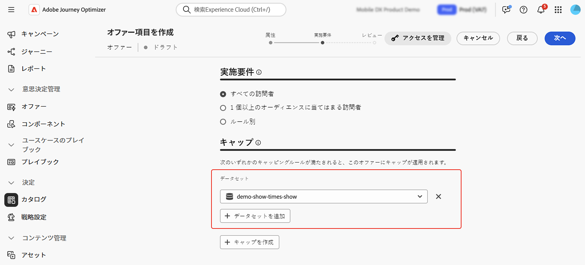
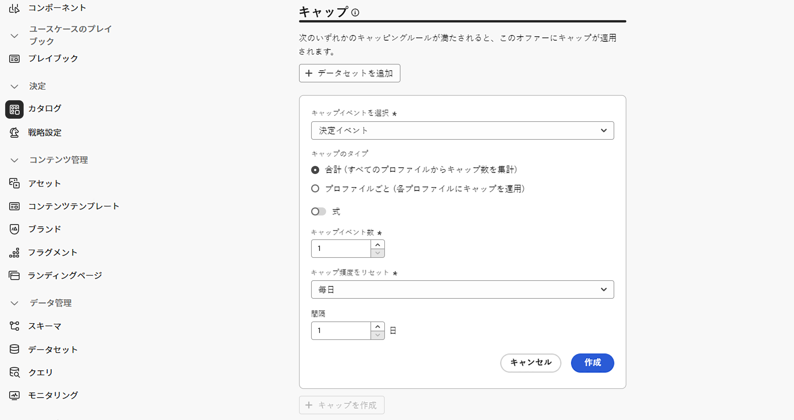
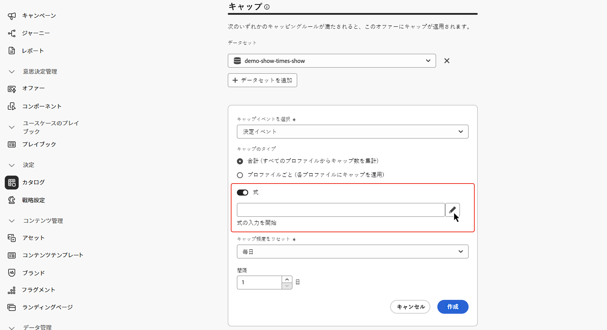
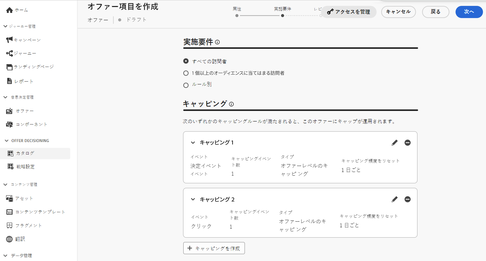
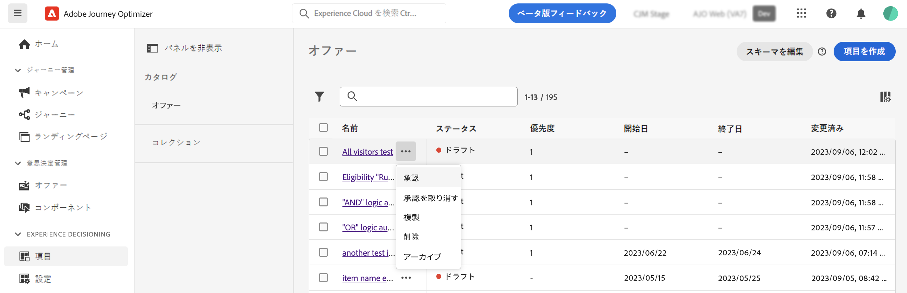
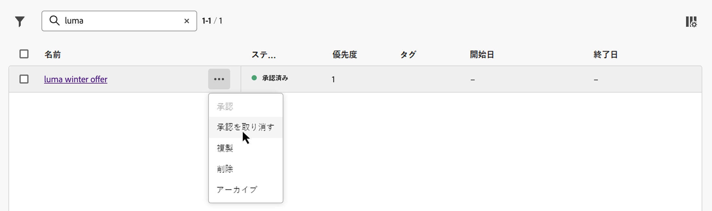

# 最初の決定項目を作成 {#items}

>[!CONTEXTUALHELP]
>id="ajo_exd_items"
>title="決定項目の管理"
>abstract="Journey Optimizer では、決定項目と呼ばれるマーケティングオファーを作成し、一元化されたカタログとコレクションを作成して整理できます。現在、作成されたすべての決定項目は、単一の「オファー」カタログ内に統合されます。この画面から、「**スキーマを編集**」ボタンを使用してカタログのスキーマにアクセスし、決定項目のカスタム属性を作成することもできます。"

Journey Optimizer では、決定項目と呼ばれるマーケティングオファーを作成し、一元化されたカタログとコレクションを作成して整理できます。これらは、ニーズに正確に合わせて設計された標準属性とカスタム属性で構成されています。さらに、決定項目を表示可能なユーザーを定義できる、プロファイル制約が組み込まれています。

決定項目を表示する対象を決定する条件を設定する場合は、決定項目を作成する前に、必ず&#x200B;**決定ルール**&#x200B;を作成してください。[決定ルールを作成する方法を学ぶ](rules.md)。

決定項目を作成するには、**[!UICONTROL 決定]**／**[!UICONTROL カタログ]**&#x200B;に移動し、「**[!UICONTROL 項目を作成]**」をクリックして、以下の節で説明する手順に従います。

## 決定項目の属性を定義 {#attributes}

>[!CONTEXTUALHELP]
>id="ajo_exd_item_priority"
>title="決定項目の優先度を定義"
>abstract="プロファイルが複数の項目に該当する場合、優先度によって、この決定項目を他の項目と比較できるようになります。優先度が高い項目は、他の項目よりも優先されます。"

>[!CONTEXTUALHELP]
>id="ajo_exd_item_custom_attributes"
>title="カスタム属性を定義"
>abstract="カスタム属性は、ニーズに合わせて調整された特定の属性で、決定項目に割り当てることができます。これらは、決定項目のカタログスキーマで作成されます。このセクションは、カタログスキーマに少なくとも 1 つのカスタム属性を追加した場合にのみ表示されます。"

まず、決定項目の標準属性とカスタム属性を定義します。

1. 名前と説明を入力します。
1. 開始日と終了日を指定します。項目は、これらの日付内の決定エンジンによってのみ検討されます。
1. プロファイルが複数の項目に該当する場合は、他の決定項目と比較した決定項目の「**[!UICONTROL 優先度]**」を設定します。優先度が高いと、その項目は他の項目よりも優先されます。

   >[!NOTE]
   >
   >優先度は、整数データタイプです。整数データタイプであるすべての属性には、整数値（小数は含まない）を含める必要があります。

1. 「**タグ**」フィールドを使用すると、Adobe Experience Platform 統合タグを決定項目に割り当てることができます。これにより、簡単に分類し、検索を改善できます。[タグの操作方法について詳しくは、こちらを参照してください](../start/search-filter-categorize.md#tags)

1. フラグメントを使用して、決定項目に複数のコンテンツを追加します。例えば、複数のモバイルデバイスモデルに対して異なるコンテンツを表示する場合などです。[詳しくは、フラグメントを参照してください。](../content-management/fragments.md)

   >[!AVAILABILITY]
   >
   >決定項目内のフラグメントは現在、一連の組織でのみ使用できます（限定提供）。詳しくは、アドビ担当者にお問い合わせください。

   「**[!UICONTROL フラグメント]**」セクションで、使用する公開済みフラグメントを選択し、参照キーを割り当てます。その後、これらのフラグメントを決定ポリシーで活用できます。[詳細情報](create-decision.md#fragments)

   {width=70%}

   公開済みのフラグメントのみを選択し、決定項目に最大 6 個のフラグメントを追加できます。

   >[!WARNING]
   >
   >現在は、[式フラグメント](../personalization/use-expression-fragments.md)のみがサポートされています。
   >
   >ネストされたフラグメント（他のフラグメントを参照するフラグメント）は使用できません。このようなフラグメントを追加すると、決定項目の[承認](#approve)は失敗します。

1. カスタム属性を指定します（オプション）。カスタム属性は、ニーズに合わせて調整された特定の属性で、決定項目に割り当てることができます。これらは、決定項目のカタログスキーマで定義されます。[カタログの操作方法を学ぶ](catalogs.md)

1. 決定項目の属性を定義したら、「**[!UICONTROL 次へ]**」をクリックします。

## 決定項目の実施要件を設定 {#eligibility}

>[!CONTEXTUALHELP]
>id="ajo_exd_item_constraints"
>title="オーディエンスまたは決定ルールを追加"
>abstract="デフォルトでは、すべてのプロファイルが決定項目を受け取る資格を持ちますが、オーディエンスまたはルールを使用すると、項目を特定のプロファイルのみに制限できます。"

<!--
>"additional-url="https://experienceleague.adobe.com/en/docs/journey-optimizer/using/audiences-profiles-identities/audiences/about-audiences" text="Use audiences"
>additional-url="https://experienceleague.adobe.com/en/docs/journey-optimizer/using/decisioning/experience-decisioning/rules" text="Use decision rules"
-->

デフォルトでは、すべてのプロファイルが決定項目を受け取る資格を持ちますが、オーディエンスまたはルールを使用すると、項目を特定のプロファイルに制限できます。どちらのソリューションも様々な用途に対応します。詳しくは、以下の節を展開してください。

+++オーディエンスと決定ルールの使用上の違い

基本的に、オーディエンスの出力はプロファイルのリストです。一方、決定ルールは、決定プロセス中に単一プロファイルに対してオンデマンドで実行される関数です。

* **オーディエンス**：オーディエンスは、プロファイル属性とエクスペリエンスイベントに基づく特定のロジックに一致する Adobe Experience Platform プロファイルのグループです。ただし、オファー管理ではオーディエンスの再計算は行われないので、オファーを提示する際にオーディエンスが最新でない可能性があります。

* **決定ルール**：一方、決定ルールは、Adobe Experience Platform で使用可能なデータに基づいており、オファーを誰に表示できるかを決定します。特定のプレースメントのオファーまたは決定でルールが選択されると、決定が行われるたびにそのルールが実行されるので、各プロファイルが最新かつ最適なオファーを確実に取得できます。

+++

* 決定項目の表示を 1 つまたは複数の Adobe Experience Platform オーディエンスのメンバーに制限するには、「**[!UICONTROL 1 つまたは複数のオーディエンスに分類される訪問者]**」オプションを選択し、左側のパネルから 1 つ以上のオーディエンスを追加し、**[!UICONTROL And]**／**[!UICONTROL Or]** 論理演算子を使用して結合します。[詳しくは、オーディエンスを参照してください](../audience/about-audiences.md)

* 特定の決定ルールを決定項目に関連付けるには、「**[!UICONTROL ルール別]**」を選択し、目的のルールを左側のパネルから中央の領域にドラッグします。[詳しくは、決定ルールを参照してください](rules.md)

オーディエンスまたは決定ルールを選択すると、推定される認定プロファイルに関する情報が表示されます。「**[!UICONTROL 更新]**」をクリックして、データを更新します。

>[!NOTE]
>
>プロファイルの予測は、ルールパラメーターにコンテキストデータなど、プロファイルに含まれていないデータが含まれている場合は使用できません。例えば、現在の気温が 80 ℃以上であることを条件とする実施要件ルールがあります。

## キャップルールの設定 {#capping}

>[!CONTEXTUALHELP]
>id="ajo_exd_item_capping_expression"
>title="式"
>abstract="キャップのしきい値に静的な値を使用する代わりに、独自の式を定義できます。これにより、Adobe Experience Platform データセットの決定属性や外部属性を使用して、しきい値を動的に計算できます。  キャップルール&#x200B;**式**&#x200B;は現在、すべてのユーザーに対する限定提供として使用できます。これらは、**[!UICONTROL 合計]**&#x200B;キャップのタイプでのみサポートされます。"

キャップは、オファーを提示できる最大回数を定義する制約として使用されます。ユーザーが特定のオファーを受け取る回数を制限すると、顧客への過度の勧誘を防ぎ、各タッチポイントをそれに適したオファーで最適化できます。特定の決定項目に対して最大 10 個のキャップを作成できます。

>[!NOTE]
>
>
>キャップカウンターの値の更新には、最大 3 秒かかる場合があります。例えば、web サイト上にオファーを表示する web バナーを表示しようとしているとします。特定のユーザーが 3 秒以内に web サイトの次のページを参照した場合、そのユーザーのカウンター値は増分しません。

キャッピングルールを設定する際に、Adobe Experience Platform データセットに保存されている属性を参照して、しきい値を定義できます。データセットを使用するには、「**[!UICONTROL データセット]**」セクションで選択します。

>[!NOTE]
>
>この機能は現在、すべてのユーザーに対する限定提供として使用できます。使用方法について詳しくは、[決定の Adobe Experience Platform データの使用](../experience-decisioning/aep-data-exd.md)の節を参照してください。

決定項目のキャッピングルールを設定するには、「**[!UICONTROL キャッピングを作成]**」ボタンをクリックし、次の手順に従います。

1. カウンターを増やすために、どの&#x200B;**[!UICONTROL キャップイベント]**&#x200B;を考慮するかを定義します。

   * **[!UICONTROL 決定イベント]**（デフォルト値）：1 つのオファーを提示できる最大回数。
   * **[!UICONTROL インプレッション]**（インバウンドチャネルのみ）：1 人のユーザーに対してオファーを表示できる最大回数。
   * **[!UICONTROL クリック数]**：ユーザーが決定項目をクリックできる最大回数。
   * **[!UICONTROL カスタムイベント]**：項目の送信回数のキャップに使用するカスタムイベントを定義できます。例えば、引き換え回数が 10,000 になるまで、または特定のプロファイルが 1 回引き換えられるまでに引き換え回数をキャップできます。これを行うには、[Adobe Experience Platform XDM](https://experienceleague.adobe.com/docs/experience-platform/xdm/home.html?lang=ja){target="_blank"} スキーマを使用してカスタムイベントルールを作成します。

   >[!NOTE]
   >
   >決定イベントを除くすべてのキャッピングイベントでは、意思決定管理のフィードバックが自動的に収集されず、結果としてキャップカウンターの値が正しくカウントされない可能性があります。キャップカウンターで各キャッピングイベントを確実に追跡して反映させるには、エクスペリエンスイベントの収集に使用するスキーマに、そのイベントの正しいフィールドグループが含まれていることを確認します。データ収集について詳しくは、Journey Optimizer の意思決定管理に関するドキュメントを参照してください。
   >* [意思決定管理データ収集](data-collection/data-collection.md)
   >* [データ収集の設定](data-collection/schema-requirement.md)

1. キャップタイプの選択

   * **[!UICONTROL 合計]**&#x200B;を選択し、組み合わせたターゲットオーディエンス（つまり、すべてのユーザー）に対して項目を提案できる回数を定義します。例えば、「超特価品 TV」を販売する電子機器小売業者の場合、オファーが返される回数は、すべてのプロファイルで 200 回に制限されます。

   * **[!UICONTROL プロファイルごと]**&#x200B;を選択して、オファーを同じユーザーに提案できる回数を定義します。例えば、「プラチナクレジットカード」のオファーを持つ銀行の場合、このオファーを 1 つのプロファイルにつき 5 回以上表示したくないとします。実際、ユーザーがオファーを 5 回見て、それに対して何らかのアクションを起こしていない場合、その次に最適なオファーに対して行動する可能性が高いと考えられます。

1. キャップしきい値を定義します。これを行うには、静的な値を入力するか、式を使用してしきい値を計算します。詳しくは、以下の節を展開してください。

   +++静的しきい値

   「**[!UICONTROL キャップカウント制限]**」フィールドで、選択したキャッピングタイプに応じて、すべてのユーザーまたはプロファイルごとにオファーを提示できる回数を指定します。数値は 0 より大きい整数にする必要があります。

   例えば、チェックアウト数が考慮されるなどのカスタムキャップイベントを定義したとします。 「**[!UICONTROL キャップカウントキャップ]**」フィールドに「10」と入力すると、10 件を超えたチェックアウトは送信されなくなります。

   +++

   +++式のしきい値

   キャップのしきい値に静的な値を使用する代わりに、独自の式を定義できます。これにより、Adobe Experience Platform データセットの決定属性や外部属性を使用して、しきい値を動的に計算できます。

   例えば、マーケターは露出を調整するのに乗数を追加することを決定する場合があります。例えば、使用可能な在庫数を 2 倍にすることで、使用可能なユニット数の 2 倍の顧客にオファーを表示できます。このアプローチは、すべての顧客がコンバージョンするわけではないことを予測し、過剰販売することなく、より広いリーチを確保します。

   >[!NOTE]
   >
   >キャッピングルール&#x200B;**式**&#x200B;は現在、すべてのユーザーに対する限定提供として使用できます。これらは、**[!UICONTROL 合計]**&#x200B;キャップのタイプでのみサポートされます。

   式を使用するには、「**[!UICONTROL 式]**」オプションを有効にして、必要に応じて式を編集します。

   

   +++

1. **[!UICONTROL キャッピング頻度をリセット]**&#x200B;ドロップダウンリストで、キャップカウンターをリセットする頻度を設定します。これを行うには、カウントの期間（毎日、毎週、毎月）を定義し、選択した日／週／月の数を入力します。例えば、キャップカウントを 2 週間ごとにリセットする場合は、対応するドロップダウンリストから「**[!UICONTROL 毎週]**」を選択し、他のフィールドに「**2**」と入力します。

   * フリークエンシーキャップカウンターのリセットは、定義した日（**UTC で午前 12 時**）、または該当する場合は週や月の最初の日に発生します。週の開始日は&#x200B;**日曜日**&#x200B;です。選択する期間は、**2 年**（つまり、それに相当する月数、週数、日数）を超えることはできません。

   * 決定項目を公開した後は、頻度に選択した期間（毎月、毎週、毎日）を変更できなくなります。項目のステータスが&#x200B;**[!UICONTROL ドラフト]**&#x200B;で、これまでにフリークエンシーキャップを有効にして公開したことがない場合であれば、フリークエンシーキャップを編集できます。

   * 決定項目が承認された際や、キャッピングが作成された際（いずれかが最後に発生した際）に、イベントがフリークエンシーキャップ制約にカウントされるまでに最大 15 分のバッファー時間が発生する場合があります。

1. 「**[!UICONTROL 作成]**」をクリックして、キャップルールの作成を確定します。1 つの決定項目に対して最大 10 個のルールを作成できます。これを行うには、「**[!UICONTROL キャップを作成]**」ボタンをクリックし、上記の手順を繰り返します。

   

<!--* Identifying how many times a given customer has been shown a decision item. 
If a marketer wants to determine how many times a specific customer has been shown an offer, they can do that. Go to Profiles menu, Attributes tab. You'll see all counter values. The alphanumeric string is associated to the offer. To make the map, go to an item, in the URL check the last alphanumeric strings. D stands for day, w stands for week, m for month. "Ce" custom event-->

## 決定項目の確認と承認 {#approve}

1. 決定項目の実施要件とキャップルールを定義したら、「**[!UICONTROL 次へ]**」をクリックして、項目を確認し保存します。

1. 決定項目が&#x200B;**[!UICONTROL ドラフト]**&#x200B;ステータスでリストに表示されます。プロファイルに表示する準備ができたら、省略記号ボタンをクリックし、「**[!UICONTROL 承認]**」を選択します。

   

## 決定項目の管理 {#manage}

決定項目リストから、決定項目を編集、そのステータスの変更（**ドラフト**、**承認済み**、**アーカイブ済み**）、複製または削除を行うことができます。

決定項目を変更するには、その項目を開き、変更を加え、保存します。

決定項目を選択するか、省略記号ボタンをクリックすると、以下で説明するアクションが有効になります。

* **[!UICONTROL 承認]**：決定項目のステータスを「承認済み」に設定します。
* **[!UICONTROL 承認を取り消し]**：決定項目のステータスを&#x200B;**[!UICONTROL ドラフト]**&#x200B;に戻します。
* **[!UICONTROL 複製]**：同じ属性と制約を持つ決定項目を作成します。デフォルトでは、新しい項目のステータスは&#x200B;**[!UICONTROL ドラフト]**&#x200B;になります。
* **[!UICONTROL 削除]**：決定項目をリストから削除します。

  >[!IMPORTANT]
  >
  >削除すると、決定項目とそのコンテンツにアクセスできなくなります。このアクションは取り消せません。

  承認済みオファー項目は、コレクションまたは決定で使用されている場合、削除できません。これらを削除するには、ステータスを「ドラフト」に変更します。これを行うには、省略記号ボタンをクリックし、「**[!UICONTROL 承認を取り消す]**」を選択します。

  

* **[!UICONTROL アーカイブ]**：決定のステータスを&#x200B;**[!UICONTROL アーカイブ済み]**&#x200B;に設定します。決定項目は引き続きリストから利用できますが、ステータスを&#x200B;**[!UICONTROL ドラフト]**&#x200B;または&#x200B;**[!UICONTROL 承認済み]**&#x200B;に戻すことはできません。複製または削除のみ可能です。

