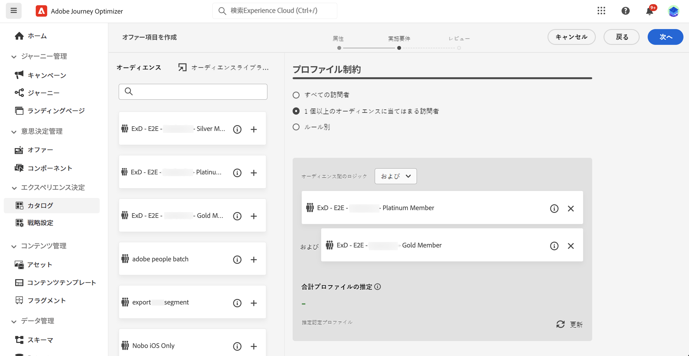
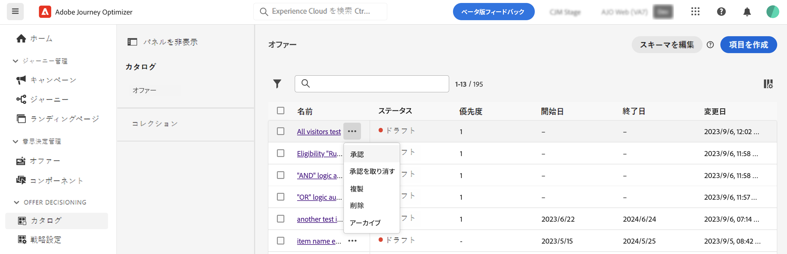

# 決定項目 {#items}

>[!BEGINSHADEBOX]

このドキュメントガイドの内容は次のとおりです。

* [Experience Decisioning の基本を学ぶ](gs-experience-decisioning.md)
* 決定項目を管理
   * [項目カタログを設定](catalogs.md)
   * **[決定項目の作成](items.md)**
   * [項目コレクションを管理](collections.md)
* 項目の選択を設定
   * [決定ルールの作成](rules.md)
   * [ランキングメソッドの作成](ranking.md)
* [選択戦略を作成](selection-strategies.md)
* [決定ポリシーの作成](create-decision.md)

>[!ENDSHADEBOX]

Journey Optimizerでは、決定項目と呼ばれるマーケティングオファーを作成し、一元化されたカタログとコレクションに整理できます。 これらは、ニーズに正確に合わせて設計された標準およびカスタムの属性で構成されています。 さらに、判定項目の表示先を定義できるプロファイル制約が組み込まれます。

決定項目を作成する前に、必ず **決定ルール** を設定する必要がある場合は、決定項目を表示する対象を決定します。 [決定ルールの作成方法を説明します](rules.md).

## 最初の決定項目を作成する

決定項目を作成するには、次の手順に従います。

1. に移動します。 **[!UICONTROL エクスペリエンス判定]** > **[!UICONTROL 項目]**.

1. 決定項目の標準属性を定義します。

   1. 名前と説明を入力します。
   1. 開始日と終了日を指定します。 項目は、これらの日付内の判定エンジンによってのみ考慮されます。
   1. を設定します。 **[!UICONTROL 優先度]** の（プロファイルが複数の項目に該当する場合）を示します。 優先度が高いと、品目が他の品目よりも優先されます。

   

1. カスタム属性は、決定項目に割り当てることができる、ニーズに合わせた特定の属性です。 判定項目のカタログスキーマで定義されます。 [カタログの操作方法を学ぶ](catalogs.md)

1. 決定項目の属性を定義したら、「 **[!UICONTROL 次へ]** をクリックして、項目のプロファイル制約を設定します。

   デフォルトでは、すべてのプロファイルが判定項目を受け取る資格を持ちますが、オーディエンスまたはルールを使用して、項目を特定のプロファイル（異なる用途に対応する両方のソリューション）に制限できます。 詳しくは、以下のセクションを展開してください。

   +++オーディエンスの使用と決定ルールの使用

   基本的に、オーディエンスの出力はプロファイルのリストです。一方、決定ルールは、決定プロセス中に単一プロファイルに対してオンデマンドで実行される関数です。

   * **オーディエンス**：一方、オーディエンスは、プロファイル属性とエクスペリエンスイベントに基づく特定のロジックに一致するAdobe Experience Platformプロファイルのグループです。 ただし、オファー管理ではオーディエンスの再計算は行われないので、オファーを提示する際にオーディエンスが最新でない可能性があります。

   * **決定ルール**：一方、決定ルールは、Adobe Experience Platformで使用可能なデータに基づき、オファーを表示できるユーザーを決定します。 特定のプレースメントのオファーまたは決定でルールが選択されると、決定が行われるたびにそのルールが実行されるので、各プロファイルが最新かつ最適なオファーを確実に取得できます。

+++

   

   * 決定項目の表示を 1 つまたは複数のAdobe Experience Platformオーディエンスのメンバーに制限するには、 **[!UICONTROL 1 つまたは複数のオーディエンスに該当する訪問者]** 」オプションを選択し、左側のパネルから 1 つ以上のオーディエンスを追加し、 **[!UICONTROL および]** / **[!UICONTROL または]** 論理演算子。 [オーディエンスの詳細を表示](../audience/about-audiences.md).

   * 特定の決定ルールを決定項目に関連付けるには、 **[!UICONTROL ルール別]**&#x200B;をクリックし、目的のルールを左側のパネルから中央の領域にドラッグします。 [決定ルールの詳細を説明します](rules.md).

   オーディエンスまたは決定ルールを選択すると、推定される認定プロファイルに関する情報が表示されます。「**[!UICONTROL 更新]**」をクリックして、データを更新します。

   >[!NOTE]
   >
   >プロファイルの予測は、ルールパラメーターにコンテキストデータなど、プロファイルに含まれていないデータが含まれている場合は使用できません。例えば、現在の気温が 80 ℃以上であることを条件とする実施要件ルールがあります。

1. 決定項目の制約を定義したら、「 **[!UICONTROL 次へ]** をクリックして、項目を確認して保存します。

1. 決定項目がリストに表示され、 **[!UICONTROL ドラフト]** ステータス。 プロファイルを表示する準備が整ったら、省略記号ボタンをクリックし、「 」を選択します。 **[!UICONTROL 承認]**.

   

## 決定項目の管理

決定項目リストから、決定項目を編集し、そのステータス (**ドラフト**, **承認済み**, **アーカイブ済み**)、複製または削除します。

決定項目を変更するには、その項目を開き、変更を加えて保存します。

決定項目を選択するか、省略記号ボタンをクリックすると、以下に示すアクションが有効になります。

* **[!UICONTROL 承認]**：決定項目のステータスを「承認済み」に設定します。
* **[!UICONTROL 承認を元に戻す]**：決定項目のステータスをに戻します。 **[!UICONTROL ドラフト]**.
* **[!UICONTROL 複製]**：同じ属性と制約を持つ判定項目を作成します。 デフォルトでは、新しい項目には **[!UICONTROL ドラフト]** ステータス。
* **[!UICONTROL 削除]**：決定項目をリストから削除します。

  >[!IMPORTANT]
  >
  >削除すると、決定項目とそのコンテンツにアクセスできなくなります。 このアクションは取り消しできません。決定項目がコレクションまたは決定で使用されている場合、その決定項目は削除できません。 最初に、任意のオブジェクトから決定項目を削除する必要があります。

* **[!UICONTROL アーカイブ]**：決定項目のステータスをに設定します。 **[!UICONTROL アーカイブ済み]**. 決定項目はリストから引き続き使用できますが、ステータスをに戻すことはできません。 **[!UICONTROL ドラフト]** または **[!UICONTROL 承認済み]**. 複製または削除のみ可能です。
