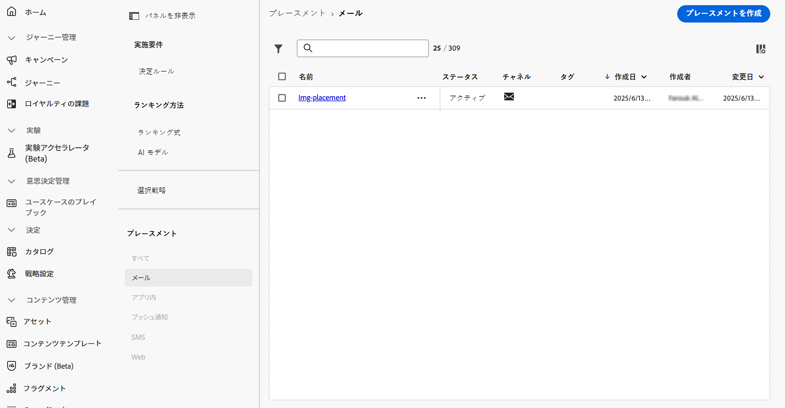
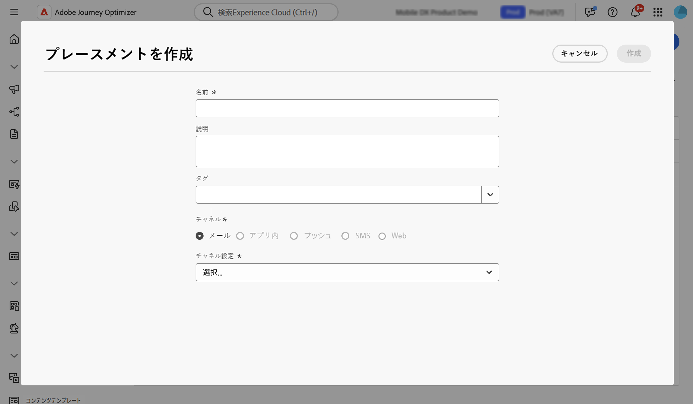
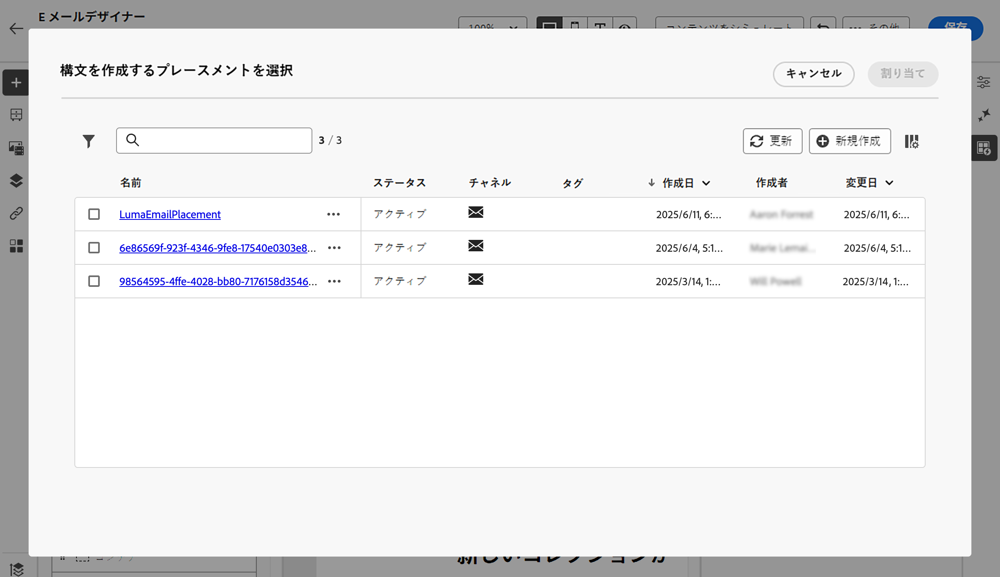

# プレースメントの操作 {#create-decision}

## プレースメントについて {#about}

プレースメントは、決定項目の紹介に使用されるコンテナです。適切なオファーコンテンツがメッセージ内の適切な場所に表示されるようにします。

決定ポリシーをメールに追加する場合、返された決定項目を表示するコンポーネントにプレースメントを関連付ける必要があります。これにより、例えば、レポートで異なるプレースメントをまたいで決定項目のパフォーマンスを追跡できます。

プレースメントのリストには、**[!UICONTROL 戦略設定]**&#x200B;メニューでアクセスできます。フィルターは、特定のチャネルサーフェスやタグに従ってプレースメントを取得するのに役立ちます。

>[!NOTE]
>
>現時点では、プレースメントは、メールチャネルでのみ使用できます。

## プレースメントの作成 {#create}

プレースメントを作成するには、次の手順に従います。

1. **[!UICONTROL 戦略設定]**&#x200B;メニューに移動し、「**[!UICONTROL メール]**」を選択して、「**[!UICONTROL プレースメントを作成]**」ボタンをクリックします。

   また、決定ポリシーを追加する際に、E メールデザイナーからプレースメントを直接作成することもできます。[メールコンポーネントにプレースメントを関連付ける方法の詳細情報](../experience-decisioning/create-decision.md#save)

1. プレースメントのプロパティを定義します。

   

   * **[!UICONTROL 名前]**：プレースメントの名前。わかりやすい名前を定義して、取得しやすくします。
   * **[!UICONTROL 説明]**：プレースメントの説明。
   * **[!UICONTROL タグ]**：Adobe Experience Platform 統合タグをプレースメントに割り当てます。これにより、簡単に分類し、検索を改善できます。[タグの操作方法について詳しくは、こちらを参照してください](../start/search-filter-categorize.md#tags)
   * **[!UICONTROL チャネル]**：プレースメントを使用するチャネル。現時点では、プレースメントは、メールでのみ使用できます。
   * **[!UICONTROL チャネル設定]**：プレースメントにチャネル設定を関連付けます。[詳しくは、チャネル設定の指定方法を参照してください](../configuration/channel-surfaces.md)。

1. 「**[!UICONTROL 作成]**」をクリックします。

プレースメントを作成すると、決定ポリシーをメールに追加する際に、プレースメントリストに表示されます。選択してプロパティを表示し、編集できます。[決定ポリシーの作成方法の詳細情報](../experience-decisioning/create-decision.md)

