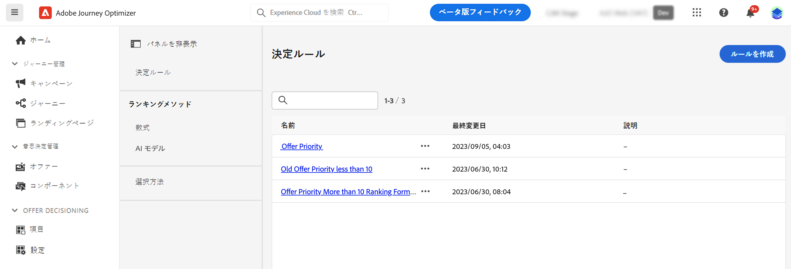
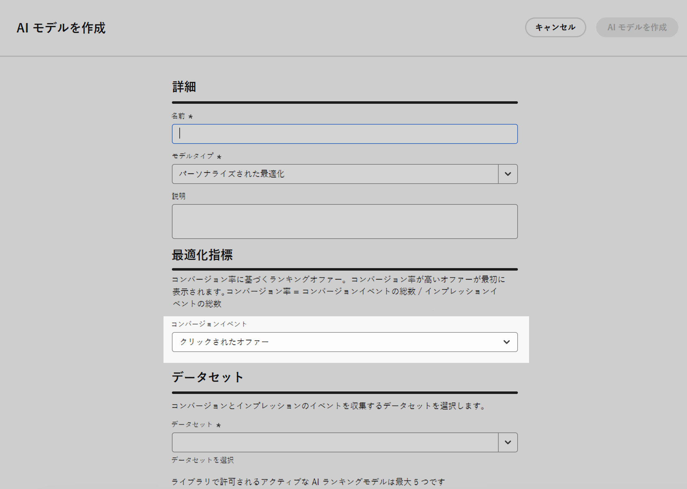
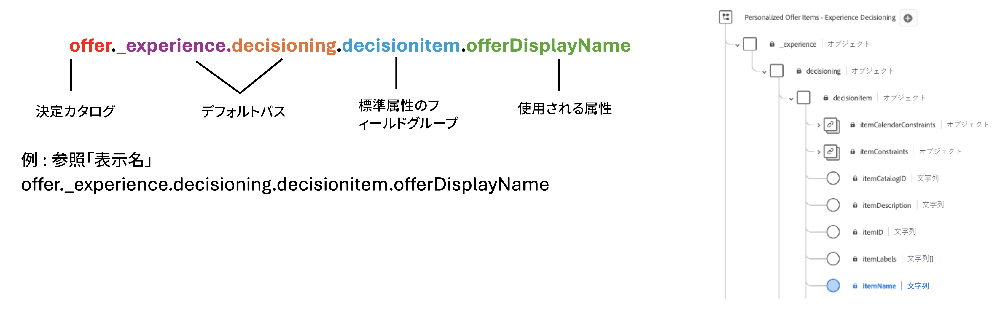
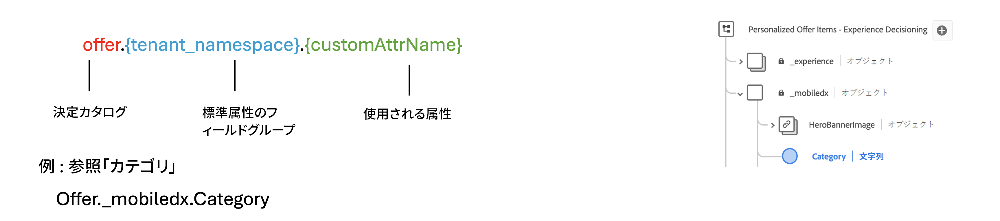

# ランキング方法 {#rankings}

>[!CONTEXTUALHELP]
>id="ajo_exd_config_formulas"
>title="ランキング式の作成"
>abstract="式を使用すると、項目の優先度スコアを考慮するのではなく、最初に提示する項目を決定するルールを定義できます。ランキング方法を作成したら、その方法を選択戦略に割り当てて、最初に選択する項目を定義できます。"

ランキング方法を使用すると、特定のプロファイルに対して表示する項目をランク付けできます。ランキング方法を作成したら、その方法を選択戦略に割り当てて、最初に選択する項目を定義できます。

次の 2 種類のランキング方法が使用できます。

* **式**&#x200B;を使用すると、項目の優先度スコアを考慮するのではなく、最初に提示する項目を決定するルールを定義できます。

* **AI モデル**&#x200B;を使用すると、複数のデータポイントを活用するトレーニング済みモデルシステムを使用して、最初に提示する項目を決定できます。

## ランキング方法の作成 {#create}

ランキング方法を作成するには、次の手順に従います。

1. **[!UICONTROL 戦略の設定]**&#x200B;メニューに移動し、使用するランキングのタイプに応じて&#x200B;**[!UICONTROL 数式]**&#x200B;または **[!UICONTROL AI モデル]**&#x200B;メニューを選択します。

1. 画面の右上隅にある「**[!UICONTROL 数式を作成]**」または「**[!UICONTROL AI モデルを作成]**」ボタンをクリックします。

   

1. ニーズに合わせて数式または AI モデルを設定して、保存します。

   ランキング式と AI モデルを作成する方法について詳しくは、意思決定管理ドキュメントを参照してください。

   * [ランキング式](../offers/ranking/create-ranking-formulas.md)
   * [AI モデル](../offers/ranking/ai-models.md)

   >[!NOTE]
   >
   >ランキング式のネスト深度は 30 レベルに制限されています。これは、PQL 文字列内の `)` の閉じ丸括弧をカウントすることによって測定されます。UTF-8 でエンコードされた文字の場合、ルール文字列のサイズは最大 8 KB になります。これは、8,000 個の ASCII 文字（各 1 バイト）、または 2,000～4,000 個の非 ASCII 文字（各 2～4 バイト）に相当します。[ 意思決定ガードレールと制限事項の詳細 ](gs-experience-decisioning.md#guardrails)

決定ポリシーでは、最大 10 個の選択戦略と決定項目を組み合わせてサポートします。[ 意思決定ガードレールと制限事項の詳細 ](gs-experience-decisioning.md#guardrails)

+++ カスタム [!DNL Customer Journey Analytics] 指標でのモデルの最適化

>[!NOTE]
>
>この機能は、管理者権限を持つ [!DNL Customer Journey Analytics] のお客様のみが使用可能です。
>
>開始する前に、Journey Optimizer データセットをデフォルトのデータビューに書き出すために、Journey Optimizer と Customer Journey Analytics が統合済みであることを確認してください。[詳しくは、 [!DNL Customer Journey Analytics]](../reports/cja-ajo.md) で  [!DNL Journey Optmizer]  データを活用する方法を参照してください

パーソナライズされた最適化モデルは、ビジネス目標を定義し、顧客データを活用して、パーソナライズされたオファーを提供し、KPI を最大化するためのビジネス指向モデルをトレーニングできる AI モデルのタイプです。パーソナライズされた AI モデルを作成する方法について詳しくは、[意思決定管理ドキュメント](../offers/ranking/personalized-optimization-model.md)を参照してください。

デフォルトでは、パーソナライズされた最適化モデルは、最適化指標として&#x200B;**オファーのクリック数**&#x200B;を使用します。[!DNL Customer Journey Analytics] を操作している場合、[!DNL Decisioning] を使用すると、独自のカスタム指標を活用して、モデルを最適化できます。

これを行うには、パーソナライズされた AI モデル作成画面にアクセスし、**[!UICONTROL コンバージョンイベント]**&#x200B;ドロップダウンを展開します。デフォルトの [!DNL Customer Journey Analytics] [データビュー](https://experienceleague.adobe.com/ja/docs/analytics-platform/using/cja-dataviews/data-views){target="_blank"}のすべての指標がリストに表示されます。モデルを最適化する指標を選択し、通常どおり AI モデルの作成を完了します。

>[!NOTE]
>
>デフォルトでは、[!DNL Customer Journey Analytics] の指標には「ラストタッチ」アトリビューションモデルを使用します。このモデルでは、コンバージョンの直前に発生したタッチポイントに 100％のクレジットが割り当てられます。
>
>アトリビューションモデルを変更することは可能ですが、すべてのアトリビューションモデルが AI モデルの最適化に最適であるわけではありません。モデルの精度とパフォーマンスを確保するために、最適化目標に合ったアトリビューションモデルを慎重に選択することをお勧めします。
>
>使用可能なアトリビューションモデルとその使用に関するガイダンスについて詳しくは、[[!DNL Customer Journey Analytics]  ドキュメント](https://experienceleague.adobe.com/ja/docs/analytics-platform/using/cja-dataviews/component-settings/attribution){target="_blank"}を参照してください。

+++

## 数式での決定項目属性の活用 {#items}

ランキング式は **PQL 構文**&#x200B;で表され、プロファイル属性、[コンテキストデータ](context-data.md)、決定項目に関連する属性などの様々な属性を利用できます。

数式で決定項目に関連する属性を活用するには、ランキング式のコードで以下の構文に従っていることを確認してください。詳しくは、各節を展開してください。

+++決定項目の標準属性の活用

+++

+++決定項目のカスタム属性の活用

+++
