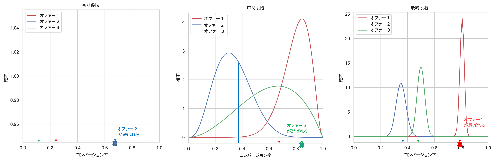
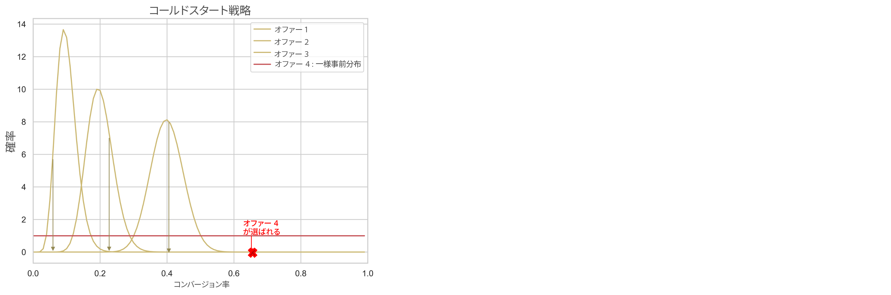

# 自動最適化モデル {#auto-optimization-model}

自動最適化モデルは、ビジネスクライアントが設定する KPI（リターン）を最大化するオファーを提供することを目的としています。これらの KPI は、コンバージョン率、売上高などの形式で設定できます。現時点では、自動最適化は、オファーコンバージョンをターゲットとするオファークリック数の最適化に的を絞っています。自動最適化は、パーソナライズされておらず、オファーの「グローバル」パフォーマンスに基づいて最適化されます。

## データセットの要件

自動最適化モデルをトレーニングするには、データセットが次の最小要件を満たしている必要があります。

* データセット内の 2 個以上のオファーには、過去 14 日以内に 100 回以上の表示イベント数と 5 個のクリックイベント数が必要です。
* 過去 14 日以内の表示回数が 100 回未満のオファーや、クリックイベント数が 5 個未満のオファーは、モデルによって新規オファーとして処理され、探索バンディットによってのみ提供される実施要件が満たされます。
* 過去 14 日以内の表示回数が 100 回以上のオファーと、クリックイベント数が 5 個以上のオファーは、モデルによって既存のオファーとして処理され、探索バンディットと活用バンディットの両方によって提供される実施要件が満たされます。

自動最適化モデルが初めてトレーニングされるまで、自動最適化モデルを利用した選択戦略内のオファーはランダムに提供されます。

## 制限事項 {#limitations}

自動最適化モデルを意思決定管理に使用する場合、次の制限が適用されます。

<!--* Auto-optimization models do not work with the Batch Decisioning API.-->
* モデルの構築に必要なフィードバックは、エクスペリエンスイベントとして送信する必要があります。[!DNL Journey Optimizer] チャネルで自動的に送信されないようにする必要があります。

## 用語 {#terminology}

自動最適化を説明する際には、次の用語が役立ちます。

* **マルチアームバンディット**：最適化に対する[マルチアームバンディット](https://en.wikipedia.org/wiki/Multi-armed_bandit){target="_blank"}アプローチにより、探索的学習とその学習の活用のバランスを取ることができます。

* **トンプソンサンプリング**：トンプソンサンプリングは、オンラインでの決定問題に対するアルゴリズムであり、既知の要素を活用して即座にパフォーマンスを最大化することと、今後のパフォーマンス向上につながる可能性のある新しい情報の蓄積に投資することの間でバランスを取りながらアクションが順次実行されます。[詳細情報](#thompson-sampling)

* [**ベータ分布**](https://ja.wikipedia.org/wiki/ベータ分布){target="_blank"}：2 つの正の[形状パラメーター](https://en.wikipedia.org/wiki/Shape_parameter){target="_blank"}によって[パラメーター化](https://en.wikipedia.org/wiki/Statistical_parameter){target="_blank"}された区間 [0、1] で定義された連続[確率分布](https://ja.wikipedia.org/wiki/確率分布){target="_blank"}のセットです。

## トンプソンサンプリング {#thompson-sampling}

自動最適化の基礎となるアルゴリズムは、**トンプソンサンプリング**&#x200B;です。この節では、トンプソンサンプリングの背景知識について説明します。

[トンプソンサンプリング](https://en.wikipedia.org/wiki/Thompson_sampling){target="_blank"}（ベイジアンバンディット）は、マルチアームバンディット問題に対するベイジアンアプローチです。基本的な考え方として、各オファーからの平均報酬 𝛍 を&#x200B;**ランダム変数**&#x200B;として扱い、これまでに収集したデータを使用して平均報酬に関する「信念」を更新します。この「信念」は、**事後確率分布**&#x200B;によって数学的に表されます。これは、基本的に平均報酬の値の範囲と、報酬が各オファーに対してその値を持つ妥当性（または確率）です。次に、すべての決定について、**これらの事後報酬分布のそれぞれからポイントをサンプリング**&#x200B;し、サンプリングした報酬の値が最も高いオファーを選択します。

このプロセスの例を次の図に示します。ここでは 3 つの異なるオファーがあります。最初は、データからの証拠がなく、すべてのオファーには均一な事後報酬分布があると仮定しています。各オファーの事後報酬分布からサンプルを抽出します。オファー 2 の分布から選択されたサンプルの値が最も高くなります。これは&#x200B;**探索**&#x200B;の例です。オファー 2 を表示した後、潜在的な報酬（例えば、コンバージョン/非コンバージョン）を収集し、以下で説明するようにベイズ定理を使用してオファー 2 の事後分布を更新します。このプロセスを継続し、オファーを表示して報酬を収集するたびに事後分布を更新します。2 番目の図では、オファー 3 が選択されています。オファー 1 の平均報酬が最も高い（事後報酬分布が最も右側にある）にもかかわらず、各分布からサンプリングするプロセスにより、一見したところ次善のオファー 3 を選択することになりました。そうすることで、オファー 3 の真の報酬分布に関してさらに学習する機会が得られます。

より多くのサンプルが収集されるにつれ、信頼性が高まり、得られる可能性のある報酬をより正確に推定できます（より狭い報酬分布に対応しています）。より多くの証拠を集めながら推定を更新するこのプロセスは&#x200B;**ベイズ推定**&#x200B;と呼ばれます。

最終的に、あるオファー（オファー 1 など）が明確な勝者である場合、そのオファーの事後の報酬配分は他のオファーとは別になります。この時点で、各決定に対して、オファー 1 からサンプリングされた報酬が最も高い傾向があり、このオファーを選択する確率も高くなります。これが&#x200B;**活用**&#x200B;です – 私たちはオファー 1 が最適であると強く確信し、報酬を最大化するためこのオファーを選択します。

**図 1**：*決定ごとに、事後報酬分布からポイントをサンプリングします。サンプル値（コンバージョン率）が最も高いオファーが選択されます。最初のフェーズでは、データからのオファーのコンバージョン率に関する証拠を持っていないので、すべてのオファーが均等に配分されます。収集するサンプルが増えると、事後分布はより狭く、より正確になります。最終的には、コンバージョン率の最も高いオファーが毎回選択されます。*

+++**技術的詳細**

配分を計算／更新するには、**ベイズ定理**&#x200B;を使用します。各オファー ***i*** について、これまでに収集したデータを前提として、各オファー ***i*** などの ***P(𝛍i | data)*** を計算し、報酬値 **𝛍i** がどの程度発生する可能性があるかを計算します。

ベイズ定理より：

***事後確率 = 尤度 * 事前確率***

**事前確率**&#x200B;は、出力が生成される確率に関する最初の推測です。何らかの証拠を収集した後の確率は、**事後確率**&#x200B;と呼ばれます。

自動最適化は、バイナリ報酬（クリックの有無）を考慮するように設計されています。この場合、尤度は N 回の試行による成功数を表し、**二項分布**&#x200B;によってモデル化されます。一部の尤度関数では、特定の事前確率を選択すると、事後確率が事前確率と同じ分布になります。このような事前分布は、**共役事前分布**&#x200B;と呼ばれます。この種の事前分布により、事後分布の計算が非常に簡単になります。**ベータ分布**&#x200B;は、二項尤度（二項報酬）の前の共役であるため、事前確率分布と事後確率分布にとっては便利で賢明な選択です。ベータ分布は、***α*** と ***β*** の 2 つのパラメーターを取ります。これらのパラメーターは、成功数と失敗数、および次の式で求められる平均値と考えることができます。

前述の尤度関数は、s 成功（コンバージョン）と f 失敗（コンバージョンなし）の二項分布でモデル化されます。q は[ベータ分布](https://ja.wikipedia.org/wiki/ベータ分布){target="_blank"}の[確率変数](https://ja.wikipedia.org/wiki/確率変数){target="_blank"}です。

事前分布はベータ分布でモデル化され、事後分布は次の形式を取ります。

事後値は、成功数と失敗数を既存のパラメーター ***α***、***β*** に単純に加算することによって計算されます。

自動最適化の場合、上記の例に示すように、すべてのオファーの事前分布 ***Beta(1, 1)***（一様分布）から開始し、特定のオファーで成功が s 件で失敗が f 件という結果を取得した後、事後確率はそのオファーのパラメーター ***(s+α, f+β)*** を使用したベータ分布になります 。
+++

**関連トピック**：

トンプソンサンプリングについて詳しくは、次の研究論文を参照してください。

* [トンプソンサンプリングの経験的評価](https://proceedings.neurips.cc/paper/2011/file/e53a0a2978c28872a4505bdb51db06dc-Paper.pdf){target="_blank"}
* [マルチアームバンディット問題に対するトンプソンサンプリングの分析](https://proceedings.mlr.press/v23/agrawal12/agrawal12.pdf){target="_blank"}

## コールドスタートの問題 {#cold-start}

「コールドスタート」の問題は、新しいオファーがキャンペーンに追加され、新しいオファーのコンバージョン率に関するデータがない場合に発生します。この期間中に、この新しいオファーのコンバージョン率に関する情報を収集しながら、パフォーマンスの低下を最小限に抑えるために、この新しいオファーが選択される頻度に関する戦略を立てる必要があります。この問題に取り組むために利用できる解決策は複数あります。重要なのは、この新しいオファーの探索と、活用をそれほど犠牲にしないことのバランスを見つけることです。現在アドビでは、新しいオファーのコンバージョン率（事前分布）についての最初の推測として「一様分布」を使用しています。基本的に、すべてのコンバージョン率の値に等しい発生確率を与えます。

**図 2**: *3 つのオファーがあるキャンペーンを考えてみましょう。キャンペーンの公開中、オファー 4 がキャンペーンに追加されます。最初は オファー 4 のコンバージョン率に関するデータがないため、コールドスタートの問題に対処する必要があります。この新しいオファーのデータを収集する間、オファー 4 のコンバージョン率に関する最初の推測として一様分布を使用します。[トンプソンサンプリング](#thompson-sampling)の節で説明したように、ユーザーに表示するオファーを選択するには、オファーの事後報酬分布からポイントをサンプリングし、サンプル値が最も高いオファーを選択します。上記の例では、オファー 4 が選択され、後で収集された報酬に基づいて、[トンプソンサンプリング](#thompson-sampling)の節で説明しているように、このオファーの事後分布が更新されます。*

## 上昇率測定 {#lift}

「上昇率」は、ベースライン戦略（ランダムにオファーを提供）と比較して、ランキングサービスでデプロイされた戦略のパフォーマンスを測定するために使用される指標です。

例えば、ランキングサービスで使用されるトンプソンサンプリング（TS）戦略のパフォーマンスを測定することに関心があり、KPI がコンバージョン率（CVR）である場合、ベースライン戦略に対する TS 戦略の「上昇率」は次のように定義されます。

>[!NOTE]
>
>現在、上昇率測定レポートは、[パーソナライズされた最適化](personalized-optimization-model.md) AI モデルでのみ使用できます。[決定レポートの詳細情報](../../reports/campaign-global-report-cja-code.md#decisioning-reporting)
