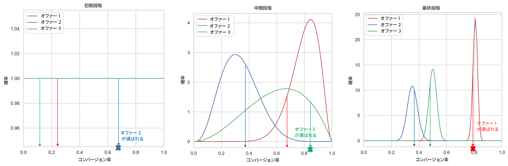

# 自動最適化モデル {#auto-optimization-model}

[!DNL Adobe Journey Optimizer]の自動最適化モデルは、実施要件ルールと頻度の上限が適用された後、すべてのオファー（またはコンテンツ）を探索し、予測CTRに基づいてアイテムをランク付けすることで、オファーのクリック率（CTR）を最大化する強化学習モデルです。

## ユースケースと利点 {#use-cases-benefits}

自動最適化は、迅速かつ容易に設定し、効果の高いオファーを包括的に特定し、単一チャネル内でオファーのクリック数を最大化したい場合にいつでも利用できます。 例：

* web ページに挿入する最適なオファーを選択して、オファークリックを最大化します。
* オファークリック数を最大化するために、メールに挿入する最適なオファーを選択します。
* モバイルアプリの画面に挿入する最適なオファーを選択して、オファークリック数を最大化できます。

自動最適化は、次のような場合に最適な選択肢です。

* オファーは時間の経過または頻繁に変更されます。自動最適化モデルは6時間ごとに再訓練されます。

## 要件と制限事項 {#requirements-limitations}

自動最適化には、次の要件と制限があります。

* 自動最適化には、オファー表示イベント、オファークリックイベント、エクスペリエンスイベント – 提案インタラクション フィールドグループを含むトレーニングデータセットが必要です。
* 自動最適化モデルは、Batch Decisioning APIへのリクエストでは使用できません。
* 自動最適化は、オファークリック数を常に最適化します。 オファークリック以外の目的のために最大化するには、[ パーソナライズ最適化](personalized-optimization-model.md) モデルを使用します。
* 自動最適化は、全体的な勝者オファーを見つけようとするもので、各顧客にパーソナライズされたランキングを見つけることはできません。 各顧客のパーソナライズされたランキングを検索するには、[ パーソナライズ最適化](personalized-optimization-model.md) モデルを使用します。

自動最適化モデルをトレーニングするには、データセットが次の最小要件を満たしている必要があります。

* データセット内の 2 個以上のオファーには、過去 14 日以内に 100 回以上の表示イベント数と 5 個のクリックイベント数が必要です。
* 過去 14 日以内の表示回数が 100 回未満のオファーや、クリックイベント数が 5 個未満のオファーは、モデルによって新規オファーとして処理され、探索バンディットによってのみ提供される実施要件が満たされます。
* 過去 14 日以内の表示回数が 100 回以上のオファーと、クリックイベント数が 5 個以上のオファーは、モデルによって既存のオファーとして処理され、探索バンディットと活用バンディットの両方によって提供される実施要件が満たされます。

自動最適化モデルが初めてトレーニングされるまで、自動最適化モデルを利用した選択戦略内のオファーはランダムに提供されます。

## 最適化と学習のバランス {#balancing-optimization-learning}

自動最適化は、[強化学習](https://en.wikipedia.org/wiki/Reinforcement_learning){target="_blank"} モデルで、実際の顧客行動に基づいてオファーのクリックスルーのパフォーマンスについて学習します。 強化学習モデルは、より優れた予測結果を持つ行動を選択することで、目的を最大化しようとします。 しかし、常に全ての顧客に最適な結果を提示するモデルは、時間の経過とともに導入される新たな項目のパフォーマンス（いわゆる「コールドスタート問題」）について学習することはなく、顧客の行動の変化に伴う他の既存の項目のパフォーマンスの変化についても学習することはありません。 したがって、強化学習モデルは、一般的に[探索 – 探索トレードオフ ](https://en.wikipedia.org/wiki/Exploration%E2%80%93exploitation_dilemma){target="_blank"}と呼ばれるものを管理する必要があります。つまり、最適化と学習のバランスを取る必要があります。

自動最適化では、[ マルチアームドバンディット ](https://en.wikipedia.org/wiki/Multi-armed_bandit){target="_blank"}と呼ばれる一般的なアプローチを使用して、トレードオフを管理します。 マルチアームドバンディットは、次にもとづいてランキング決定をおこないます。

* 各項目のクリック率の予測
* 各項目の予測クリック率の違い
* 各項目に対する予測に関するモデルの不確実性の程度。

マルチアームドバンディットは、この情報とランダムな変動を利用して、実行するアクションを選択します。 自動最適化は[ アンサンブルアルゴリズム ](https://en.wikipedia.org/wiki/Ensemble_learning){target="_blank"}で、全体的なパフォーマンスを最大化しながら、すべてのオファーが適切に探索されるように、複数のマルチアームドバンディットを含みます。

ランキングの要求に応じる際に、「監督」するマルチアームドバンディットは、まず、この要求を探索に向けて偏らせるか、あるいは搾取に向けて偏らせるかを選択する。 この決定は、「イプシロン・グリーディ」アプローチを用いて行われる。

ランキングの2番目のレイヤーは、2つの[ トンプソンサンプリング ](https://en.wikipedia.org/wiki/Thompson_sampling){target="_blank"}盗賊のうちの1人によって実行されます。

* トラフィックの10%は、新しいオファーやデータが限られているオファーを推奨する可能性が高い、探索重視のバンディットに割り当てられます。このモデルは、これらのオファーに対応する顧客行動をより詳細に把握することでメリットを得られると仮定しています。
* トラフィックの90%は、エクスプロイメントに重点を置いたバンディットに割り当てられ、時間の経過とともにパフォーマンスの高いオファーを継続的に推奨する可能性が高まります。このモデルは、新規オファーや低データのオファーが、実証されるまでパフォーマンスが低い可能性が高いという前提の下で構築されています。

技術的な意味では、これらの仮定は以前の確率分布のパラメータであり、[priors](https://en.wikipedia.org/wiki/Prior_probability){target="_blank"}とも呼ばれます。 オファーがより多くのディスプレイデータやクリックデータを収集するにつれて、選択した優先度の影響は小さくなり、2つの盗賊による予測は時間の経過とともに収束する傾向があります。

複数のバンディットを組み合わせて、探索のために専用のトラフィックを割り当てるアドビのアプローチには、いくつかの利点があります。

* このモデルは、最小限のデータで最新のオファーを最もすばやく学習します
* このモデルでは、あらゆるオファーを継続的に学習し、顧客行動の変化に時間をかけて対応します
* このモデルは、見かけ上のCTRが高いがオブザベーションはほとんどない、または見かけ上のCTRが低いがオブザベーションはほとんどない、積極的にオファーを好まない、といった具合にはオーバーフィットしません
* このモデルは、クリックデータが少なく、履歴データの量も非常に異なるため、何百ものオファーでトラフィック割り当ての意思決定を処理するのに堅牢です

## トンプソンサンプリング {#thompson-sampling}

[ トンプソンサンプリング ](https://en.wikipedia.org/wiki/Thompson_sampling){target="_blank"}、つまりベイジアンバンディットは、マルチアームドバンディット問題に対するベイジアンアプローチです。 このモデルは、各オファーの平均報酬𝛍をランダム変数として扱い、これまで収集したデータを使用して、平均報酬に関する「信念」を更新します。 この「信念」は、事後確率分布によって数学的に表されます。基本的には、平均報酬の値の範囲と、報酬が各オファーにその値を持っているというもっともらしい（または確率）です。 次に、決定ごとに、これらの事後報酬分布のそれぞれからポイントをサンプリングし、サンプリングされた報酬が最も価値の高いオファーを選択します。

このプロセスの例を次の図に示します。ここでは 3 つの異なるオファーがあります。最初は、データから証拠がなく、すべてのオファーが一様な事後報酬分布を持っていると仮定します。 各オファーの事後報酬分布からサンプルを抽出します。オファー 2 の分布から選択されたサンプルの値が最も高くなります。これは探索の一例です。 オファー2を表示した後、潜在的な報酬（コンバージョン/コンバージョンなし等）を収集し、以下に説明するようにベイズ定理を使用してオファー2の事後分布を更新します。 このプロセスを継続し、オファーを表示して報酬を収集するたびに事後分布を更新します。2 番目の図では、オファー 3 が選択されています。オファー 1 の平均報酬が最も高い（事後報酬分布が最も右側にある）にもかかわらず、各分布からサンプリングするプロセスにより、一見したところ次善のオファー 3 を選択することになりました。そうすることで、Offer 3の真のリワード配分についてより深く知る機会を提供します。

より多くのサンプルが収集されるにつれて、信頼性が高まり、可能な報酬のより正確な見積もりが得られます（より狭い報酬分布に対応します）。 より多くの証拠が得られるにつれて私たちの信念を更新するこのプロセスは、**ベイズ推論**&#x200B;として知られています。

最終的に、あるオファー（オファー 1 など）が明確な勝者である場合、そのオファーの事後の報酬配分は他のオファーとは別になります。この時点で、各決定に対して、オファー 1 からサンプリングされた報酬が最も高い傾向があり、このオファーを選択する確率も高くなります。これは搾取です – オファー1が最高であると強く信じており、報酬を最大化するために選択されています。

**図 1**：*決定ごとに、事後報酬分布からポイントをサンプリングします。サンプル値（コンバージョン率）が最も高いオファーが選択されます。最初のフェーズでは、データからのオファーのコンバージョン率に関する証拠を持っていないので、すべてのオファーが均等に配分されます。収集するサンプルが増えると、事後分布はより狭く、より正確になります。最終的には、コンバージョン率の最も高いオファーが毎回選択されます。*

+++ 計算詳細

分布を計算/更新するには、**ベイズの定理**&#x200B;を使用します。 各オファー ***i*** について、これまでに収集したデータを前提として、各オファー ***i*** などの ***P(𝛍i | data)*** を計算し、報酬値 **𝛍i** がどの程度発生する可能性があるかを計算します。

ベイズ定理より：

***事後確率 = 尤度 * 事前確率***

**事前確率**&#x200B;は、出力が生成される確率に関する最初の推測です。ある証拠が収集された後の確率は、**事後確率**&#x200B;と呼ばれます。

自動最適化は、バイナリ報酬（クリックの有無）を考慮するように設計されています。この場合、尤度はN個の試行からの成功数を表し、二項分布によってモデル化されます。 一部の尤度関数では、特定の事前確率を選択すると、事後確率が事前確率と同じ分布になります。このような事前分布は、**共役事前分布**&#x200B;と呼ばれます。この種の事前分布により、事後分布の計算が非常に簡単になります。[Beta分布](https://ja.wikipedia.org/wiki/ベータ分布){target="_blank"}は、二項尤度（バイナリ報酬）の前の共役型であり、したがって、前確率と後確率の分布に対して便利で賢明な選択です。 Beta ディストリビューションは、***α***&#x200B;と&#x200B;***β***&#x200B;の2つのパラメーターを使用します。 これらのパラメーターは、成功と失敗のカウントと、次によって与えられる平均値と考えることができます。

上記の尤度関数は二項分布によってモデル化され、sの成功（コンバージョン）とfの失敗（コンバージョンなし）、qはBeta分布を持つ確率変数です。

事前分布はベータ分布でモデル化され、事後分布は次の形式を取ります。

+++

### 探索バイアスと探索バイアス {#exploration-exploitation-bias}

パラメーター&#x200B;***α***、***β***&#x200B;に初期値を選択する必要があります。 自動最適化には、探索バイアスのThompson サンプリングバンディットと、ベータ版の分布で異なる初期&#x200B;***α***、***β***&#x200B;の先行者を利用する探索バイアスのThompson サンプリングバンディットの両方が含まれます。

一般的なトンプソンサンプリングアプローチでは、事後は、既存のパラメータ ***α***、***β***&#x200B;に成功数と失敗数を追加するだけで計算されます。 自動最適化では、探索バイアスと悪用バイアスの両方の帯域において、新しいデータと以前のデータの影響を修正するために、新しい成功と失敗に対してさまざまな重み付け要因を利用します。

## 参照 {#references}

Thompsonのサンプリング・バンディットの詳細については、以下の研究論文を参照してください。

* [トンプソンサンプリングの経験的評価](https://proceedings.neurips.cc/paper/2011/file/e53a0a2978c28872a4505bdb51db06dc-Paper.pdf){target="_blank"}
* [マルチアームバンディット問題に対するトンプソンサンプリングの分析](https://proceedings.mlr.press/v23/agrawal12/agrawal12.pdf){target="_blank"}
