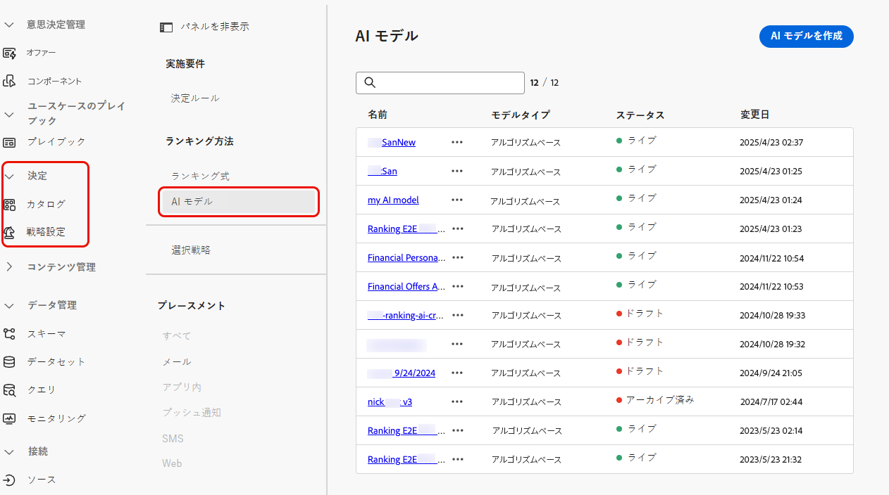
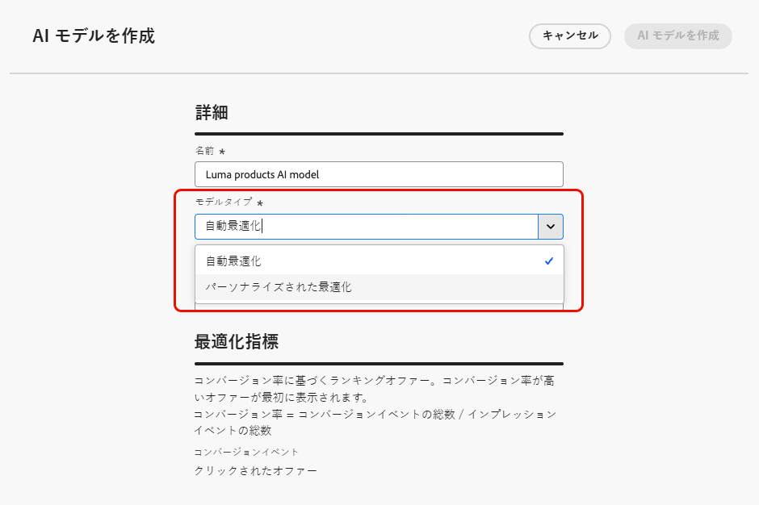
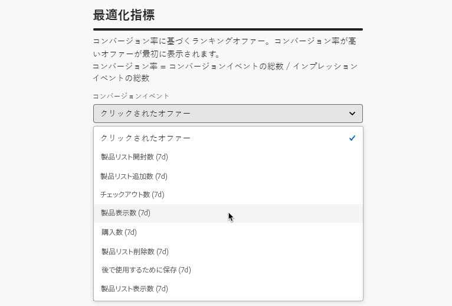
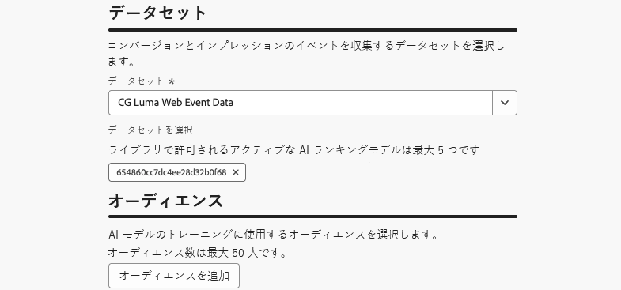

# AI モデルの作成 {#create-ai-models}

[!DNL Journey Optimizer] を使用すると、ビジネス目標に基づいてオファーをランク付けする **AI モデル**&#x200B;を作成できます。

>[!CAUTION]
>
>AI モデルを作成、編集または削除するには、**ランキング戦略を管理**&#x200B;する権限が必要です。[詳細情報](../../administration/high-low-permissions.md#manage-ranking-strategies)

## AI モデルの作成 {#create-ranking-strategy}

>[!CONTEXTUALHELP]
>id="ajo_exd_ai_model_metric"
>title="最適化指標"
>abstract="[!DNL Journey Optimizer] は&#x200B;**コンバージョン率**&#x200B;に基づいてオファーをランク付けします（コンバージョン率 = コンバージョンイベントの合計数／インプレッションイベントの合計数）。コンバージョン率は、**インプレッションイベント**（表示されるオファー）と&#x200B;**コンバージョンイベント**（メールまたは web でのクリックにつながるオファー）の 2 種類の指標を使用して計算されます。これらのイベントは、提供されている Web SDK または Mobile SDK を使用して自動的にキャプチャされます。"

AI モデルを作成するには、次の手順を行います。

1. コンバージョンイベントが収集されるデータセットを作成します。[方法についてはこちらを参照](../data-collection/create-dataset.md)

1. **[!UICONTROL 決定]**／**[!UICONTROL 戦略設定]**&#x200B;メニューに移動し、「**[!UICONTROL AI モデル]**」を選択します。

   

   これまでに作成した AI モデルがすべてリストされます。

1. 「**[!UICONTROL AI モデルを作成]**」ボタンをクリックします。

1. AI モデルの一意の名前と、必要に応じて説明を指定します。

1. 作成する AI モデルのタイプを選択します。

   * **[!UICONTROL 自動最適化]**&#x200B;は、過去のオファーのパフォーマンスに基づいてオファーを最適化します。[詳細情報](auto-optimization-model.md)
   * **[!UICONTROL パーソナライズされた最適化]**&#x200B;では、オーディエンスとオファーのパフォーマンスに基づいて、オファーを最適化およびパーソナライズします。[詳細情報](personalized-optimization-model.md)

   

1. 「**[!UICONTROL 最適化指標]**」セクションでは、AI モデルがオファーのランク付けを計算する際に使用するコンバージョンイベントに関する情報が提供されます。

   [!DNL Journey Optimizer] は&#x200B;**コンバージョン率**&#x200B;に基づいてオファーをランク付けします（コンバージョン率 = コンバージョンイベントの合計数／インプレッションイベントの合計数）。コンバージョン率は、次の 2 種類の指標を使用して計算されます。
   * **インプレッションイベント**（表示されるオファー）
   * **コンバージョンイベント**（メールまたは web でのクリックにつながるオファー）

   これらのイベントは、提供されている Web SDK または Mobile SDK を使用して自動的にキャプチャされます。詳しくは、[Adobe Experience Platform Web SDK](https://experienceleague.adobe.com/docs/experience-platform/edge/home.html?lang=ja) 概要を参照してください。

   +++ カスタム [!DNL Customer Journey Analytics] 指標でのモデルの最適化

   >[!NOTE]
   >
   >この機能は、管理者権限を持つ [!DNL Customer Journey Analytics] のお客様のみが使用可能です。
   >
   >開始する前に、Journey Optimizer データセットをデフォルトのデータビューにエクスポートするために、Journey Optimizer と Customer Journey Analytics が統合済みであることを確認してください。[詳しくは、 [!DNL Customer Journey Analytics]](../../reports/cja-ajo.md) で  [!DNL Journey Optmizer]  データを活用する方法を参照してください

   **[!UICONTROL パーソナライズされた最適化]**&#x200B;モデルは、ビジネス目標を定義し、顧客データを利用して、パーソナライズされたオファーを提供し、KPI を最大化するビジネス指向モデルをトレーニングできる AI モデルのタイプです。

   デフォルトでは、パーソナライズされた最適化モデルは、最適化指標として&#x200B;**オファーのクリック数**&#x200B;を使用します。[!DNL Customer Journey Analytics] を操作している場合、[!DNL Decisioning] を使用すると、独自のカスタム指標を活用して、モデルを最適化できます。

   これを行うには、**[!UICONTROL パーソナライズされた最適化]**&#x200B;モデルタイプを選択し、**[!UICONTROL コンバージョンイベント]**&#x200B;ドロップダウンを展開します。デフォルトの [!DNL Customer Journey Analytics] [データビュー](https://experienceleague.adobe.com/ja/docs/analytics-platform/using/cja-dataviews/data-views){target="_blank"}のすべての指標がリストに表示されます。モデルを最適化する指標を選択します。

   {width=85%}

   >[!NOTE]
   >
   >デフォルトでは、[!DNL Customer Journey Analytics] の指標には「ラストタッチ」アトリビューションモデルを使用します。このモデルでは、コンバージョンの直前に発生したタッチポイントに 100％のクレジットが割り当てられます。
   >
   >アトリビューションモデルを変更することは可能ですが、すべてのアトリビューションモデルが AI モデルの最適化に最適であるわけではありません。モデルの精度とパフォーマンスを確保するために、最適化目標に合ったアトリビューションモデルを慎重に選択することをお勧めします。
   >
   >使用可能なアトリビューションモデルとその使用に関するガイダンスについて詳しくは、[[!DNL Customer Journey Analytics]  ドキュメント](https://experienceleague.adobe.com/ja/docs/analytics-platform/using/cja-dataviews/component-settings/attribution){target="_blank"}を参照してください。

   +++

1. コンバージョンイベントとインプレッションイベントが収集されるデータセットを選択します。このようなデータセットを作成する方法について詳しくは、[この節](../data-collection/create-dataset.md)を参照してください。

   {width=85%}

   >[!CAUTION]
   >
   >「**[!UICONTROL エクスペリエンスイベント - 提案インタラクション]**」フィールドグループ（以前の mixin）に関連付けられたスキーマから作成されたデータセットのみがドロップダウンリストに表示されます。

1. **[!UICONTROL パーソナライズされた最適化]**&#x200B;の AI モデルを作成する場合は、AI モデルのトレーニングに使用するセグメントを選択します。

   <!--➡️ [Discover this feature in video](#video)-->

   >[!NOTE]
   >
   >最大 5 個のオーディエンスを選択できます。

1. AI モデルを保存して有効化します。

<!--At this point, you must have:

* created the AI model,
* defined which type of event you want to capture - offer displayed (impression) and/or offer clicked (conversion),
* and in which dataset you want to collect the event data.-->

これで、オファーが表示やクリックされるたびに、対応するイベントが [Adobe Experience Platform Web SDK](https://experienceleague.adobe.com/docs/experience-platform/edge/web-sdk-faq.html?lang=ja#what-is-adobe-experience-platform-web-sdk%3F){target="_blank"} または Mobile SDK を使用し、**[!UICONTROL エクスペリエンスイベント - 提案インタラクション]**&#x200B;フィールドグループによって自動的にキャプチャされるようになります。

イベントタイプ（表示されたオファーまたはクリックされたオファー）で送信できるようにするには、Adobe Experience Platform に送信されるエクスペリエンスイベントで、各イベントタイプに正しい値を設定する必要があります。[方法についてはこちらを参照](../data-collection/schema-requirement.md)

<!--
## How-to video {#video}

Learn how to create a personalized optimization model and how to apply it to a decision.

>[!VIDEO](https://video.tv.adobe.com/v/3419954?quality=12)-->
