# ランキング式の作成 {#create-ranking-formulas}

**ランキング式**&#x200B;を使用すると、優先度スコアを考慮するのではなく、どのオファーを最初に表示するかを決定するルールを定義できます。

これらのルールを作成するために、**[!UICONTROL Adobe Journey Optimizer]** の AI 式ビルダーを使用すると、オファーのランク付け方法をより柔軟に制御できます。 静的なオファーの優先度のみに依存するのではなく、ガイド付きインターフェイスを通じて、AI モデルスコア、オファーの優先度、プロファイル属性、オファー属性、コンテキストシグナルを組み合わせたカスタムランキング式を定義できるようになりました。

このアプローチにより、AI 駆動型の傾向、ビジネス価値、リアルタイムのコンテキストの任意の組み合わせに基づいてオファーのランキングを動的に調整できるので、マーケティング目標と顧客ニーズの両方に合わせた決定が容易になります。 AI 式ビルダーは、適用するコントロールのレベルに応じて、シンプルな式または高度な式をサポートします。

ランキング式を作成したら、[選択戦略](../selection-strategies.md)に割り当てることができます。 この選択戦略の使用時に実施要件を満たすオファーが複数ある場合、決定エンジンは選択した式を使用して、最初に配信するオファーを計算します。

➡️ [この機能をビデオで確認](#video)

## ガードレールと制限 {#ranking-guardrails}

ランキング式を作成する前に、次の制約を考慮してください。

* AI式ビルダーは、連続指標を使用する[ パーソナライズされた最適化モデル ](personalized-optimization-model.md)をサポートしていません。
* AI モデルがランキング式で使用されている場合、データはホールドアウトおよびモデル駆動型トラフィックの[ コンバージョン率](../../reports/campaign-global-report-cja-code.md#conversion-rate) レポートに反映されません。
* ランキング式のネストの深さは、PQL文字列内の`)`をカウントして測定される30 レベルに制限されています。
* ランキング式の文字列は、UTF-8でエンコードされた文字（8,000 ASCII文字または2,000～4,000非ASCII文字）に対して最大8 KBにすることができます。
* ルックバック期間は、ランキング式（先月以降のエクスペリエンスイベントなど）ではサポートされていません。 このような数式を保存しようとすると、エラーがトリガーします。
* [AIを活用した数式の最適化](#optimize)は、コードベースのPQL式がUTF-8 エンコードされたサイズの&#x200B;**2 KB**&#x200B;より大きいランキング式にのみ適用されます。小さい数式は分析されません。

## ランキング式の作成とプロパティの設定 {#create-ranking-formula}

>[!CONTEXTUALHELP]
>id="ajo_exd_config_formulas"
>title="ランキング式の作成"
>abstract="式を使用すると、項目の優先度スコアを考慮するのではなく、最初に提示する決定項目を決定するルールを定義できます。 ランキング式を作成したら、選択戦略に割り当てることができます。"

ランキング式を作成するには、次の手順に従います。

1. **[!UICONTROL 戦略設定]**&#x200B;メニューにアクセスし、「**[!UICONTROL ランキング式]**」タブを選択します。 以前に作成した式のリストが表示されます。

   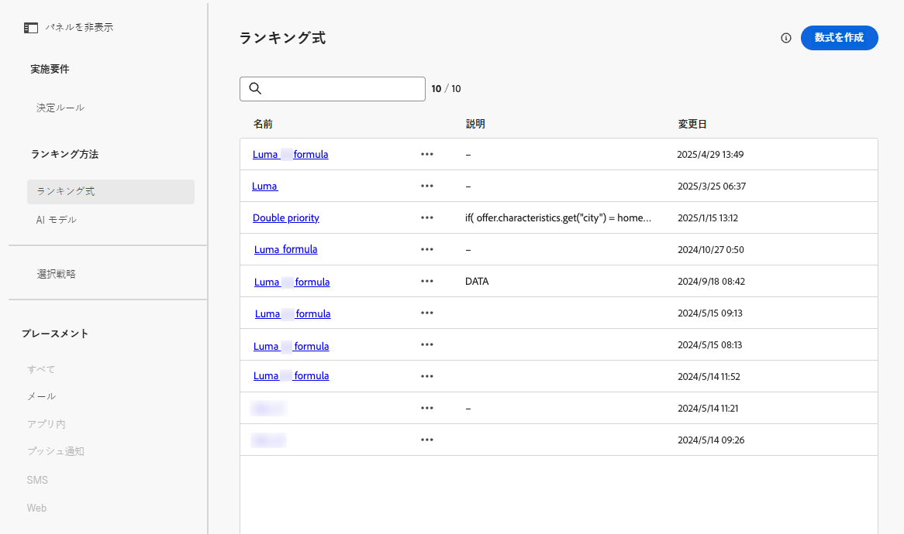

1. 「**[!UICONTROL 数式を作成]**」をクリックします。

1. 式の名前を指定し、必要に応じて説明を追加します。

   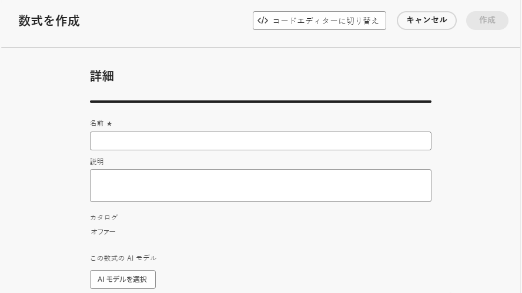{width="80%"}

1. オプションで、「**[!UICONTROL AI モデルを選択]**」をクリックして、ランキング式を作成するための参照として使用するモデルを設定します。

   以下の式を定義する際にモデルスコアを参照するたびに、選択した AI モデルが使用されます。

1. 一致する決定項目のランキングスコアを決定する条件を定義します。 実行できる操作は、次のとおりです。

   * [数式ビルダー](#ranking-select-criteria)を使用して&#x200B;**[!UICONTROL 条件]** セクションに入力するか、または
   * 「**[!UICONTROL コードエディターに切り替え]**」をクリックして、コードエディター](#ranking-code-editor)で[PQLを使用してランキングロジックを定義または調整します。

## Adobe Experience Platform データの使用 {#aep-data}

**[!UICONTROL データセット ルックアップ]** セクションでは、Adobe Experience Platformのデータを使用して、ランキングロジックを動的に調整し、実際の条件を反映させることができます。

これは、製品の在庫状況やリアルタイムの価格設定など、頻繁に変更される属性で特に役立ちます。 [詳しくは、決定の Adobe Experience Platform データの使用方法を参照してください。](../aep-data-exd.md)


## 式ビルダーを使用した条件の定義 {#ranking-select-criteria}

一致する決定項目のランキングスコアを決定する&#x200B;**条件**&#x200B;を定義します。

直感的なインターフェイスにより、AI スコア（傾向）、オファーの値（優先度）、コンテキストレバー、外部プロファイルの傾向を個別または組み合わせて調整することで、決定を微調整し、すべてのインタラクションを最適化できます。<!--Whether you are maximizing revenue, promoting strategic offers, or balancing business goals with real-time context, the formula builder gives you total control in defining ranking strategies.-->

<!--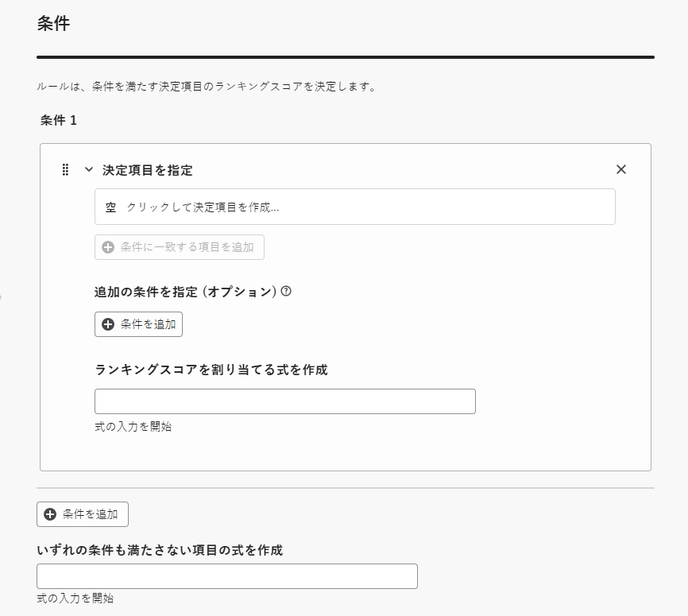{width="80%"}-->

1. 必要に応じて、**[!UICONTROL コードエディターに切り替え]**&#x200B;をクリックし、数式ビルダーと共に&#x200B;**PQL構文**&#x200B;を使用する式を追加します。 このオプションは、次の手順でユーザーインターフェイスフィールドを補完するので、同じランキング式で両方のアプローチを組み合わせることができます。 PQL構文の使用方法について詳しくは、[専用ドキュメント ](https://experienceleague.adobe.com/docs/experience-platform/segmentation/pql/overview.html?lang=ja)を参照してください。 決定項目属性とコピー&amp;ペーストの例の構文については、[ コードエディターの使用](#ranking-code-editor) セクションを参照してください。

   

   >[!NOTE]
   >
   >コードエディターに切り替えても、式ベースの入力が条件に追加され、他のユーザーインターフェイスフィールドは削除されません。

1. 「**[!UICONTROL 条件 1]**」セクションで、次の手順を実行して、ランキングスコアを適用する決定項目を指定します。
   * [決定項目属性](../items.md#attributes)を選択します
   * 論理演算子を選択
   * 一致する条件を追加 – 値を入力するか、プロファイル属性または[ コンテキストデータ ](../context-data.md)を選択できます

   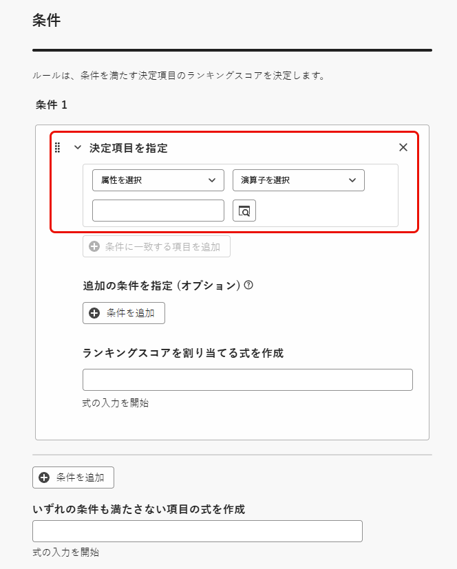{width="70%"}

1. オプションで、追加の要素を指定して、条件が true になる一致条件を絞り込むことができます。

   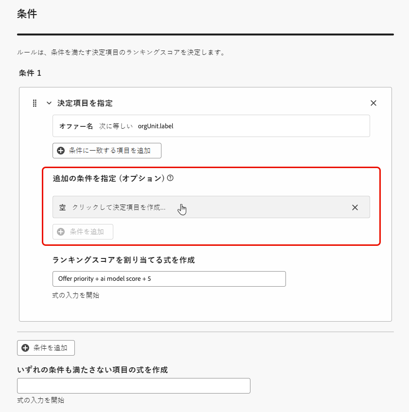{width="80%"}

   例えば、条件 1 として、*天気*&#x200B;カスタム属性が&#x200B;*暖かい*&#x200B;に&#x200B;*等しい*&#x200B;という条件を定義したとします。 さらに、最初の条件が満たされ、リクエスト時に温度が 75℃を超える場合は条件 1 が true になるなどの別の条件を追加できます。<!--Add a screenshot with the example-->

1. 上記で定義した条件を満たす決定項目にランキングスコアを割り当てる式を作成します。 次のいずれかを参照できます。

   * [上記](#create-ranking-formula)の「**[!UICONTROL 詳細]**」セクションでオプションで選択した AI モデルから出力されたスコア。
   * 決定項目の優先度（[決定項目を作成](../items.md#attributes)する際に手動で割り当てられる値）。<!--If a profile qualifies for multiple decision items, a higher priority grants the item precedence over others.-->
   * 外部で派生した傾向スコアなど、プロファイルに存在する可能性のある属性。
   * 自由な形式で割り当てることができる静的な値。
   * 上記のすべての組み合わせ。

   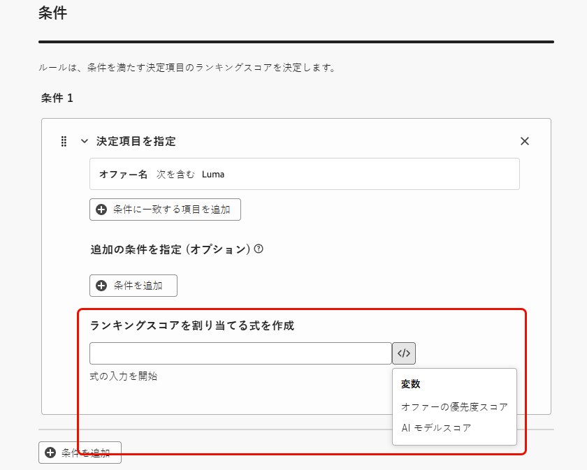{width="70%"}

   >[!NOTE]
   >
   >フィールドの横にあるアイコンをクリックして、定義済みの変数を追加します。

1. 「**[!UICONTROL 条件を追加]**」をクリックし、必要な回数に応じて 1 つ以上の条件を追加します。 ロジックは次のとおりです。
   * 特定の決定項目に対して最初の条件が true である場合、その条件は次の条件よりも優先されます。
   * 最初の条件が true でない場合、決定エンジンは 2 番目の条件に進み、それ以降も同様に処理されます。

1. 最後のフィールドでは、上記の条件を満たさないすべての決定項目に割り当てられる式を作成できます。

   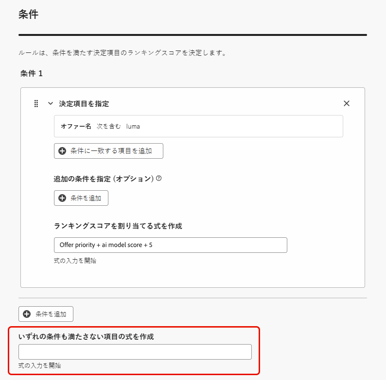{width="70%"}

   +++ランキング式の例

   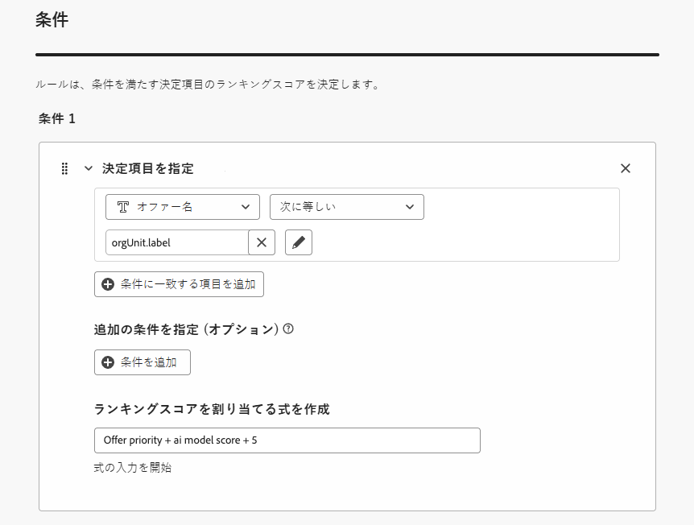{width="80%"}

   決定項目の地域（カスタム属性）がプロファイルの地理ラベル（プロファイル属性）と等しい場合、ここで表されるランキングスコア（決定項目の優先度、AI モデルスコア、静的な値の組み合わせ）が、その条件を満たすすべての決定項目に適用されます。

   +++

1. 数式の準備ができたら、**[!UICONTROL 作成]**&#x200B;をクリックします。

リストからランキング式にアクセスして、その詳細を表示し、編集または削除できるようになりました。 実施要件を満たす決定項目をランク付けするための[選択戦略](../selection-strategies.md)で使用する準備が整いました。

## コードエディターを使用した条件の定義 {#ranking-code-editor}

ランキングロジックを&#x200B;**PQL**&#x200B;式として記述または編集する場合は、**[!UICONTROL コードエディター]**&#x200B;に切り替えます。


>[!NOTE]
>
>このアクションは、この式のデフォルトのビルダー表示に戻るのを防ぎます。

プロファイル属性、[ コンテキストデータ ](../context-data.md)および[決定項目属性](../items.md#attributes)を利用できます。

例えば、実際の気温が高い場合に、「hot」属性を持つすべてのオファーの優先度を上げるとします。 そのために、決定の呼び出し時に **contextData.weather=hot** を渡しています。

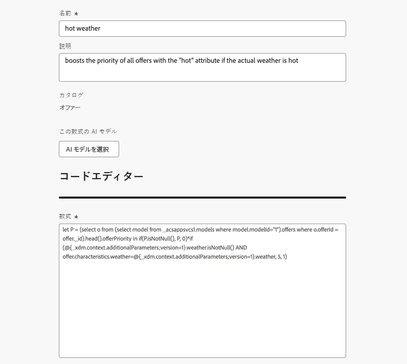{width="80%"}

数式で決定項目に関連する属性を活用するには、ランキング式のコードで正しい構文に従っていることを確認してください。 詳しくは、各節を展開してください。

+++決定項目の標準属性の活用

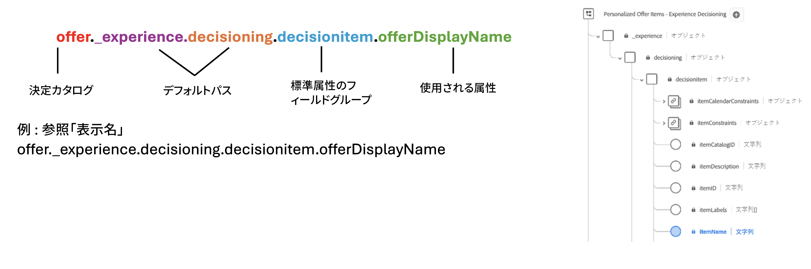

+++

+++決定項目のカスタム属性の活用

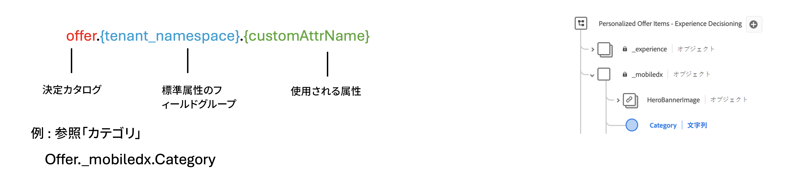

+++

ニーズに応じて、さまざまなコードベースのランキング式を作成できます。 以下に例を示します。

+++プロファイル属性に基づいた特定のオファー属性を持つオファーのブースト

オファーに対応する市区町村にプロファイルが住んでいる場合は、その市区町村内のすべてのオファーの優先度を 2 倍にします。

**ランキング式：**

```
if( offer.characteristics.get("city") = homeAddress.city, offer.rank.priority * 2, offer.rank.priority)
```

+++

+++終了日が今から 24 時間以内のオファーのブースト

**ランキング式：**

```
if( offer.selectionConstraint.endDate occurs <= 24 hours after now, offer.rank.priority * 3, offer.rank.priority)
```

+++

+++オファーされる製品を顧客が購入する傾向に基づいたオファーのブースト

顧客の傾向スコアに基づいて、オファーのスコアを上げることができます。

この例では、インスタンステナントは *_salesvelocity* です。また、プロファイルスキーマには、一連のスコアが配列に格納されます。

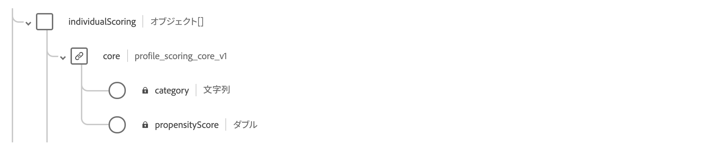

これを前提として、例えば、次のようなプロファイルの場合、

```
{"_salesvelocity": {"individualScoring": [
                    {"core": {
                            "category":"insurance",
                            "propensityScore": 96.9
                        }},
                    {"core": {
                            "category":"personalLoan",
                            "propensityScore": 45.3
                        }},
                    {"core": {
                            "category":"creditCard",
                            "propensityScore": 78.1
                        }}
                    ]}
}
```

+++

+++プロファイルの郵便番号と年収に基づいたオファーのブースト

この例では、システムは常に最初に郵便番号が一致するオファーを表示しようとし、一致が見つからない場合は一般的なオファーにフォールバックして、他の郵便番号向けのオファーの表示を回避します。

```pql
if( offer._luma.offerDetails.zipCode = _luma.zipCode,luma.annualIncome / 1000 + 10000, if( not offer.luma.offerDetails.zipCode,_luma.annualIncome / 1000, -9999) )
```

数式の機能：

* オファーの郵便番号がユーザーと同じ場合は、最初に選択されるように非常に高いスコアを付けます。
* オファーに郵便番号がまったく含まれていない場合（一般的なオファーの場合）は、ユーザーの収入に基づいて通常のスコアを付けます。
* オファーの郵便番号がユーザーと異なる場合は、選択されないように非常に低いスコアを付けます。

+++

+++コンテキストデータに基づいてオファーの優先度を上げる

[!DNL Journey Optimizer] を使用すると、呼び出しで渡されるコンテキストデータに基づいて、特定のオファーの優先度を上げることができます。 例えば、`contextData.weather=hot` が渡される場合は、`attribute=hot` を含んだすべてのオファーの優先度を上げる必要があります。

>[!NOTE]
>
>コンテキストデータを渡す方法について詳しくは<!-- using the **Edge Decisioning** and **Decisioning** APIs-->、[この節](../context-data.md)を参照してください。

**Decisioning** API を使用する場合は、次の例のように、コンテキストデータをリクエスト本文のプロファイル要素に追加します。

```
"xdm:profiles": [
{
    "xdm:identityMap": {
        "crmid": [
            {
            "xdm:id": "CRMID1"
            }
        ]
    },
    "xdm:contextData": [
        {
            "@type":"_xdm.context.additionalParameters;version=1",
            "xdm:data":{
                "xdm:weather":"hot"
            }
        }
    ]
    
}],
```

+++

## AIを活用した計算式の最適化 {#optimize}

[!DNL Journey Optimizer]は、ランキング式を自動的に分析し、元のロジックを保持する簡略化を提案できます。 PQL式が&#x200B;**2 KB** （UTF-8 エンコード）より大きい式のみが対象です。小さい式は分析されません。 簡略化が見つかると、リスト内の数式名の横に赤いインジケーターが表示されます。


>[!NOTE]
>
>AIを活用した数式最適化は、**AI アシスタント**&#x200B;と同じ生成AI機能に依存し、同じアクセス制御を使用します。 ユーザーには、**[!UICONTROL AI アシスタント]** リソースに対する&#x200B;**[!UICONTROL コンテンツを生成]**&#x200B;権限を付与する必要があります。 詳しくは、[AI アシスタントへのアクセス ](../../content-management/gs-generative.md#generative-access)を参照してください。

ランキング式を最適化するには、次の手順に従います。

1. ランキング式リストで、数式名の横にある赤いインジケーターアイコンをクリックします。

1. 「**[!UICONTROL 最適化]**」ウィンドウが開き、元のPQL式がAIが提案したバージョンと共に表示されます。

   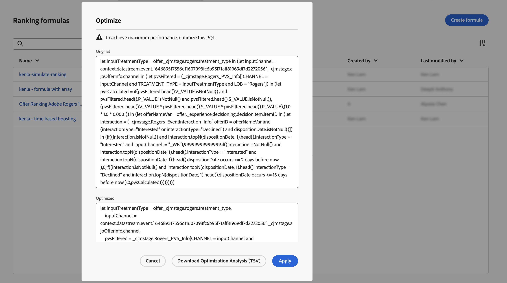

1. 両方の式が同じランキング結果を生成することを検証するには、**[!UICONTROL 最適化分析（TSV）]**&#x200B;をクリックして、シミュレートされたプロファイルが各バージョンに対してどのように評価されるかを示すファイルをダウンロードします。

1. 満足したら、**[!UICONTROL 適用]**&#x200B;をクリックして、元の式を最適化された式に置き換えます。

## チュートリアルビデオ {#video}

Adobe Journey Optimizer の AI 式ビルダーを使用して、カスタムオファーランキング戦略を作成する方法について説明します。

>[!VIDEO](https://video.tv.adobe.com/v/3464446/?learn=on&enablevpops)
