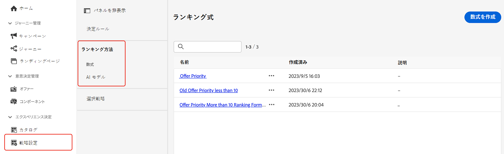

# ランキング方法 {#rankings}

ランキング方法を使用すると、特定のプロファイルに対して表示する項目をランク付けできます。ランキング方法を作成したら、その方法を選択戦略に割り当てて、最初に選択する項目を定義できます。

次の 2 種類のランキング方法が使用できます。

* **式**&#x200B;を使用すると、項目の優先度スコアを考慮するのではなく、最初に提示する項目を決定するルールを定義できます。

* **AI モデル**&#x200B;を使用すると、複数のデータポイントを活用するトレーニング済みモデルシステムを使用して、最初に提示する項目を決定できます。

## ランキング方法の作成 {#create}

ランキング方法を作成するには、次の手順に従います。

1. **[!UICONTROL 戦略の設定]**&#x200B;メニューに移動し、使用するランキングのタイプに応じて&#x200B;**[!UICONTROL 数式]**&#x200B;または **[!UICONTROL AI モデル]**&#x200B;メニューを選択します。

   

1. 画面の右上隅にある「**[!UICONTROL 数式を作成]**」または「**[!UICONTROL AI モデルを作成]**」ボタンをクリックします。

   ランキング式と AI モデルを作成する方法について詳しくは、次の節を参照してください。

   * [ランキング式](ranking-formulas.md)
   * [AI モデル](ai-models.md)

1. ニーズに合わせて数式または AI モデルを設定して、保存します。

これで、ランキング方法を[選択戦略](../selection-strategies.md)で使用して、実施要件を満たす決定項目をランク付けする準備が整いました。

