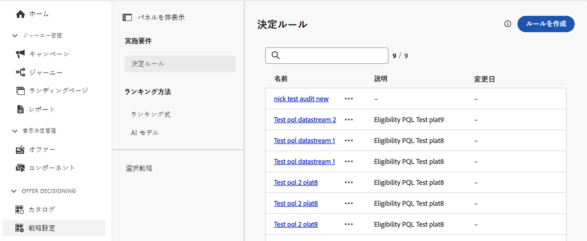

# 決定ルール {#rules}

>[!CONTEXTUALHELP]
>id="ajo_exd_config_rules"
>title="決定ルールの作成"
>abstract="決定ルールを使用すると、決定項目レベルで直接、または特定の選択戦略内で制約を適用することで、決定項目のオーディエンスを定義できます。これにより、項目を提示する対象を正確に制御できます。"

## 決定ルールについて {#about}

決定ルールを使用すると、決定項目レベルで直接、または特定の選択戦略内で制約を適用することで、決定項目のオーディエンスを定義できます。これにより、項目を提示する対象を正確に制御できます。

例えば、女性向けに作られたヨガ関連製品を特集した決定項目があるシナリオを考えてみましょう。決定ルールを使用すると、性別が「女性」で、「ヨガ」に「興味」を示したプロファイルにのみ、これらの項目を表示するように指定できます。

>[!NOTE]
>
>項目および選択戦略レベルの決定ルールに加えて、キャンペーンレベルで意図したオーディエンスを定義することもできます。[詳細情報](../campaigns/create-campaign.md#audience)

決定ルールのリストには、**[!UICONTROL 戦略設定]**&#x200B;メニューからアクセスできます。

## 決定ルールの作成 {#create}

決定ルールを作成するには、次の手順に従います。

1. **[!UICONTROL 戦略設定]**／**[!UICONTROL 決定ルール]**&#x200B;に移動し、「**[!UICONTROL ルールを作成]**」ボタンをクリックします。

   >[!NOTE]
   >
   >また、Adobe Experience Platform のデータを使用して、外部データで決定ロジックを強化することもできます。これは、製品の在庫状況やリアルタイムの価格設定など、頻繁に変更される属性の場合に特に役立ちます。この機能は現在、パブリックベータ版としてすべてのお客様にご使用いただけます。アクセス権をご希望の場合は、アカウント担当者にお問い合わせください。[決定の Adobe Experience Platform データの使用方法の詳細情報](../experience-decisioning/aep-data-exd.md)

1. 決定ルール作成画面が開きます。ルールに名前を付け、説明を入力します。

1. Adobe Experience Platform セグメントビルダーを使用して、ニーズに合った決定ルールを作成します。それには、次のような様々なデータソースを活用できます。
   * プロファイルと決定項目の属性。
   * オーディエンス。
   * Adobe Experience Platform から取得されるコンテキストデータ。[コンテキストデータの活用方法について説明します](context-data.md)

   

   >[!NOTE]
   >
   >決定ルールを作成するために用意されているセグメントビルダーは、Adobe Experience Platform セグメント化サービスで使用されるものと比べて、特性がいくつかあります。ただし、本ドキュメントで説明されているグローバルプロセスは、決定ルールを作成する場合にも有効です。[詳しくは、セグメント定義の作成方法を参照してください](../audience/creating-a-segment-definition.md)

1. ワークスペースに新しいフィールドを追加および設定すると、**[!UICONTROL オーディエンスのプロパティ]**&#x200B;パネルに、オーディエンスに属する推定プロファイルに関する情報が表示されます。「**[!UICONTROL 予測を更新]**」をクリックして、データを更新します。

   >[!NOTE]
   >
   >プロファイルの予測は、コンテキストデータなどのプロファイルにないデータがルールパラメーターに含まれている場合は使用できません。

1. 決定ルールの準備が整ったら、「**[!UICONTROL 保存]**」をクリックします。作成されたルールはリストに表示され、決定項目と選択戦略で使用して、プロファイルへの決定項目の表示を制御できます。

   >[!NOTE]
   >
   >実施要件ルールのネスト深度は 30 レベルに制限されています。これは、PQL 文字列内の `)` の閉じ丸括弧をカウントすることによって測定されます。UTF-8 でエンコードされた文字の場合、ルール文字列のサイズは最大 15 KB になります。これは、15,000 個の ASCII 文字（各 1 バイト）、または 3,750～7,500 個の非 ASCII 文字（各 2～4 バイト）に相当します。[詳しくは、決定ガードレールと制限を参照してください](gs-experience-decisioning.md#guardrails)
