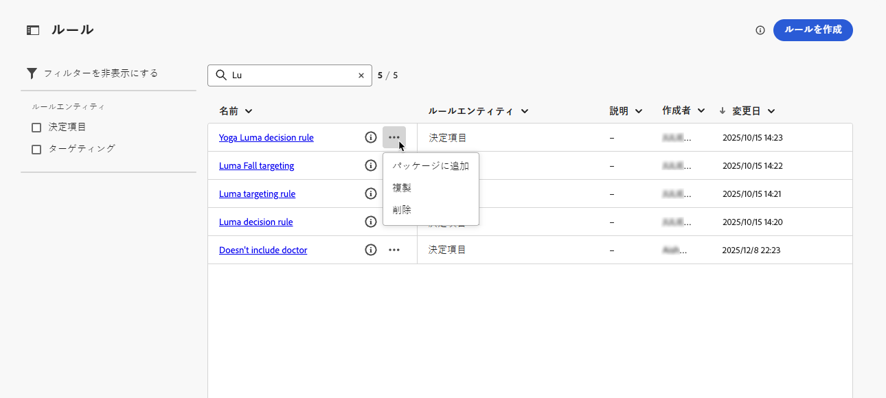
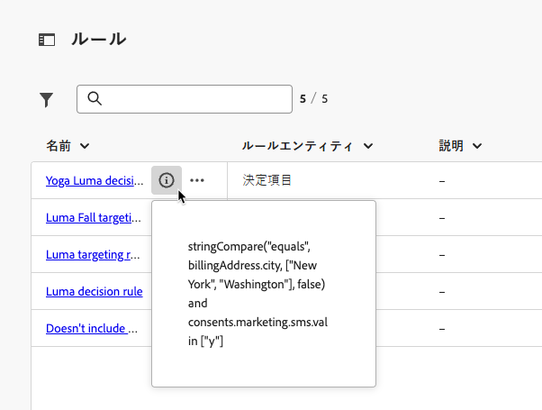
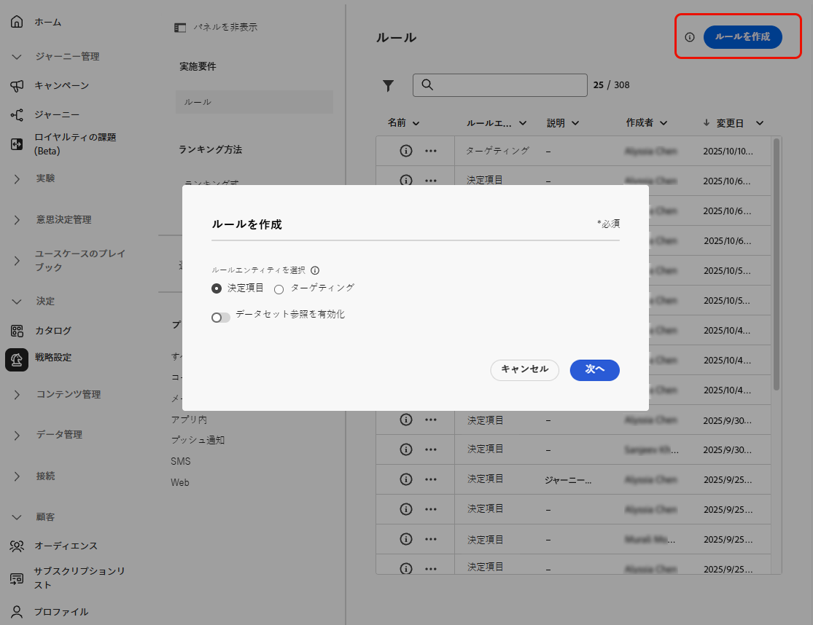
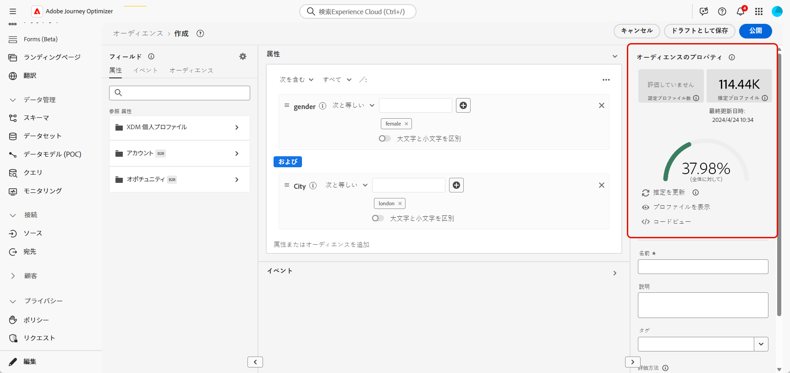

# ルールの作成 {#rules}

>[!CONTEXTUALHELP]
>id="ajo_exd_config_rules"
>title="ルールの作成"
>abstract="決定項目または選択戦略で使用して、どの項目をどのオーディエンスに提示するかを制御できる&#x200B;**決定ルール**&#x200B;や、パーソナライズされたコンテンツを受信するか、特定のジャーニーパスにエントリする実施要件を満たす特定のオーディエンスセグメントを決定する&#x200B;**ターゲティングルール**&#x200B;の 2 つのタイプのルールを作成できます。  決定ルールを作成する際に、「**[!UICONTROL データセット参照を有効にする]**」を選択して、Adobe Experience Platform データを使用できます。これにより、動的な外部属性に基づいて実施要件の条件を定義でき、関連する場合にのみ決定項目が表示されるようになります。"

## ルールについて {#about}

[!DNL Journey Optimizer] では、次の 2 つのタイプの再利用可能なルールを作成できます。

* [決定ルール](#decision-rules)
* [ターゲティングルール](#targeting-rules)

### 決定ルール {#decision-rules}

決定ルールを使用すると、決定項目レベルで直接、または特定の選択戦略内で制約を適用することで、決定項目のオーディエンスを定義できます。 これにより、項目を提示する対象を正確に制御できます。

例えば、女性向けに作られたヨガ関連製品を特集した決定項目があるシナリオを考えてみましょう。決定ルールを使用すると、性別が「女性」で、「ヨガ」に「興味」を示したプロファイルにのみ、これらの項目を表示するように指定できます。

>[!NOTE]
>
>項目および選択戦略レベルの決定ルールに加えて、キャンペーンレベルで意図したオーディエンスを定義することもできます。[詳細情報](../campaigns/create-campaign.md#audience)

### ターゲティングルール {#targeting-rules}

>[!AVAILABILITY]
>
>ターゲティングルールは現在、限定提供（LA）です。 アクセス権を取得するには、アドビ担当者にお問い合わせください。
>
>この機能は、**決定**&#x200B;アドオン機能を購入した組織のみが利用できます。すべての顧客に段階的にロールアウトされる予定です。

ターゲティングルールを使用すると、特定のオーディエンスセグメントに基づいて、顧客がパーソナライズされたコンテンツを受信するか、特定のジャーニーパスにエントリする実施要件を満たす必要がある特定の資格を決定できるので、ジャーニーやキャンペーンでサブオーディエンスをターゲットに設定できます。

多くの場合、これらは、顧客行動イベントやコンテキストデータに加えて、複数の属性の組み合わせになります。時間と労力を節約するために、ターゲティングルールを一度作成して、ジャーニーやキャンペーンをまたいで再利用できます。また、オーサリング時にインラインですばやく変更することもできます。

これらのルールは、次のいずれかの場合に使用できます。

* ジャーニーやキャンペーンで[コンテンツ最適化ターゲティング](../campaigns/campaigns-message-optimization.md#targeting)を作成する場合。
* [ジャーニーパスの最適化](../building-journeys/optimize.md#targeting)を作成する場合。

➡️ [この機能をビデオで確認](#video)

## アクセスルール {#access}

ルールのリストには、**[!UICONTROL 決定]**／**[!UICONTROL 戦略設定]**&#x200B;メニューでアクセスできます。

次のアクションが使用できます。

* ルールエンティティ（**[!UICONTROL 決定項目]**&#x200B;または&#x200B;**[!UICONTROL ターゲティング]** - [詳細情報](#about)）でフィルタリングできます。

* ルールの名前をクリックしてルールを選択し、ルールビルダーを使用して編集します。[詳細情報](#create)

* 各項目の横にある「**[!UICONTROL その他のアクション]**」ボタンから、次の操作を実行できます。

   * **[!UICONTROL 決定項目]**&#x200B;エンティティを選択した場合、別のサンドボックスにエクスポートするには、ルールをパッケージに追加します。方法について詳しくは、[別のサンドボックスへのオブジェクトのエクスポート](../configuration/copy-objects-to-sandbox.md)を参照してください。
   * ルールを複製します。
   * ルールを削除します。

{width=100%}

* **[!UICONTROL 詳細情報]**&#x200B;アイコンをクリックして、ルールを構成する式を表示します。

{width=60%}

## ルールの作成 {#create}

ルールを作成するには、次の手順に従います。

1. **[!UICONTROL 決定]**／**[!UICONTROL 戦略設定]**／**[!UICONTROL ルール]**&#x200B;に移動し、「**[!UICONTROL ルールを作成]**」ボタンをクリックします。

1. ルールエンティティを選択して、ルールを作成するオブジェクトのタイプを指定します。

   {width=90%}

   * **[!UICONTROL 決定項目]** - ルールは、決定のコンテキスト内の[決定項目](#decision-rules)に適用できます。
   * **[!UICONTROL ターゲティング]** - ルールは、キャンペーンまたはジャーニーの[コンテンツ最適化](../campaigns/campaigns-message-optimization.md#targeting)の一部として、または[ジャーニーを最適化アクティビティ](../building-journeys/optimize.md#targeting)のいずれかで[ターゲティング](#targeting-rules)ルールを作成する際に使用できます。

1. **[!UICONTROL 決定項目]**&#x200B;ルールを作成する場合は、「**[!UICONTROL データセット参照を有効にする]**」を選択して、Adobe Experience Platform のデータを使用して、外部データで決定ロジックを強化できます。これは、製品の在庫状況やリアルタイムの価格設定など、頻繁に変更される属性の場合に特に役立ちます。

   >[!AVAILABILITY]
   >
   >この機能は現在、パブリックベータ版としてすべてのお客様にご使用いただけます。アクセス権をご希望の場合は、アカウント担当者にお問い合わせください。[決定の Adobe Experience Platform データの使用方法の詳細情報](../experience-decisioning/aep-data-exd.md)

1. ルール作成画面が開きます。ルールに名前を付け、説明を入力します。

1. Adobe Experience Platform セグメントビルダーを使用して、ニーズに合ったルールを作成します。それには、次のような様々なデータソースを活用できます。
   * プロファイル属性。
   * 決定項目属性 - **[!UICONTROL 決定項目]**&#x200B;ルールを作成する際にのみ使用できます。
   * オーディエンス。
   * Adobe Experience Platform から取得されるコンテキストデータ。[コンテキストデータの活用方法について説明します](context-data.md)

   {width=85%}

   >[!NOTE]
   >
   >ルールを作成するために用意されているセグメントビルダーは、Adobe Experience Platform セグメント化サービスで使用されるものと比べて、特性がいくつかあります。ただし、ドキュメントで説明されているグローバルプロセスは、[!DNL Journey Optimizer] でルールを作成する場合に有効です。[詳しくは、セグメント定義の作成方法を参照してください](../audience/creating-a-segment-definition.md)

1. ワークスペースに新しいフィールドを追加および設定すると、**[!UICONTROL オーディエンスのプロパティ]**&#x200B;パネルに、オーディエンスに属する推定プロファイルに関する情報が表示されます。「**[!UICONTROL 予測を更新]**」をクリックして、データを更新します。

   {width=85%}

   >[!NOTE]
   >
   >プロファイルの予測は、コンテキストデータなどのプロファイルに保存されていないデータがルールパラメーターに含まれている場合は使用できません。

1. ルールの準備が整ったら、「**[!UICONTROL 作成]**」をクリックします。作成したルールはリストに表示され、作成したエンティティに応じて次の場合に使用できます。

   * **決定項目**&#x200B;と&#x200B;**選択戦略**&#x200B;で、プロファイルに対する決定項目の表示を管理する場合。
   * または、コンテンツ最適化やパス最適化で&#x200B;**ターゲティング**&#x200B;を作成する場合。

>[!NOTE]
>
>ルールのネスト深度は 30 レベルに制限されています。これは、PQL 文字列内の `)` の閉じ丸括弧をカウントすることによって測定されます。
>
>UTF-8 でエンコードされた文字の場合、ルール文字列のサイズは最大 15 KB になります。これは、15,000 個の ASCII 文字（各 1 バイト）、または 3,750～7,500 個の非 ASCII 文字（各 2～4 バイト）に相当します。
>
>[実施要件ルールのガードレールと制限の詳細情報](decisioning-guardrails.md#eligibility-rules)

## チュートリアルビデオ {#video}

Adobe Journey Optimizerで再利用可能な **ターゲティングルール** を作成、複製、適用して、地域、言語、行動などの顧客属性に基づいてキャンペーンを効率的にパーソナライズし、オーディエンスの精度を高めながら時間を節約する方法を説明します。

>[!VIDEO](https://video.tv.adobe.com/v/3476127/?quality=12)
