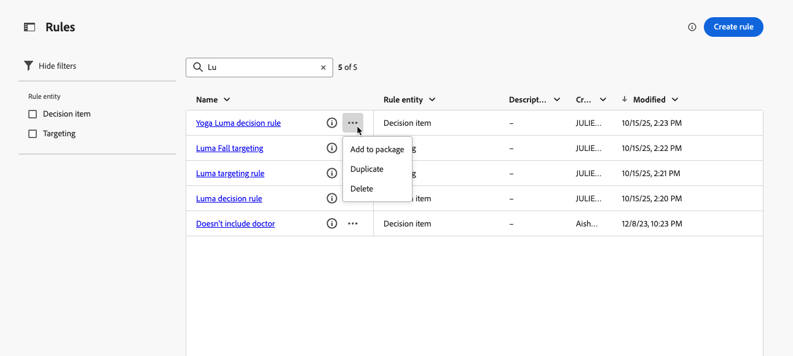
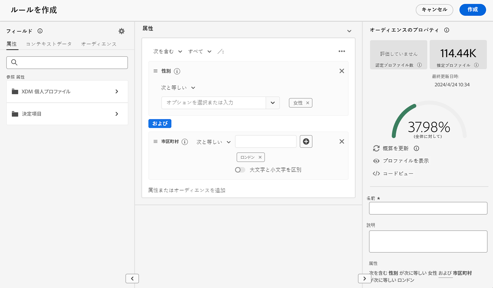
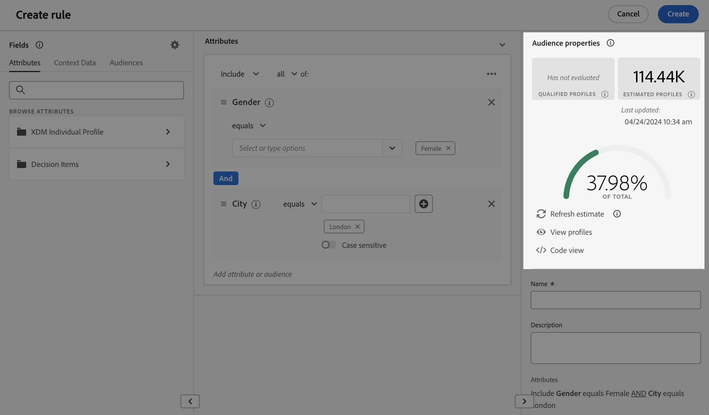

# ルールの作成 {#rules}

>[!CONTEXTUALHELP]
>id="ajo_exd_config_rules"
>title="ルールの作成"
>abstract="決定項目や選択戦略で使用できる **決定ルール**、どの項目をどのオーディエンスに提示するかを制御する **ターゲティングルール）の 2 種類のルールを作成できます。または、パーソナライズされたコンテンツを受信する資格のある特定のオーディエンスセグメントを決定する**、特定のジャーニーパスを入力する）ことができます。   決定ルールを作成する際に、「**[!UICONTROL データセットのルックアップを有効にする]** を選択して、Adobe Experience Platform データを使用できます。 これにより、動的な外部属性に基づいて実施要件の条件を定義でき、関連する場合にのみ決定項目が表示されるようになります。"

## ルールについて {#about}

[!DNL Journey Optimizer] では、次の 2 種類の再利用可能なルールを作成できます。

* [決定ルール](#decision-rules)
* [ターゲティングルール](#targeting-rules)

### 決定ルール {#decision-rules}

決定ルールを使用すると、決定項目レベルで直接制約を適用するか、特定の選択戦略内で制約を適用することで、決定項目のオーディエンスを定義できます。 これにより、項目を提示する対象を正確に制御できます。

例えば、女性向けに作られたヨガ関連製品を特集した決定項目があるシナリオを考えてみましょう。決定ルールを使用すると、性別が「女性」で、「ヨガ」に「興味」を示したプロファイルにのみ、これらの項目を表示するように指定できます。

>[!NOTE]
>
>項目および選択戦略レベルの決定ルールに加えて、キャンペーンレベルで意図したオーディエンスを定義することもできます。[詳細情報](../campaigns/create-campaign.md#audience)

### ターゲティングルール {#targeting-rules}

>[!AVAILABILITY]
>
>ターゲティングルールは現在、限定提供（LA）になっています。 アクセス権を取得するには、アドビ担当者にお問い合わせください。
>
>この機能は、**Decisioning** アドオン機能を購入した組織のみが利用できます。 すべての顧客に段階的にロールアウトされます。

ターゲティングルールを使用すると、特定のオーディエンスセグメントに基づいて、パーソナライズされたコンテンツを受け取ったり、特定のジャーニーパスにエントリしたりするために顧客が満たす必要がある特定の資格を決定できます。これにより、ジャーニーやキャンペーンのサブオーディエンスをターゲットに設定できます。

多くの場合、顧客行動イベントとコンテキストデータに加えて、複数の属性が組み合わされています。 時間と労力を節約するために、ターゲティングルールを 1 回作成すると、それらをジャーニーやキャンペーン全体で再利用できます。オーサリング時にインラインですばやく変更することもできます。

これらのルールは次のどちらでも使用できます。

* ジャーニーやキャンペーンで [ コンテンツ最適化のターゲティング ](../campaigns/campaigns-message-optimization.md#targeting) を作成する場合
* 作成時 [ ジャーニーパスの最適化 ](../building-journeys/optimize.md#targeting)。

➡️ [この機能について詳しくは、ビデオを参照してください](#video)。

## アクセスルール {#access}

ルールのリストには、**[!UICONTROL 決定]** / **[!UICONTROL 戦略設定]** メニューでアクセスできます。

次のアクションを使用できます。

* ルールエンティティ（**[!UICONTROL 決定項目]** または **[!UICONTROL ターゲティング]** - [ 詳細情報 ](#about)）でフィルタリングできます。

* ルール名をクリックして選択し、ルールビルダーを使用して編集します。 [詳細情報](#create)

* 各項目の横にある **[!UICONTROL その他のアクション]** ボタンから、次の操作を実行できます。

   * **[!UICONTROL 決定項目]** エンティティを選択した場合、別のサンドボックスに書き出すために、ルールをパッケージに追加します。 詳細情報 [ 別のサンドボックスへのオブジェクトの書き出し ](../configuration/copy-objects-to-sandbox.md)
   * ルールを複製します。
   * ルールを削除します。

{width=100%}

* **[!UICONTROL 詳細情報]** アイコンをクリックして、ルールを構成する式を表示します。

{width=60%}

## ルールの作成 {#create}

ルールを作成するには、次の手順に従います。

1. **[!UICONTROL 決定]**/**[!UICONTROL 戦略設定]**/**[!UICONTROL ルール]** に移動し、「**[!UICONTROL ルールを作成]**」ボタンをクリックします。

1. ルール エンティティを選択して、ルールを作成するオブジェクトのタイプを指定します。

   {width=90%}

   * **[!UICONTROL 決定項目]** - ルールは、決定のコンテキストでは [ 決定項目 ](#decision-rules) に適用できます。
   * **[!UICONTROL ターゲティング]** - ルールは、キャンペーンまたはジャーニーの [ コンテンツ最適化 ](#targeting-rules) の一部として、または [ ジャーニーの最適化 ](../campaigns/campaigns-message-optimization.md#targeting) アクティビティ [ でターゲティング ](../building-journeys/optimize.md#targeting) ルールを作成する際に使用できます。

1. **[!UICONTROL 決定項目]** ルールを作成する場合は、「**[!UICONTROL データセット検索を有効にする]** を選択して、Adobe Experience Platformのデータを使用し、外部データを使用して決定ロジックを強化できます。 これは、製品の在庫状況やリアルタイムの価格設定など、頻繁に変更される属性の場合に特に役立ちます。

   >[!AVAILABILITY]
   >
   >この機能は現在、パブリックベータ版としてすべてのお客様にご使用いただけます。アクセス権をご希望の場合は、アカウント担当者にお問い合わせください。[決定の Adobe Experience Platform データの使用方法の詳細情報](../experience-decisioning/aep-data-exd.md)

1. ルール作成画面が開きます。 ルールに名前を付け、説明を入力します。

1. Adobe Experience Platform セグメントビルダーを使用して、ニーズに合ったルールを作成します。 それには、次のような様々なデータソースを活用できます。
   * プロファイル属性：
   * 決定項目属性 – **[!UICONTROL 決定項目]** ルールの作成時にのみ使用できます。
   * オーディエンス；
   * Adobe Experience Platform から取得されるコンテキストデータ。[コンテキストデータの活用方法について説明します](context-data.md)

   {width=85%}

   >[!NOTE]
   >
   >ルールを作成するために用意されているセグメントビルダーは、Adobe Experience Platform Segmentation サービスで使用されるものと比較して、特異性がいくつかあります。 ただし、ドキュメントで説明されているグローバルプロセスは、[!DNL Journey Optimizer] でルールを作成する場合にも有効です。 [詳しくは、セグメント定義の作成方法を参照してください](../audience/creating-a-segment-definition.md)

1. ワークスペースに新しいフィールドを追加および設定すると、**[!UICONTROL オーディエンスのプロパティ]**&#x200B;パネルに、オーディエンスに属する推定プロファイルに関する情報が表示されます。「**[!UICONTROL 予測を更新]**」をクリックして、データを更新します。

   {width=85%}

   >[!NOTE]
   >
   >プロファイルの予測は、ルールパラメーターにコンテキストデータなど、プロファイルに保存されていないデータが含まれる場合は使用できません。

1. ルールの準備が整ったら、「**[!UICONTROL 作成]**」をクリックします。 作成したルールがリストに表示され、作成したエンティティに応じて次の方法で使用できます。

   * **決定項目** および **選択戦略** で、プロファイルに対する決定項目の表示を管理します。
   * または、コンテンツの最適化やパスの最適化で **ターゲティング** を構築する場合にも使用できます。

>[!NOTE]
>
>ルールのネストの深さは 30 レベルに制限されています。 これは、PQL文字列で `)` まれている閉じ丸括弧をカウントして測定します。
>
>UTF-8 でエンコードされた文字の場合、ルール文字列のサイズは最大 15 KB になります。これは、15,000 個の ASCII 文字（各 1 バイト）、または 3,750～7,500 個の非 ASCII 文字（各 2～4 バイト）に相当します。
>
>[ 実施要件ルールのガードレールと制限事項の詳細 ](decisioning-guardrails.md#eligibility-rules)

## チュートリアルビデオ {#video}

Adobe Journey Optimizerで再利用可能な **ターゲティングルール** を作成、複製、適用して、地域、言語、行動などの顧客属性に基づいてキャンペーンを効率的にパーソナライズし、オーディエンスの精度を高めながら時間を節約する方法を説明します。

>[!VIDEO](https://video.tv.adobe.com/v/3476127/?quality=12)
