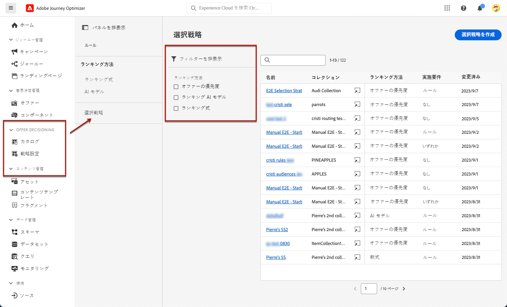

# 選択戦略の作成 {#selection-strategies}

>[!CONTEXTUALHELP]
>id="ajo_exd_config_strategies"
>title="選択戦略の定義"
>abstract="選択戦略は、再利用可能な項目で、実施要件の制約およびランキング方法に関連付けられたコレクションで構成され、決定方針が選択されている場合に表示されるオファーを決定します。"
>additional-url="https://experienceleague.adobe.com/docs/journey-optimizer/using/experience-decisioning/create-decision.html?lang=ja" text="決定ポリシーを作成"

>[!CONTEXTUALHELP]
>id="ajo_exd_strategy_eligibility"
>title="実施要件を満たすプロファイルの制限"
>abstract="この選択戦略では、オファーの選択を制限できます。デフォルトでは、すべてのプロファイルが実施要件を満たしていますが、オーディエンスやルールを使用すると、オファーの選択を特定のプロファイルのみに制限できます。"
>additional-url="https://experienceleague.adobe.com/docs/journey-optimizer/using/audiences-profiles-identities/audiences/about-audiences.html?lang=ja" text="オーディエンスを使用"
>additional-url="https://experienceleague.adobe.com/docs/journey-optimizer/using/experience-decisioning/selection/rules.html?lang=ja" text="決定ルールを使用"

>[!BEGINSHADEBOX &quot;このドキュメントガイドの内容&quot;]

* [Offer Decisioning の基本を学ぶ](gs-experience-decisioning.md)
* 決定項目を管理します。 [項目カタログを設定](catalogs.md) - [決定項目の作成](items.md) - [項目コレクションを管理](collections.md)
* 項目の選択を設定： [決定ルールの作成](rules.md) - [ランキングメソッドの作成](ranking.md)
* **[選択戦略の作成](selection-strategies.md)**
* [決定ポリシーを作成](create-decision.md)

>[!ENDSHADEBOX]

選択戦略は、再利用可能な項目で、実施要件の制約およびランキング方法に関連付けられたコレクションで構成され、[決定方針](create-decision.md)が選択されている場合に表示されるオファーを決定します。

## 選択戦略へのアクセスと管理

1. **[!UICONTROL Offer Decisioning]**／**[!UICONTROL 設定]**／**[!UICONTROL 選択戦略]**&#x200B;に移動します。

1. これまでに作成した選択戦略がすべてリストされます。ランキングメソッドに従って戦略を取得するのに役立つフィルターを使用できます。

   

1. 選択戦略名をクリックして編集します。

1. 各戦略で選択したコレクション、ランキング方法および実施要件も表示されます。各コレクション名の横にあるアイコンをクリックして、コレクションを直接編集できます。

   

## 選択戦略の作成

選択戦略を作成するには、次の手順に従います。

1. **[!UICONTROL 選択戦略]**&#x200B;インベントリから、「**[!UICONTROL 選択戦略を作成]**」をクリックします。

   

1. 戦略の名前を追加します。

   >[!NOTE]
   >
   >現在はデフォルトの&#x200B;**[!UICONTROL オファー]**&#x200B;カタログのみを使用できます。

1. 名前で始まる、選択戦略の詳細を入力します。

   

1. 検討するオファーを含む[コレクション](collections.md)を選択します。

1. 検討するオファーを含むオファー[コレクション](collections.md)を選択します。

1. 「**[!UICONTROL 実施要件]**」フィールドを使用して、この選択戦略のオファーの選択を制限します。

   

   * オファーの選択を Experience Platform オーディエンスのメンバーに制限するには、「**[!UICONTROL オーディエンス]**」を選択して、リストからオーディエンスを選択します。[オーディエンスの使用方法を学ぶ](../audience/about-audiences.md)

   * 決定ルールに選択制約を追加する場合は、「**[!UICONTROL 決定ルール]**」オプションを使用し、任意のルールを選択します。[ルールの作成方法を学ぶ](rules.md)

1. プロファイルごとに最適なオファーを選択するためのランキング方法を定義します。[詳細情報](#select-ranking-method)

   

   * デフォルトでは、複数のオファーがこの戦略の実施要件を満たす場合、[オファーの優先度](#offer-priority)メソッドは、オファーで定義された値を使用します。

   * 特定の計算済みスコアを使用して配信する実施要件を満たすオファーを選択する場合は、「[数式](#ranking-formula)」または「[AI モデル](#ai-ranking)」を選択します。

1. 「**[!UICONTROL 作成]**」をクリックします。これで、[決定](create-decision.md)で使用する準備が整いました

## ランキング方法を選択 {#select-ranking-method}

>[!CONTEXTUALHELP]
>id="ajo_exd_strategy_ranking"
>title="オファーのランク付け方法の定義"
>abstract="特定の選択戦略に対して実施要件を満たすオファーが複数ある場合、選択戦略（優先度またはランキング式）を作成する際に各プロファイルに最適なオファーを選択する方法を選べます。"
>additional-url="https://experienceleague.adobe.com/docs/journey-optimizer/using/experience-decisioning/create-decision.html?lang=ja" text="決定ポリシーを作成"

特定の選択戦略に対して実施要件を満たすオファーが複数ある場合、選択戦略を作成する際に各プロファイルに最適なオファーを選択する方法を選べます。オファーのランク付けは、次の基準で行えます。

* [オファーの優先度](#offer-priority)
* [数式](#ranking-formula)
* [AI ランキング](#ai-ranking)

### オファーの優先度 {#offer-priority}

決定において特定のプレースメントに対して実施要件を満たすオファーが複数ある場合、デフォルトでは、**優先度**&#x200B;が最も高いオファーが最初に顧客に配信されます。

オファーの優先度スコアは、[決定項目](items.md)の作成時に割り当てられます。

### ランキング式 {#ranking-formula}

Journey Optimizer では、オファーの優先度に加えて、**ランキング式**&#x200B;を作成できます。これらは、特定のプレースメントに対して最初に表示するオファーを決定する数式であり、オファーの優先度スコアを考慮するものではありません。

例えば、終了日が今から 24 時間以内のすべてのオファーの優先度を上げることもできますし、プロファイルの目標地点が「実行中」の場合は「実行中」カテゴリのオファーの優先度を上げることもできます。ランキング式を作成する方法については、[この節](ranking.md)を参照してください。

作成したら、この数式を選択戦略で使用できます。この選択戦略の使用時に実施要件を満たすオファーが複数ある場合、決定は選択した式を使用して、最初に配信するオファーを計算します。

### AI ランキング {#ai-ranking}

AI モデルを選択して、特定のプロファイルに表示するオファーを自動的にランク付けする、トレーニング済みモデルシステムを使用することもできます。AI モデルの作成方法については、[この節](ranking.md)を参照してください。

AI モデルが作成されたら、そのモデルを選択戦略で使用できます。複数のオファーが実施要件を満たす場合、トレーニング済みモデルシステムは、この選択戦略に対して最初に提示するオファーを決定します。
