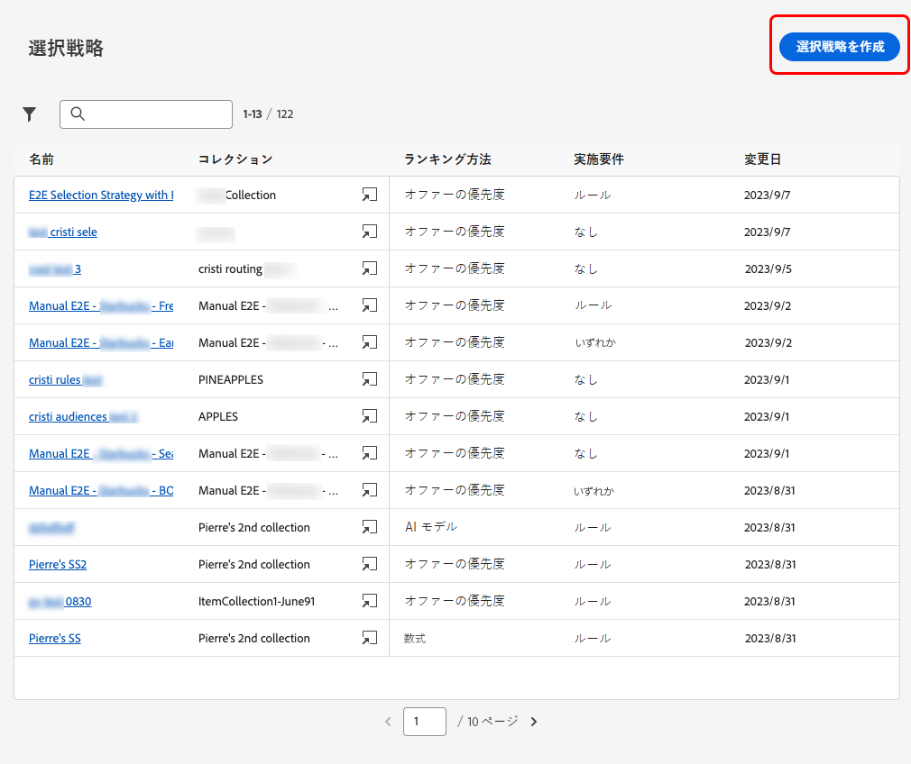

# 選択戦略を作成 {#selection-strategies}

>[!BEGINSHADEBOX]

このドキュメントガイドの内容は次のとおりです。

* [Experience Decisioning の基本を学ぶ](gs-experience-decisioning.md)
* 決定項目を管理
   * [項目カタログを設定](catalogs.md)
   * [決定項目の作成](items.md)
   * [項目コレクションを管理](collections.md)
* 項目の選択を設定
   * [決定ルールの作成](rules.md)
   * [ランキングメソッドの作成](ranking.md)
* **[選択戦略を作成](selection-strategies.md)**
* [決定ポリシーの作成](create-decision.md)

>[!ENDSHADEBOX]

選択戦略は、再利用可能な項目で、実施要件の制約に関連付けられたコレクションと、 [決定方針](create-decision.md).

## 選択戦略へのアクセスと管理

1. に移動します。 **[!UICONTROL エクスペリエンス判定]** > **[!UICONTROL 設定]** > **[!UICONTROL 選択戦略]**.

1. これまでに作成した選択戦略がすべて表示されます。 ランキングメソッドに従って戦略を取得するのに役立つフィルターを使用できます。

   

1. 選択戦略名をクリックして編集します。

1. 各戦略で選択したコレクション、ランキング方法、実施要件も表示されます。 各コレクション名の横にあるアイコンをクリックして、コレクションを直接編集できます。

   

## 選択方法の作成

選択戦略を作成するには、次の手順に従います。

1. 次から： **[!UICONTROL 選択戦略]** 在庫、クリック **[!UICONTROL 選択方法を作成]**.

   

1. 戦略の名前を追加します。

   >[!NOTE]
   >
   >現在はデフォルトのみ **[!UICONTROL オファー]** カタログを使用できます。

1. 名前で始まる、選択戦略の詳細を入力します。

   

1. オファーを選択 [コレクション](collections.md) 検討するオファーを含む

1. 以下を使用します。 **[!UICONTROL 適格要件]** 「 」フィールドを使用して、この選択戦略のオファーの選択を制限できます。

   

   * オファーの選択をExperience Platformオーディエンスのメンバーに制限するには、 **[!UICONTROL オーディエンス]** リストからオーディエンスを選択します。 [オーディエンスの使用方法を説明します。](../audience/about-audiences.md)

   * 決定ルールに選択制約を追加する場合は、「**[!UICONTROL 決定ルール]**」オプションを使用し、任意のルールを選択します。[ルールの作成方法を説明します](rules.md)

1. プロファイルごとに最適なオファーを選択するためのランキング方法を定義します。[詳細情報](#select-ranking-method)

   

   * デフォルトでは、複数のオファーがこの戦略の実施要件を満たす場合、 [オファーの優先度](#offer-priority) メソッドは、オファーで定義された値を使用します。

   * 特定の計算済みスコアを使用して配信する実施要件を満たすオファーを選択する場合は、「[数式](#ranking-formula)」または「[AI モデル](#ai-ranking)」を選択します。

1. 「**[!UICONTROL 作成]**」をクリックします。これで、 [決定](create-decision.md)

## ランキング方法を選択 {#select-ranking-method}

複数のオファーが特定の選択戦略の実施要件を満たす場合、選択戦略を作成する際に、各プロファイルに最適なオファーを選択する方法を選択できます。 オファーのランク付けは、次の基準で行えます。

* [オファーの優先度](#offer-priority)
* [数式](#ranking-formula)
* [AI ランキング](#ai-ranking)

### オファーの優先度 {#offer-priority}

デフォルトでは、決定内の特定の配置に対して複数のオファーが適格な場合、最も高い項目が **優先度** が最初にお客様に配信されます。

オファーの優先度スコアは、 [決定項目](items.md).

### ランキング式 {#ranking-formula}

Journey Optimizer では、オファーの優先度に加えて、**ランキング式**&#x200B;を作成できます。これらは、特定のプレースメントに対して最初に表示するオファーを決定する数式であり、オファーの優先度スコアを考慮するものではありません。

例えば、終了日が今から 24 時間以内のすべてのオファーの優先度を上げることもできますし、プロファイルの目標地点が「実行中」の場合は「実行中」カテゴリのオファーの優先度を上げることもできます。ランキング式を作成する方法については、[この節](ranking.md)を参照してください。

作成したら、この数式を選択方法で使用できます。 この選択戦略を使用する際に複数のオファーを提示する資格がある場合、決定は、選択された数式を使用して、最初に配信するオファーを計算します。

### AI ランキング {#ai-ranking}

AI モデルを選択して、特定のプロファイルに表示するオファーを自動的にランク付けする、トレーニング済みモデルシステムを使用することもできます。AI モデルの作成方法については、[この節](ranking.md)を参照してください。

AI モデルが作成されたら、そのモデルを選択戦略で使用できます。 複数のオファーが適格な場合、トレーニング済みモデルシステムは、この選択戦略で最初に提示するオファーを決定します。

